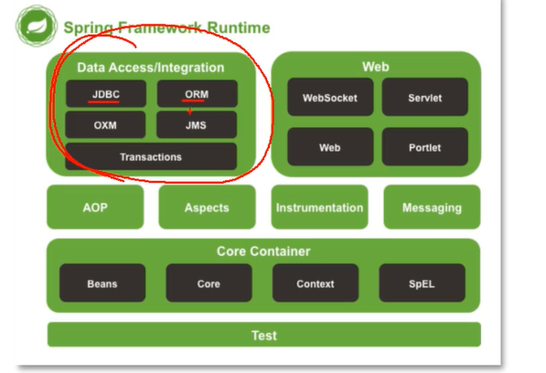

# Java框架开发

## Servlet初体验

### 一、Servlet简介

#### Servlet是什么

是一个运行在Web服务器或者应用服务器上的程序，它是作为来自Web服务器或者其他HTTP客户端的请求和HTTP服务器上面数据库或者应用程序的中间层。和CGI Common Gateway Interface公共网关接口实现的程序差不多，但是相较于它有更多优势比如：

+ 性能更好
+ 在Web服务器的地址空间内执行，没必要再创建一个单独的进程来处理每个客户端请求。
+ Servlet独立于平台，因为Java语言
+ 服务器上面Java安全，可以保护计算机资源
+ Java类库对Servlet全部开放


#### Servlet任务

- 读取客户端（浏览器）发送的显式的数据。这包括网页上的 HTML 表单，或者也可以是来自 applet 或自定义的 HTTP 客户端程序的表单。
- 读取客户端（浏览器）发送的隐式的 HTTP 请求数据。这包括 cookies、媒体类型和浏览器能理解的压缩格式等等。
- 处理数据并生成结果。这个过程可能需要访问数据库，执行 RMI 或 CORBA 调用，调用 Web 服务，或者直接计算得出对应的响应。
- 发送显式的数据（即文档）到客户端（浏览器）。该文档的格式可以是多种多样的，包括文本文件（HTML 或 XML）、二进制文件（GIF 图像）、Excel 等。
- 发送隐式的 HTTP 响应到客户端（浏览器）。这包括告诉浏览器或其他客户端被返回的文档类型（例如 HTML），设置 cookies 和缓存参数，以及其他类似的任务。

#### Servlet 生命周期

Servlet 生命周期可被定义为从创建直到毁灭的整个过程。以下是 Servlet 遵循的过程：

- Servlet 初始化后调用 **init ()** 方法。一次性初始化，只调用一次
- Servlet 调用 **service()** 方法来处理客户端的请求。Servlet 容器（即 Web 服务器）调用 service() 方法来处理来自客户端（浏览器）的请求，并把格式化的响应写回给客户端。每次服务器接收到一个 Servlet 请求时，服务器会产生一个新的线程并调用服务。service() 方法检查 HTTP  请求类型（GET、POST、PUT、DELETE 等），并在适当的时候调用 doGet、doPost、doPut，doDelete 等方法。只需要根据来自客户端的请求类型来重写 doGet() 或 doPost() 即可。
- Servlet 销毁前调用  **destroy()** 方法。只调用一次
- 最后，Servlet 是由 JVM 的垃圾回收器进行垃圾回收的。

#### Serverlet总结

在Java Web程序中，**Servlet**主要负责接收用户请求 `HttpServletRequest`,在`doGet()`,`doPost()`中做相应的处理，并将回应`HttpServletResponse`反馈给用户。**Servlet** 可以设置初始化参数，供Servlet内部使用。一个Servlet类只会有一个实例，在它初始化时调用`init()`方法，销毁时调用`destroy()`方法**。**Servlet需要在web.xml中配置（MyEclipse中创建Servlet会自动配置），**一个Servlet可以设置多个URL访问**。**Servlet不是线程安全的**，因此要谨慎使用类变量。一般变量放在doGet和doPost方法里面，虽然可以synchronized方法同步，但是这样也会有数据不同步问题。

### 二、网络相关问题汇编

#### 转发和重定向的区别

转发是forward，重定向是Redirect

1. 转发是服务器行为，重定向是服务器返回一个状态码，浏览器查收到状态码就会转移到新的网址进行请求资源。
2. 转发是服务器根据url读取资源，然后转发到浏览器，浏览器不知道内容是哪里来的，所以其地址栏还是以前的样子。重定向是服务器根据逻辑返回状态码，告诉浏览器去新的地址，所以地址栏是新的地址。
3. 转发页面和转发到的页面可以共享request里面的数据，重定向不能共享数据
4. 转发一般是由用户登录的时候根据用户身份转发响应界面到浏览器，重定向一般是拥护注销登录的时候会返回主界面或者到其他网站
5. 转发效率高，重定向效率低，相当于新的一次请求。

#### 自动刷新(Refresh)

自动刷新不仅可以实现一段时间之后自动跳转到另一个页面，还可以实现一段时间之后自动刷新本页面。Servlet中通过HttpServletResponse对象设置Header属性实现自动刷新例如：

```java
Response.setHeader("Refresh","5;URL=http://localhost:8080/servlet/example.htm");
```

其中5为时间，单位为秒。URL指定就是要跳转的页面（如果设置自己的路径，就会实现每过5秒自动刷新本页面一次）

#### JSP

JSP全称是Java Server Pages，一种动态网页技术。能够有一个编译器，将内容转化为Servlet运行。JSP侧重于视图，Servlet更侧重于控制逻辑，在MVC架构模式中，JSP适合充当视图（view）而Servlet适合充当控制器（controller）。HttpServlet是先由源代码编译为class文件后部署到服务器下，为先编译后部署。而JSP则是先部署后编译。会把相关java代码编译为.class文件，请求的时候就用这个文件作为应答。

##### JSP有9个内置对象：

- request：封装客户端的请求，其中包含来自GET或POST请求的参数；
- response：封装服务器对客户端的响应；
- pageContext：通过该对象可以获取其他对象；
- session：封装用户会话的对象；
- application：封装服务器运行环境的对象；
- out：输出服务器响应的输出流对象；
- config：Web应用的配置对象；
- page：JSP页面本身（相当于Java程序中的this）；
- exception：封装页面抛出异常的对象。

##### Request对象的主要方法有哪些

- setAttribute(String name,Object)：设置名字为name的request 的参数值 
- getAttribute(String name)：返回由name指定的属性值 
- getAttributeNames()：返回request 对象所有属性的名字集合，结果是一个枚举的实例 
- getCookies()：返回客户端的所有 Cookie 对象，结果是一个Cookie 数组 
- getCharacterEncoding() ：返回请求中的字符编码方式 = getContentLength() ：返回请求的 Body的长度 
- getHeader(String name) ：获得HTTP协议定义的文件头信息 
- getHeaders(String name) ：返回指定名字的request Header 的所有值，结果是一个枚举的实例 
- getHeaderNames() ：返回所以request Header 的名字，结果是一个枚举的实例 
- getInputStream() ：返回请求的输入流，用于获得请求中的数据 
- getMethod() ：获得客户端向服务器端传送数据的方法 
- getParameter(String name) ：获得客户端传送给服务器端的有 name指定的参数值 
- getParameterNames() ：获得客户端传送给服务器端的所有参数的名字，结果是一个枚举的实例 
- getParameterValues(String name)：获得有name指定的参数的所有值 
- getProtocol()：获取客户端向服务器端传送数据所依据的协议名称 
- getQueryString() ：获得查询字符串 
- getRequestURI() ：获取发出请求字符串的客户端地址 
- getRemoteAddr()：获取客户端的 IP 地址 
- getRemoteHost() ：获取客户端的名字 
- getSession([Boolean create]) ：返回和请求相关 Session 
- getServerName() ：获取服务器的名字 
- getServletPath()：获取客户端所请求的脚本文件的路径 
- getServerPort()：获取服务器的端口号 
- removeAttribute(String name)：删除请求中的一个属性 

## Spring入门

### 一、Spring简介

1. 解决企业开发的难度，减轻对项目模块之间的管理，类和类之间的管理，创建对象、管理对象之间的关系。

2. 主要就是IOC Inverse of Control，aop 能实现模块之间、类之间的解耦合，关系更加松散。dependency injection

3. 依赖：类A中用到了类B的属性或者方法，就是依赖，框架就能管理这个依赖关系。

4. Maven管理项目包、资源。

5. 官网是spring.io，可以做微服务Microservice，反应式编程，云服务，事件驱动等

6. 特点

   1. jar小，3m大小就差不多了，占用资源小，运行快。
   2. IOC
   3. AOP，面向切面编程
   4. 方便集成其他各种框架，如MyBatis

7. Spring的体系结构

   

   容器里面存的是对象，Core Container

   ORM就是MyBatis，Web是Spring MVC

### 二、IoC控制反转

#### 简介

框架怎么学，知道框架能做什么，比如MyBatis可以访问数据库

学习框架的语法，框架完成某个功能需要步骤的支持，要知道怎么写

学习框架的内部实现，原理是什么，底层代码怎么写的。

最后就是自己实现一个框架。

#### IOC

Inversion of Control，控制反转，是一个概念、理论、思想，描述的是把对象的创建、赋值、管理工作都交给代码之外的容器实现，也就是对象的创建是有其他资源实现的。

控制：创建对象、对象的属性赋值、对象之间的关系管理

正转：由开发人员在代码里面，使用new构造对象创建方法，开发人员主动进行对象管理

反转：把原来的开发人员管理，创建对象的权限转移给代码之外的容器实现，由容器代替开发人员管理对象，创建对象。容器可以是服务器软件，或者是框架Spring。

为什么用IOC，就是为了减少对代码的改动，从而实现不同的功能，就是解耦合，让各个代码之间关系更小，我的改动就可以更少。

Java中创建对象的方式，构造方法 new或者反射、序列化再读出来、克隆、ioc容器创建。**动态代理也可以创建**

#### Ioc使用

1. ioc的体现，servlet，创建类继承HttpServelt，在web.xml等中注册Servlet，如\<servlet-name>myservlet\</servlet-name>。没有创建对象但是就用到了Servlet，这个是Tomcat服务器为你创建的。Tomcat作为容器，里面存有Servlet对象，listener、filter对象等。

2. IoC的技术实现，DI是IoC的技术实现，依赖注入DI Dependency Injection。只需要在程序中提供要使用的对象的名称就可以了，至于如何在容器中创建赋值查找，都由容器内部实现。Spring使用Di实现了IoC功能，**底层创建对象用的是反射机制**。

3. 项目顺序：创建maven项目，加入maven依赖，Spring依赖，Junit依赖。创建类，接口和其他类。创建Spring需要使用的配置文件，声明类的信息，这些类由Spring创建和管理，最后测试Spring创建的类。

4. 容器的创建语句的时候对象就已经被创建了，就是ApplicationContext对象创建的时候就已经创建了配置文件里面**所有**的文件。可以通过api获得此时框架里面有的类的数目，以及类的名称。创建的时候默认带的是无参构造方法。

5. 在beans.xml里面写好包就可以调用别人的对象，即使是Java库已经实现了的对象也可以，需要正确的包路径。

6. 在Spring里面，对对象的属性赋值：一种是标签在配置文件里面，第二种是使用注解。di语法分类：set注入，调用set方法，使用广泛。另一种是构造注入，调用类的有参构造方法完成赋值。写了bean里面的property属性，调用的是set方法，自己在类里面写的set方法。set方法叫做设值注入。先调用了无参构造方法，然后调用set方法。有set方法就能执行，不一定需要你有相关的数据成员，就是你在property里面写的属性名字不一定类里面有，但是会根据这个名称找相关的set方法。里面是name和value

   引用类型的set注入，里面是name和ref。ref里面需要的是bean的name，也就是你要把引用类型再写一个bean，然后才可调用。

7. 构造注入，即使用构造函数。在xml里面写\<constructor -arg>标签，一个标签对应一个属性，调用的是对应个数的构造函数。还可以用index替换name，意思是构造函数里面的参数的顺序012.这个index可以省略，直接写value，但是相关的顺序必须和构造函数里面的顺序一样。

8. junit是一个单元测试工具类库，做测试方法用的，单元指定的是方法，一是可以在类下面写一个main方法进行执行。另外的就是用单元测试，需要加入junit依赖，然后创建测试类，需要在src/test/com/包+类下创建。创建测试方法应该是public void ，建议名称是test+ 测试方法名称，方法没有参数，方法的上面要加上@Test注解，这个注解来自Junit，这样的方法就可以单独执行，不用main方法就可以跑起来。


