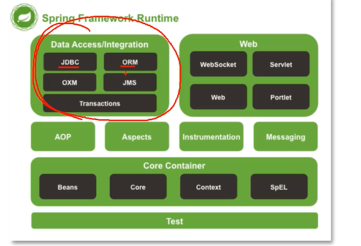
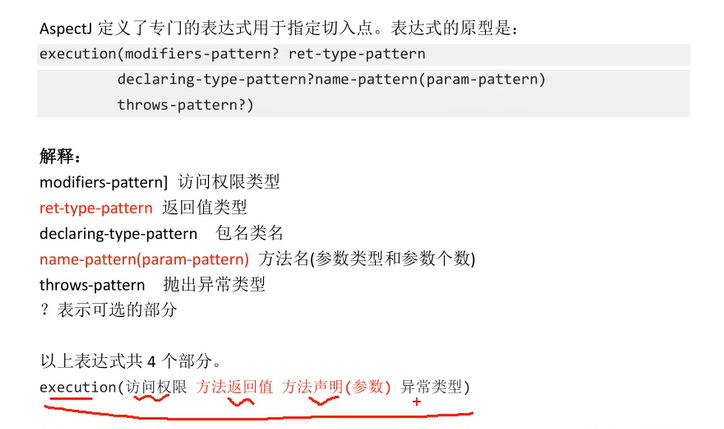
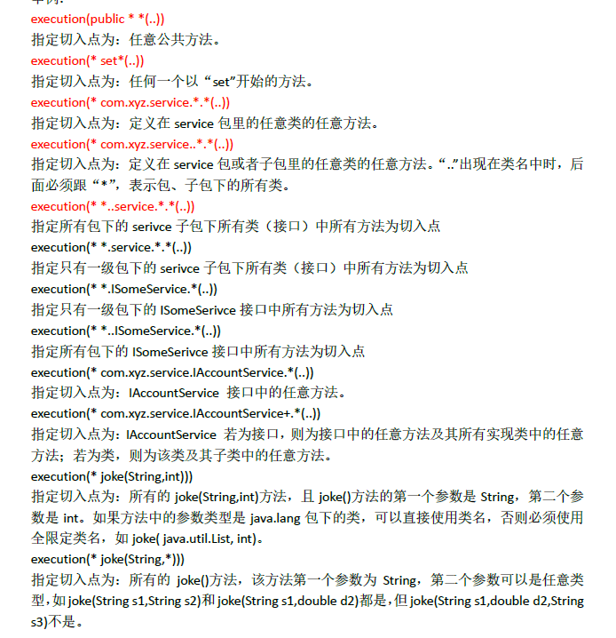

# Java框架开发

## Servlet初体验

### 一、Servlet简介

#### Servlet是什么

是一个运行在Web服务器或者应用服务器上的程序，它是作为来自Web服务器或者其他HTTP客户端的请求和HTTP服务器上面数据库或者应用程序的中间层。和CGI Common Gateway Interface公共网关接口实现的程序差不多，但是相较于它有更多优势比如：

+ 性能更好
+ 在Web服务器的地址空间内执行，没必要再创建一个单独的进程来处理每个客户端请求。
+ Servlet独立于平台，因为Java语言
+ 服务器上面Java安全，可以保护计算机资源
+ Java类库对Servlet全部开放


#### Servlet任务

- 读取客户端（浏览器）发送的显式的数据。这包括网页上的 HTML 表单，或者也可以是来自 applet 或自定义的 HTTP 客户端程序的表单。
- 读取客户端（浏览器）发送的隐式的 HTTP 请求数据。这包括 cookies、媒体类型和浏览器能理解的压缩格式等等。
- 处理数据并生成结果。这个过程可能需要访问数据库，执行 RMI 或 CORBA 调用，调用 Web 服务，或者直接计算得出对应的响应。
- 发送显式的数据（即文档）到客户端（浏览器）。该文档的格式可以是多种多样的，包括文本文件（HTML 或 XML）、二进制文件（GIF 图像）、Excel 等。
- 发送隐式的 HTTP 响应到客户端（浏览器）。这包括告诉浏览器或其他客户端被返回的文档类型（例如 HTML），设置 cookies 和缓存参数，以及其他类似的任务。

#### Servlet 生命周期

Servlet 生命周期可被定义为从创建直到毁灭的整个过程。以下是 Servlet 遵循的过程：

- Servlet 初始化后调用 **init ()** 方法。一次性初始化，只调用一次
- Servlet 调用 **service()** 方法来处理客户端的请求。Servlet 容器（即 Web 服务器）调用 service() 方法来处理来自客户端（浏览器）的请求，并把格式化的响应写回给客户端。每次服务器接收到一个 Servlet 请求时，服务器会产生一个新的线程并调用服务。service() 方法检查 HTTP  请求类型（GET、POST、PUT、DELETE 等），并在适当的时候调用 doGet、doPost、doPut，doDelete 等方法。只需要根据来自客户端的请求类型来重写 doGet() 或 doPost() 即可。
- Servlet 销毁前调用  **destroy()** 方法。只调用一次
- 最后，Servlet 是由 JVM 的垃圾回收器进行垃圾回收的。

#### Serverlet总结

在Java Web程序中，**Servlet**主要负责接收用户请求 `HttpServletRequest`,在`doGet()`,`doPost()`中做相应的处理，并将回应`HttpServletResponse`反馈给用户。**Servlet** 可以设置初始化参数，供Servlet内部使用。一个Servlet类只会有一个实例，在它初始化时调用`init()`方法，销毁时调用`destroy()`方法**。**Servlet需要在web.xml中配置（MyEclipse中创建Servlet会自动配置），**一个Servlet可以设置多个URL访问**。**Servlet不是线程安全的**，因此要谨慎使用类变量。一般变量放在doGet和doPost方法里面，虽然可以synchronized方法同步，但是这样也会有数据不同步问题。

### 二、网络相关问题汇编

#### 转发和重定向的区别

转发是forward，重定向是Redirect

1. 转发是服务器行为，重定向是服务器返回一个状态码，浏览器查收到状态码就会转移到新的网址进行请求资源。
2. 转发是服务器根据url读取资源，然后转发到浏览器，浏览器不知道内容是哪里来的，所以其地址栏还是以前的样子。重定向是服务器根据逻辑返回状态码，告诉浏览器去新的地址，所以地址栏是新的地址。
3. 转发页面和转发到的页面可以共享request里面的数据，重定向不能共享数据
4. 转发一般是由用户登录的时候根据用户身份转发响应界面到浏览器，重定向一般是拥护注销登录的时候会返回主界面或者到其他网站
5. 转发效率高，重定向效率低，相当于新的一次请求。

#### 自动刷新(Refresh)

自动刷新不仅可以实现一段时间之后自动跳转到另一个页面，还可以实现一段时间之后自动刷新本页面。Servlet中通过HttpServletResponse对象设置Header属性实现自动刷新例如：

```java
Response.setHeader("Refresh","5;URL=http://localhost:8080/servlet/example.htm");
```

其中5为时间，单位为秒。URL指定就是要跳转的页面（如果设置自己的路径，就会实现每过5秒自动刷新本页面一次）

#### JSP

JSP全称是Java Server Pages，一种动态网页技术。能够有一个编译器，将内容转化为Servlet运行。JSP侧重于视图，Servlet更侧重于控制逻辑，在MVC架构模式中，JSP适合充当视图（view）而Servlet适合充当控制器（controller）。HttpServlet是先由源代码编译为class文件后部署到服务器下，为先编译后部署。而JSP则是先部署后编译。会把相关java代码编译为.class文件，请求的时候就用这个文件作为应答。

##### JSP有9个内置对象：

- request：封装客户端的请求，其中包含来自GET或POST请求的参数；
- response：封装服务器对客户端的响应；
- pageContext：通过该对象可以获取其他对象；
- session：封装用户会话的对象；
- application：封装服务器运行环境的对象；
- out：输出服务器响应的输出流对象；
- config：Web应用的配置对象；
- page：JSP页面本身（相当于Java程序中的this）；
- exception：封装页面抛出异常的对象。

##### Request对象的主要方法有哪些

- setAttribute(String name,Object)：设置名字为name的request 的参数值 
- getAttribute(String name)：返回由name指定的属性值 
- getAttributeNames()：返回request 对象所有属性的名字集合，结果是一个枚举的实例 
- getCookies()：返回客户端的所有 Cookie 对象，结果是一个Cookie 数组 
- getCharacterEncoding() ：返回请求中的字符编码方式 = getContentLength() ：返回请求的 Body的长度 
- getHeader(String name) ：获得HTTP协议定义的文件头信息 
- getHeaders(String name) ：返回指定名字的request Header 的所有值，结果是一个枚举的实例 
- getHeaderNames() ：返回所以request Header 的名字，结果是一个枚举的实例 
- getInputStream() ：返回请求的输入流，用于获得请求中的数据 
- getMethod() ：获得客户端向服务器端传送数据的方法 
- getParameter(String name) ：获得客户端传送给服务器端的有 name指定的参数值 
- getParameterNames() ：获得客户端传送给服务器端的所有参数的名字，结果是一个枚举的实例 
- getParameterValues(String name)：获得有name指定的参数的所有值 
- getProtocol()：获取客户端向服务器端传送数据所依据的协议名称 
- getQueryString() ：获得查询字符串 
- getRequestURI() ：获取发出请求字符串的客户端地址 
- getRemoteAddr()：获取客户端的 IP 地址 
- getRemoteHost() ：获取客户端的名字 
- getSession([Boolean create]) ：返回和请求相关 Session 
- getServerName() ：获取服务器的名字 
- getServletPath()：获取客户端所请求的脚本文件的路径 
- getServerPort()：获取服务器的端口号 
- removeAttribute(String name)：删除请求中的一个属性 

## Spring入门

### 一、Spring简介

1. 解决企业开发的难度，减轻对项目模块之间的管理，类和类之间的管理，创建对象、管理对象之间的关系。

2. 主要就是IOC Inverse of Control，aop 能实现模块之间、类之间的解耦合，关系更加松散。dependency injection

3. 依赖：类A中用到了类B的属性或者方法，就是依赖，框架就能管理这个依赖关系。

4. Maven管理项目包、资源。

5. 官网是spring.io，可以做微服务Microservice，反应式编程，云服务，事件驱动等

6. 特点

   1. jar小，3m大小就差不多了，占用资源小，运行快。
   2. IOC
   3. AOP，面向切面编程
   4. 方便集成其他各种框架，如MyBatis

7. Spring的体系结构

   

   容器里面存的是对象，Core Container

   ORM就是MyBatis，Web是Spring MVC
   
   - **Spring Core：** 基础,可以说 Spring 其他所有的功能都需要依赖于该类库。主要提供 IoC 依赖注入功能。
   - **Spring  Aspects** ： 该模块为与AspectJ的集成提供支持。
   - **Spring AOP** ：提供了面向切面的编程实现。
   - **Spring JDBC** : Java数据库连接。
   - **Spring JMS** ：Java消息服务。
   - **Spring ORM** : 用于支持Hibernate等ORM工具。Object Relational Mapping
   - **Spring Web** : 为创建Web应用程序提供支持。
   - **Spring Test** : 提供了对 JUnit 和 TestNG 测试的支持。
   
8. Spring就是很多模块的集合，比如核心容器、数据集成访问、web、aop、工具、消息、测试模块。Core Container中的core组件是Spring所有组件的核心，beans组件和context组件是IoC和Di的基础，AOP组件用来实现面向切面编程。

   - **核心技术** ：依赖注入(DI)，AOP，事件(events)，资源，i18n，验证，数据绑定，类型转换，SpEL。
   - **测试** ：模拟对象，TestContext框架，Spring MVC 测试，WebTestClient。
   - **数据访问** ：事务，DAO支持，JDBC，ORM，编组XML。
   - **Web支持** : Spring MVC和Spring WebFlux Web框架。
   - **集成** ：远程处理，JMS，JCA，JMX，电子邮件，任务，调度，缓存。
   - **语言** ：Kotlin，Groovy，动态语言。

#### @RestController 和 @Controller

Controller返回一个页面，不加@ResponseBody就是在返回一个视图的情况下进行，适用于前后端不分离的情况。

**`@RestController` 返回JSON 或 XML 形式数据**，`@RestController`只返回对象，对象数据直接以 JSON 或 XML 形式写入 HTTP 响应(Response)中，这种情况属于 RESTful Web服务，这也是目前日常开发所接触的最常用的情况（前后端分离）。

**`@Controller +@ResponseBody` 返回JSON 或 XML 形式数据**，也就是说`@Controller` +`@ResponseBody`= `@RestController`（Spring 4 之后新加的注解）。

### 二、IoC控制反转

#### 简介

框架怎么学，知道框架能做什么，比如MyBatis可以访问数据库

学习框架的语法，框架完成某个功能需要步骤的支持，要知道怎么写

学习框架的内部实现，原理是什么，底层代码怎么写的。

最后就是自己实现一个框架。

#### IOC

Inversion of Control，控制反转，是一个概念、理论、思想，描述的是把对象的创建、赋值、管理工作都交给代码之外的容器实现，也就是对象的创建是有其他资源实现的。

控制：创建对象、对象的属性赋值、对象之间的关系管理

正转：由开发人员在代码里面，使用new构造对象创建方法，开发人员主动进行对象管理

反转：把原来的开发人员管理，创建对象的权限转移给代码之外的容器实现，由容器代替开发人员管理对象，创建对象。容器可以是服务器软件，或者是框架Spring。

为什么用IOC，就是为了减少对代码的改动，从而实现不同的功能，就是解耦合，让各个代码之间关系更小，我的改动就可以更少。

Java中创建对象的方式，构造方法 new或者反射、序列化再读出来、克隆、ioc容器创建。**动态代理也可以创建**

将对象之间的相互依赖关系交给 IoC 容器来管理，并由 IoC 容器完成对象的注入。这样可以很大程度上简化应用的开发，把应用从复杂的依赖关系中解放出来。  **IoC 容器就像是一个工厂一样，当我们需要创建一个对象的时候，只需要配置好配置文件/注解即可，完全不用考虑对象是如何被创建出来的。** 在实际项目中一个 Service 类可能有几百甚至上千个类作为它的底层，假如我们需要实例化这个 Service，你可能要每次都要搞清这个  Service 所有底层类的构造函数，这可能会把人逼疯。如果利用 IoC  的话，你只需要配置好，然后在需要的地方引用就行了，这大大增加了项目的可维护性且降低了开发难度。

#### Ioc使用

1. ioc的体现，servlet，创建类继承HttpServelt，在web.xml等中注册Servlet，如\<servlet-name>myservlet\</servlet-name>。没有创建对象但是就用到了Servlet，这个是Tomcat服务器为你创建的。Tomcat作为容器，里面存有Servlet对象，listener、filter对象等。

2. IoC的技术实现，DI是IoC的技术实现，依赖注入DI Dependency Injection。只需要在程序中提供要使用的对象的名称就可以了，至于如何在容器中创建赋值查找，都由容器内部实现。Spring使用Di实现了IoC功能，**底层创建对象用的是反射机制**。

3. 项目顺序：创建maven项目，加入maven依赖，Spring依赖，Junit依赖。创建类，接口和其他类。创建Spring需要使用的配置文件，声明类的信息，这些类由Spring创建和管理，最后测试Spring创建的类。

4. 容器的创建语句的时候对象就已经被创建了，就是ApplicationContext对象创建的时候就已经创建了配置文件里面**所有**的文件。可以通过api获得此时框架里面有的类的数目，以及类的名称。创建的时候默认带的是无参构造方法。

5. 在beans.xml里面写好包就可以调用别人的对象，即使是Java库已经实现了的对象也可以，需要正确的包路径。

6. 在Spring里面，对对象的属性赋值：一种是标签在配置文件里面，第二种是使用注解。di语法分类：set注入，调用set方法，使用广泛。另一种是构造注入，调用类的有参构造方法完成赋值。写了bean里面的property属性，调用的是set方法，自己在类里面写的set方法。set方法叫做设值注入。先调用了无参构造方法，然后调用set方法。有set方法就能执行，不一定需要你有相关的数据成员，就是你在property里面写的属性名字不一定类里面有，但是会根据这个名称找相关的set方法。里面是name和value

   引用类型的set注入，里面是name和ref。ref里面需要的是bean的name，也就是你要把引用类型再写一个bean，然后才可调用。

7. 构造注入，即使用构造函数。在xml里面写\<constructor -arg>标签，一个标签对应一个属性，调用的是对应个数的构造函数。还可以用index替换name，意思是构造函数里面的参数的顺序012.这个index可以省略，直接写value，但是相关的顺序必须和构造函数里面的顺序一样。

8. junit是一个单元测试工具类库，做测试方法用的，单元指定的是方法，一是可以在类下面写一个main方法进行执行。另外的就是用单元测试，需要加入junit依赖，然后创建测试类，需要在src/test/com/包+类下创建。创建测试方法应该是public void ，建议名称是test+ 测试方法名称，方法没有参数，方法的上面要加上@Test注解，这个注解来自Junit，这样的方法就可以单独执行，不用main方法就可以跑起来。

9. 什么样的对象要放进容器中：dao类 service类、controller类、工具类，对象默认都是实例的，在容器中叫这个名称的对象只有一个。而实体类对象，如数据库或者Tomcat容器出来的对象，都不应该放到容器中。怎么放进去？一个是用bean标签，xml文件，另一个是注解

10. 使用框架的步骤：

    1. 加依赖
    2. 创建类，类是自己做的，有接口和实现类。
    3. 创建Spring的配置文件，使用\<bean>声明对象，里面的name和value或者ref
    4. 使用容器中的对象，通过ApplicationContext接口和它的实现类ClassPathXmlApplicationContext方法的getBean().

11. 引用类型的自动注入，根据一些规则由spring完成赋值操作。两种方法

    1. byName()方法，按名称注入，java类中引用类型的属性名和spring配置文件中的id名称一样，数据类型一样，这样容器中的bean，spring能够赋值给引用类型，语法规则是

       ```xml
       <bean id="xx" class="yyy" autowire="byName"/>
       ```

       即我的引用类型的bean标签的id应该和它本身类的名字一样才可以

    2. byType，按类型注入，Java类中引用类型的数据类型和Spring容器中bean配置的class属性是同源关系的，这样的bean能够赋值给引用类型。引用类型的数据类型和bean的class的值一样，或者class是子类，或者class是接口的实现

       ```xml
       <bean id="xx" class="yyy" autowire="byType"/>
       ```

       就是需要的引用类型的class要和我自己的数据对象是一个class出来的，或者引用的那个bean是子类也可以，或者接口也可以。这个时候就不允许有两个一样关系的出来了，比如有了父类的bean，又有一个子类的bean，这样就是不允许的，保证符合条件的bean只有一个。

12. 类的数量特别多的时候，采用多个配置文件，即多个ApplicationContext.xml文件，里面是写的bean依赖。这样的优势是文件小，打开修改快，避免多人竞争带来的冲突。可以按功能模块分文件，或者按类的功能分文件。

    按模块分的时候，一般两个模块，然后需要一个总的主配置文件，里面不定义bean，bean都在另外两个模块的配置文件里面写。这里只写一个配置文件路径，就是其他的文件应该去哪里找。里面的路径是类路径，在target里面的classes文件里面找。语法为：

    ```xml
    <import resource="classpath:ba06/spring-school.xml"/>
    <import resource="classpath:ba06/spring-student.xml"/>
    <!--可以用通配符，比如这里写为 就是对有一定相关性的用*表示-->
    <import resource="classpath:ba06/spring-*.xml"/>
    ```

    创建ac的时候，用总的配置的config文件。

##### 注解实现di

使用步骤：

1. 加入Maven的依赖，用的是spring-context，在你加入这个的时候，间接地会加入spring-aop依赖，有aop才能用注解

2. 在类中加入spring的注解(多个不同功能的注解)

3. 在spring的配置文件里面加入组件扫描器的标签，说明注解在项目中的位置

4. 有以下注解：

   ```java
   @component(value="myStudent") 创建对象的，等同于bean的功能，value是唯一的对象名称，也就是bean里面的id值，位置在类的上面，这句话的意思就等同于bean标签
   要在applicationContext里面写
       <context:component-scan base-package="包名称"/>
   这个value=是可以省略的 常用
   或者后面可以不写括号，那么默认的value就是类的名字首字母小写
   创建的时候会用无参构造函数
   @Respotory 放在dao的实现类里面，表示创建dao对象，访问数据库 持久层
   @Service 业务层，放在Service类上面，事务类
   @Controller 控制器 控制器对象，接受用户提交的参数并且显示请求的处理结果
   三个和Component一样可以创建对象，但是都有额外的功能
   Component在不知道是什么类的时候就用
   @Value 给简单类型的赋值，就是给类的数据赋值，无需set方法则写在类成员前面，或者可以写在set函数前面
       @Value("张飞")直接把值设置为了这么多
   @Autowired 对引用类型赋值 自动注入原理 默认type注入 只用写这个就行，就可以根据类型进行赋值，但是要声明清楚其引用类的注解，可以是注解也可以用bean标签
       byName方式需要在属性上面加上
       @Autowired
       @Qualifier(value="bean的id") 二者顺序无所谓
   @Resource 来自jdk的注解，Spring提供了对它的支持，可以使用它给引用类型赋值，默认是byName的。位置也一样，在属性上面或者set上面
       会先用byName注入，如果不行就会用byType方式
       byName方式需要@Resource(name="mySchool")
   ```

5. 指定多个包的三种方式，在bean里面的compone-scan里面

   ```xml
   <context:component-scan base-package="包名称"/> 多个直接写
   
   <context:component-scan base-package="包名称;包名称"/>多个分号分割
   
   <context:component-scan base-package="包名称"/>总包名称，可以把所有都扫描，但是不要直接com，因为是顶级包，会扫描很多，无用包扫描
   ```

6. Autowired有一个属性required，是boolean类型，默认为true，如果是true那么就会报错，当为假的时候，引用类型如果赋值失败程序正常运行，结果是null。用true好，因为这样可以报错，让你知道是什么问题。

7. 经常改的就用xml文件，不经常改的就用注解，因为注解是和源代码一起的，xml是完全分开的。

##### IoC实现解耦合

通过IoC可以实现业务对象之间的解耦合，比如dao和Service之间的解耦合

### 三、AOP 面向切面编程

就是叫做AOP Aspect Orient Programming，底层就是动态代理。就是动态代理的规范化书写方法。给目标增加功能就是Aspect，切面，特点就是和业务功能没有关系，独立使用的。需要注意的点：

1. 找出切面，即找出哪些功能应该拿出来做切面
2. 合理地安排切面运行的时间，在什么之前或者什么之后
3. 合理地安排切面执行的位置

常见切面有日志、事务、统计信息、参数检查、权限验证等。

aop的技术实现框架：spring能够做aop的工作，主要在事务处理时使用aop，但是我们平时不会用这个aop，因为比较笨重。所以我们平常经常用的是aspectJ的框架，比较权威、厉害。spring框架里面就集成了aspectJ的功能。

#### 常见名词

1. JoinPoint：连接点，连接业务方法和切面的位置，就是某类中的业务方法
2. PointCut：切入点，指多个连接点方法的集合，就是多个方法
3. 目标对象：给哪个类增加功能，这个类就是目标对象。
4. Advice：通知，通知表示切面功能执行的时间。

#### 切面的要素

1. 切面的功能代码，切面干什么
2. 切面的执行位置，使用PointCut表示切面执行的位置
3. 切面的执行时间，使用advice表示在目标方法之前还是之后。

#### 动态代理

可以创建对象，在原有代码不改动的情况下实现增加功能。减少代码重复，专注业务逻辑代码，解耦合，让业务功能和日志等功能分离。

有JDK动态代理和CGLIB动态代理。

可以在程序的执行过程中创建代理对象，通过代理对象执行方法，给目标类的方法增加额外的功能，功能增强。实现步骤

1. 创建目标类，SomeServiceImpl目标类，给它的doSome等方法增加一些业务功能
2. 创建InvocationHandler接口的实现类，在这个类实现给目标方法增加功能。需要完成invoke方法的书写，代理对象执行方法的时候会调用这个invoke方法。需要一个目标对象target，Object类。在这里调用之前用工具类进行某些操作，之后执行某些操作，就相当于是实现了我们的一些目标。
3. 使用jdk中的类Proxy，创建代理对象，实现创建对象的能力。

##### JDK动态代理

必须要接口，在接口的方式下面增强方法。

有方法如Proxy、Method、InvocationHandler来创建代理对象。

##### CGLIB动态代理

原理就是生成一个继承A的子类，不能是final的，然后重写一些方法或者多写一些方法，用A a=new B();的方法。这个效率高，要求也低。


#### aspectJ

实现aop有两种方式：

1. 使用xml的配置文件，配置全局事务
2. 使用注解，一般都是如此，有五个注解

#### Spring AOP和AspectJ AOP的区别

**Spring AOP 属于运行时增强，而 AspectJ 是编译时增强。** Spring AOP 基于代理(Proxying)，而 AspectJ 基于字节码操作(Bytecode Manipulation)。

 Spring AOP 已经集成了 AspectJ  ，AspectJ  应该算的上是 Java 生态系统中最完整的 AOP 框架了。AspectJ  相比于 Spring AOP 功能更加强大，但是 Spring AOP 相对来说更简单，

如果我们的切面比较少，那么两者性能差异不大。但是，当切面太多的话，最好选择 AspectJ ，它比Spring AOP 快很多。

##### aspectJ的使用

1. 切面的执行时间在规范中叫做通知advice，增强。在aspectJ中用注解来表示
   1. @Before
   2. @AfterReturing
   3. @Around
   4. @AfterThrowing
   5. @After

2. 表示切面执行的位置，使用的是切入点表达式：

   

   常用的是方法返回值和声明(参数)。可以用通配符*表示任意多个字符，..表示任意多个参数

   

   要给多个目标方法都加上功能，就改变一下表达式，里面可能是同一个包之类的。

3. 步骤：

   1. 新建Maven项目

   2. 加入依赖如spring和aspectJ依赖，还有测试junit依赖

   3. 创建目标类，接口和他的实现类。要做的是给类中的方法增加功能。可以先写接口，然后alt+enter可以快速创建实现类

   4. 创建切面类：普通类。

      类的上面要加入@Aspect注解，加这个的作用代表的是当前类是切面类，表示这个类里面有切面类的功能代码。

      类中定义方法，方法就是切面要执行的功能代码。要求有public 无返回值、名称自定义、可以有参数也可以无参数，参数不是自定义的，类型有规定。

      在这个方法的上面加入通知注解，如@Before表示前置时间，通知时间。有value属性，里面内容是切入点表达式。这个在目标方法之前执行，不会改变目标方法的执行结果。

      有时需要指定切入点表达式execution()。就是在注解里面的value值，写作：

      ```java
      @Before(value="excution(public void com.bjpowernode.ba01.someServiceImpl.doSome(String,Integer))")
      ```

   5. 创建spring的配置文件，声明对象，把对象交给容器统一管理，我们可以用bean或者用注解实现。

      然后声明目标对象，声明切面类对象，声明aspectJ框架中的自动代理生成器标签，自动代理生成器就是用来完成代理对象的自动创建功能的。

      如someService和myAspect标签id，

      自动代理生成器的标签其实就是

      ```xml
      <aop:aspectj-autoproxy/>
      ```

      这个标签会把spring中的所有目标对象一次性生成代理对象

   6. 创建测试类，从spring中获取对象，其实就是代理对象，通过代理执行方法，实现aop的功能增强。**获取目标对象不是用类获取的，而是用接口作为类型proxy出来的。**这里的代理proxy还是jdk动态生成的代理。
   
4. 指定通知方法中的参数，连接点JoinPoint是业务方法(目标方法，即要加入切面功能的方法)。作用是可以在通知方法中获取方法执行时的信息，如方法名称和方法的实参。

   @Before(value="excution(...)")

   public void myBefore(JoinPoint jp)，这样jp就是目标方法了，通过它可以获取很多东西，如方法定义、方法名称、方法实参等。可以用这个获得目标方法的所有信息。

   这个jp是每个注解都能用的，而且其参数必须放在第一个。

5. 注解说明

   1. 后置通知，方法要求和Before一样，但是必须要有参数Object res；注解是@AfterReturning 后置通知，属性有两个，value是切入点表达式，returning是自定义的变量，表达目标方法的返回值，这个就是必须和Object那个名字一样，就是res。位置就是方法的上面。在目标方法之后执行，能够获取到目标方法的返回值，可以根据返回值做不同的处理功能，可以修改这个返回值。但是不一定结果会真的改变，因为Java传参数有两种，一种传值，一种传对象地址，如果是Sting这种那么就不会改变，而如果是对象的话就会改变。

   2. @Around，环绕通知，其功能最强。方法定义格式和之前差不多，public 必须有返回值，Object，名字自定义，有固定的参数ProceedingJoinPoint。注解参数有value切入点表达式，位置就在方法定义上面。它是最强的通知，在方法前后都可以增强功能，可以控制目标方法是否被调用执行。

      等同于jdk里面的动态代理，在前和后都有用。

      ProceedingJoinPoint pjp参数等同于jdk调用里面的Method方法，其实就是执行目标方法的。这个是继承的JoinPoint类

      返回值Object就是目标方法的执行结果。

      目标方法调用其实就是 pjp.proceed()；在目标方法前和后做我们的操作就行，比如输出相关信息。可以用Object args[]=pjp.getArgs();获得参数，然后参数个数对应前面，我们可以对参数进行判断，然后决定是否执行。这个也可以改变返回值。

      这个经常用来做事务，之前开启事务，执行方法，然后提交事务。

   3. 还有@AfterThrowing，也是public void 方法名自定义，有一个参数Exception，还有一个只可能是JoinPoint。

      参数有value切入点表达式，throwing自定义的变量ex，即Exception ex，形参名。这个就是我们发生异常的时候可以做一些操作，比如输出异常的内容。这个的作用就是在发生异常的时候进行通知，相当于try里面的catch。

   4. @After，public void 自定义方法名，没有参数，可能有JoinPoint。这个叫做最终通知，value是切入点表达式。特点是总是会执行，在目标方法之后执行的。相当于Finally。

6. @PointCut，如果在一个Aspect里面，有多个一样的切入点表达式，可复用的，那么就用这个注解，进行定义，然后可以省略很多内容。写在一个方法上面的时候，此时这个方法就是切入点表达式的别名，那么我们在其他的地方就可以用这个方法，**但是注意写方法要写出括号**。这个方法随便定义。

7. 我们有接口的时候，那么就会用jdk的动态代理。如果我们没有写接口，那么用的就是cglib的动态代理。

   有接口的时候我们也可以用cglib代理，需要在bean文件里面声明aop的时候加上，proxy-target-class="true"，这样就用到了cglib代理，然后速度是较快的。

### 四、Spring集成MyBatis

我们要做的就是两个框架进行集成，像一个框架一样使用，用的技术是IOC。为什么IOC可以？因为IOC能创建对象，可以把MyBatis框架中的对象交给Spring统一创建，开发人员从Spring中获取对象。Spring的强大之处就在于可以整合其他各个框架，靠的就是IoC。

#### MyBatis使用步骤

1. 定义dao接口，StudentDao
2. 定义mapper文件，studentDao.xml
3. 定义myBatis的主配置文件myBatis.xml。主要内容就是数据库信息和mapper文件的位置。我们会使用独立的连接池替换Mybatis默认自己带的连接池，把连接池也交给Spring创建。
4. 创建dao的代理对象，Dao=SqlSession.getMapper(StudentDao.class);从而就可以进行使用。使用这个getMapper方法有条件：
   1. 获取SqlSession对象，需要使用SqlSessionFactory的openSession()方法，
   2. 创建SqlSessionFactory对象，通过读取mybatis的主配置文件，能创建SqlSessionFactory对象。

#### Spring需要做的事

1. 创建独立的连接池对象，使用阿里的druid连接池
2. 创建SqlSessionFactory对象
3. 创建出dao对象。
4. 使用的都是bean的标签，因为注解我们没有源代码是无法进行操作的。

### 五、Spring常见面试题

#### Spring中的bean的作用域有哪些

- singleton : 唯一 bean 实例，Spring 中的 bean 默认都是单例的。
- prototype : 每次请求都会创建一个新的 bean 实例。
- request : 每一次HTTP请求都会产生一个新的bean，该bean仅在当前HTTP request内有效。
- session : 每一次HTTP请求都会产生一个新的 bean，该bean仅在当前 HTTP session 内有效。
- global-session：  全局session作用域，仅仅在基于portlet的web应用中才有意义，Spring5已经没有了。Portlet是能够生成语义代码(例如：HTML)片段的小型Java Web插件。它们基于portlet容器，可以像servlet一样处理HTTP请求。但是，与 servlet 不同，每个 portlet  都有不同的会话

是在这个地方确定的用哪一个作用域：

```xml
<bean id="dao" class="com.demo.dao.PersonDAOImpl" scope="prototype" /bean>
```

#### Spring中单例bean的线程安全问题

虽然是单例的，但是当多个线程操作这一个对象的时候，进行写操作就存在一个线程安全问题。一般情况下我们常用的Controller Service Dao这些Bean是无状态的，没有状态的Bean不能保存数据，因此是线程安全的。问题其实就是出现在只有一个bean但是被多个线程使用了。

常见的有 2 种解决办法：

1. 在类中定义一个 `ThreadLocal` 成员变量，将需要的可变成员变量保存在  `ThreadLocal`  中（推荐的一种方式）。本地线程，每一个运行的线程都有一个自己的本地线程，保存在内存里面。
2. 改变 Bean 的作用域为 “prototype”：每次请求都会创建一个新的 bean 实例，自然不会存在线程安全问题。

#### @Component和@Bean的区别

1. 作用对象不同，第一个注解作用于类，和Service等匹配，意思是把类作为一个bean放进框架生成对象。@Bean作用于方法
2. `@Component`通常是通过类路径扫描来自动侦测以及自动装配到Spring容器中（我们可以使用 `@ComponentScan` 注解定义要扫描的路径从中找出标识了需要装配的类自动装配到 Spring 的 bean 容器中）。`@Bean` 注解通常是我们在标有该注解的方法中定义产生这个 bean,`@Bean`告诉了Spring这是某个类的示例，当我需要用它的时候还给我。
3. `@Bean` 注解比 `Component` 注解的自定义性更强，而且很多地方我们只能通过 `@Bean` 注解来注册bean。比如当我们引用第三方库中的类需要装配到 `Spring`容器时，则只能通过 `@Bean`来实现。@Bean的意思是将方法的返回值作为一个对象装配到Spring容器里面。

#### Bean的生命周期


#### Spring MVC


也就是Model View Controller三者

#### Spring框架里面用到的设计模式

**工厂设计模式** : Spring使用工厂模式通过 `BeanFactory`、`ApplicationContext` 创建 bean 对象。

**代理设计模式** : Spring AOP 功能的实现。

**单例设计模式** : Spring 中的 Bean 默认都是单例的。

**模板方法模式** : Spring 中 `jdbcTemplate`、`hibernateTemplate` 等以 Template 结尾的对数据库操作的类，它们就使用到了模板模式。

**包装器设计模式** : 我们的项目需要连接多个数据库，而且不同的客户在每次访问中根据需要会去访问不同的数据库。这种模式让我们可以根据客户的需求能够动态切换不同的数据源。

**观察者模式:** Spring 事件驱动模型就是观察者模式很经典的一个应用。

**适配器模式** :Spring AOP 的增强或通知(Advice)使用到了适配器模式、spring MVC 中也是用到了适配器模式适配`Controller`。

#### Spring事务中的隔离级别

**TransactionDefinition 接口中定义了五个表示隔离级别的常量：**

- **TransactionDefinition.ISOLATION_DEFAULT:**  使用后端数据库默认的隔离级别，Mysql 默认采用的 REPEATABLE_READ隔离级别 Oracle 默认采用的 READ_COMMITTED隔离级别.
- **TransactionDefinition.ISOLATION_READ_UNCOMMITTED:** 最低的隔离级别，允许读取尚未提交的数据变更，**可能会导致脏读、幻读或不可重复读**，也就是未提交读
- **TransactionDefinition.ISOLATION_READ_COMMITTED:**   允许读取并发事务已经提交的数据，**可以阻止脏读，但是幻读或不可重复读仍有可能发生**，就是提交读
- **TransactionDefinition.ISOLATION_REPEATABLE_READ:**  对同一字段的多次读取结果都是一致的，除非数据是被本身事务自己所修改，**可以阻止脏读和不可重复读，但幻读仍有可能发生。**就是可重复读
- **TransactionDefinition.ISOLATION_SERIALIZABLE:**   最高的隔离级别，完全服从ACID的隔离级别。所有的事务依次逐个执行，这样事务之间就完全不可能产生干扰，也就是说，**该级别可以防止脏读、不可重复读以及幻读**。但是这将严重影响程序的性能。通常情况下也不会用到该级别。就是完全串行化

#### @Transaction(rollbackFor=Exception.class)注解

当有这个注解在类上面的时候，该类的所有public方法都会具有这个类型的事务属性。如果类或者方法有这个注解，那么在这个类里面抛出异常就会回滚，数据库里面的数据也会回滚。

如果不配置rollbackFor属性，那么事务只会在遇到RuntimeException的时候才会回滚，加上了这个就会让它在遇到非运行时异常也回滚。

#### JPA

JPA全称是Java Persistence API，

想要在Entity里面有一个属性，但是这个属性不要被存到数据库里面，就需要加一个@Transient注解，表示不让它被持久化数据库存储。


