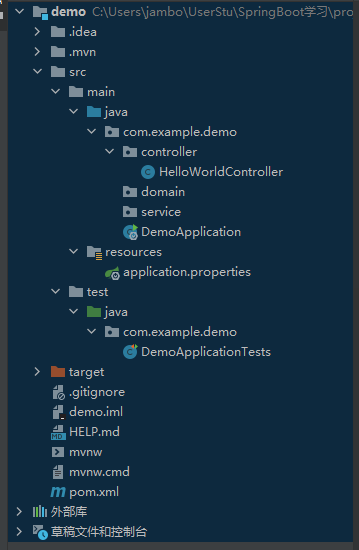
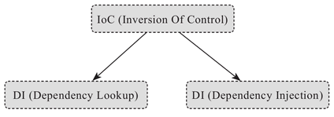
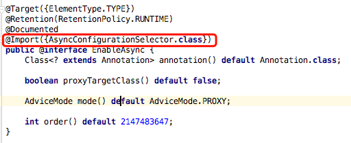

# SpringBoot学习

## 一、入门篇

### 什么是SpringBoot

整合了多个框架，使得开发人员不用再看多余的框架配置。

### 快速入门

 http://start.spring.io/ 快速构建一个spring boot项目

如上图所示，Spring Boot的基础结构共三个文件:

+ src/main/java 程序开发以及主程序入口

+ src/main/resources 配置文件

+ src/test/java 测试程序

```
com
  +- example
    +- myproject
      +- Application.java
      |
      +- domain
      |  +- Customer.java
      |  +- CustomerRepository.java
      |
      +- service
      |  +- CustomerService.java
      |
      +- controller
      |  +- CustomerController.java
      |
```

1、Application.java 建议放到跟目录下面,主要用于做一些框架配置

2、domain目录主要用于实体（Entity）与数据访问层（Repository）

3、service 层主要是业务类代码

4、controller 负责页面访问控制

#### 引入web模块

1. 添加web模块依赖

   ```xml
   <dependency>
       <groupId>org.springframework.boot</groupId>
       <artifactId>spring-boot-starter-web</artifactId>
   </dependency>
   ```

   加入之后会变红，需要点击pom.xml然后maven再点击重新加载项目之后就可以加载成功了

2. `spring-boot-starter` ：核心模块，包括自动配置支持、日志和 YAML，如果引入了 `spring-boot-starter-web` web 模块可以去掉此配置，因为 `spring-boot-starter-web` 自动依赖了 `spring-boot-starter`。

   `spring-boot-starter-test` ：测试模块，包括 JUnit、Hamcrest、Mockito。

3. 编写controller内容：

   ```java
   package com.example.demo.controller;
   
   import org.springframework.web.bind.annotation.RequestMapping;
   import org.springframework.web.bind.annotation.RestController;
   
   @RestController
   public class HelloWorldController {
       @RequestMapping("/hello")
       public String index(){
           return "Hello World";
       }
   
   }
   ```

   这里有两个注解，第一个是说自己用json方式进行存储，第二个是作为一个http请求的方法进行的返回，这里就是进行一个字符串hello world的返回。

   

4. 启动主程序即DemoApplication，然后去浏览器输入http://localhost:8080/hello 就可以获得一个hello world的访问了。

5. 在test下面写test测试文件：

   ```java
   package com.example.demo;
   
   import com.example.demo.controller.HelloWorldController;
   import org.junit.Before;
   import org.junit.Test;
   import org.junit.runner.RunWith;
   import org.springframework.boot.test.context.SpringBootTest;
   import org.springframework.http.MediaType;
   import org.springframework.test.context.junit4.SpringRunner;
   import org.springframework.test.web.servlet.MockMvc;
   import org.springframework.test.web.servlet.MockMvcBuilder;
   import org.springframework.test.web.servlet.ResultMatcher;
   import org.springframework.test.web.servlet.request.MockMvcRequestBuilders;
   import org.springframework.test.web.servlet.result.MockMvcResultHandlers;
   import org.springframework.test.web.servlet.setup.MockMvcBuilders;
   import static org.hamcrest.Matchers.equalTo;
   import static org.springframework.test.web.servlet.result.MockMvcResultHandlers.print;
   import static org.springframework.test.web.servlet.result.MockMvcResultMatchers.content;
   import static org.springframework.test.web.servlet.result.MockMvcResultMatchers.status;
   //需要这里的static导入
   
   
   @RunWith(SpringRunner.class)
   @SpringBootTest
   public class HelloTest {
       private MockMvc mvc;
       @Before
       public void setUp() throws Exception{
           mvc= MockMvcBuilders.standaloneSetup(new HelloWorldController()).build();
       }
       @Test
       public void getHello() throws Exception{
           mvc.perform(MockMvcRequestBuilders.get("/hello").accept(MediaType.APPLICATION_JSON))
                   .andExpect(status().isOk())
                   .andExpect(content().string(equalTo("Hello World"))).andDo(print());
       }
   }
   
   ```

   使用print获得了以下结果

   ```
   MockHttpServletRequest:
         HTTP Method = GET
         Request URI = /hello
          Parameters = {}
             Headers = [Accept:"application/json"]
                Body = <no character encoding set>
       Session Attrs = {}
   
   Handler:
                Type = com.example.demo.controller.HelloWorldController
              Method = com.example.demo.controller.HelloWorldController#index()
   
   Async:
       Async started = false
        Async result = null
   
   Resolved Exception:
                Type = null
   
   ModelAndView:
           View name = null
                View = null
               Model = null
   
   FlashMap:
          Attributes = null
   
   MockHttpServletResponse:
              Status = 200
       Error message = null
             Headers = [Content-Type:"application/json", Content-Length:"11"]
        Content type = application/json
                Body = Hello World
       Forwarded URL = null
      Redirected URL = null
             Cookies = []
   2021-04-08 11:36:00.865  INFO 9188 --- [extShutdownHook] o.s.s.concurrent.ThreadPoolTaskExecutor  : Shutting down ExecutorService 'applicationTaskExecutor'
   
   ```

#### Mock讲解

##### 什么是Mock

Mock是模拟对象 mock Object，是以可控的方式模拟真实对象行为的假对象，在编程过程中通常用模拟一些输入数据来验证程序是否达到预期结果

##### 为什么用Mock对象

可以模拟真实的、复杂的对象行为

使用Mockito一般分三个步骤：1、模拟测试类所需的外部依赖；2、执行测试代码；3、判断执行结果是否达到预期；

##### MockMvc

MockMvc是由spring-test包提供，实现了对Http请求的模拟，能够直接使用网络的形式，转换到Controller的调用，使得测试速度快、不依赖网络环境。同时提供了一套验证的工具，结果的验证十分方便。

接口MockMvcBuilder，提供一个唯一的build方法，用来构造MockMvc。主要有两个实现：StandaloneMockMvcBuilder和DefaultMockMvcBuilder，分别对应两种测试方式，即独立安装和集成Web环境测试（并不会集成真正的web环境，而是通过相应的Mock API进行模拟测试，无须启动服务器）。MockMvcBuilders提供了对应的创建方法standaloneSetup方法和webAppContextSetup方法，在使用时直接调用即可

##### SpringBoot中使用

1. spring-boot-starter-test  pom文件里面会引入对应东西

2. 创建一个controller类，提供一个hello方法作为待测试的业务接口

3. 编写测试类，实例化MockMvc，builder方法。然后是testHello方法，加上@test注解。

   ```java
   @Test
   public void testHello() throws Exception {
   
   	/*
   	 * 1、mockMvc.perform执行一个请求。
   	 * 2、MockMvcRequestBuilders.get("XXX")构造一个请求。
   	 * 3、ResultActions.param添加请求传值
   	 * 4、ResultActions.accept(MediaType.TEXT_HTML_VALUE))设置返回类型
   	 * 5、ResultActions.andExpect添加执行完成后的断言。
   	 * 6、ResultActions.andDo添加一个结果处理器，表示要对结果做点什么事情
   	 *   比如此处使用MockMvcResultHandlers.print()输出整个响应结果信息。
   	 * 7、ResultActions.andReturn表示执行完成后返回相应的结果。
   	 */
   	mockMvc.perform(MockMvcRequestBuilders
   			.get("/hello")
   			// 设置返回值类型为utf-8，否则默认为ISO-8859-1
   			.accept(MediaType.APPLICATION_JSON_UTF8_VALUE)
   			.param("name", "Tom"))
   			.andExpect(MockMvcResultMatchers.status().isOk())
   			.andExpect(MockMvcResultMatchers.content().string("Hello Tom!"))
   			.andDo(MockMvcResultHandlers.print());
   }
   ```

##### 常用的测试

1. 普通控制器

   ```java
   mockMvc.perform(get("/user/{id}", 1)) //执行请求  
               .andExpect(model().attributeExists("user")) //验证存储模型数据  
               .andExpect(view().name("user/view")) //验证viewName  
               .andExpect(forwardedUrl("/WEB-INF/jsp/user/view.jsp"))//验证视图渲染时forward到的jsp  
               .andExpect(status().isOk())//验证状态码  
               .andDo(print()); //输出MvcResult到控制台
   ```

2. 得到MvcResult自定义验证

   ```java
   MvcResult result = mockMvc.perform(get("/user/{id}", 1))//执行请求  
           .andReturn(); //返回MvcResult  
   Assert.assertNotNull(result.getModelAndView().getModel().get("user")); //自定义断言 
   ```

3. 验证请求参数绑定到模型数据及Flash属性

   ```java
   mockMvc.perform(post("/user").param("name", "zhang")) //执行传递参数的POST请求(也可以post("/user?name=zhang"))  
               .andExpect(handler().handlerType(UserController.class)) //验证执行的控制器类型  
               .andExpect(handler().methodName("create")) //验证执行的控制器方法名  
               .andExpect(model().hasNoErrors()) //验证页面没有错误  
               .andExpect(flash().attributeExists("success")) //验证存在flash属性  
               .andExpect(view().name("redirect:/user")); //验证视图  
   ```

4. 文件上传

   ```java
   byte[] bytes = new byte[] {1, 2};  
   mockMvc.perform(fileUpload("/user/{id}/icon", 1L).file("icon", bytes)) //执行文件上传  
           .andExpect(model().attribute("icon", bytes)) //验证属性相等性  
           .andExpect(view().name("success")); //验证视图 
   
   ```

5. JSON请求/响应验证

   ```java
   String requestBody = "{\"id\":1, \"name\":\"zhang\"}";  
       mockMvc.perform(post("/user")  
               .contentType(MediaType.APPLICATION_JSON).content(requestBody)  
               .accept(MediaType.APPLICATION_JSON)) //执行请求  
               .andExpect(content().contentType(MediaType.APPLICATION_JSON)) //验证响应contentType  
               .andExpect(jsonPath("$.id").value(1)); //使用Json path验证JSON 请参考http://goessner.net/articles/JsonPath/  
         
       String errorBody = "{id:1, name:zhang}";  
       MvcResult result = mockMvc.perform(post("/user")  
               .contentType(MediaType.APPLICATION_JSON).content(errorBody)  
               .accept(MediaType.APPLICATION_JSON)) //执行请求  
               .andExpect(status().isBadRequest()) //400错误请求  
               .andReturn();  
         
       Assert.assertTrue(HttpMessageNotReadableException.class.isAssignableFrom(result.getResolvedException().getClass()));//错误的请求内容体
   
   
   ```

6. 异步测试

   ```java
   //Callable  
       MvcResult result = mockMvc.perform(get("/user/async1?id=1&name=zhang")) //执行请求  
               .andExpect(request().asyncStarted())  
               .andExpect(request().asyncResult(CoreMatchers.instanceOf(User.class))) //默认会等10秒超时  
               .andReturn();  
         
       mockMvc.perform(asyncDispatch(result))  
               .andExpect(status().isOk())  
               .andExpect(content().contentType(MediaType.APPLICATION_JSON))  
               .andExpect(jsonPath("$.id").value(1));  
   ```

7. 全局配置

```java
mockMvc = webAppContextSetup(wac)  
            .defaultRequest(get("/user/1").requestAttr("default", true)) //默认请求 如果其是Mergeable类型的，会自动合并的哦mockMvc.perform中的RequestBuilder  
            .alwaysDo(print())  //默认每次执行请求后都做的动作  
            .alwaysExpect(request().attribute("default", true)) //默认每次执行后进行验证的断言  
            .build();  
      
mockMvc.perform(get("/user/1"))  
        .andExpect(model().attributeExists("user"));
```
## 二、Web开发

开发简单，包括json输出，filters、property、log等

### json接口开发

只需要类添加 `@RestController` 即可，默认类中的方法都会以 json 的格式返回

```java
@RestController
public class HelloController {
    @RequestMapping("/getUser")
    public User getUser() {
    	User user=new User();
    	user.setUserName("小明");
    	user.setPassWord("xxxx");
        return user;
    }
}
```

如果需要使用页面开发只要使用`@Controller`注解即可

### 自定义Filter

我们常常在项目中会使用 filters 用于录调用日志、排除有 XSS 威胁的字符、执行权限验证等等。Spring Boot 自动添加了  OrderedCharacterEncodingFilter 和 HiddenHttpMethodFilter，并且我们可以自定义  Filter。

两个步骤：

> 1. 实现 Filter 接口，实现 Filter 方法
> 2. 添加`@Configuration` 注解，将自定义Filter加入过滤链

```java
@Configuration
public class WebConfiguration {
    @Bean
    public RemoteIpFilter remoteIpFilter() {
        return new RemoteIpFilter();
    }
    
    @Bean
    public FilterRegistrationBean testFilterRegistration() {

        FilterRegistrationBean registration = new FilterRegistrationBean();
        registration.setFilter(new MyFilter());
        registration.addUrlPatterns("/*");
        registration.addInitParameter("paramName", "paramValue");
        registration.setName("MyFilter");
        registration.setOrder(1);
        return registration;
    }
    
    public class MyFilter implements Filter {
		@Override
		public void destroy() {
			// TODO Auto-generated method stub
		}

		@Override
		public void doFilter(ServletRequest srequest, ServletResponse sresponse, FilterChain filterChain)
				throws IOException, ServletException {
			// TODO Auto-generated method stub
			HttpServletRequest request = (HttpServletRequest) srequest;
			System.out.println("this is MyFilter,url :"+request.getRequestURI());
			filterChain.doFilter(srequest, sresponse);
		}

		@Override
		public void init(FilterConfig arg0) throws ServletException {
			// TODO Auto-generated method stub
		}
    }
}

```

### 自定义property

#### 配置在 application.properties 中：

```
com.neo.title=纯洁的微笑
com.neo.description=分享生活和技术
```

自定义配置类

```java
@Component
public class NeoProperties {
	@Value("${com.neo.title}")//用注解进行赋值
	private String title;
	@Value("${com.neo.description}")
	private String description;

	//省略getter settet方法

	}
```

#### log配置

配置输出的地址和输出级别

```properties
logging.path=/user/local/log
logging.level.com.favorites=DEBUG
logging.level.org.springframework.web=INFO
logging.level.org.hibernate=ERROR
```

path 为本机的 log 地址，`logging.level` 后面可以根据包路径配置不同资源的 log 级别

### 数据库操作

在这里我重点讲述 Mysql、spring data jpa 的使用，其中 Mysql 就不用说了大家很熟悉。Jpa 是利用 Hibernate 生成各种自动化的 sql，如果只是简单的增删改查，基本上不用手写了，Spring 内部已经帮大家封装实现了

1. 添加相关jar包

   ```xml
   <dependency>
       <groupId>org.springframework.boot</groupId>
       <artifactId>spring-boot-starter-data-jpa</artifactId>
   </dependency>
    <dependency>
       <groupId>mysql</groupId>
       <artifactId>mysql-connector-java</artifactId>
   </dependency>
   
   ```

2. 添加配置文件

   ```properties
   spring.datasource.url=jdbc:mysql://localhost:3306/test
   spring.datasource.username=root
   spring.datasource.password=root
   spring.datasource.driver-class-name=com.mysql.jdbc.Driver
   
   spring.jpa.properties.hibernate.hbm2ddl.auto=update //这里有四个值，下面介绍
   spring.jpa.properties.hibernate.dialect=org.hibernate.dialect.MySQL5InnoDBDialect
   //dialect 主要是指定生成表名的存储引擎为 InnoDBD
   spring.jpa.show-sql= true
   //show-sql 是否打印出自动生成的 SQL，方便调试的时候查看
   ```

   > 1. create： 每次加载 hibernate 时都会删除上一次的生成的表，然后根据你的 model 类再重新来生成新表，哪怕两次没有任何改变也要这样执行，这就是导致数据库表数据丢失的一个重要原因。
   > 2. create-drop ：每次加载 hibernate 时根据 model 类生成表，但是 sessionFactory 一关闭,表就自动删除。
   > 3. update：最常用的属性，第一次加载 hibernate 时根据 model  类会自动建立起表的结构（前提是先建立好数据库），以后加载 hibernate 时根据 model  类自动更新表结构，即使表结构改变了但表中的行仍然存在不会删除以前的行。要注意的是当部署到服务器后，表结构是不会被马上建立起来的，是要等  应用第一次运行起来后才会。
   > 4. validate ：每次加载 hibernate 时，验证创建数据库表结构，只会和数据库中的表进行比较，不会创建新表，但是会插入新值。

3. 添加实体类和Dao

   ```java
   @Entity
   public class User implements Serializable {
   
   	private static final long serialVersionUID = 1L;
   	@Id
   	@GeneratedValue
   	private Long id;
   	@Column(nullable = false, unique = true)
   	private String userName;
   	@Column(nullable = false)
   	private String passWord;
   	@Column(nullable = false, unique = true)
   	private String email;
   	@Column(nullable = true, unique = true)
   	private String nickName;
   	@Column(nullable = false)
   	private String regTime;
   
   	//省略getter settet方法、构造方法
   
   }
   ```

   **Entity 中不映射成列的字段得加 @Transient 注解，不加注解也会映射成列**

   ```java
   public interface UserRepository extends JpaRepository<User, Long> {
       User findByUserName(String userName);
       User findByUserNameOrEmail(String username, String email);
   }
   ```

4. 测试

   ```java
   @RunWith(SpringJUnit4ClassRunner.class)
   @SpringApplicationConfiguration(Application.class)
   public class UserRepositoryTests {
   
   	@Autowired
   	private UserRepository userRepository;
   
   	@Test
   	public void test() throws Exception {
   		Date date = new Date();
   		DateFormat dateFormat = DateFormat.getDateTimeInstance(DateFormat.LONG, DateFormat.LONG);        
   		String formattedDate = dateFormat.format(date);
   		
   		userRepository.save(new User("aa1", "aa@126.com", "aa", "aa123456",formattedDate));
   		userRepository.save(new User("bb2", "bb@126.com", "bb", "bb123456",formattedDate));
   		userRepository.save(new User("cc3", "cc@126.com", "cc", "cc123456",formattedDate));
   
   		Assert.assertEquals(9, userRepository.findAll().size());
   		Assert.assertEquals("bb", userRepository.findByUserNameOrEmail("bb", "cc@126.com").getNickName());
   		userRepository.delete(userRepository.findByUserName("aa1"));
   	}
   
   }
   
   ```

### Thymeleaf

一个前后端工具

### Gradle构建工具

比maven简介，更适合大型复杂项目的构建，

### WebJars

让大家以Jar包的形式来使用前端的各种框架和组件。

WebJars 是将客户端（浏览器）资源（JavaScript，Css等）打成 Jar 包文件，以对资源进行统一依赖管理。WebJars 的 Jar 包部署在 Maven 中央仓库上。

## 三、事务详解

### 什么是事务

事务就是逻辑上的一组操作，要么都执行要么都不执行。事务是否生效要看用的数据库引擎是否是事务型数据库，比如MySQL的InnoDB引擎就是，但是MyISAM就不是。

### Spring支持的两种事务管理方式

1. 编程式管理，通过TransactionTemplate或者TransactionManager对象进行事务管理，实际很少用
2. 声明式的事务管理，推荐使用，代码侵入性小，实际上是基于AOP实现的，基于@Transactional进行管理的方式使用最多，

### 事务属性：TransactionDefinition


#### 1. 事务的传播行为

在事务之间可能有相互调用的事情，那么回滚就应该大家一起回滚。有以下常量定义传播行为：

```java
public interface TransactionDefinition {
    int PROPAGATION_REQUIRED = 0;
    int PROPAGATION_SUPPORTS = 1;
    int PROPAGATION_MANDATORY = 2;
    int PROPAGATION_REQUIRES_NEW = 3;
    int PROPAGATION_NOT_SUPPORTED = 4;
    int PROPAGATION_NEVER = 5;
    int PROPAGATION_NESTED = 6;
    ......
}//为了方便，又定义了一个枚举类，

package org.springframework.transaction.annotation;

import org.springframework.transaction.TransactionDefinition;

public enum Propagation {

    REQUIRED(TransactionDefinition.PROPAGATION_REQUIRED),

    SUPPORTS(TransactionDefinition.PROPAGATION_SUPPORTS),

    MANDATORY(TransactionDefinition.PROPAGATION_MANDATORY),

    REQUIRES_NEW(TransactionDefinition.PROPAGATION_REQUIRES_NEW),

    NOT_SUPPORTED(TransactionDefinition.PROPAGATION_NOT_SUPPORTED),

    NEVER(TransactionDefinition.PROPAGATION_NEVER),

    NESTED(TransactionDefinition.PROPAGATION_NESTED);


    private final int value;

    Propagation(int value) {
        this.value = value;
    }

    public int value() {
        return this.value;
    }

}
```

相关类说明：

1. **`TransactionDefinition.PROPAGATION_REQUIRED`**

   使用最多的一个行为，@Transactional默认用的就是这个传播行为。如果当前存在事务就加入，如果没有就创建一个新的事务。

   1. 如果外部方法没有开启事务的话，`Propagation.REQUIRED`修饰的内部方法会新开启自己的事务，且开启的事务相互独立，互不干扰。
   2. 如果外部方法开启事务并且被`Propagation.REQUIRED`的话，所有`Propagation.REQUIRED`修饰的内部方法和外部方法均属于同一事务 ，只要一个方法回滚，整个事务均回滚。

2. **`TransactionDefinition.PROPAGATION_REQUIRES_NEW`**

   创建一个新的事务，如果当前存在事务，则把当前事务挂起。也就是说不管外部方法是否开启事务，`Propagation.REQUIRES_NEW`修饰的内部方法会新开启自己的事务，且开启的事务相互独立，互不干扰。

3. **`TransactionDefinition.PROPAGATION_NESTED`**

   当前如果存在事务，就新建一个事务作为当前事务的嵌套事务来运行。外部主事务回滚的话，子事务也会回滚，而内部子事务可以单独回滚而不影响外部主事务和其他子事务。

4. **`TransactionDefinition.PROPAGATION_MANDATORY`** 强制的

   如果存在事务就加入，如果没有就抛出异常

#### 2. 事务隔离级别

还是那几个，MySQL的InnoDB默认是可重复读，但是不保证幻影读，应该用加锁来保证没有幻影读。

InnoDB存储引擎提供了对XA事务的支持，并通过XA事务来支持分布式事务的实现。分布式事务指的是允许多个独立的事务资源（transactional  resources）参与到一个全局的事务中。事务资源通常是关系型数据库系统，但也可以是其他类型的资源。全局事务要求在其中的所有参与的事务要么都提交，要么都回滚，这对于事务原有的ACID要求又有了提高。另外，在使用分布式事务时，InnoDB存储引擎的事务隔离级别必须设置为SERIALIZABLE。

#### 3. 事务超时属性

超时了会回滚

#### 4. 事务只读属性

如果只读事务，那么可以加一个@Transactional，这样数据库会进行一个优化，可能放到一个事务进行执行。如果不加的话，数据库就会默认一个句子一个sql，这样就会比较麻烦

#### 5. 事务回滚规则

只有遇到运行时异常时才会回滚，Error也会导致回滚，遇到检查型Checked异常的时候不会回滚

要自定义遇到某个异常的时候回滚就要写成

@Transactional(rollbackFor = MyException.class)

### @Transactional注解使用

#### 使用范围

推荐加到方法上，但是只对public有效。

如果在类上面，就代表其对类中的所有public方法有效。

不推荐在接口上使用

#### 常用配置参数

**`@Transactional` 的常用配置参数总结：**

| 属性名      | 说明                                                         |
| ----------- | ------------------------------------------------------------ |
| propagation | 事务的传播行为，默认值为 REQUIRED，可选的值在上面介绍过      |
| isolation   | 事务的隔离级别，默认值采用 DEFAULT，可选的值在上面介绍过     |
| timeout     | 事务的超时时间，默认值为-1（不会超时）。如果超过该时间限制但事务还没有完成，则自动回滚事务。 |
| readOnly    | 指定事务是否为只读事务，默认值为 false。                     |
| rollbackFor | 用于指定能够触发事务回滚的异常类型，并且可以指定多个异常类型。 |

#### @Transactional事务注解原理

基于AOP实现的，AOP是使用动态代理实现的，有接口就用jdk的动态代理，否则就是Cglib代理。

如果一个类或者一个类中的 public 方法上被标注`@Transactional` 注解的话，Spring 容器就会在启动的时候为其创建一个代理类，在调用被`@Transactional` 注解的 public 方法的时候，实际调用的是，`TransactionInterceptor` 类中的 `invoke()`方法。这个方法的作用就是在目标方法之前开启事务，方法执行过程中如果遇到异常的时候回滚事务，方法调用完成之后提交事务。就是写一个invoke方法，在前面开启事务，在后面捕捉异常回滚事务，或者提交事务。

`TransactionInterceptor` 类中的 `invoke()`方法内部实际调用的是 `TransactionAspectSupport` 类的 `invokeWithinTransaction()`方法。由于新版本的 Spring 对这部分重写很大，而且用到了很多响应式编程的知识，这里就不列源码了。

如果在一个类里面一个方法调用另一个方法，调用的方法没有注解，被调用的有注解，这样内部的注解就会失效。这个只在Spring AOP的时候才会有问题，AspectJ没问题。因为Spring的aop必须在类以外才有效，所以同一个类里面的相互调用进行aop是失效的。


# Springboot入门学习

## 微服务是什么

微服务（Microservice）虽然是当下刚兴起的比较流行的新名词，但本质上来说，微服务并非什么新的概念。

就是进行功能拆分，使得其独立承担对外服务的职责

可扩展性提高、隔离性、支持多语言

## Spring Ioc介绍

Ioc可以由Di或者Dl(Dependency Lookup依赖查找)实现，前者是当前软件实体被动接受其依赖的其他组件被Ioc容器注入，后者则是当前软件实体主动去某个服务注册地查找其依赖的那些服务



任何一个使用 Spring 框架构建的独立的 Java 应用（Standalone Java Application），通常都会存在一行类似于“context.getBean（..）；”的代码。

 实际上，这行代码做的就是 DL 的工作，而构建的任何一种 IoC 容器背后（比如 BeanFactory 或者 ApplicationContext）发生的事情，则更多是 DI 的过程（也可能有部分 DL 的逻辑用于对接遗留系统）。

### 使用过程

1. 收集和注册

   第一个阶段可以认为是构建和收集 bean 定义的阶段，在这个阶段中，我们可以通过 XML 或者 Java 代码的方式定义一些 bean，然后通过手动组装或者让容器基于某些机制自动扫描的形式，将这些 bean 定义收集到 IoC 容器中。

    假设我们以 XML 配置的形式来收集并注册单一 bean，一般形式如下：

   ```xml
   <bean id="mockService" class="..MockServiceImpl"> ...</bean>
   ```

   如果嫌逐个收集 bean 定义麻烦，想批量地收集并注册到 IoC 容器中，我们也可以通过 XML Schema 形式的配置进行批量扫描并采集和注册：

   ```xml
   <context:component-scan base-package="com.keevol">
   ```

   注意基于 JavaConfig 形式的收集和注册，不管是单一还是批量，后面我们都会单独提及。

2. 分析和组装

   当第一阶段工作完成后，我们可以先暂且认为 IoC 容器中充斥着一个个独立的 bean，它们之间没有任何关系。

   但实际上，它们之间是有依赖关系的，所以，IoC 容器在第二阶段要干的事情就是分析这些已经在 IoC 容器之中的 bean，然后根据它们之间的依赖关系先后组装它们。

   如果 IoC 容器发现某个 bean 依赖另一个 bean，它就会将这另一个 bean 注入给依赖它的那个 bean，直到所有 bean 的依赖都注入完成，所有 bean 都“整装待发”，整个 IoC 容器的工作即算完成。

   至于分析和组装的依据，Spring 框架最早是通过 XML 配置文件的形式来描述 bean 与 bean 之间的关系的，随着 Java  业界研发技术和理念的转变，基于 Java 代码和 Annotation 元信息的描述方式也日渐兴盛（比如 @Autowired 和  @Inject），但不管使用哪种方式，都只是为了简化绑定逻辑描述的各种“表象”，最终都是为本阶段的最终目的服务。

   很多 Java 开发者一定认为 Spring 的 XML  配置文件是一种配置（Configuration），但本质上，这些配置文件更应该是一种代码形式，XML 在这里其实可以看作一种  DSL，它用来表述的是 bean 与 bean 之间的依赖绑定关系，如果没有 IoC 容器就要自己写代码新建（new）对象并配置（set）依赖

## Spring JavaConfig和常见Annotation

### JavaConfig

#### 1）表达形式层面

基于 XML 的配置形式是这样的：

\<bean id="mockService" class="..MockServiceImpl"> ...\</bean>

而基于 JavaConfig 的配置形式是这样的：

```java
@Configurationpublic 
class MockConfiguration {    
    @Bean    
    public MockService mockService() {        
        return new MockServiceImpl();    
    }
}
```

任何一个标注了 @Bean 的方法，其返回值将作为一个 bean 定义注册到 Spring 的 IoC容器，方法名将默认成为该 bean 定义的 id。

#### 2）注册 bean **定义层面**

基于 XML 的配置方式是这样的：

```xml
<?xml version="1.0" encoding="UTF-8"?><beans xmlns="http://www.springframework.org/schema/beans"    xmlns:xsi="http://www.w3.org/2001/XMLSchema-instance"    xmlns:context="http://www.springframework.org/schema/context"    xsi:schemaLocation="http://www.springframework.org/schema/beans        http://www.springframework.org/schema/beans/spring-beans.xsd        http://www.springframework.org/schema/context        http://www.springframework.org/schema/context/spring-context.xsd">       <!-- bean定义 --></beans>
```

而基于 JavaConfig 的配置方式是这样的：

```java
@Configurationpublic 
class MockConfiguration{    
    // bean定义
} 
```

任何一个标注了 @Configuration 的 Java 类定义都是一个 JavaConfig 配置类。

#### 3) 表达依赖注入关系层面

为了表达 bean 与 bean 之间的依赖关系，在 XML 形式中一般是这样的：

```xml
<bean id="mockService" class="..MockServiceImpl">
    <property name="dependencyService" ref="dependencyService" />
</bean>
<bean id="dependencyService" class="DependencyServiceImpl" /> 
```

而在 JavaConfig 中则是这样的：

```java
@Configuration
public class MockConfiguration {
    @Bean
    public MockService mockService() {
        return new MockServiceImpl(dependencyService());
    }

    @Bean
    public DependencyService dependencyService() {
        return new DependencyServiceImpl();
    }
}
```

如果一个 bean 的定义依赖其他 bean，则直接调用对应 JavaConfig 类中依赖 bean 的创建方法就可以了。

 在 JavaConfig 形式的依赖注入过程中，我们使用方法调用的形式注入依赖，如果这个方法返回的对象实例只被一个 bean 依赖注入，那也还好，如果多于一个 bean 需要依赖这个方法调用返回的对象实例，那是不是意味着我们就会创建多个同一类型的对象实例？

 从代码表述的逻辑来看，直觉上应该是会创建多个同一类型的对象实例，但实际上最终结果却不是这样，依赖注入的都是同一个 Singleton 的对象实例，那这是如何做到的？

 笔者一开始以为 Spring 框架会通过解析 JavaConfig 的代码结构，然后通过解析器转换加上反射等方式完成这一目的，但实际上  Spring 框架的设计和实现者采用了另一种更通用的方式，这在 Spring  的参考文档中有说明。即通过拦截配置类的方法调用来避免多次初始化同一类型对象的问题，一旦拥有拦截逻辑的子类发现当前方法没有对应的类型实例时才会去请求父类的同一方法来初始化对象实例，否则直接返回之前的对象实例。

 所以，原来 Spring IoC 容器中有的特性（features）在 JavaConfig 中都可以表述，只是换了一种形式而已，而且，通过声明相应的 Java Annotation 反而“内聚”一处，变得更加简洁明了了。

## SpringBoot介绍

### 核心功能

#### 1）独立运行的 Spring 项目

Spring Boot 可以以 jar 包的形式独立运行，运行一个 Spring Boot 项目只需通过 java–jar xx.jar 来运行。

#### 2）内嵌 Servlet 容器

Spring Boot 可选择内嵌 Tomcat、Jetty 或者 Undertow，这样我们无须以 war 包形式部署项目。

#### 3）提供 starter 简化 [Maven](http://c.biancheng.net/maven/) 配置

Spring 提供了一系列的 starter pom 来简化 Maven 的依赖加载，例如，当你使用了spring-boot-starter-web 时，会自动加入如图 1 所示的依赖包。

#### 4）自动配置 Spring

Spring Boot 会根据在类路径中的 jar 包、类，为 jar 包里的类自动配置  Bean，这样会极大地减少我们要使用的配置。当然，Spring Boot  只是考虑了大多数的开发场景，并不是所有的场景，若在实际开发中我们需要自动配置 Bean，而 Spring Boot  没有提供支持，则可以自定义自动配置。

#### 5）准生产的应用监控

Spring Boot 提供基于 http、ssh、telnet 对运行时的项目进行监控。

#### 6）无代码生成和 xml 配置

Spring Boot 的神奇的不是借助于代码生成来实现的，而是通过条件注解来实现的，这是 Spring 4.x 提供的新特性。Spring  4.x 提倡使用 Java 配置和注解配置组合，而 Spring Boot 不需要任何 xml 配置即可实现 Spring 的所有配置。

### 优缺点

#### 1）优点

- 快速构建项目。
- 对主流开发框架的无配置集成。
- 项目可独立运行，无须外部依赖Servlet容器。
- 提供运行时的应用监控。
- 极大地提高了开发、部署效率。
- 与[云计算](http://c.biancheng.net/cloud_computing/)的天然集成。

#### 2）缺点

- 由于不用自己做配置，报错时很难定位。
- 网上现成的解决方案比较少。

## @SpringBootApplication

这是一个复合的注解，三体结构

```java
@Target(ElementType.TYPE)
@Retention(RetentionPolicy.RUNTIME)
@Documented
@Inherited
@Configuration
@EnableAutoConfiguration
@ComponentScanpublic
@interface
SpringBootApplication{...}
```

重要的只有三个 Annotation，而“三体”结构实际上指的就是这三个 Annotation：

- @Configuration
- @EnableAutoConfiguration
- @ComponentScanpublic

### @Configuration

就是Spring里面的Configuration，代表本身启动类是IoC容器的配置类

### @EnableAutoConfiguration

而 @EnableAutoConfiguration 也是借助 @Import 的帮助，将所有符合自动配置条件的 bean 定义加载到 IoC 容器，仅此而已！

```java
@Target(ElementType.TYPE)
@Retention(RetentionPolicy.RUNTIME)
@Documented
@Inherited
@AutoConfigurationPackage
@Import(EnableAutoConfigurationImportSelector.class)
public @interface EnableAutoConfiguration {...}
```

借助 EnableAutoConfigurationImportSelector，@EnableAutoConfiguration 可以帮助  SpringBoot 应用将所有符合条件的 @Configuration 配置都加载到当前 SpringBoot 创建并使用的 IoC  容器

### @SpringFactoriesLoader

SpringFactoriesLoader 属于 Spring 框架私有的一种扩展方案（类似于 Java 的 SPI 方案  java.util.ServiceLoader），其主要功能就是从指定的配置文件 META-INF/spring.factories 加载配置，

spring.factories 是一个典型的 java properties 文件，配置的格式为 Key=Value 形式，只不过 Key 和 Value 都是 Java 类型的完整类名（Fully qualified name），比如：

 example.MyService=example.MyServiceImpl1,example.MyServiceImpl2 然后框架就可以根据某个类型作为 Key 来查找对应的类型名称列表了

### @ComponentScan

可有可无

## SpringApplication.run执行流程详解

```java
SpringApplication.run（DemoApplication.class，args）;
```

### 深入探索执行流程

1. 如果我们使用的是 SpringApplication 的静态 run 方法，那么，这个方法里面首先需要创建一个  SpringApplication 对象实例，然后调用这个创建好的 SpringApplication 的实例 run方 法。在  SpringApplication 实例初始化的时候，它会提前做几件事情：

    根据 classpath  里面是否存在某个特征类（org.springframework.web.context.ConfigurableWebApplicationContext）来决定是否应该创建一个为 Web 应用使用的 ApplicationContext 类型，还是应该创建一个标准 Standalone 应用使用的  ApplicationContext 类型。

    使用 SpringFactoriesLoader 在应用的 classpath 中查找并加载所有可用的 ApplicationContextInitializer。

    使用 SpringFactoriesLoader 在应用的 classpath 中查找并加载所有可用的 ApplicationListener。

    推断并设置 main 方法的定义类。

2. SpringApplication 实例初始化完成并且完成设置后，就开始执行 run 方法的逻辑了，方法执行伊始，首先遍历执行所有通过  SpringFactoriesLoader 可以查找到并加载的 SpringApplicationRunListener，调用它们的  started() 方法，告诉这些 SpringApplicationRunListener，“嘿，SpringBoot 应用要开始执行咯！”。

3. 创建并配置当前 SpringBoot 应用将要使用的 Environment（包括配置要使用的 PropertySource 以及 Profile）。

4. 遍历调用所有 SpringApplicationRunListener 的 environmentPrepared（）的方法，告诉它们：“当前 SpringBoot 应用使用的 Environment 准备好咯！”。

5. 如果 SpringApplication的showBanner 属性被设置为 true，则打印 banner（SpringBoot  1.3.x版本，这里应该是基于 Banner.Mode 决定 banner  的打印行为）。这一步的逻辑其实可以不关心，我认为唯一的用途就是“好玩”（Just For Fun）。

6. 根据用户是否明确设置了applicationContextClass 类型以及初始化阶段的推断结果，决定该为当前 SpringBoot  应用创建什么类型的 ApplicationContext 并创建完成，然后根据条件决定是否添加 ShutdownHook，决定是否使用自定义的  BeanNameGenerator，决定是否使用自定义的 ResourceLoader，当然，最重要的，将之前准备好的 Environment  设置给创建好的 ApplicationContext 使用。

7. ApplicationContext 创建好之后，SpringApplication 会再次借助  Spring-FactoriesLoader，查找并加载 classpath 中所有可用的  ApplicationContext-Initializer，然后遍历调用这些 ApplicationContextInitializer 的  initialize（applicationContext）方法来对已经创建好的 ApplicationContext 进行进一步的处理。

8. 遍历调用所有 SpringApplicationRunListener 的 contextPrepared（）方法，通知它们：“SpringBoot 应用使用的 ApplicationContext 准备好啦！”

9. 最核心的一步，将之前通过 @EnableAutoConfiguration 获取的所有配置以及其他形式的 IoC 容器配置加载到已经准备完毕的 ApplicationContext。

10. 遍历调用所有 SpringApplicationRunListener 的 contextLoaded() 方法，告知所有 SpringApplicationRunListener，ApplicationContext "装填完毕"！

11. 调用 ApplicationContext 的 refresh() 方法，完成 IoC 容器可用的最后一道工序。

12. 查找当前 ApplicationContext 中是否注册有 CommandLineRunner，如果有，则遍历执行它们。

13. 正常情况下，遍历执行 SpringApplicationRunListener 的 finished()  方法，告知它们：“搞定！”。（如果整个过程出现异常，则依然调用所有 SpringApplicationRunListener 的  finished() 方法，只不过这种情况下会将异常信息一并传入处理）。

**整个过程看起来冗长无比，但其实很多都是一些事件通知的扩展点，如果我们将这些逻辑暂时忽略，那么，其实整个 SpringBoot 应用启动的逻辑就可以压缩到极其精简的几步，如图 1 所示。**


### 扩展点的说明

#### 第四步的SpringApplicationRunListener

```java
public interface SpringApplicationRunListener {
    void started();
    void environmentPrepared(ConfigurableEnvironment environment);
    void contextPrepared(ConfigurableApplicationContext context);
    void contextLoaded(ConfigurableApplicationContext context);
    void finished(ConfigurableApplicationContext context, Throwable exception);
}
```

一般不需要自己定义

#### 第一步的ApplicationListener

**但对 Spring 框架本身又没有过多接触的开发者来说，可能会将这个名字与 SpringApplicationRunListener 混淆。**

如果我们要为 SpringBoot 应用添加自定义的 ApplicationListener，有两种方式：

- 通过 SpringApplication.addListeners（..）或者 SpringApplication.setListeners（..）方法添加一个或者多个自定义的 ApplicationListener。
- 借助 SpringFactoriesLoader 机制，在 META-INF/spring.factories 文件中添加配置（以下代码是为 SpringBoot 默认注册的 ApplicationListener 配置）。

#### 第一步的ApplicationContextInitializer

这个类的主要目的就是在 ConfigurableApplicationContext 类型（或者子类型）的 ApplicationContext 做 refresh 之前，允许我们对 ConfigurableApplicationContext 的实例做进一步的设置或者处理。

```java
public class DemoApplicationContextInitializer implements ApplicationContextInitializer {
    @Override
    public void initialize(ConfigurableApplicationContext applicationContext) {
        // do whatever you want with applicationContext,
        // e.g.
        applicationContext.registerShutdownHook();
    }
}
```

#### 第十二步的CommandLineRunner

CommandLineRunner 是很好的扩展接口

CommandLineRunner 需要大家关注的其实就两点：

 1）所有 CommandLineRunner 的执行时点在 SpringBoot 应用的 Application-Context 完全初始化开始工作之后（可以认为是 main 方法执行完成之前最后一步）。

 2）只要存在于当前 SpringBoot 应用的 ApplicationContext 中的任何 Command-LineRunner，都会被加载执行（不管你是手动注册这个 CommandLineRunner 到 IoC 容器，还是自动扫描进去的）。

## SpringBoot的自动配置

### 基于条件的自动配置

在 Spring 框架中，我们可以使用 @Conditional 这个 Annotation 配合 @Configuration 或者  @Bean 等 Annotation 来干预一个配置或者 bean 定义是否能够生效。

可以在这个注解里面加上实现类，比如MyCondition1.class...等

实现了一批 Annotation（位于 org.springframework.boot.autoconfigure.condition 包下），条件注解如下：

- @ConditionalOnBean：当容器里有指定的 Bean 的条件下。
- @ConditionalOnClass：当类路径下有指定的类的条件下。
- @ConditionalOnExpression：基于 SpEL 表达式作为判断条件。
- @ConditionalOnJava：基于 JVM 版本作为判断条件。
- @ConditionalOnJndi：在 JNDI 存在的条件下查找指定的位置。
- @ConditionalOnMissingBean：当容器里没有指定 Bean 的情况下。
- @ConditionalOnMissingClass：当类路径下没有指定的类的条件下。
- @ConditionalOnNotWebApplication：当前项目不是 Web 项目的条件下。
- @ConditionalOnProperty：指定的属性是否有指定的值。
- @ConditionalOnResource：类路径是否有指定的值。
- @ConditionalOnSingleCandidate：当指定 Bean 在容器中只有一个，或者虽然有多个但是指定首选的 Bean。
- @ConditionalOnWebApplication：当前项目是 Web 项目的条件下。

### 调整自动配置的顺序

在实现自动配置的过程中，除了可以提供基于条件的配置，我们还可以对当前要提供的配置或者组件的加载顺序进行相应调整，从而让这些配置或者组件之间的依赖分析和组装可以顺利完成。

我们可以使用 @org.springframework.boot.autoconfigure.AutoConfigureBefore 或者  @org.springframework.boot.autoconfigure.AutoConfigureAfter  让当前配置或者组件在某个其他组件之前或者之后进行，比如，假设我们希望某些 JMX 操作相关的 bean 定义在 MBeanServer  配置完成之后进行，那么我们就可以提供一个类似如下的配置：

```java
@Configuration
@AutoConfigureAfter(JmxAutoConfiguration.class)
public class AfterMBeanServerReadyConfiguration {
    @AutoWired
    MBeanServer mBeanServer;

    //通过 @Bean 添加必要的 bean 定义
}
```

## spring-boot-starter-logging和应用日志

假如 maven 依赖中添加了 spring-boot-starter-logging，如以下代码所示：

```xml
<dependency>
    <groupId> org.springframework.boot </groupId>
    <artifactId> spring-boot-starter-logging </artifactId>
</dependency>
```

那么，我们的 [SpringBoot](http://c.biancheng.net/spring_boot/) 应用将自动使用 logback 作为应用日志框架，[Spring](http://c.biancheng.net/spring/)Boot 启动的时候，由 org.springframework.boot.logging.Logging-Application-Listener 根据情况初始化并使用。

假设我们要对默认 SpringBoot 提供的应用日志设定做调整，则可以通过几种方式进行配置调整：

- 遵循 logback 的约定，在 classpath 中使用自己定制的 logback.xml 配置文件。

- 在文件系统中任何一个位置提供自己的 logback.xml 配置文件，然后通过 logging.config 配置项指向这个配置文件来启用它，比如在 application.properties 中指定如下的配置。

  ```properties
  logging.config=/{some.path.you.defined}/any-logfile-name-I-like.log
  ```

SpringBoot 默认允许我们通过在配置文件或者命令行等方式使用 logging.file 和 logging.path  来自定义日志文件的名称和存放路径，不过，这只是允许我们在 SpringBoot  框架预先定义的默认日志系统设定的基础上做有限的设置，如果我们希望更灵活的配置，最好通过框架特定的配置方式提供相应的配置文件，然后通过  logging.config 来启用。意思是说这个只是一点的更改，要进行更多的更改需要进行更深层的配置文件的更改。

```xml
<dependency>
    <groupId> org.springframework.boot </groupId>
    <artifactId> spring-boot-starter-log4j </artifactId>
</dependency>
```

也可以这么写使用这一种日志模块

## spring-boot-starter-web

加入web依赖

```xml
<dependency>
    <groupId>org.springframework.boot</groupId>
    <artifactId>spring-boot-starter-web</artifactId>
</dependency>
```

我们就得到了一个直接可执行的 Web 应用，当前项目下运行 mvn spring-boot：run 就可以直接启动一个使用了嵌入式 tomcat 服务请求的 Web 应用，只不过，我们还没有提供任何服务 Web 请求的 Controller，所以，访问任何路径都会返回一个  SpringBoot 默认提供的错误页面（一般称其为 whitelabel error page）

### 项目结构层面的约定

项目结构层面与传统打包为 war 的 Java Web 应用的差异在于，静态文件和页面模板的存放位置变了，原来是放在 src/main/webapp 目录下的一系列资源，现在都统一放在 src/main/resources 相应子目录下，比如：

- src/main/resources/static 用于存放各类静态资源，比如 css，js 等。
- src/main/resources/templates 用于存放模板文件，比如 *.vm。

### SpringMVC 框架层面的约定和定制

spring-boot-starter-web 默认将为我们自动配置如下一些 SpringMVC 必要组件：

- 必要的 ViewResolver，比如 ContentNegotiatingViewResolver 和 Bean-NameViewResolver。
- 将必要的 Converter、GenericConverter 和 Formatter 等 bean 注册到 IoC 容器。
- 添加一系列的 HttpMessageConverter 以便支持对 Web 请求和相应的类型转换。
- 自动配置和注册 MessageCodesResolver。
- 其他。

任何时候，如果我们对默认提供的 SpringMVC 组件设定不满意，都可以在 IoC 容器中注册新的同类型的 bean  定义来替换，或者直接提供一个基于 WebMvcConfigurerAdapter 类型的 bean 定义来定制，甚至直接提供一个标注了  @EnableWebMvc 的 @Configuration 配置类完全接管所有 SpringMVC 的相关配置，自己完全重新配置。 

## spring-boot-starter-jdbc与数据访问

我们会自己配置一个 DataSource 实例，或者通过自动配置模块提供的配置参数对 DataSource 实例进行自定义的配置。

假设我们的 SpringBoot 应用只依赖一个数据库，那么，使用 DataSource 自动配置模块提供的配置参数是最方便的：

spring.datasource.url=jdbc:mysql://{database host}:3306/{databaseName}
spring.datasource.username={database username}
spring.datasource.password={database password}

自动配置的时候如果需要连接其他数据库，那就需要进行设置，要更改启动类和加一些注解。

另外，SpringBoot 还提供了很多其他数据访问相关的自动配置模块，比如  spring-boot-starter-data-jpa、spring-boot-starter-data-mongodb  等，大家可以根据自己数据访问的具体场景选择使用这些自动配置模块。

也需要相应的在 SpringBoot 启动类中排除掉这些自动配置模块中的 AutoConfiguration 实现类（对应  spring-boot-starter-data-jpa 是 JpaRepositoriesAutoConfiguration），或者标注某个  DataSource 为 @Primary。

## spring-boot-starter-aop及其使用场景说明

现在 Spring 框架提供的 AOP 方案倡导了一种各取所长的方案，即使用 SpringAOP 的面向对象的方式来编写和组织织入逻辑，并使用  AspectJ 的 Pointcut 描述语言配合 Annotation 来标注和指明织入点（Jointpoint）。

[SpringBoot](http://c.biancheng.net/spring_boot/) 为我们提供了一个 spring-boot-starter-aop 自动配置模块。

 spring-boot-starter-aop 自动配置行为由两部分内容组成：

1. 位于 spring-boot-autoconfigure的org.springframework.boot.autoconfigure.aop.AopAutoConfiguration 提供 @Configuration 配置类和相应的配置项。
2. spring-boot-starter-aop 模块自身提供了针对 spring-aop、aspectjrt 和 aspectjweaver 的依赖。

一般情况下，只要项目依赖中加入了 spring-boot-starter-aop，其实就会自动触发 AOP 的关联行为，包括构建相应的  AutoProxyCreator，将横切关注点织入（Weave）相应的目标对象等，不过 AopAutoConfiguration  依然为我们提供了可怜的两个配置项，用来有限地干预 AOP 相关配置：

- spring.aop.auto=true
- spring.aop.proxy-target-class=false

 对我们来说，这两个配置项的最大意义在于：允许我们投反对票，比如可以选择关闭自动的 aop 配置（spring.aop.auto=false），或者启用针对 class 而不是 interface 级别的 aop 代理（aop proxy）。

## spring-boot-starter-security与应用安全

安全的对外提供服务的Web应用：

```xml
<?xml version="1.0" encoding="UTF-8"?>
<project xmlns="http://maven.apache.org/POM/4.0.0"
    xmlns:xsi="http://www.w3.org/2001/XMLSchema-instance"
    xsi:schemaLocation="http://maven.apache.org/POM/4.0.0
        http://maven.apache.org/xsd/maven-4.0.0.xsd">
    <modelVersion>4.0.0</modelVersion>
    <groupId>com.keevol.unveilspring.chapter3</groupId>
    <artifactId>web-security-demo</artifactId>
    <version>0.0.1-SNAPSHOT</version>
    <packaging>jar</packaging>
    <name>web-security-demo</name>
    <description>web security demo project for Spring Boot</description>
    <parent>
        <groupId>org.springframework.boot</groupId>
        <artifactId>spring-boot-starter-parent</artifactId>
        <version>1.3.1.RELEASE</version>
        <relativePath /> <!-- lookup parent from repository -->
    </parent>
    <properties>
        <project.build.sourceEncoding>UTF-8</project.build.sourceEncoding>
        <java.version>1.8</java.version>
    </properties>
    <dependencies>
        <dependency>
            <groupId>org.springframework.boot</groupId>
            <artifactId>spring-boot-starter-security</artifactId>
        </dependency>
        <dependency>
            <groupId>org.springframework.boot</groupId>
            <artifactId>spring-boot-starter-web</artifactId>
        </dependency> <!--其他依赖 -->
    </dependencies>
    <build>
        <plugins>
            <plugin>
                <groupId>org.springframework.boot</groupId>
                <artifactId>spring-boot-maven-plugin</artifactId>
            </plugin>
        </plugins>
    </build>
</project> 
```

这个安全防护是比较弱的，但是比较便利

## spring-boot-starter-actuator与应用监控

actuator就是制动器、传动装置、执行机构等。Sensor是监，Actuator是控

#### 1. Sensor 类 endpoints

| 名称        | 说明                                                         |
| ----------- | ------------------------------------------------------------ |
| autoconfig  | 这个 endpoint 会为我们提供一份 SpringBoot 的自动配置报告，告诉我们哪些自动配置模块生效了，以及哪些没有生效，原因是什么。 |
| beans       | 给出当前应用的容器中所有 bean 的信息。                       |
| configprops | 对现有容器中的 ConfigurationProperties 提供的信息进行“消毒”处理后给出汇总信息。 |
| info        | 提供当前 SpringBoot 应用的任意信息，我们可以通过 Environment 或者 application.properties  等形式提供以 info. 为前缀的任何配置项，然后 info 这个 endpoint 就会将这些配置项的值作为信息的一部分展示出来。 |
| health      | 针对当前 SpringBoot 应用的健康检查用的 endpoint。            |
| env         | 关于当前 SpringBoot 应用对应的 Environment 信息。            |
| metrics     | 当前 SprinBoot 应用的 metrics 信息。                         |
| trace       | 当前 SpringBoot 应用的 trace 信息。                          |
| mapping     | 如果是基于 SpringMVC 的 Web 应用，mapping 这个 endpoint 将给出 @RequestMapping 相关信息。 |

#### 2. Actuator 类 endpoints

- shutdown：用于关闭当前 SpringBoot 应用的 endpoint。
- dump：用于执行线程的 dump 操作。

 默认情况下，除了 shutdown 这个 endpoint（因为比较危险，如果没有安全防护，谁都可以访问它，然后关闭应用），其他 endpoints 都是默认启用的。

 生产环境下，如果没有启用安全防护（比如没有依赖 spring-boot-starter-security），那么，建议遵循 Deny By Default 原则，将所有的 endpoints 都关掉，然后根据具体情况单独启用某些 endpoint：

endpoints.enabled=falseendpoints.info.enabled=trueendpoints.health.enabled=true...

所有配置项以 endpoints. 为前缀，然后根据 endpoint 名称划分具体配置项。大部分 endpoints 都是开箱即用，但依然有些 endpoint 提供给我们进一步扩展的权利，比如健康状态检查相关的 endpoint（health endpoint）。

### 自定义应用的健康状态检查

应用的健康状态检查是很普遍的监控需求，SpringBoot 也预先通过  org.springframework.boot.actuate.autoconfigure.HealthIndicatorAutoConfiguration 为我们提供了一些常见服务的监控检查支持，比如：

- DataSourceHealthIndicator
- DiskSpaceHealthIndicator
- [Redis](http://c.biancheng.net/redis/)HealthIndicator
- SolrHealthIndicator
- MongoHealthIndicator

SpringBoot 还允许我们提供更多的 HealthIndicator 实现，只要将这些 HealthIndicator 实现类注册到 IoC 容器，SpringBoot 会自动发现并使用它们。大概是根据是否抛出异常来判断是否健康的

### 要把endpoint开放到外面

不管是 spring-boot-starter-actuator 默认提供的 endpoint 实现，还是我们自己给出的 endpoint  实现，如果只是实现了放在 SpringBoot  应用的“身体内部”，那么它们不会发挥任何作用，只有将它们采集的信息暴露开放给外部监控者，或者允许外部监控者访问它们，这些 endpoints  才会真正发挥出它们的最大“功效”。


# 实习问题过程记录

## 注解

### 相关Annotation

1. ComponentScan 用于注解在类中的使用的声明

   @ComponentScan 对应 XML 配置形式中的 <context：component-scan> 元素，用于配合一些元信息 Java Annotation，比如 @Component 和 @Repository 等，将标注了这些元信息 Annotation 的  bean 定义类批量采集到 Spring 的 IoC 容器中。

    我们可以通过 basePackages 等属性来细粒度地定制 @ComponentScan 自动扫描的范围，如果不指定，则默认 Spring 框架实现会从声明 @ComponentScan 所在类的 package 进行扫描。

    @ComponentScan 是 SpringBoot 框架魔法得以实现的一个关键组件，大家可以重点关注，我们后面还会遇到它。

2. @PropertySource 与 @PropertySources

   @PropertySource 用于从某些地方加载 *.properties 文件内容，并将其中的属性加载到 IoC 容器中，便于填充一些  bean 定义属性的占位符（placeholder），当然，这需要 PropertySourcesPlaceholderConfigurer  的配合。

   ```java
   @Configuration
   @PropertySource("classpath:1.properties")
   @PropertySource("classpath:2.properties")
   @PropertySource("...")
   public class XConfiguration{
       ...
   }
   ```

3. @Import 与 @ImportResource

   在 XML 形式的配置中，我们通过 \<import resource="XXX.xml"/>  的形式将多个分开的容器配置合到一个配置中，在 JavaConfig 形式的配置中，我们则使用 @Import 这个 Annotation  完成同样目的：

   @Import 只负责引入 JavaConfig 形式定义的 IoC 容器配置，如果有一些遗留的配置或者遗留系统需要以 XML 形式来配置（比如 dubbo 框架），我们依然可以通过 @ImportResource 将它们一起合并到当前 JavaConfig 配置的容器中。

#### Spring注解

##### 1.声明bean的注解

**@Component** 组件，没有明确的角色，调用无参构造创建一个bean对象，并把对象存入spring的IOC容器，交由spring容器进行管理。相当于在xml中配置一个bean。value：指定bean的id。如果不指定value属性，默认bean的id是当前类的类名。首字母小写。

**@Service** 在业务逻辑层使用（service层）

**@Repository** 在数据访问层使用（dao层）

**@Controller** 在展现层使用，控制器的声明（C）

@RestController:

用于标注控制层组件(如struts中的action)，包含@Controller和@ResponseBody；

@Controller:

用于标注是控制层组件，**需要返回页面时请用@Controller而不是@RestController**；

@**Bean**用于把当前方法的返回值作为bean对象存入spring的ioc容器里面，name用于指定bean的id，不写的时候那么就默认是当前方法的名称小写，

```java
/**
 * 获取DataSource对象
 * @return
 */
@Bean(value = "dataSource")//返回值作为对象存入容器中
public DataSource getDataSource() {
    try {
        ComboPooledDataSource dataSource = new ComboPooledDataSource();
        dataSource.setDriverClass(this.driver);
        dataSource.setJdbcUrl(this.url);
        dataSource.setUser(this.username);
        dataSource.setPassword(this.password);
        return dataSource;
    }catch (Exception exception) {
        throw new RuntimeException(exception);
    }
}
```

##### 2.注入bean的注解

@Autowired：由Spring提供，@Autowire和@Resource都是Spring支持的注解形式动态装配bean的方式。Autowire默认按照类型(byType)装配，如果想要按照名称(byName)装配，需结合@Qualifier注解使用。要求依赖对象存在，如果不存在就会在注入的时候抛出异常

@Qualifier：byName进行注入，不能独立使用，要和Autowire一起使用，value属性用于指定要注入的bean的id，可以省略不写

@Inject：由JSR-330提供

@Resource：由JSR-250提供，@Autowire和@Resource都是Spring支持的注解形式动态装配bean的方式。@Resource默认按照名称(byName)装配，名称可以通过name属性指定。如果没有指定name，则注解在字段上时，默认取（name=字段名称）装配。如果注解在setter方法上时，默认取（name=属性名称）装配。

```
name：用于指定要注入的bean的id
type：用于指定要注入的bean的type
```

```
1.如果同时指定name和type属性，则找到唯一匹配的bean装配，未找到则抛异常；
2.如果指定name属性，则按照名称(byName)装配，未找到则抛异常；
3.如果指定type属性，则按照类型(byType)装配，未找到或者找到多个则抛异常；
4.既未指定name属性，又未指定type属性，则按照名称(byName)装配；如果未找到，则按照类型(byType)装配。
```

都可以注解在set方法和属性上，推荐注解在属性上（一目了然，少写代码）。

@Value：通过@Value可以将外部的值动态注入到Bean中，可以为基本类型数据和String类型数据的变量注入数据

```java
// 1.基本类型数据和String类型数据的变量注入数据
@Value("tom") 
private String name;
@Value("18") 
private Integer age;


// 2.从properties配置文件中获取数据并设置到成员变量中
// 2.1jdbcConfig.properties配置文件定义如下
jdbc.driver \= com.mysql.jdbc.Driver  
jdbc.url \= jdbc:mysql://localhost:3306/eesy  
jdbc.username \= root  
jdbc.password \= root

// 2.2获取数据如下 配置文件前面加${}
@Value("${jdbc.driver}")  
private String driver;

@Value("${jdbc.url}")  
private String url;  
  
@Value("${jdbc.username}")  
private String username;  
  
@Value("${jdbc.password}")  
private String password;

》注入普通字符

    @Value("Michael Jackson")
    String name;

》注入操作系统属性

    @Value("#{systemProperties['os.name']}")
    String osName;

》注入表达式结果

    @Value("#{ T(java.lang.Math).random() * 100 }") 
    String randomNumber;

》注入其它bean属性

    @Value("#{domeClass.name}")
    String name;

》注入文件资源

    @Value("classpath:com/hgs/hello/test.txt")
    String Resource file;

》注入网站资源

    @Value("http://www.cznovel.com")
    Resource url;

》注入配置文件

    @Value("${book.name}")
    String bookName;
```

##### 3.java配置类相关注解

@Configuration 声明当前类为配置类，相当于xml形式的Spring配置（类上），比如MySQL Config

@Bean 注解在方法上，声明当前方法的返回值为一个bean，替代xml中的方式（方法上）

@Configuration 声明当前类为配置类，其中内部组合了@Component注解，表明这个类是一个bean（类上）

@ComponentScan 用于对Component进行扫描，相当于xml中的（类上）

@WishlyConfiguration 为@Configuration与@ComponentScan的组合注解，可以替代这两个注解

@ConfigurationProperties(prefix = "library")可以读取相关配置文件，加载到我么你的一个类里面，作为bean进行使用

@PropertySource("classpath:website.properties")可以用来指定某个配置文件

##### 4.切面（AOP）相关注解

Spring支持AspectJ的注解式切面编程。

**@Aspect** 声明一个切面（类上） 
 使用**@After、@Before、@Around**定义建言（advice），可直接将拦截规则（切点）作为参数。

**@After** 在方法执行之后执行（方法上） 
**@Before** 在方法执行之前执行（方法上） 
**@Around** 在方法执行之前与之后执行（方法上）

**@PointCut** 声明切点 
 在java配置类中使用@EnableAspectJAutoProxy注解开启Spring对AspectJ代理的支持（类上）

##### 5.@Bean的属性支持

**@Scope** 设置Spring容器如何新建Bean实例（方法上，得有@Bean） 
 其设置类型包括：

Singleton （单例,一个Spring容器中只有一个bean实例，默认模式）, 
 Protetype （每次调用新建一个bean）, 
 Request （web项目中，给每个http request新建一个bean）, 
 Session （web项目中，给每个http session新建一个bean）, 
 GlobalSession（给每一个 global http session新建一个Bean实例）

**说明Bean的作用域**

**@StepScope** 在Spring Batch中还有涉及

**@PostConstruct** 由JSR-250提供，在构造函数执行完之后执行，等价于xml配置文件中bean的initMethod

**@PreDestory** 由JSR-250提供，在Bean销毁之前执行，等价于xml配置文件中bean的destroyMethod

#### SpringMVC部分

**@EnableWebMvc** 在配置类中开启Web MVC的配置支持，如一些ViewResolver或者MessageConverter等，若无此句，重写WebMvcConfigurerAdapter方法（用于对SpringMVC的配置）。

**@Controller** 声明该类为SpringMVC中的Controller

**@RequestMapping** 用于映射Web请求，包括访问路径和参数（类或方法上）

**@ResponseBody** 支持将返回值放在response内，而不是一个页面，通常用户返回json数据（返回值旁或方法上）

**@RequestBody** 允许request的参数在request体中，而不是在直接连接在地址后面。（放在参数前）

**@PathVariable** 用于接收路径参数，比如@RequestMapping(“/hello/{name}”)申明的路径，将注解放在参数中前，即可获取该值，通常作为Restful的接口实现方法。

**@RestController** 该注解为一个组合注解，相当于@Controller和@ResponseBody的组合，注解在类上，意味着，该Controller的所有方法都默认加上了@ResponseBody。

**@ControllerAdvice** 通过该注解，我们可以将对于控制器的全局配置放置在同一个位置，注解了@Controller的类的方法可使用@ExceptionHandler、@InitBinder、@ModelAttribute注解到方法上， 
 这对所有注解了 @RequestMapping的控制器内的方法有效。

**@ExceptionHandler** 用于全局处理控制器里的异常，@ExceptionHandler(MethodArgumentNotValidException.class)比如这个就是处理这个异常类型

**@InitBinder** 用来设置WebDataBinder，WebDataBinder用来自动绑定前台请求参数到Model中。

**@ModelAttribute** 本来的作用是绑定键值对到Model里，在@ControllerAdvice中是让全局的@RequestMapping都能获得在此处设置的键值对。

#### 数据校验部分

`@NotEmpty` 被注释的字符串的不能为 null 也不能为空

`@NotBlank` 被注释的字符串非 null，并且必须包含一个非空白字符

`@Null` 被注释的元素必须为 null

`@NotNull` 被注释的元素必须不为 null

`@AssertTrue` 被注释的元素必须为 true

`@AssertFalse` 被注释的元素必须为 false

`@Pattern(regex=,flag=)`被注释的元素必须符合指定的正则表达式

`@Email` 被注释的元素必须是 Email 格式。

`@Min(value)`被注释的元素必须是一个数字，其值必须大于等于指定的最小值

`@Max(value)`被注释的元素必须是一个数字，其值必须小于等于指定的最大值

`@DecimalMin(value)`被注释的元素必须是一个数字，其值必须大于等于指定的最小值

`@DecimalMax(value)` 被注释的元素必须是一个数字，其值必须小于等于指定的最大值

`@Size(max=, min=)`被注释的元素的大小必须在指定的范围内

`@Digits (integer, fraction)`被注释的元素必须是一个数字，其值必须在可接受的范围内

`@Past`被注释的元素必须是一个过去的日期

`@Future` 被注释的元素必须是一个将来的日期

以上那些事在类里面对成员变量的注解，我们在传输的时候就在获取的参数前面加上@Valid注解

```java
public ResponseEntity<Person> getPerson(@RequestBody @Valid Person person) {
        return ResponseEntity.ok().body(person);
    }
```

同时还要在类上面加上@Validated注解

#### 全局处理Controller层异常

1. `@ControllerAdvice` :注解定义全局异常处理类
2. `@ExceptionHandler` :注解声明异常处理方法

#### JPA相关

@Entity声明一个类对应一个数据库实体，@Table(name="role")对应一个表名

@Id声明一个字段是主键，通过 `@GeneratedValue`直接使用 JPA 内置提供的四种主键生成策略来指定主键生成策略。默认用的是AUTO，MySQL用的一般是Identity自增方式

```java
@Id
@GeneratedValue(strategy = GenerationType.IDENTITY)
private Long id;

//其中四种类型的定义如下：
public enum GenerationType {

    /**
     * 使用一个特定的数据库表格来保存主键
     * 持久化引擎通过关系数据库的一张特定的表格来生成主键,
     */
    TABLE,

    /**
     *在某些数据库中,不支持主键自增长,比如Oracle、PostgreSQL其提供了一种叫做"序列(sequence)"的机制生成主键
     */
    SEQUENCE,

    /**
     * 主键自增长
     */
    IDENTITY,

    /**
     *把主键生成策略交给持久化引擎(persistence engine),
     *持久化引擎会根据数据库在以上三种主键生成 策略中选择其中一种
     */
    AUTO
}
```

@Column设置字段类型，定义相关表中的列名称等

@Transient表示不把这个成员对应到数据库里面去

@Lob声明某个字段是大字段，

@Enumerated表示枚举字段，枚举类里面存储相关信息，然后加在成员前面就会让数据库里面存的是枚举类的信息如MALE或者FEMALE

`@CreatedDate`: 表示该字段为创建时间时间字段，在这个实体被 insert 的时候，会设置，就是可以直接设置创建时间到标识的成员上

`@CreatedBy` :表示该字段为创建人，在这个实体被 insert 的时候，会设置值

`@LastModifiedDate`、`@LastModifiedBy`同理。

`@EnableJpaAuditing`：开启 JPA 审计功能。

@Modifying注解提示JPA这个操作是修改操作

`@OneToOne` 声明一对一关系

`@OneToMany` 声明一对多关系

`@ManyToOne`声明多对一关系

`@MangToMang`声明多对多关系

#### 事务@Transactional

在要开启事务的方法上使用这个注解就是

`@Transactional` 注解一般用在可以作用在`类`或者`方法`上。

- **作用于类**：当把`@Transactional 注解放在类上时，表示所有该类的`public 方法都配置相同的事务属性信息。
- **作用于方法**：当类配置了`@Transactional`，方法也配置了`@Transactional`，方法的事务会覆盖类的事务配置信息。

#### json处理

**`@JsonIgnoreProperties` 作用在类上用于过滤掉特定字段不返回或者不解析。**

```java
@JsonIgnoreProperties({"userRoles"})//意思就是userRoles这个成员不会变成json数据
```

**`@JsonIgnore`一般用于类的属性上，作用和上面的`@JsonIgnoreProperties` 一样。**

`@JsonFormat`一般用来格式化 json 数据。：

```java
@JsonFormat(shape=JsonFormat.Shape.STRING, pattern="yyyy-MM-dd'T'HH:mm:ss.SSS'Z'", timezone="GMT")
private Date date;
```

`@JsonUnwrapped` 扁平对象

#### 测试相关

**`@ActiveProfiles`一般作用于测试类上， 用于声明生效的 Spring 配置文件。**

**`@Test`声明一个方法为测试方法**

**`@Transactional`被声明的测试方法的数据会回滚，避免污染测试数据。**

**`@WithMockUser` Spring Security 提供的，用来模拟一个真实用户，并且可以赋予权限。**

## 4.13学习lib项目

### 项目理解

1. @GetMapping("/admin/reader/list")注解，就是输入网址的时候就到我们这个controller进行处理。dto是data transfer object，dao是data access object。都是controller里面进行，然后到service里面具体进行业务处理，dao就是进行数据库访问等，

2. 

   记得要进行修改

3. navicate可以进行连接，看到数据库的相关内容，网络数据库

4. http://localhost:8082/swagger-ui.html#/这个在启动之后进入就可以模拟网络传输，添加我们的http包等内容，有什么需要的就直接写。

5. instance函数只是对数据形式的一个转换，一个方法，而不是构造函数，其实也是类似于构造函数

### 常用注解

#### API注解说明

1. **@API**
    使用在类上，表明是swagger资源，@API拥有两个属性:value、tags，源码如下

   ```java
   //If tags is not used,this value will be used to set the tag for the operations described by this resource. Otherwise, the value will be ignored.
    String value() default "";
   
    //Tags can be used for logical grouping of operations by resources or any other qualifier.
    String[] tags() default {""};
   
   ```

   生成的api文档会根据tags分类，直白的说就是这个controller中的所有接口生成的接口文档都会在tags这个list下；tags如果有多个值，会生成多个list，每个list都显示所有接口

   @Api(tags = "列表1")
   @Api(tags = {"列表1","列表2"})

   value的作用类似tags,但是不能有多个值

2. **@ApiOperation**
   使用于在方法上，表示一个http请求的操作
   源码中属性太多，记几个比较常用
   value用于方法描述
   notes用于提示内容
   tags可以重新分组（视情况而用）

3. **@ApiParam**
   使用在方法上或者参数上，字段说明；表示对参数的添加元数据（说明或是否必填等）
   name–参数名
   value–参数说明
   required–是否必填

4. **@ApiModel()**
   使用在类上，表示对类进行说明，用于参数用实体类接收
   value–表示对象名
   description–描述

5. **@ApiModelProperty()**
   使用在方法，字段上，表示对model属性的说明或者数据操作更改
   value–字段说明
   name–重写属性名字
   dataType–重写属性类型
   required–是否必填
   example–举例说明
   hidden–隐藏

#### 网络注解说明

1. **@RequestHeader** 是获取请求头中的数据，通过指定参数 value 的值来获取请求头中指定的参数值。其他参数用法和 @RequestParam 完全一样。value是通过这个字段来获取值，**required是表示是否必需这个参数**。

2. @Data注解写在dto类的前面，则get和set方法都有了，可以直接用。是lombok插件里面的内容。还有相似的@Getter和@Setter注解

3. ```java
   	@PutMapping("/admin/{id}/reader/update/{state}")//注解表示到这个url的时候会调用这个函数进行后台处理
       @ApiOperation("修改状态")//这是添加一个value注解，说明一下作用
       public Response<Boolean> delete(@RequestHeader(value = "ebao-uid", required = false) Integer ebaoUid,
                                       @PathVariable("id") Integer id,//这是url地址里面的变量，获取到
                                       @PathVariable("state") Integer state,//这也是变量
                                       @RequestBody FrozenReasonDto frozenReasonDto//这是体部的内容
                                       //@RequestParam是url后面?的内容，和body是有区别的
                                       ) {
           LoginRespDto user = operatorService.currentUser();
           readerService.updateState(id, state, user.getId().toString(), user.getRealName(),frozenReasonDto);
           return Response.success;
       }
   ```

4. @GetMapping是一个组合注解，是@RequestMapping(method = RequestMethod.GET)的缩写。

   @PostMapping是一个组合注解，是@RequestMapping(method = RequestMethod.POST)的缩写。

   http协议明确规定，put、get与delete请求都是具有幂等性的，而post为非幂等性请求，就是说接口被定义为post请求可访问时，说明这个接口对数据库的影响是非幂等性的。**所以一般插入新数据时，用post方法，更新数据库时，用put方法，**以此类推@PostMapping注解是标示接口为非幂等性接口，@PutMapping注解是标示接口为幂等性接口。
   
5. RequestBody注解是获取Http体部的信息的，但是一个请求方法只能有一个body注解，如果要用多个body那就说明数据库设计或者系统设计出问题了。

#### Enable*注解说明

这是用来启动某一个功能特性的一类注解，包括我们常用的`@SpringBootApplication`注解中用于开启自动注入的annotation`@EnableAutoConfiguration`，开启异步方法的annotation`@EnableAsync`，开启将配置文件中的属性以bean的方式注入到IOC容器的annotation`@EnableConfigurationProperties`等。



这个的方法的作用就是让注解方法可以和其他方法异步执行，重点在于import注解，这个用来导入一个或者多个class，放到spring容器里面进行托管。

然后是`AsyncConfigurationSelector.class`这个class，里面继承了一个接口，

### 知识学习

1. Response类里面有ok，返回正确的结果，需要的结果，.success返回的是是否成功的。
2. NBSP就是html里面的空格转义符，amp表示&符号

## 4.14学习lib项目

### 问题

1. Predicate接口的作用，是什么意思？获得count的过程是怎么样的，相关函数调用关系？

2. 怎么写target里面的文件才会和在正常包目录下的一样？

3. 

   这是什么意思？

4. @ManyToMany这种注解用来是做什么的？ 用在嵌套表里面，对一个嵌套的表用这个注解，里面加一个@JoinConlumn定义这个嵌套表和我外面的表进行一个连接，用这个就可以让查询更简单，不用再管连接问题了。但是不推荐用，懒加载下可能会挂，虽然方便但是有问题，还是推荐先ids变为set然后再到map里面查询

5. 什么时候会用到@Transactional，对数据库进行修改操作的时候加

6. `@JsonUnwrapped` 扁平对象是什么意思，不懂

### 学习经验

1. sql的查询等操作还有很多要学的东西，本身的语句，api的调用，查询方式的确定等，都是需要继续学习深入的东西
2.  List\<Predicate>是我们的where子句，加进来之后就会是并的关系。
3. 因为int默认是0，如果我的条件是空就没法进行判断，就会查出是0的数据，而不是空数据。一般我们都是用的封装类而不是基本数据类型
4. 因为是一对多的关系，直接连接查询是不行的，所以需要像这样进行而不是直接的连接查询，一对多是不能直接连接查询的。
   而且生成了set进行查询，这样就只用提供一次东西，也就是批查询，如果是在这里直接写for循环进行查询，那就需要多次从磁盘数据库到内存的过程，我们用set进去就是移进去做一次就行，然后一起传回内存获得结果。做set只是一个习惯性的结果，不一定是需要去重的
5. 多用工具类进行判断是否为空，因为除了null值还有size=0的情况
6. @PostMapping()里面的url地址是自定的，但是要符合规范，**restful api**。
7. settings.xml文件放到.m2下面，作用就是进行**maven的私服配置**，里面有相关的账号和密码等。
8. client包是我们用的一些微服务，util里面是我们自定义的一些api