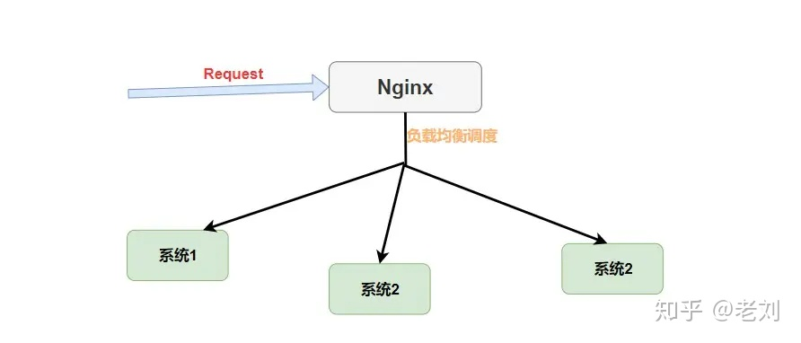

# Spring Cloud

构建分布式系统不需要复杂和容易出错。Spring Cloud  为最常见的分布式系统模式提供了一种简单且易于接受的编程模型，帮助开发人员构建有弹性的、可靠的、协调的应用程序。Spring Cloud 构建于  Spring Boot 之上，使得开发者很容易入手并快速应用于生产中。

我所理解的 `Spring Cloud` 就是微服务系统架构的一站式解决方案，在平时我们构建微服务的过程中需要做如 **服务发现注册** 、**配置中心** 、**消息总线** 、**负载均衡** 、**断路器** 、**数据监控** 等操作，而 Spring Cloud 为我们提供了一套简易的编程模型，使我们能在 Spring Boot 的基础上轻松地实现微服务项目的构建。

## 一、基础知识理解入门

### Eureka 服务发现框架

Eureka是基于REST（代表性状态转移）的服务，主要在AWS云中用于定位服务，以实现负载均衡和中间层服务器的故障转移。我们称此服务为Eureka服务器。Eureka还带有一个基于Java的客户端组件Eureka  Client，它使与服务的交互变得更加容易。客户端还具有一个内置的负载平衡器，可以执行基本的循环负载平衡。在Netflix，更复杂的负载均衡器将Eureka包装起来，以基于流量，资源使用，错误条件等多种因素提供加权负载均衡，以提供出色的弹性。

服务发现就是一个中介，帮助服务提供者和服务消费者提供连接服务。作为桥梁。

**服务注册Register：**当Eureka客户端向Eureka Server注册时，它提供自身的元数据，比如IP地址、端口、运行状况指示符URL、主页等。即房东向中介提供自己的房屋信息。

**服务续约Renew：**Eureka的客户端会每隔30秒发送一个心跳来续约，告知服务器自己还存在，没有出现问题，如果90秒内都没有收到续约，那就会被从注册表里面删除。其实就是房东定期告诉中介自己的房子还要出租，中介收到消息后继续保留租房信息。

**获取注册列表信息Fetch Registries：**客户端从服务器获取注册表信息，并将其缓存在本地，客户端就可以利用这些信息查找其他服务，从而实现对其他服务的调用。这个注册列表信息定期(30秒)更新一次。服务器存储了所有的服务信息，并且进行了压缩，常用格式是json或者xml，默认是json。理解就是租客去中介那里定期获得新的租房信息同步本地信息列表。

**服务下线：**客户端程序关闭的时候会向服务器发送取消请求，发送请求之后，服务器会删除这个实例。这个请求不会自动完成，需要调用以下内容：DiscoveryManager.getInstance().shutdownComponent();理解就是房东告诉中介自己的房子不租了。

**服务剔除Eviction：**当客户端连续三个周期即90秒没有发送服务续约心跳，就会被服务器从列表里面删除。即中介长时间未收到房东信息就会删除房东信息。


这里面并不是说每个Eureka客户端都是等同的，看图即知，虽然每个都带有客户端，但是他们的母体可能一个是服务提供商一个是服务消费者。

### 负载均衡之Ribbon

#### 什么是RestTemplate

RestTemplate是Spring提供的一个访问Http服务的客户端类，微服务之间的调用是使用的RestTemplate。Eureka框架中的注册续约底层都是用的RestTemplate。

#### 为什么需要Ribbon

这是一个开源的负载均衡项目，是一个客户端/进程内负载均衡器，运行在消费端。


就是运行在消费者端的，在获取到服务列表之后，内部用负载均衡算法，让消费者选择使用哪一个服务器。

#### Nginx和Ribbon的对比

Nginx是一种集中式的负载均衡器，将所有请求的集中起来再进行负载均衡：



他们的区别就是，一个是先进行request接收再进行负载均衡，一个是先负载均衡在进行request

#### Ribbon的几种负载均衡算法

Nginx用的是轮询和加权轮询算法,在Ribbon里面有更多的负载均衡调度算法,默认用的是RoundRobinRule轮询策略

**RoundRobinRule**：轮询策略。`Ribbon` 默认采用的策略。若经过一轮轮询没有找到可用的 `provider`，其最多轮询 10 轮。若最终还没有找到，则返回 null。

**RandomRule**: 随机策略，从所有可用的 provider 中随机选择一个。

**RetryRule**: 重试策略。先按照 RoundRobinRule 策略获取 provider，若获取失败，则在指定的时限内重试。默认的时限为 500 毫秒

需要知道的是默认轮询算法，并且可以更换默认的负载均衡算法，只需要在配置文件中做出修改就行。

```properties
providerName:
  ribbon:
    NFLoadBalancerRuleClassName: com.netflix.loadbalancer.RandomRule
```

当然，在 `Ribbon` 中你还可以**自定义负载均衡算法**，你只需要实现 `IRule` 接口，然后修改配置文件或者自定义 `Java Config` 类。

### 什么是Open Feign

RestTemplate的调用太麻烦，每次都要像这么写：

```java
@Autowired
private RestTemplate restTemplate;
// 这里是提供者A的ip地址，但是如果使用了 Eureka 那么就应该是提供者A的名称
private static final String SERVICE_PROVIDER_A = "http://localhost:8081";
 
@PostMapping("/judge")
public boolean judge(@RequestBody Request request) {
    String url = SERVICE_PROVIDER_A + "/service1";
    // 是不是太麻烦了？？？每次都要 url、请求、返回类型的 
    return restTemplate.postForObject(url, request, Boolean.class);
}
```

所以我们用了映射，就像域名和ip地址之间的映射一样，我们可以将被调用的服务代码映射到消费者端，这样就可以无缝开发了。OpenFeign也是运行在消费者端的，使用ribbon进行负载均衡，所以OpenFeign直接内置了Ribbon。

在导入了 `Open Feign` 之后我们就可以进行愉快编写 `Consumer` 端代码了。

```java
// 使用 @FeignClient 注解来指定提供者的名字
@FeignClient(value = "eureka-client-provider")
public interface TestClient {//这个接口其实就是对Feign服务的一种调用，进行映射，不需要我们再提供url地址，
    // 这里一定要注意需要使用的是提供者那端的请求相对路径，这里就相当于映射了
    @RequestMapping(value = "/provider/xxx",
    method = RequestMethod.POST)
    CommonResponse<List<Plan>> getPlans(@RequestBody planGetRequest request);
}
```

然后我们在 `Controller` 就可以像原来调用 `Service` 层代码一样调用它了。

```java
@RestController
public class TestController {
    // 这里就相当于原来自动注入的 Service
    @Autowired
    private TestClient testClient;
    // controller 调用 service 层代码
    @RequestMapping(value = "/test", method = RequestMethod.POST)
    public CommonResponse<List<Plan>> get(@RequestBody planGetRequest request) {
        return testClient.getPlans(request);
    }
}
```

### 必不可少的Hystrix

#### Hystrix熔断和降级

在分布式环境中，不可避免地会有许多服务依赖项中的某些失败。Hystrix是一个库，可通过添加等待时间容限和容错逻辑来帮助您控制这些分布式服务之间的交互。Hystrix通过隔离服务之间的访问点，停止服务之间的级联故障并提供后备选项来实现此目的，所有这些都可以提高系统的整体弹性。


这就是服务雪崩，因为最后被调用的崩溃了，导致前面调用它的服务也崩溃了，最后大家一起崩溃。

熔断就是服务雪崩的一种有效解决方案，当指定时间窗内的请求失败达到设定阈值时，系统通过断路器将整个请求链路断开，防止因为一个服务崩溃引发的连锁反应。

`@HystrixCommand` 注解来标注某个方法，这样 `Hystrix` 就会使用 **断路器** 来“包装”这个方法，每当调用时间超过指定时间时(默认为1000ms)，断路器将会中断对这个方法的调用。

当然你可以对这个注解的很多属性进行设置，比如设置超时时间，像这样。

```java
@HystrixCommand(
    commandProperties = {@HystrixProperty(name = "execution.isolation.thread.timeoutInMilliseconds",value = "1200")}
)//就是在服务调用的时候加上这个注解，那么就会根据超时时间进行熔断
public List<Xxx> getXxxx() {
    // ...省略代码逻辑
}
```

服务降级是为了有更好的用户体验，设置一个后备处理，写的时候加上一个备用调用，一个挂掉之后就启动备用的服务。或者当系统访问人数过多的时候就让稍后查看。

```java
// 指定了后备方法调用
@HystrixCommand(fallbackMethod = "getHystrixNews")
@GetMapping("/get/news")
public News getNews(@PathVariable("id") int id) {
    // 调用新闻系统的获取新闻api 代码逻辑省略
}
// 
public News getHystrixNews(@PathVariable("id") int id) {
    // 做服务降级
    // 返回当前人数太多，请稍后查看
}
```

#### 其他内容

**舱壁模式：**默认是调用一个服务用的一批线程，当调用服务出现故障，就会出现这些线程占用资源等待的情形，其他请求也无法执行。这个模式就是让一个调用用自己的一个线程池，相互之间不影响，这样就可以防止其崩溃。

**Hystrix仪表盘：**实时监控各项指标信息。

### 微服务网关--Zuul

ZUUL 是从设备和 web 站点到 Netflix 流应用后端的所有请求的前门。作为边界服务应用，ZUUL  是为了实现动态路由、监视、弹性和安全性而构建的。它还具有根据情况将请求路由到多个 Amazon Auto Scaling  Groups（亚马逊自动缩放组，亚马逊的一种云计算方式） 的能力

主要进行鉴权、限流、路由、监控功能，就是系统对外的唯一路径。最关键的就是路由和过滤器。


#### 基本功能

1. zuul需要向Eureka服务器注册，注册的目的是拿到所有consumer的信息，这样就可以拿到所有如ip地址、端口号等信息。拿到之后就可以进行路由映射，

2. 

3. 统一前缀：就是我们可以在前面加一个统一的前缀，比如我们刚刚调用的是 `localhost:9000/consumer1/studentInfo/update`，这个时候我们在 `yaml` 配置文件中添加如下。

   ```java
   zuul:
     prefix: /zuul
   ```

   这样我们就需要通过 `localhost:9000/zuul/consumer1/studentInfo/update` 来进行访问了。

4. 路由策略配置：改变微服务名称，不将其暴露给用户，

   ```java
   zuul:
     routes:
       consumer1: /FrancisQ1/**
       consumer2: /FrancisQ2/**
   ```

   这个时候你就可以使用 `localhost:9000/zuul/FrancisQ1/studentInfo/update` 进行访问了。

5. 服务名屏蔽：在你配置完路由策略之后使用微服务名称还是可以访问的，这个时候你需要将服务名屏蔽。

   ```java
   zuul:
     ignore-services: "*"
   ```

6. 路径屏蔽：`Zuul` 还可以指定屏蔽掉的路径 URI，即只要用户请求中包含指定的 URI 路径，那么该请求将无法访问到指定的服务。通过该方式可以限制用户的权限。

   ```java
   zuul:
     ignore-patterns: **/auto/**
   ```

   这样关于 auto 的请求我们就可以过滤掉了。

   > ** 代表匹配多级任意路径
   > *代表匹配一级任意路径

7. 敏感请求头屏蔽：默认情况下，像 Cookie、Set-Cookie 等敏感请求头信息会被 zuul 屏蔽掉，我们可以将这些默认屏蔽去掉，当然，也可以添加要屏蔽的请求头。

#### 过滤功能

可以通过过滤实现限流、灰度发布、权限控制等功能。


分为pre routing post等过滤器。要实现自己定义的 `Filter` 我们只需要继承 `ZuulFilter` 然后将这个过滤器类以 `@Component`注解加入 Spring 容器中就行了。

因为Zuul作为网关，也是一个单点的，所以也需要进行zuul的集群配置，这时候就可以借助额外的一些负载均衡器比如Nginx。

### Spring Cloud的配置管理--config

我们需要一种可以统一对配置文件进行管理而且可以在项目运行时动态修改配置文件的工具，那就是Spring Cloud Config

#### Config是什么

`Spring Cloud Config` 为分布式系统中的外部化配置提供服务器和客户端支持。使用 `Config` 服务器，可以在中心位置管理所有环境中应用程序的外部属性。简单来说，`Spring Cloud Config` 就是能将各个 应用/系统/模块 的配置文件存放到 **统一的地方然后进行管理**(Git 或者 SVN)。


就是每次启动的时候请求一个uri，然后进行配置的传送，再进行相关的配置。

更改的时候利用Bus消息总线+config进行一个配置的动态刷新

### Spring Cloud Bus

用于将服务和服务实例与分布式消息系统链接在一起的事件总线。在集群中传播状态更改很有用（例如配置更改事件）。你可以简单理解为 `Spring Cloud Bus` 的作用就是**管理和广播分布式系统中的消息**，也就是消息引擎系统中的广播模式。当然作为 **消息总线** 的 `Spring Cloud Bus` 可以做很多事而不仅仅是客户端的配置刷新功能。


## 二、Eureka

### Eureka架构

牢记它就是一个中介

Eureka架构图

蓝色的 `Eureka Server` 是 `Eureka` 服务器，这三个代表的是集群，而且他们是去中心化的。

绿色的 `Application Client` 是 `Eureka` 客户端，其中可以是**消费者**和**提供者**，最左边的就是典型的提供者，它需要向 `Eureka` 服务器注册自己和发送心跳包进行续约，而其他消费者则通过 `Eureka` 服务器来获取提供者的信息以调用他们

### Eureka与Zookeeper对比

- Eureka： **符合AP原则**  为了保证了可用性，`Eureka` 不会等待集群所有节点都已同步信息完成，它会无时无刻提供服务。即可用性和分区容忍性，数据可能不一致，但是是随时都可用的。
- Zookeeper： **符合CP原则** 为了保证一致性，在所有节点同步完成之前是阻塞状态的。即一致性和分区容忍性，但是为了保持一致性会停顿一些时间，也就没有了可用性。

### 基本配置

#### 服务端配置

```properties
eureka:
  instance:
    hostname: xxxxx    # 主机名称
    prefer-ip-address: true/false   # 注册时显示ip
  server:
    enableSelfPreservation: true   # 启动自我保护
    renewalPercentThreshold: 0.85  # 续约配置百分比
```

还需要在spring boot启动类中设置 `@EnableEurekaServer` 注解开启 Eureka 服务

#### 客户端配置

```properties
eureka:
  client:
    register-with-eureka: true/false  # 是否向注册中心注册自己
    fetch-registry: # 指定此客户端是否能获取eureka注册信息
    service-url:    # 暴露服务中心地址
      defaultZone: http://xxxxxx   # 默认配置
  instance:
    instance-id: xxxxx # 指定当前客户端在注册中心的名称
```

### 实战Eureka

#### 1、使用Spring DiscoveryClient

没有ribbon做负载均衡，不利于开发和维护，实质上就是通过DiscoveryClient去获取所有实例的列表，然后从中获取一个url再通过RestTemplate进行远程调用

先写一个provider，里面写上getMapping内容，从中返回某些东西。然后写一个Consumer，里面

#### 2.、编写调用提供者代码的逻辑并设置启动类

```java
@SpringBootApplication
@RestController
public class EurekaConsumerApplication {
    // 这个注解告诉spring cloud 创建一个支持 Ribbon 的 RestTemplate
    @LoadBalanced//代表会用到ribbon作为均衡器
    @Bean
    public RestTemplate getRestTemplate() {
        return new RestTemplate();
    }

    @Autowired
    RestTemplate restTemplate;

    @RequestMapping(value = "/consumer/{id}")
    public Map consumerTest(@PathVariable(value = "id")Integer id) {
        // 通过带有 Ribbon 功能的 RestTemplate 调用服务
        ResponseEntity<Map> responseEntity
                // 注意这里的url是提供者的名称
                = restTemplate.exchange("http://provider-application/provider/" + id, HttpMethod.GET,
                null, Map.class, id);//用exchange函数进行实际的服务调用
        return responseEntity.getBody();
    }

    public static void main(String[] args) {
        SpringApplication.run(EurekaConsumerApplication.class, args);
    }
}
```

#### 3、使用Open Feign

你可以**在消费者端定义与服务端映射的接口**，然后你就可以**通过调用消费者端的接口方法来调用提供者端的服务**了(目标REST服务)，除了编写接口的定义，开发人员不需要编写其他调用服务的代码，是现在常用的方案。

#### 增加 `open Feign` 依赖并配置接口

```xml
<dependency>
    <groupId>org.springframework.cloud</groupId>
    <artifactId>spring-cloud-starter-openfeign</artifactId>
</dependency>
```

```java
@Service
// 使用@FeignClient表示服务 这里的值是 提供者的名称 是url地址的前部
@FeignClient("provider-application")
// 这里的值是提供者相应的路径
@RequestMapping("/provider")
public interface FeginService {
    // 这里的路径也要和提供者相同 参数也需要一样
    @GetMapping("/{id}")
    //这个方法会去调用相关的服雾
    Map providerMethod(@PathVariable(value = "id") int id);
}
```

#### 创建 `Controller` 实现类

```java
@RestController
public class FeignController {
    // 调用服务
    @Autowired
    private FeginService feginService;

    @RequestMapping(value = "/consumer/{id}")
    public Map consumerTest(@PathVariable(value = "id")Integer id) {
        return feginService.providerMethod(id);
    }
}
```

#### 增加 `Feign` 配置

```properties
# 当然你可以不进行配置 这里不影响主要功能
feign:
  client:
    config:
      default:
        connectTimeout: 5000  # 指定Feign客户端连接提供者的超时时限   取决于网络环境
        readTimeout: 5000   # 指定Feign客户端从请求到获取到提供者给出的响应的超时时限  取决于业务逻辑运算时间
  compression:
    request:
      enabled: true   # 开启对请求的压缩
      mime-types: text/xml, application/xml
      min-request-size: 2048   # 指定启用压缩的最小文件大小
    response:
      enabled: true   # 开启对响应的压缩
```

#### 配置启动类

```java
@SpringBootApplication
@EnableFeignClients   // 这里需要使用 @EnableFeignClients 来启用 Feign客户端
public class EurekaConsumerApplication {
    public static void main(String[] args) {
        SpringApplication.run(EurekaConsumerApplication.class, args);
    }
}
```

### Eureka的自我保护机制

当 `Eureka Server` 在某种特定情况下 `Eureka Server` 不会剔除其注册列表中的实例，那就是 `Eureka` 的自我保护时期。

何为自我保护？ 假想一下，当一个 `server` 节点出现了网络分区等不可抗力原因，那么它会因此收不到 `client` 的续约心跳，如果网络波动比较大，也就可能导致 `server` 因为一次网络波动剔除了所有或者绝大部分 `Client` 。这种情况是我们不想看见的。

所以 `Eureka` 会有一种自我保护机制，默认是15分钟内收到的续约低于原来的85%(这是上面的续约配置比例)那么就会开启 自我保护 。这阶段 `Eureka Server` 不会剔除其列表中的实例，即使过了 90秒 也不会。

### Eureka代码解析 还未做

## 三、Ribbon

 Spring Cloud Ribbon是一个基于HTTP和TCP的客户端负载均衡工具，它基于Netflix Ribbon实现。通过Spring Cloud的封装，可以让我们轻松地将面向服务的REST模版请求自动转换成客户端负载均衡的服务调用。

### 客户端负载均衡

负载均衡分为软件和硬件负载均衡。硬件负载均衡主要通过在服务器节点之间按照专门用于负载均衡的设备。软件均衡是通过在服务器上安装一些用于负载均衡功能或模块等软件来完成请求分发工作，比如Nginx等。


该设备按某种算法（比如线性轮询、按权重负载、按流量负载等）从维护的可用服务端清单中取出一台服务端端地址，然后进行转发。

服务端和客户端负载均衡的区别在于存储的服务端清单在哪里。

   通过Spring Cloud Ribbon的封装，我们在微服务架构中使用客户端负载均衡调用非常简单，只需要如下两步：

​    ▪️服务提供者只需要启动多个服务实例并注册到一个注册中心或是多个相关联的服务注册中心。

​    ▪️服务消费者直接通过调用被@LoadBalanced注解修饰过的RestTemplate来实现面向服务的接口调用

## 四、实际操作

### 基础操作

1. @EnableEurekaServer注解，加在application文件里，作为Eureka的server

   ```properties
   server:
     port: 8761 //本身的端口
   
   eureka:
     instance:
       hostname: localhost //本身的主地址
     client://client下面两个都是false，说明这个是一个server的配置
       registerWithEureka: false
       fetchRegistry: false
       serviceUrl:
         defaultZone: http://${eureka.instance.hostname}:${server.port}/eureka/
         //基本的地址
   
   spring:
     application:
       name: eurka-server //在Eureka主页里面的名字
         
   ```

2. @EnableEurekaClient注解，代表是Eureka的client
   在工程的启动类中，通过@EnableDiscoveryClient向服务中心注册；并且向程序的ioc注入一个bean: restTemplate;并通过@LoadBalanced注解表明这个restRemplate开启负载均衡的功能。

   @EnableDiscoveryClient和@EnableEurekaClient共同点就是：都是能够让注册中心能够发现，扫描到改服务。
   
   不同点：@EnableEurekaClient只适用于Eureka作为注册中心，@EnableDiscoveryClient 可以是其他注册中心。
   
   ```java
   @SpringBootApplication
   @EnableEurekaClient
   @EnableDiscoveryClient
   public class ServiceRibbonApplication {
   
       public static void main(String[] args) {
           SpringApplication.run( ServiceRibbonApplication.class, args );
       }
   
       @Bean
       @LoadBalanced
       RestTemplate restTemplate() {
           return new RestTemplate();
    }
   
   }
   ```
   
   ```properties
   server:
     port: 8762
   
   spring:
     application:
       name: service-hi
   //必须要配置自己需要的一些信息
   eureka:
    client:
       serviceUrl:
         defaultZone: http://localhost:8761/eureka/
   ```
   
3. 加上@EnableFeignClients注解开启Feign的功能：

   定义一个feign接口，通过@ FeignClient（“服务名”），来指定调用哪个服务。比如在代码中调用了service-hi服务的“/hi”接口，代码如下：

   ```java
   @FeignClient(value = "service-hi")
   public interface SchedualServiceHi {
       @RequestMapping(value = "/hi",method = RequestMethod.GET)
       String sayHiFromClientOne(@RequestParam(value = "name") String name);
   }
   ```

4. 加@EnableHystrix注解开启Hystrix

   在hiService方法上加上@HystrixCommand注解。该注解对该方法创建了熔断器的功能，并指定了fallbackMethod熔断方法，熔断方法直接返回了一个字符串，字符串为”hi,”+name+”,sorry,error!”，代码如下：

   ```java
   @Service
   public class HelloService {
   
       @Autowired
       RestTemplate restTemplate;
   
       @HystrixCommand(fallbackMethod = "hiError")
       public String hiService(String name) {
           return restTemplate.getForObject("http://SERVICE-HI/hi?name="+name,String.class);
       }
   
       public String hiError(String name) {
           return "hi,"+name+",sorry,error!";
       }
   }
   ```

5. feign自带断路器，feign.hystrix.enabled=true需要在配置文件里面写

   ```java
   @FeignClient(value = "service-hi",fallback = SchedualServiceHiHystric.class)//直接在这里定义清楚失败处理方法
   public interface SchedualServiceHi {
       @RequestMapping(value = "/hi",method = RequestMethod.GET)
       String sayHiFromClientOne(@RequestParam(value = "name") String name);
   }
   ```

6. 在主程序启动类中加入@EnableHystrixDashboard注解，开启hystrixDashboard：

   就是一个仪表盘，可以对服务进行监控

   访问http://localhost:8764/hystrix, 

## 五、jbdoctor项目学习

### 4.16 doctor接口学习

学习路径为facade-doctor/src/main/java/com/ebaolife/jbdoctor/doctor/controller/consultation/ConsultInquiryController.java

1. ```java
   @AnRateLimiter(permitsPerSecond = 3, timeout = 500, msg = "", rc = 0, dataType = 1)
   ```

   这个注解就是做一个限流，每秒允许三个请求，时间限制500ms，msg是错误的时候返回的消息，一般有默认，rc是返回的状态码，dataType是


