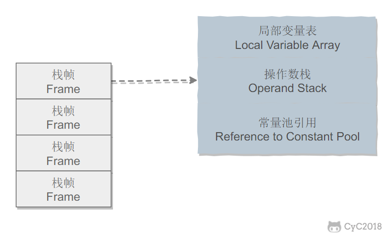
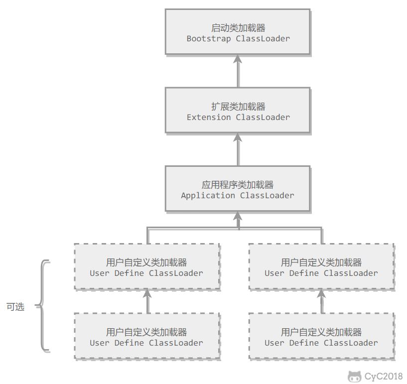

# Java语言学习

## 2021年始

### 2.1 Java多线程相关 阅读Java语言程序设计 进阶篇

#### 1.线程相关概念

1. 任务类要实现Runnable接口，只包含一个run方法。调用Thread，用Runnable对象实例化一个Thread对象，然后Thread调用start方法，就将本线程放入了就绪队列，等待执行。run方法是JVM调用的，直接调用只是启动这个run函数，没有增加新线程。

2. sleep是当前线程sleep，不是.的那个线程sleep

3. 这个线程会无限调用自己，即会无限进行构造函数，最后会报错StackOverflowError。另外同一个线程不能重复调用start方法，否则会报IllegalThreadStateException错误。

   ```java
   package com.company;
   
   public class Main implements Runnable{
   
       public static void main(String[] args) {
   	// write your code here
           new Main();
       }
       Main(){
           Main test=new Main();//在这里无限调用自己
           new Thread(test);
       }
   
       public void run(){
           System.out.println("kdasd");
   
       }
   }
   ```

4. Thread的yield方法，会让出时间给其他线程。用setPriority或者get获得线程优先级1-10.join为等待别的线程结束再执行自己，

#### 2.线程池

1. 利用Excutor接口执行线程池任务，用其子接口ExcutorService来进行管理和控制任务。

   ```java
   public static void main(String[] args) {
           ExecutorService e= Executors.newFixedThreadPool(3);
   
           e.execute(new Main());
           e.execute(new Main());
           e.execute(new Main());
           return ;
       }
   ```

   运用上面的函数可以创建固定数目的三个线程，如果是newCachedThreadPool()那么就会在需要的时候就创建线程，如果之前的可用也不用创建。下面的e.excute(Runnable)，一样，和Thread运行一样

2. 线程池其实就是对线程的一种管理，不会为多个程序创建多个线程，只是有的时候再使用，而且可以实现重用。还有其他函数如shutdown()，关闭执行器但是等待所有线程执行完毕，shutdownNow()是马上关闭。还有isShutdown  isTerminated等进行判断，看执行器是否关闭，看线程是否全部终止。

## Java基础

### 一、数据类型

1. 基本类型，byte是8位，char是16位，int32位。float也是32位，long和double是64位。

2. boolean只有两个值，但是在JVM里面是当做0和1处理的。boolean的数组是按照byte数组处理的。

3. 包装类型，如Integer和Float等，

   ```java
   Integer x = 2;     // 装箱 调用了 Integer.valueOf(2)
   int y = x;         // 拆箱 调用了 X.intValue()
   ```

   包装类就是把简单的数据类型变成一个类。集合不允许是基本类型，所以里面都是Integer等包装类型。这些类包含了最大值最小值所占位数等基本属性。这些类提供了对象的操作，如类型转换，进制转换等。

   **主要区别**

   1. 在Java中，一切皆对象，但八大基本类型却不是对象。

   2. 声明方式的不同，基本类型无需通过new关键字来创建，而封装类型需new关键字。
   3. 存储方式及位置的不同，基本类型是直接存储变量的值保存在堆栈中能高效的存取，封装类型需要通过引用指向实例，具体的实例保存在堆中。
   4. 初始值的不同，**封装类型的初始值为null，基本类型的的初始值视具体的类型而定，比如int类型的初始值为0**，boolean类型为false；
   5. 使用方式的不同，比如与集合类合作使用时只能使用包装类型。
   6. 什么时候该用包装类，什么时候用基本类型，看基本的业务来定：这个字段允允许null值，就需要使用包装类型，如果不允许null值，，使用基本类型就可以了，用到比如泛型和反射调用函数，就需要用包装类！

   对于Integer，-127-128有缓存，所以Integer i1=127,i2=127两个是一样的。但是用new就是不等于的。但是对于double等没有缓存的来说，这样就算错的。Byte全都有，char和boolean和short都是在-128-127有缓存。

### 二、String

#### 概览

1. String被声明为final，Integer也是final，都不可以被寄存。Java 8中String内部其实用的是char数组，Java 9之后改用byte存储，同时用coder变量表示用的哪一种编码。所以String不可变。
2. 不可变使得其能够被hash，可以使用string pool，保证了参数不可变，那么在网络环境中就较为安全。不可变还使得它线程安全。
3. StringBuffer和StringBuilder可变。builder不是线程安全的，buffer是安全的，内部用到了synchronized进行同步。
4. String pool就是保存所以字符串的字面量，如“aaa”，可以有s1.intern()方法，将s1字符串放入池子中，并且返回对字符串的引用。没有就放入，有的话就直接返回。
5. new String("abc")的时候，如果pool里面没有这个值，那么会创建两个abc对象，一个放进pool一个放进堆。在String的拷贝构造的时候(即一个字符串创建另一个字符串时)，就是单纯地指向同一个value数组。

### 三、运算

#### 参数传递以值传递进行

1. 参数传递是以值传递的方式进行的，而不是引用的方式。
2. 但是在传对象的时候，是把对象的地址用值的形式传递下去的，因此在函数内改变参数的值会引起原来对象的改变。

#### 隐式类型转换

int 会转为double等。不会转为低级的如short。但是在++或者+=的时候，运算结果会转为低级的如short。

#### switch的使用

switch在Java 7开始支持String，但是不支持double、long、float等数值较多的判断，因为设计初衷是为了少数的几个值。

### 四、关键字

#### final

1. final不可改变，引用不可变，但是引用的对象可变。也就是一个final对象变量，不能指向别的对象，但是指向的对象是可变的。
2. final方法不可被重写，override。private隐式地是final，
3. 类不可以被继承

#### static

1. 静态变量属于整个类

2. 静态方法在类加载的时候就存在了，**静态则不能是抽象方法**，静态则只能访问静态方法和静态字段，不能有this和super关键字，因为他们和具体的互相关联。

3. 静态语句块在类初始化的时候运行一次。

4. 非静态内部类需要有对象才可以创建，但是静态的内部类可以直接创建，它可以访问外部类的所有资源(除了非静态的)。

5. 静态导包，这使得在使用静态方法和变量的时候不再需要class的名字了，不需要类都可以直接使用。

6. 静态的变量和块初始化顺序先于非静态的，最后才是构造函数。

   **全部顺序如下**：

   父类（静态变量、静态语句块）

   子类（静态变量、静态语句块）

   父类（实例变量、普通语句块）

   父类（构造函数）

   子类（实例变量、普通语句块）

   子类（构造函数）

### 五、Object通用方法

#### 概览

1. ```java
   //Object 原始类的通用方法
   public native int hashCode()
   
   public boolean equals(Object obj)
   
   protected native Object clone() throws CloneNotSupportedException
   
   public String toString()
   
   public final native Class<?> getClass()
   
   protected void finalize() throws Throwable {}
   
   public final native void notify()
   
   public final native void notifyAll()
   
   public final native void wait(long timeout) throws InterruptedException
   
   public final void wait(long timeout, int nanos) throws InterruptedException
   
   public final void wait() throws InterruptedException
   
   ```

2. equals方法，和null比较，任何不是null的都是错的。==判断值是否相等，基本类型没有equals方法。对于引用类型= =判断两个变量是否引用同一个对象，但是equals判断引用的对象是否等价。

3. hashCode()方法，返回hash值，散列值相同但对象不一定等价。重写equals方法的时候一定要重写hashCode()方法，保证hash值是一样的。

   ```java
   31*x == (x<<5)-x//和31相乘的数的快速计算方法
   ```

4. clone()方法，必须实现了才能用。应该注意的是，clone() 方法并不是 Cloneable 接口的方法，而是 Object 的一个 protected  方法。Cloneable 接口只是规定，如果一个类没有实现 Cloneable 接口又调用了 clone() 方法，就会抛出  CloneNotSupportedException。

   浅拷贝只是将两个变量都指向了同一个对象。深拷贝是引用了不同的对象，创建了新的对象。浅拷贝就是自己只是简单地继承了clone方法，深拷贝是自己写的。这个函数不安全，所以最好不用，可以用拷贝构造函数，或者拷贝工厂。

### 六、继承

#### 访问权限

1. 有private protected public，缺省代表包级可以用。
2. public都可以用，private只有本类可用，protected表示包内可用以及其他包的本类的子类可用。

#### 抽象类和接口

1. abstract关键字，如果包含抽象方法那么就必须声明为抽象类。抽象类不可被实例化，即没有对象。只能被继承。
2. 接口是抽象类的延伸，Java 8之前是完全抽象的类，但是Java 8开始，可以有一个默认的方法了。Java 8限制所有方法都是public的，Java 9开始就允许private了，这样可以保证一些方法不被看见。
3. 接口内的成员限制都是static和final的，不允许除了public之外的其他限制符。
4. 一个是类，一个是接口，不一样，里面的字段限制也不一样。
5. 接口要求必须实现同一个方法，可以多重继承，Java 8开始，类有了默认的方法实现。
6. 当要求所有方法有共性的时候用接口，当只是要求部分方法有共性的时候用抽象类。

#### super

1. 子类调用super相关的函数进行构造等

#### 重写和重载

1. 重写指子类声明了一个和父类声明一样的方法。子类的返回类型是和父类一样的或者是其子类型。子类抛出的异常也要是父类相关的类型。
2. 使用@Override注解，让编译器检查是否满足三个限制条件。
3. 重写的时候就先看子类里面有没有对应的方法，没有再看父类的方法。
4. **重载是在一个类里面，方法名称相同，但是参数列表不同的，返回值不在考虑范围内。**

#### 里式替换原则

1. 里氏替换原则通俗的来讲就是：子类可以扩展父类的功能，但不能改变父类原有的功能。

2. 里氏代换原则告诉我们，在软件中将一个基类对象替换成它的子类对象，程序将不会产生任何错误和异常，反过来则不成立，如果一个软件实体使用的是一个子类对象的话，那么它不一定能够使用基类对象。

3. 里氏代换原则是实现开闭原则的重要方式之一，由于使用基类对象的地方都可以使用子类对象，**因此在程序中尽量使用基类类型来对对象进行定义，而在运行时再确定其子类类型**，用子类对象来替换父类对象。

### 七、反射

1. 每个类都有一个class对象，编译一个新类时会产生一个同名的.class文件，这个文件里面保存着class对象。类加载相当于Class对象的加载，类在第一次使用时才动态加载到JVM中，也可以使用

   ```java
   Class.forName("com.mysql.jdbc.Driver")
   ```

   这种方法控制类的加载，这个会返回一个Class对象。

   通过反射，我们可以在运行时获得程序或程序集中每一个类型的成员和成员的信息。程序中一般的对象的类型都是在编译期就确定下来的，而 Java  反射机制可以动态地创建对象并调用其属性，这样的对象的类型在编译期是未知的。所以我们可以通过反射机制直接创建对象，即使这个对象的类型在编译期是未知的。

   **是运行时对一个类进行构造或者判断**

2. 反射提供运行时的类信息，即运行时类型识别，RTTI，这个类可以在运行的时候才加载进来，甚至在编译时期该类的.class不存在也可以加载进来。

   Class 和 java.lang.reflect 一起对反射提供了支持，java.lang.reflect 类库主要包含了以下三个类：

   - **Field**  ：可以使用 get() 和 set() 方法读取和修改 Field 对象关联的字段；
   - **Method**  ：可以使用 invoke() 方法调用与 Method 对象关联的方法；
   - **Constructor**  ：可以用 Constructor 的 newInstance() 创建新的对象。

3. IDEA等用的时候.号出现候选，就用到了反射。框架开发的时候，需要根据配置文件加载不同的对象或类，调用不同的方法，此时就用到了反射。

4. .class名字，或者getClass()方法，instanceof关键字判断是否某个类的实例。

   1. 也可以用isInstance()方法判断是否是某个类的实例，这是一个native方法(native方法就是由别的语言实现的，比如系统调用，底层实现等，帮助提高Java效率，更方便地实现一些功能)。isInstance只能对List进行判断，但是不能对List<Integer>进行判断，这样是错误的。
   2. 使用Class对象的newInstance()方法来创建Class对象对应类的实例。

   ```java
   Class<?> c = String.class;
   Object str = c.newInstance();
   ```

   3. 先通过Class对象获取指定的Constructor对象，再调用Constructor对象的newInstance()方法来创建实例。这种方法可以用指定的构造器构造类的实例。

   ```java
   //获取String所对应的Class对象
   Class<?> c = String.class;
   //获取String类带一个String参数的构造器
   Constructor constructor = c.getConstructor(String.class);
   //根据构造器创建实例
   Object obj = constructor.newInstance("23333");
   System.out.println(obj);
   ```

   4. getMethod()或者s等方法可以返回某个类特定的方法或者全部的方法。获取之后就可以用invoke来调用一个方法。

   5. getFiled()方法访问共有的成员变量

5. 反射消耗系统资源，因为是动态的JVM无法调优，要求在安全环境下使用，代码也有暴露的副作用。

### 八、异常

1. Throwable可以表示任何异常抛出的类。分为Error和Exception。Error表示JVM无法处理的错误，Exception分为受检测的即可以try catch的语句，和非受检，例如除以0的，遇到了就程序崩溃了。

   

   


### 九、泛型

#### 概览

1. 泛型就是参数化类型，将一个变量的类型也当做是一个参数进行传递。泛型只在编译的时候有效，编译结束会擦除相关信息，即两个list，尽管一个是String一个是Integer但是两者其实是一样的，都是LIst。

2. 泛型的使用

   1. 泛型类，如Map等容器类。他们里面都必须是类，不能是简单类型，如int等。
   2. 泛型接口，实现的时候implements时后面要说清楚哪一个类型，这时候就得说清楚了。
   3. 当参数类型不确定的时候在<>里面放?即可，此时的?相当于是所有类型的父类。
   4. 泛型方法：**泛型类，是在实例化类的时候指明泛型的具体类型；泛型方法，是在调用方法的时候指明泛型的具体类型** 。

   ```java
           //在泛型类中声明了一个泛型方法，使用泛型E，这种泛型E可以为任意类型。可以类型与T相同，也可以不同。
           //由于泛型方法在声明的时候会声明泛型<E>，因此即使在泛型类中并未声明泛型，编译器也能够正确识别泛型方法中识别的泛型。
           public <E> void show_3(E t){
               System.out.println(t.toString());
           }
   		//可变参数个数，里面类型可以是任意的
           public <T> void printMsg( T... args){
               for(T t : args){
                   Log.d("泛型测试","t is " + t);
               }
           }
   ```

3. **如果静态方法要使用泛型的话，必须将静态方法也定义成泛型方法** 。

4. ？是通配符

5. 常见面试题：

   　　1. Java中的泛型是什么 ? 使用泛型的好处是什么?

      　　这是在各种Java泛型面试中，一开场你就会被问到的问题中的一个，主要集中在初级和中级面试中。那些拥有Java1.4或更早版本的开发背景的人都知道，在集合中存储对象并在使用前进行类型转换是多么的不方便。泛型防止了那种情况的发生。它提供了编译期的类型安全，确保你只能把正确类型的对象放入集合中，避免了在运行时出现ClassCastException。

     　　2. Java的泛型是如何工作的 ? 什么是类型擦除 ?
    
     　　这是一道更好的泛型面试题。泛型是通过类型擦除来实现的，编译器在编译时擦除了所有类型相关的信息，所以在运行时不存在任何类型相关的信息。例如List<String>在运行时仅用一个List来表示。这样做的目的，是确保能和Java 5之前的版本开发二进制类库进行兼容。你无法在运行时访问到类型参数，因为编译器已经把泛型类型转换成了原始类型。根据你对这个泛型问题的回答情况，你会得到一些后续提问，比如为什么泛型是由类型擦除来实现的或者给你展示一些会导致编译器出错的错误泛型代码。请阅读我的Java中泛型是如何工作的来了解更多信息。
     
     　　3. 什么是泛型中的限定通配符和非限定通配符 ?
    
     　　这是另一个非常流行的Java泛型面试题。限定通配符对类型进行了限制。有两种限定通配符，一种是\<? extends T\>它通过确保类型必须是T的子类来设定类型的上界，另一种是\<? super T\>它通过确保类型必须是T的父类来设定类型的下界。泛型类型必须用限定内的类型来进行初始化，否则会导致编译错误。另一方面\<?>表示了非限定通配符，因为<?>可以用任意类型来替代。更多信息请参阅我的文章泛型中限定通配符和非限定通配符之间的区别。
     
     　　4. List<? extends T>和List <? super T>之间有什么区别 ?
    
     　　这和上一个面试题有联系，有时面试官会用这个问题来评估你对泛型的理解，而不是直接问你什么是限定通配符和非限定通配符。这两个List的声明都是限定通配符的例子，List<? extends T>可以接受任何继承自T的类型的List，而List<? super T>可以接受任何T的父类构成的List。例如List<? extends Number>可以接受List<Integer>或List<Float>。在本段出现的连接中可以找到更多信息。
     
     　　5. 如何编写一个泛型方法，让它能接受泛型参数并返回泛型类型?
    
     　　编写泛型方法并不困难，你需要用泛型类型来替代原始类型，比如使用T, E or K,V等被广泛认可的类型占位符。泛型方法的例子请参阅Java集合类框架。最简单的情况下，一个泛型方法可能会像这样:

   ```java
         public V put(K key, V value) {
                return cache.put(key, value);
         }
   ```

   　  6. Java中如何使用泛型编写带有参数的类?

   　　这是上一道面试题的延伸。面试官可能会要求你用泛型编写一个类型安全的类，而不是编写一个泛型方法。关键仍然是使用泛型类型来代替原始类型，而且要使用JDK中采用的标准占位符。

   　　7. 编写一段泛型程序来实现LRU缓存?

   　　对于喜欢Java编程的人来说这相当于是一次练习。给你个提示，LinkedHashMap可以用来实现固定大小的LRU缓存，当LRU缓存已经满了的时候，它会把最老的键值对移出缓存。LinkedHashMap提供了一个称为removeEldestEntry()的方法，该方法会被put()和putAll()调用来删除最老的键值对。当然，如果你已经编写了一个可运行的JUnit测试，你也可以随意编写你自己的实现代码。

   　　8. 你可以把List\<String>传递给一个接受List\<Object>参数的方法吗？

   　　对任何一个不太熟悉泛型的人来说，这个Java泛型题目看起来令人疑惑，因为乍看起来String是一种Object，所以List\<String>应当可以用在需要List\<Object>的地方，但是事实并非如此。真这样做的话会导致编译错误。如果你再深一步考虑，你会发现Java这样做是有意义的，因为List\<Object>可以存储任何类型的对象包括String, Integer等等，而List\<String>却只能用来存储Strings。　

   ```js
          List<Object> objectList;
          List<String> stringList;
          objectList = stringList;  //compilation error incompatible types
   ```

    　9. Array中可以用泛型吗?

   　　这可能是Java泛型面试题中最简单的一个了，当然前提是你要知道Array事实上并不支持泛型，这也是为什么Joshua Bloch在Effective Java一书中建议使用List来代替Array，因为List可以提供编译期的类型安全保证，而Array却不能。

   　　10. 如何阻止Java中的类型未检查的警告?

   　　如果你把泛型和原始类型混合起来使用，例如下列代码，Java 5的javac编译器会产生类型未检查的警告，例如　　

   ​       List\<String> rawList = new ArrayList()

### 十、注解***Annontation***

https://www.cnblogs.com/acm-bingzi/p/javaAnnotation.html

 1.）Override
   java.lang.Override 是一个标记类型注解，它被用作标注方法。它说明了被标注的方法重写了父类的方法，起到了断言的作用。如果我们使用了这种注解在一个没有覆盖父类方法的方法时，java 编译器将以一个编译错误来警示。
 2.）Deprecated
   Deprecated 也是一种标记类型注解。当一个类型或者类型成员使用@Deprecated  修饰的话，编译器将不鼓励使用这个被标注的程序元素。所以使用这种修饰具有一定的“延续性”：如果我们在代码中通过继承或者覆盖的方式使用了这个过时的类型或者成员，虽然继承或者覆盖后的类型或者成员并不是被声明为@Deprecated，但编译器仍然要报警。
 3.）SuppressWarnings
   SuppressWarning 不是一个标记类型注解。它有一个类型为String[] 的成员，这个成员的值为被禁止的警告名。对于javac  编译器来讲，被-Xlint 选项有效的警告名也同样对@SuppressWarings 有效，同时编译器忽略掉无法识别的警告名。
　　@SuppressWarnings("unchecked") 

### 十一、特性

#### Java 8特性

1. 流计算。让数据操作更容易和更快，一次性使用对象，遍历时有多种功能，顺序执行和并行执行都可，利用好多核处理器的优势。并行就是在加一个.parallel()就可以。终端方法可以是sum()、collect()或toArray()等，其他方法返回的都是流的对象。
2. 函数式接口：函数式接口是只包含一个方法的接口。比如Java标准库中的java.lang.Runnable和 java.util.Comparator都是典型的函数式接口。接口中有默认方法，并且这些方法可以直接在接口中运行。
3. Lambda表达式，简洁代码，表达式会被编译为一个函数式接口，函数式接口是指的只有一个方法的。
4. Java Time：时间接口，Date和Calendar等。
5. Nashorn：JVM的Javascript引擎，两者可以兼容
6. Concurrent Accumulators：线程安全的方式有效处理计数器
7. HashMap修复，
8. StampedLocks：速度更快，代价小，
9. 文件夹遍历
10. 强随机数生成

#### Java和C++的区别

- Java 是纯粹的面向对象语言，所有的对象都继承自 java.lang.Object，C++ 为了兼容 C 即支持面向对象也支持面向过程。
- Java 通过虚拟机从而实现跨平台特性，但是 C++ 依赖于特定的平台。
- Java 没有指针，它的引用可以理解为安全指针，而 C++ 具有和 C 一样的指针。
- Java 支持自动垃圾回收，而 C++ 需要手动回收。
- Java 不支持多重继承，只能通过实现多个接口来达到相同目的，而 C++ 支持多重继承。
- Java 不支持操作符重载，虽然可以对两个 String 对象执行加法运算，但是这是语言内置支持的操作，不属于操作符重载，而 C++ 可以。
- Java 的 goto 是保留字，但是不可用，C++ 可以使用 goto。

#### JRE与JDK

JRE是Java Runtime Environment，Java运行环境的简称，是一个JVM程序，主要包含了JVM的标准实现和一些Java的标准类库。

JDK是Java Development Kit，Java开发工具包，提供了Java的开发和运行环境，JDK是开发的核心，里面包含了JRE以及一些其他的工具，比如javac这个编译器。

## Java容器

### 一、概览

容器主要包含Collection和Map两种

#### Collection


包括Set、List、Queue等

##### 1. Set

1. TreeSet：基于红黑树实现，支持有序性操作(即程序执行的顺序按照代码的先后顺序执行)，如根据一个范围寻找元素，但是查找效率低于HashSet，这个因为是树所以查找效率是O(logN)。
2. HashSet：基于哈希表实现，支持快速查找，效率为O(1)，但是不支持有序性操作，因为本身不是有序的，经过散列之后不再是有序的，而且因为散列失去了插入时的顺序的信息，也就是说用Iterator遍历HashSet得到的结果是不确定的。
3. LinkedHashSet：具有哈希集合的查找效率，又有双向链表维护元素的插入顺序。这是一个非线程安全的集合。

##### 2. List

1. ArrayList：动态数组实现，支持随机访问，大小无限制。

   1. 初始定义及大小

   ```java
   public class ArrayList<E> extends AbstractList<E> implements List<E>, RandomAccess, Cloneable, java.io.Serializable
   //有RandomAccess接口实现，说明可以随机访问，本身是数组
   private static final int DEFAULT_CAPACITY = 10;//默认数组大小是10
   ```

    2. 添加元素

       ```java
       public boolean add(E e) {
           ensureCapacityInternal(size + 1);  // Increments modCount!!
           elementData[size++] = e;
           return true;
       }//add方法实现，先保证大小可以满足
       
       private void ensureCapacityInternal(int minCapacity) {
           if (elementData == DEFAULTCAPACITY_EMPTY_ELEMENTDATA) {
               minCapacity = Math.max(DEFAULT_CAPACITY, minCapacity);
               //看指定大小和默认大小谁大
           }
           ensureExplicitCapacity(minCapacity);
       }
       
       private void ensureExplicitCapacity(int minCapacity) {
           modCount++;//记录改变次数
           //modCount 用来记录 ArrayList 结构发生变化的次数。结构发生变化是指添加或者删除至少一个元素的所有操作，或者是调整内部数组的大小，仅仅只是设置元素的值不算结构发生变化
           // overflow-conscious code
           if (minCapacity - elementData.length > 0)
               grow(minCapacity);
       }
       
       private void grow(int minCapacity) {
           // overflow-conscious code
           int oldCapacity = elementData.length;
           int newCapacity = oldCapacity + (oldCapacity >> 1);
           //加的大概是1.5倍
           if (newCapacity - minCapacity < 0)
               newCapacity = minCapacity;
           if (newCapacity - MAX_ARRAY_SIZE > 0)
               newCapacity = hugeCapacity(minCapacity);
           // minCapacity is usually close to size, so this is a win:
           elementData = Arrays.copyOf(elementData, newCapacity);
           //需要复制，这个花时间很多，所以最好预估一下有多大
       }
       
       ```

   	3. 删除元素

       ```java
       public E remove(int index) {
           rangeCheck(index);
           modCount++;
           E oldValue = elementData(index);
           int numMoved = size - index - 1;
           if (numMoved > 0)
               System.arraycopy(elementData, index+1, elementData, index, numMoved);
           elementData[--size] = null; // clear to let GC do its work
           return oldValue;
       }
       //意思是删除一个之后要将后面的都复制到前面来，所以耗时很大
       ```

   	4. ```java
           transient Object[] elementData; // non-private to simplify nested class access
           //表示不可以被序列化
           ```
         ```
         
         ArrayList 实现了 writeObject() 和 readObject() 来控制只序列化数组中有元素填充那部分内容。
         序列化时需要使用 ObjectOutputStream 的 writeObject() 将对象转换为字节流并输出。而 writeObject() 方法在传入的对象存在 writeObject() 的时候会去反射调用该对象的 writeObject() 来实现序列化。反序列化使用的是  ObjectInputStream 的 readObject() 方法，原理类似。 
         
         ```java
         ArrayList list = new ArrayList();
         ObjectOutputStream oos = new ObjectOutputStream(new FileOutputStream(file));
         oos.writeObject(list);
         ```
         在序列化过程中需要对比前后的modCount是否改变，如果改变需要抛出异常。

2. Vector：线程安全的，和ArrayList类似。用了synchronized关键字。

   ```java
   public Vector(int initialCapacity, int capacityIncrement) {
       super();
       if (initialCapacity < 0)
           throw new IllegalArgumentException("Illegal Capacity: "+
                                              initialCapacity);
       this.elementData = new Object[initialCapacity];
       this.capacityIncrement = capacityIncrement;
   }
   //vector的构造函数
   ```

   构造过程是每次让capacity翻倍(如果increment为负的或者没有时)，或者是每次增加capacityIncrement这么多。

   **Vector 是同步的，因此开销就比 ArrayList 要大，访问速度更慢。最好使用 ArrayList 而不是 Vector，因为同步操作完全可以由程序员自己来控制；**

   可以使用 `Collections.synchronizedList();` 得到一个线程安全的 ArrayList。

   ```java
   List<String> list = new ArrayList<>();
   List<String> synList = Collections.synchronizedList(list);
   //线程安全的ArrayList
   List<String> list = new CopyOnWriteArrayList<>();//或者用这个
   ```

3. CopyOnWriteArrayList：两个数组，写的时候在复制的数组上面进行，读写分离互不影响。写需要加锁，防止并发写入数据丢失，写结束之后要把原始数组指向复制数组。

   ```java
   public boolean add(E e) {
       final ReentrantLock lock = this.lock;
       lock.lock();
       try {
           Object[] elements = getArray();
           int len = elements.length;
           Object[] newElements = Arrays.copyOf(elements, len + 1);//复制
           newElements[len] = e;
           setArray(newElements);//设置回去
           return true;
       } finally {
           lock.unlock();
       }
   }
   
   final void setArray(Object[] a) {
       array = a;
   }
   
   ```

   适合读多写少的应用场景，但是有缺陷，写的时候复制则内存消耗为两倍，读的时候部分数据可能会没有读到最新写过的。所以不适合内存敏感以及对实时性要求很高的场景。

4. LinkedList：双向链表实现，只可以顺序访问，可以快速插入和删除，**还可以用作栈、队列、双向队列，因为有类似的add操作和pop操作，且速度比Stack快**

   基于双向链表实现：

   ```java
   private static class Node<E> {//节点
       E item;
       Node<E> next;
       Node<E> prev;
   }
   transient Node<E> first;//意思是不可以被序列化
   transient Node<E> last;//链表有头和尾指针
   ```

   所以它不支持随机访问，删除和插入代价小。

##### 3. Queue

1. LinkedList：可以用来实现双向队列。
2. PriorityQueue：基于堆结构实现，可以用它来实现优先队列。

#### Map

1. TreeMap：红黑树实现的Treee

2. HashMap：基于hash表实现

   JDK1.7源码分析

   ```java
   transient Entry[] table;//一个数组，每个数组都挂着一个链表
   static class Entry<K,V> implements Map.Entry<K,V> {
       final K key;//key
       V value;
       Entry<K,V> next;//链表结构
       int hash;//hash值
   
       Entry(int h, K k, V v, Entry<K,V> n) {
           value = v;
           next = n;
           key = k;
           hash = h;
       }
   
       public final K getKey() {
           return key;
       }
   
       public final V getValue() {
           return value;
       }
   
       public final V setValue(V newValue) {
           V oldValue = value;
           value = newValue;
           return oldValue;//返回老的值
       }
   
       public final boolean equals(Object o) {
           if (!(o instanceof Map.Entry))//不属于entry
               return false;
           Map.Entry e = (Map.Entry)o;
           Object k1 = getKey();
           Object k2 = e.getKey();
           if (k1 == k2 || (k1 != null && k1.equals(k2))) {
               Object v1 = getValue();
               Object v2 = e.getValue();
               if (v1 == v2 || (v1 != null && v1.equals(v2)))
                   return true;//键和值都相等
           }
           return false;
       }
   
       public final int hashCode() {
           return Objects.hashCode(getKey()) ^ Objects.hashCode(getValue());
           //计算hash值，并且将key和value计算之后的值异或一下
       }
   
       public final String toString() {
           return getKey() + "=" + getValue();
       }
   }
   
   ```

   此处的链表是以头插法进行的，即插入的位置不是链表的尾部而是头部。

   查找的时候先计算获得在表格里面的位置，然后在表格里面的链表进行查找

   put操作过程，将null键单独处理，因为无法调用其hashcode方法，所以强制存放在0号数组位置。然后要确认一下找到的键的值是否和现在不一样，如果不一样就更新为put进去的值，如果键不存在就放在了链表的头部。

   ```java
   public V put(K key, V value) {
       if (table == EMPTY_TABLE) {
           inflateTable(threshold);
       }
       // 键为 null 单独处理
       if (key == null)
           return putForNullKey(value);
       int hash = hash(key);//计算hash值，函数在下面
       // 确定桶下标
       int i = indexFor(hash, table.length);
       
       //static int indexFor(int h, int length) {
       //return h & (length-1);//获得的hash值和table大小取模，与一个2的倍数-1，某一位之后全为1，位运算快。所以表格长度一般就是2的倍数
   	//	}
   
       // 先找出是否已经存在键为 key 的键值对，如果存在的话就更新这个键值对的值为 value
       for (Entry<K,V> e = table[i]; e != null; e = e.next) {
           Object k;
           if (e.hash == hash && ((k = e.key) == key || key.equals(k))) {
               V oldValue = e.value;
               e.value = value;
               e.recordAccess(this);
               return oldValue;
           }
       }
   
       modCount++;
       // 插入新键值对
       addEntry(hash, key, value, i);
       return null;
   }
   
   final int hash(Object k) {
       int h = hashSeed;
       if (0 != h && k instanceof String) {
           return sun.misc.Hashing.stringHash32((String) k);
       }
   
       h ^= k.hashCode();
   
       // This function ensures that hashCodes that differ only by
       // constant multiples at each bit position have a bounded
       // number of collisions (approximately 8 at default load factor).
       h ^= (h >>> 20) ^ (h >>> 12);
       return h ^ (h >>> 7) ^ (h >>> 4);
   }
   
   
   ```

   也有扩容操作，容量越大，花的时间越少，但是也浪费空间，所以要权衡。扩容用resize()实现，每次就扩大一倍，但是扩容就需要重新插入老的键值，这一步很花时间。因为是&运算重新取模，所以有快速的方法，看扩容之后的那一位1的地方，如果原来是1那么原位置不变，否则就原位置+原容量。

   从jdk1.8开始，一个链表超出8个元素的时候就会转换为红黑树。

   - Hashtable 使用 synchronized 来进行同步。
   - HashMap 可以插入键为 null 的 Entry。
   - HashMap 的迭代器是 fail-fast 迭代器。  fail-fast:直接在容器上进行遍历，fail-safe:这种遍历基于容器的一个克隆。因此，对容器内容的修改不影响遍历。
   - HashMap 不能保证随着时间的推移 Map 中的元素次序是不变的，因为扩容会改变位置

3. HashTable：和HashMap类似，但是是线程安全的，这个已经老了不应该用了。应该使用ConcurrentHashMap，线程安全，且效率高，因为用了分段锁。

4. ConcurrentHashMap：线程安全，因为使用了分段锁，在多线程的时候可以访问不同分段的内容。分段数就是并发程度，默认是16.

5. WeakHashMap：用来实现缓存，这一部分会被JVM回收。ConcurrentCache就有两部分，一部分是eden，一部分是longterm，longterm由WeakHashMap实现，在cache使用过程中，如下：

   - 经常使用的对象放入 eden 中，eden 使用 ConcurrentHashMap 实现，不用担心会被回收（伊甸园）；
   - 不常用的对象放入 longterm，longterm 使用 WeakHashMap 实现，这些老对象会被垃圾收集器回收。
   - 当调用  get() 方法时，会先从 eden 区获取，如果没有找到的话再到 longterm 获取，当从 longterm 获取到就把对象放入 eden 中，从而保证经常被访问的节点不容易被回收。
   - 当调用 put() 方法时，如果 eden 的大小超过了 size，那么就将 eden 中的所有对象都放入 longterm 中，利用虚拟机回收掉一部分不经常使用的对象。

6. LinkedHashMap：本身是HashMap，双向链表维护元素顺序，顺序可以是插入的顺序或者是LRU的顺序。

### 二、容器中的设计模式

#### 迭代器模式

1. 这点不懂，后面看

## Java并发

### 一、使用线程

#### 1. 实现Runnable接口

1. 这个接口实现只是作为一个Thread构造的参数，即我们Runnable之后需要new Thread，然后Thread.start()，就将它加入了就绪队列。Runnable的接口基础需要实现run方法，也就是我们的线程进行操作的时候真正进行的操作。

#### 2. 实现Callable接口

1. 和Runnable相比，有返回值，接口实现需要实现call函数，返回Integer

   ```java
   public static void main(String[] args) throws ExecutionException, InterruptedException {
       MyCallable mc = new MyCallable();
       FutureTask<Integer> ft = new FutureTask<>(mc);
       Thread thread = new Thread(ft);
       thread.start();
       System.out.println(ft.get());
   }
   ```

#### 3. 继承Thread类

1. 因为Thread本身实现了Runnable接口，所以也要实现run，这时候只需要new一个Thread，然后就直接start就可以了。

#### 4. 接口 or 类

 	实现接口再new Thread()更好，因为接口可以多继承，但是继承Thread类之后就不能再继承其他类了，而且直接继承整个类的话开销较大。所以一般我们用runnable接口。

### 二、基础线程机制

1. Executor 管理多个异步任务的执行，而无需程序员显式地管理线程的生命周期。这里的异步是指多个任务的执行互不干扰，不需要进行同步操作。

   主要有三种 Executor：

   - CachedThreadPool：一个任务创建一个线程；
   - FixedThreadPool：所有任务只能使用固定大小的线程；
   - SingleThreadExecutor：相当于大小为 1 的 FixedThreadPool。

   ```java
   public static void main(String[] args) {
       ExecutorService executorService = Executors.newCachedThreadPool();
       for (int i = 0; i < 5; i++) {
           executorService.execute(new MyRunnable());
       }
       executorService.shutdown();
   }
   ```

2. daemon，守护线程是程序运行时在后台提供服务的线程，不属于程序中不可或缺的部分。

   当所有非守护线程结束时，程序也就终止，同时会杀死所有守护线程。

   main() 属于非守护线程。

   在线程启动之前使用 setDaemon() 方法可以将一个线程设置为守护线程。

   ```java
   public static void main(String[] args) {
       Thread thread = new Thread(new MyRunnable());
       thread.setDaemon(true);
   }
   ```

3. sleep方法会休眠当前运行的线程，而不是t.sleep()这个t线程，sleep() 可能会抛出 InterruptedException，线程中抛出的所有异常都要在本地进行处理，不能跨线程处理。

4. yield()，静态方法，表示自己已经完成了重要部分，可以让出资源，也就是建议调度器说可以让出资源给别的同等优先级的线程。

### 三、中断

#### 1.InterruptedException

在run函数里面调用interrupt()函数，会给线程设置一个标志，如果不是在running状态，那么就会因为抛出这个异常从而结束本线程，这个方法对IO阻塞和synchronized无用。

#### 2. interrupted()

如果只是interrupt()函数，就是设置一个标识，这样不可以直接结束进程，调用这个方法就可以判断是否设置了标志，从而结束一个死循环。

#### 3. Excutor的中断操作

1. 用shutDown方法会等线程执行完毕关闭，如果是shutDownNow方法就相当于调用了excutor管理的所有线程的interrupt()方法，设置标记，抛出异常，从而马上结束。

2. 如果只想中断 Executor 中的一个线程，可以通过使用 submit() 方法来提交一个线程，它会返回一个 Future<?> 对象，通过调用该对象的 cancel(true) 方法就可以中断线程。

   ```java
   Future<?> future = executorService.submit(() -> {
       // ..
   });
   future.cancel(true);
   
   ```

### 四、互斥同步

Java提供了两种锁机制来实现互斥访问，一种是JVM实现的synchronized，一种是jdk实现的ReentrantLock。

#### 1. synchronized关键字

1. 对一个代码块同步，即在一个对象里面的内部代码块同步

   ```java
   public class SynchronizedExample {
   
       public void func1() {
           synchronized (this) {
               for (int i = 0; i < 10; i++) {
                   System.out.print(i + " ");
               }
           }
       }
   }
   
   ```

   此时只能对这一个对象有用，即在运行这一个对象的时候才可以，若是两个对象则不可。比较好理解，就是虽然是一个代码块，但是只属于一个对象，而不是所有对象共有这一个地方。有了此关键字，则一个线程进入的时候另一个线程必须等待。

2. 对一个方法同步，如

   ```java
   public synchronized void func()
   ```

   也是只对同一个对象的运行有限制。但如果是静态方法那就是对不同对象使用都有限制。

3. 对一个内部类同步，则作用于整个类，也就是说两个对象同时使用的时候会受到同步限制。

#### ReentrantLock

这是JUC里面的锁，即java.util.concurrent。和Lock的关系就和List和ArrayList的关系一样，子类和父类。

#### 区别比较

1. synchronized是JVM实现的，ReentrantLock是JDK实现的。
2. 性能两者大致相同。
3. 当线程一直在等待另一个线程释放锁的时候，ReentrantLock可以放弃等待，但是synchronized不可以。
4. 公平锁：是否按照申请时间上锁。synchronized不公平，ReentrantLock可选是否公平。
5. 一个ReentrantLock可以绑定多个Condition对象。
6. **优先使用synchronized，因为是JVM本身实现的，但是ReentrantLock由jdk实现，jdk版本改变可能就不支持了。另外synchronized锁会由JVM确保释放**

### 五、线程之间的协作

#### join()

1. 在线程中用此方法，会把这个线程挂起，而不是处于就绪队列等待，直到目标结束。即cpu不会给它分配时间，一直等着另一个线程结束。

    1、废弃的方法

   ```java
    thread.suspend():该方法不会释放线程所暂用的资源。如果使用该方法将某个线程挂起，可能会使其他等待资源的线程死锁。暂停的意思
   
    thread.resume():方法本身没有问题，但是不能独立于suspend()方法使用 恢复的意思
   ```

    2、日常使用的方法

   ```java
   wait() //暂停执行、放弃已获得的锁、进入等待状态
   
   notify() //随机唤醒一个在等待锁的线程 通知的意思
   
   notifyAll() //唤醒所有在等待锁的线程，自行抢占cpu
   ```

#### wait() notify()等函数

1. 调用wait()函数也会挂起，然后其他线程用notify()函数来唤醒挂起的线程。这些都是Object的方法，即大家都有的方法。这两个函数的使用都必须在同步方法里，比如方法加入synchronized限制。
2. wait()的时候，会释放相关的同步锁，否则会造成死锁(别的一直等待本线程释放锁)。
3. wait()来自object，但是sleep来自Thread。sleep执行对象是当前运行的线程，wait()执行的是.符号前面的线程。wait会释放锁，但是sleep不会释放锁。

#### await()  signal() signalAll()等函数

1. JUC提供了Condition类实现线程之间的协调。可以在Condition上面用await()方法让线程等待，然后其他线程用signal()来唤醒。await()比wait()好就好在可以指定自己的等待条件。
2. 创建的方法是先创建一个Lock对象，如ReentrantLock，然后用lock.newCondition()创建一个condition对象。在函数里面就可以使用condition.await()来锁住等待别的进程唤醒。

### 六、线程状态

1. 线程只能处于一种状态，但是这只是JVM的线程，而不是实际操作系统的线程。
2. 新建状态
3. 可运行状态Runnable，正在JVM里面运行，但是在实际的操作系统里面可能并没有运行，只是在对其进行资源调度，在操作系统里面调度资源也算是在JVM里面运行。
4. 阻塞Blocked，在等待别的线程释放锁，释放了本线程才可以进入可运行状态
5. 无限期等待，waiting，等待别的线程唤醒。和阻塞区别是这个是自愿的，阻塞是被动的等待。
6. 限期等待，对于sleep方法、wait方法、join方法设置时间，就可以达到限期等待，时间到了就恢复运行。
7. 死亡Terminated，结束了运行。

### 七、JUC-AQS 需要认真看

JUC提高了并发性能，AQS是JUC的核心。java.util.concurrent包。AbstractQueuedSynchronizer（AQS）

这个得重新看。

#### CountDownLatch

1. 就是一个计数器，一开始设定初值，每次调用某个方法之后数值减一，当减为0的时候，其他await的函数就可以被唤醒，这个用来做有数量的进程的控制。等待给定多个数目之后唤醒对应的线程。

   ```java
   public class CountdownLatchExample {
   
       public static void main(String[] args) throws InterruptedException {
           final int totalThread = 10;
           CountDownLatch countDownLatch = new CountDownLatch(totalThread);
           ExecutorService executorService = Executors.newCachedThreadPool();
           for (int i = 0; i < totalThread; i++) {
               executorService.execute(() -> {
                   System.out.print("run..");
                   countDownLatch.countDown();//
               });
           }
           countDownLatch.await();//数值减为0之后这里才会运行
           System.out.println("end");
           executorService.shutdown();
       }
   }
   
   ```

#### CyclicBarrier

1. 控制多个线程等待，一开始有个数值，和前面类似，也是计数器，每个线程调用一次await()就减一，直到为0就唤醒所有线程。这个叫循环屏障，是因为reset()函数可以让其恢复数值继续使用。reset可以用是因为类内部有个成员存储初始值。

   ```java
   
   public class CyclicBarrierExample {
   
       public static void main(String[] args) {
           final int totalThread = 10;
           CyclicBarrier cyclicBarrier = new CyclicBarrier(totalThread);
           ExecutorService executorService = Executors.newCachedThreadPool();
           for (int i = 0; i < totalThread; i++) {
               executorService.execute(() -> {
                   System.out.print("before..");
                   try {
                       cyclicBarrier.await();//这里运行一次减一，然后再往前看循环，直到为0，才会越过此处，输出after
                   } catch (InterruptedException | BrokenBarrierException e) {
                       e.printStackTrace();
                   }
                   System.out.print("after..");
               });
           }
           executorService.shutdown();
       }
   }
   
   ```

#### Semaphore

1. 类似于操作系统的信号量。

### 八、JUC-其他组件

#### FutureTask

运行时间较长时，就用这个组件进行运行，等到主线程结束之后再去进行查询这个组件的线程的结果，

```java
public class FutureTaskExample {

    public static void main(String[] args) throws ExecutionException, InterruptedException {
        FutureTask<Integer> futureTask = new FutureTask<Integer>(new Callable<Integer>() {
            @Override
            //一个很长的计算，用FutureTask包装
            public Integer call() throws Exception {
                int result = 0;
                for (int i = 0; i < 100; i++) {
                    Thread.sleep(10);
                    result += i;
                }
                return result;
            }
        });

        Thread computeThread = new Thread(futureTask);
        computeThread.start();//虽然先算，但是结果后出现

        Thread otherThread = new Thread(() -> {
            System.out.println("other task is running...");
            try {
                Thread.sleep(1000);
            } catch (InterruptedException e) {
                e.printStackTrace();
            }
        });
        otherThread.start();//等到本线程结束再进行查询
        System.out.println(futureTask.get());
    }
}
```

#### BlockingQueue

这个接口实现了三个阻塞队列，LinkedBlockingQueue，ArrayBlockQueue(固定长度)，PriorityBlockingQueue，后面这个是优先级队列。

提供了take方法和put方法，如果队列是空的就阻塞take方法，如果满了就阻塞put方法，所以就可以用来实现消费者生产者问题。

#### ForkJoin

用于并行计算里面，和MapReduce类似，把大的计算任务拆分为小任务并行计算

```java
public class ForkJoinExample extends RecursiveTask<Integer> {

    private final int threshold = 5;
    private int first;
    private int last;

    public ForkJoinExample(int first, int last) {
        this.first = first;
        this.last = last;
    }

    @Override
    protected Integer compute() {
        int result = 0;
        if (last - first <= threshold) {
            // 任务足够小则直接计算
            for (int i = first; i <= last; i++) {
                result += i;
            }
        } else {
            // 拆分成小任务
            int middle = first + (last - first) / 2;
            ForkJoinExample leftTask = new ForkJoinExample(first, middle);
            ForkJoinExample rightTask = new ForkJoinExample(middle + 1, last);
            leftTask.fork();
            rightTask.fork();
            result = leftTask.join() + rightTask.join();
        }
        return result;
    }
}
public static void main(String[] args) throws ExecutionException, InterruptedException {
    ForkJoinExample example = new ForkJoinExample(1, 10000);
    ForkJoinPool forkJoinPool = new ForkJoinPool();//需要用pool进行管理
    Future result = forkJoinPool.submit(example);
    System.out.println(result.get());
}
```

ForkJoin 使用 ForkJoinPool 来启动，它是一个特殊的线程池，线程数量取决于 CPU 核数。

ForkJoinPool的模型就是实现一个工作窃取算法，本身做好了的就去别的线程的双端队列里面拿出来最晚的一个任务到自己身上执行。

### 九、Java内存模型

这个模型试图屏蔽各种硬件和操作系统的内存访问差异，从而让Java在各种平台下可以获得一样的内存访问结果。

#### 主内存和工作内存

1. 主内存是Main Memory，每个线程有自己的工作内存，一般就是cache或者是一部分寄存器。线程之间通信由主内存实现。

2. 有以下相关函数：

   

   - read：把一个变量的值从主内存传输到工作内存中
   - load：在 read 之后执行，把 read 得到的值放入工作内存的变量副本中
   - use：把工作内存中一个变量的值传递给执行引擎
   - assign：把一个从执行引擎接收到的值赋给工作内存的变量
   - store：把工作内存的一个变量的值传送到主内存中
   - write：在 store 之后执行，把 store 得到的值放入主内存的变量中
   - lock：作用于主内存的变量
   - unlock

#### 内存模型三大特性

1. 原子性，以上操作都是原子的操作

   int等类型在多线程下不是线程安全的，需要用AtomicInteger等，就是安全的，还有就是对相关的方法用synchronized关键字，就能同步访问，它在内存间的操作就是我们上面说的lock和unlock，在虚拟机上面对应的字节码指令是monitorenter和monitorexit。

2. 可见性，即一个线程修改了一个值，那么其他线程可以马上看到这个修改。实现的方法是在变量修改后将新的值同步回主存，在变量读取前从主存刷新变量值来实现可见性的。实现的方式有三种

   1. volatile，但是不能保证原子性
   2. synchronized，即对一个变量unlock的时候，要将变量更改同步回去
   3. final，一旦初始化完成且没有this逃逸(其他线程通过this引用访问初始化一半的对象)

3. 有序性，指的是在一个线程里面观察，所有操作都是有序的，但是因为Java内存模型里面允许编译器和处理器更改指令顺序提高效率，所有多线程的时候结果就不能得到保证。于是用volatile关键字，添加内存屏障，禁止指令顺序更改。也可以用synchronized关键字，因为保证一个时刻只能有一个线程执行代码，相当于就是按顺序执行。

#### 先行发生原则

1. 单一线程原则，即先来后到
2. 管程锁定原则，即一个锁必须先解锁才能再上锁
3. volatile变量原则，对一个volatile变量的写操作先于读操作
4. 线程启动原则，线程的start()方法先于任何此线程的操作
5. 线程加入原则，Thread对象结束才会返回到join方法。
6. 线程中断规则，先有interrupt()方法后才有代码检测到中断的发生
7. 对象终结原则，一个对象初始化比finalize()方法先完成，先于开始
8. 传递性，先后发生顺序是可传递的，先后性不可变

### 十、线程安全 需要认真看

线程不管怎么多线程运行，不需要自行写同步代码，都可以同步，这就是线程安全

线程安全的实现有以下几种方式：

1. 不可变，immutable，不可变则一定线程安全，因为不能进行更改，不会有临界区问题，只能读。多线程之下应该尽量让对象不可变，来满足线程安全。不可变的如下：final String 枚举类型 Number部分子类如Long Double BigInteger BigDecimal等，但是AtomicInteger和AtomicLong是可变的，也是线程安全的。

   对于集合，可以使用 Collections.unmodifiableXXX() 方法来获取一个不可变的集合。如Map，这个的实现原理就是先拷贝所有集合内容，然后再在所有的修改本集合的函数里面抛出异常。

2. 互斥同步，用synchronized和ReentrantLock实现

3. 非阻塞同步，互斥同步总是有一个阻塞再唤醒的过程，这是性能的损失，是一种悲观的并发策略，也就是说不管有没有同步问题，我都认为可能会出问题，所以这就会导致性能的损失。(JVM会优化掉一些不必要的锁)。所以我们用一种乐观的操作来实现，基于冲突检测，先进行操作，如果没有其他线程争用数据，就成功了，否则就需要进行补偿，不断地重试直到成功为止。这种乐观的并发策略不需要阻塞线程，所以叫非阻塞同步

#### 非阻塞同步 需要仔细学

1. CAS，乐观锁需要操作和冲突检测的步骤是原子性的，这里就不能用互斥同步的方式来保证原子性了，只有靠硬件完成。典型的硬件原子性操作就是CAS 比较并交换 Compare and swap，这个指令需要三个操作数，内存地址V，旧的预期值A，新的值B，只有V地址的值等于A才会把V的值更新为B

2. AtomicInteger，JUC里面的整数原子类，调用了Unsafe的CAS操作。

   ```java
   private AtomicInteger cnt = new AtomicInteger();
   
   public void add() {
       cnt.incrementAndGet();
   }
   ```

   以下代码是 incrementAndGet() 的源码，它调用了 Unsafe 的 getAndAddInt() 。

   ```java
   public final int incrementAndGet() {
       return unsafe.getAndAddInt(this, valueOffset, 1) + 1;
   }
   ```

   以下代码是 getAndAddInt() 源码，var1 指示对象内存地址，var2 指示该字段相对对象内存地址的偏移，var4  指示操作需要加的数值，这里为 1。通过 getIntVolatile(var1, var2) 得到旧的预期值，通过调用  compareAndSwapInt() 来进行 CAS 比较，如果该字段内存地址中的值等于 var5，那么就更新内存地址为 var1+var2  的变量为 var5+var4。

   **可以看到 getAndAddInt() 在一个循环中进行，发生冲突的做法是不断的进行重试。**

   ```java
   public final int getAndAddInt(Object var1, long var2, int var4) {
       int var5;
       do {
           var5 = this.getIntVolatile(var1, var2);//获得值
       } while(!this.compareAndSwapInt(var1, var2, var5, var5 + var4));
   
       return var5;
   }//1 2是地址，4是要加的值，5是老值 1和2
   ```

3. ABA，就是初值是A，然后改为了B，后来又改回了A，呢么CAS操作就会觉得没有发生过改变，JUC包提供了带标记的原子类AtomicStampedReference来解决这个问题，可以通过控制变量值的版本来保证CAS的正确性，大部分情况下ABA不会影响程序并发的正确性。ABA问题用传统的互斥同步更高效。

#### 无同步方案

如果一个方法本身不涉及共享数据，那就不需要同步来保证正确性。

1. 栈封闭，局部变量因为是虚拟机栈里面，地方限制，线程私有，所以不需要同步。

2. 线程本地存储Thread Local Storage。尽量让一些事务在一个线程里面进行，一个线程里面完成，如一个服务器监听到连接请求，就开一个新线程处理。可以用java.lang.ThreadLocal类来实现线程本地存储功能。本地的线程的东西就不会受到别的线程的影响。

   

   每一个线程都有自己的Map，当调用线程的set函数的时候，先得到map对象，再去map里面寻找到键值，如果有就改值，没有就插入进map。这个并不能解决多线程并发问题，只是对一些自己的东西，不共享的东西，有一个保护。

   在线程池下，因为ThreadLocalMap底层数据结构导致这个有泄露内存的风险，应该尽可能在每次使用这个ThreadLocal之后手动调用remove()函数，防止内存泄露

3. 可重入代码 Reentrant Code，纯代码，可以在任何时候中断它，转而去执行别的代码，也就是可以随意切断运行，回来之后不会有改变。这些就是因为它不依赖一些共有的资源，用到的状态量都由参数传入而不是全局变量一类的东西，不会调用不可重入的方法等。

### 十一、锁优化

主要是JVM对synchronized的优化

#### 自旋锁

1. 互斥同步阻塞再进入消耗很大，所以自旋锁出现了，就是一直等待，但是时间较短，如果这段时间获得了锁，就可以避免线程的切换。但是它需要忙于循环操作，占用cpu时间，只适用于共享数据锁定时间短的情况。

#### 锁消除

1. 也就是一个优化，对于一些不需要锁的变量或者内存，人为加了锁，那么JVM会检索之后消除锁。如String的拼接+号，会转化为StringBuffer对象的连续append()操作，每个append里面都有一个同步块，虚拟机会观察里面进行更改的变量，发现它只是存在方法内部，所以就会消除这个锁。

#### 锁粗化

1. 也就是发现连续的对一个加锁，不断地加锁再解锁很麻烦，那就会转化为在作用范围内的一把大锁，直接锁住这么长时间，而不是频繁地加锁解锁。

#### 轻量级锁

1. jdk1.6开始有了四个状态：无锁unlocked 001，偏向锁biasble 101，轻量级锁lightweight locked 00，重量级锁inflated 10。11状态是marked for gc
2. 轻量级锁是相对于重量级锁而言的，因为大多数锁在用的时候都不会被用到，不存在竞争，因此就不需要互斥量的操作，所以就用轻量级锁，先用CAS操作，如果CAS失败了再用互斥量进行同步
3. CAS失败之后就会进行检查，若是有两个以上的线程争用一个锁，那轻量级锁就不再有效，需要膨胀为重量级锁。

#### 偏向锁

1. 意思就是当一个线程申请到锁，就成为偏向锁，做什么操作都不需要同步，当另一个线程需要申请此资源的时候，就会撤销偏向锁，变成正常的锁。这个就是为了防止本身没什么并发操作的时候却浪费了太多的资源。

### 十二、多线程开发的技巧

- 给线程起个有意义的名字，这样可以方便找 Bug。
- 缩小同步范围，从而减少锁争用。例如对于 synchronized，应该尽量使用同步块而不是同步方法。就是应该是对方法内的一部分代码进行同步，而不是整个方法，这样减小占用。
- 多用同步工具少用 wait() 和 notify()。首先，CountDownLatch, CyclicBarrier, Semaphore 和  Exchanger 这些同步类简化了编码操作，而用 wait() 和 notify()  很难实现复杂控制流；其次，这些同步类是由最好的企业编写和维护，在后续的 JDK 中还会不断优化和完善。同步组件要牢记。
- 使用 BlockingQueue 实现生产者消费者问题。阻塞队列，只有数值不为0才可用，满了只有消耗了才能放进去。
- 多用并发集合少用同步集合，例如应该使用 ConcurrentHashMap 而不是 Hashtable。
- 使用本地变量和不可变类来保证线程安全。本地和不可变都可以
- 使用线程池而不是直接创建线程，这是因为创建线程代价很高，线程池可以有效地利用有限的线程来启动任务。线程池优化。

## Java虚拟机

HotSpot虚拟机，就是JVM。实现跨平台的原因就是它可以把java程序转化为不同操作系统的指令或者字节码。

### 一、运行时数据区域


1. 程序计数器指的是正在执行的虚拟机字节码指令的地址，如果执行的是本地方法则为空

2. Java虚拟机栈，Java方法执行时会同时创建一个栈指针用于存储局部变量表、操作数栈、常量池引用等信息，方法的调用对应的是入栈和出栈的过程，

   

   可以通过 -Xss 这个虚拟机参数来指定每个线程的 Java 虚拟机栈内存大小，在 JDK 1.4 中默认为 256K，而在 JDK 1.5+ 默认为 1M：

   ```java
   java -Xss2M HackTheJava
   ```

   该区域可能抛出以下异常：

   - 当线程请求的栈深度超过最大值，会抛出 StackOverflowError 异常；比如递归无限调用，就会导致栈溢出
   - 栈进行动态扩展时如果无法申请到足够内存，会抛出 OutOfMemoryError 异常。

3. 本地方法栈，只为本地方法服务，这些方法一般是其他语言写的，并且被编译为基于本机硬件和操作系统的程序。

4. 堆，所以对象都在这里分配内存，是垃圾收集的主要区域("GC堆")。垃圾收集都是采用分代收集算法，主要思想就是对于不同类型的对象采用不同的垃圾回收算法，可以分为新生代 young generation和老年代old generation，堆不需要连续内存，可以动态增加内存，增加失败代表内存不够，会抛出OutOfMemoryError异常。

   可以通过 -Xms 和 -Xmx 这两个虚拟机参数来指定一个程序的堆内存大小，第一个参数设置初始值，第二个参数设置最大值。

   ```java
   java -Xms1M -Xmx2M HackTheJava
   ```

5. **方法区**，用于存放已经被加载的类信息、常量、静态变量、即时编译器编译后的代码等数据。和堆一样不需要连续的内存，而且可以动态扩展，这和堆一样。

   对这块区域的垃圾回收目标主要是对常量池的回收和对类的卸载，但是一般难以实现。

   HotSpot虚拟机把它当成永久代来进行垃圾回收，但是很难确定永久代的大小，因为这个大小受到多方面的影响，每次Full GC之后永久代大小都会改变，所以经常会抛出OutOfMemoryError异常，为了更方便管理，从jdk1.8开始，移除永久代，并且把方法区移到元空间。因此方法区位于本地内存里面而不是虚拟机内存里

   方法区是一个JVM规范，永久代和元空间都是一个实现方法，原来永久代的内容被放入堆和元空间中，元空间中存储类的元信息，静态变量和常量池等放入堆中。

6. 运行时常量池，是方法区的一部分，Class文件中的常量池如编译后生成的字面量和符号引用会在类加载之后被放到这个区域。

   除了在编译器生成的常量，还允许动态生成，如String类的intern()；也会放到此处

7. 直接内存，在jdk1.4中新引入了NIO类，它可以使用Native函数库直接分配堆外内存，然后通过Java堆中的DirectByteBuffer对象作为这块内存的引用进行操作，这样可以显著提高性能，避免在堆内存和堆外内存来回拷贝数据，

### 二、垃圾收集

垃圾收集主要针对堆和方法区进行，程序计数器、虚拟机栈、本地方法栈这三个区域是线程私有的，只存在于线程本身，在线程结束之后就会消失，所以不需要对这三个区域进行垃圾回收。

#### 1. 判断一个对象是否可以被回收

1. 引用计数算法，有一个引用就加1，引用失效就减1，计数为0就可以回收对象。但是有时候会出现循环引用的情况，如A引用B,B再引用A，在去掉这两个对象变量之后，相关引用内容没有去掉，则二者永远都不能被回收，此时这个算法就无效了，不能实现回收的判断。所以Java虚拟机不使用这个算法。

2. 可达性分析算法，以GC Roots为起始点进行搜索，可以到达的对象都是存活的，不可达的就是要被回收的。这个根节点包括以下内容

   + 虚拟机栈中局部变量表引用的对象
   + 本地方法栈中JNI引用的对象
   + 方法区中静态属性引用的对象
   + 方法区中常量引用的对象

3. 方法区的回收，方法区主要存放的是永久代对象，而永久代对象的回收率低得多，所以方法区上面的回收性价比不高。**主要是对常量池的回收和对类的卸载**。

   为了避免内存溢出，在大量使用反射和动态代理的场景都需要虚拟机具备类卸载功能，类的卸载首先要满足以下三个条件：

   + 该类的所有实例都已经被回收，此时堆中没有该类的任何实例对象
   + 加载该类的ClassLoader已经被回收
   + 该类对应的Class对象没有在任何地方被引用，也就无法在任何地方通过反射访问该类方法

4. finalize()方法，类似于C++的析构函数，用于关闭外部资源，但是Try-finally等方式可以做得更好，并且此方法运行代价高，不确定性大，无法保证对象的调用顺序，因此最好不要使用这个方法。

   当一个对象可以被回收的时候，可以调用finalize()方法，那么就有可能在该方法中重新被引用，也就是被称为自救，但是自救只能进行一次，如果回收之前调用过了，那后面就不能再调用了。

#### 2. 引用类型

计数和可达性分析都与引用有关，所以要学习引用类型

1. 强引用：被强引用关联的对象不会被回收，使用new 一个新对象的方式来创建强引用。

2. 软引用：被软引用关联的对象只有在内存不够的情况下才会被回收，使用SoftReference类来创建软引用：

   ```java
   Object obj = new Object();
   SoftReference<Object> sf = new SoftReference<Object>(obj);
   obj = null;  // 使对象只被软引用关联 去除掉本身的强引用
   ```

3. 弱引用：弱引用的对象一定会被回收，也就是下一次垃圾回收发生了就会被回收

   ```java
   Object obj = new Object();
   WeakReference<Object> wf = new WeakReference<Object>(obj);
   obj = null;
   ```

4. 虚引用：幽灵引用或者幻影引用。虚引用只有一个作用，也就是在对象被回收的时候会收到一个系统通知：

   使用 PhantomReference 来创建虚引用。

   ```java
   Object obj = new Object();
   PhantomReference<Object> pf = new PhantomReference<Object>(obj, null);
   obj = null;
   ```

#### 3. 垃圾收集算法

1. 标记-清除：标记阶段，程序检查每个对象是否是活动对象，如果是就会在头部打上标记，清除阶段，会进行对象回收并且取消标志位，还会判断回收后的分块是否附近连续，如果连续就会合并分块。并且要把空白分块连接到空闲链表上面，之后分配就只需要遍历这个空闲链表就能找到分块了。

   分配的时候会找适合大小的分块，如果分块大于对象需要大小，就会分割成对象大小及剩余大小，然后返回。

   缺点就是标记和清除过程效率都不高。也会因为分块产生大量的内存碎片。

2. 标记整理：所有存活对象都移向一端，就可以清除掉可能的内存碎片了。这样没有内存碎片，但是要大量移动，内存效率比较低。

3. 复制：内存划分为两块，每次只用一块，用完之后就将剩余存活的挪到另一块，然后进行之前那块的内存清理。主要不足就是只用了内存的一半，效率不高。商业化的虚拟机就是这样做的，但是是一块大的Eden和两块小的Survivor，每次使用Eden和一块Survivor，复制到另一个Survivor并且清理之前用的那一块。

   对于Java虚拟机HotSpot，Eden和Survivor比例大小为8:1，保证内存利用率在90%以上，但是若是存活对象过多，就会借用老年代空间，暂时存放多余的存活对象。

4. 分代收集：商业虚拟机采用分代收集算法，根据对象存活周期将内存分为几块，不同块采用适当的收集算法，一般是将堆分为新生代和老年代，新生代就用复制算法处理，老年代就用标记清除或者标记整理算法。可能是综合效率进行的考量，老年代毕竟不容易被垃圾回收，效率也就无所谓了。

#### 4. 垃圾收集器


七个垃圾收集器，连线代表可以配合使用。

单线程指的是垃圾收集器只用一个线程，而多线程使用多个线程。

串行指垃圾收集和用户程序交替执行，也就是在执行垃圾回收的时候需要停止用户程序，并行指的是一起进行。除了CMS和G1之外，其他的垃圾收集器都是串行执行的。

1. Serial收集器，串行收集，单线程的。优点就是简单高效，因为没有线程交互的开销，所以有最高的单线程收集效率。在内存较小的场景下，一点停顿时间是可以接受的，多用于Client，因为Client产生垃圾少。

   

2. ParNew收集器，是Serial收集器的多线程版本，多个线程进行垃圾收集。多适用于Server场景，除了性能外，只有它和Serial可以和CMS收集器配合使用。

3. Parallel Scavenge 并行清道夫：多线程收集。目标是达到一个可控制的吞吐量，比如对于一些后台计算，没有太多交互的任务，就适合用高吞吐量的收集器。

   可以通过一个开关参数打开GC自适应的调节策略GC Ergonomics，即一些参数会虚拟机自己根据当前情况调整。

4. Serial-old收集器，是Serial的老年版本，也是给Client场景使用的，在Server中则有两大用途，一是在JDK1.5及之前版本中与Parallel Scavenge收集器搭配使用，二是作为CMS收集器的后备预案，在并发收集发生Concurrent Mode Failure时使用。

5. Parallel Old收集器，是Parallel Scavenge收集器的老年代版本，在注重吞吐量的场合，优先考虑Parallel Scavenge和 parallel old收集器

6. CMS收集器，Concurrent Mark Sweep，指的是同步标记-清除算法，分为四个流程

   1. 初始标记，只是标记一下GC Roots能直接关联到的对象，速度很快，但是需要停顿。
   2. 并发标记，进行GC Roots Tracing的过程，它在整个回收过程中耗时最长，不需要停顿。因为是并发的
   3. 重新标记，为了修正并发标记期间因用户程序继续运作而导致标记产生变得的那一部分对象的标记记录，需要停顿。
   4. 并发清除，不需要停顿。耗时也长。

   具有以下缺点

   	1. 吞吐量低，停顿时间短是以吞吐量为代价的，CPU利用率不高。
   	2. 无法处理浮动垃圾，可能出现Concurrent Mode Failure，浮动垃圾是指并发清除阶段由于用户线程继续运行而产生的垃圾，这部分垃圾只能下一次GC才能进行回收。所以要预留内存，那么对于老年代快满了再回收就不可以了，因为可能剩余内存不够存放浮动垃圾，就出现了前面所说的错误，此时虚拟机会临时启用Serial Old收集器。
   	3. 标记-清除算法导致空间碎片，往往出现老年代空间剩余，但无法找到足够大连续空间来分配当前对象，也就是剩余大小不足以支持分配新对象，所以不得不需要进行一次**Full** **GC**。

7. G1收集器，Garbage First，面向服务端应用的垃圾收集器，在多CPU和大内存的场景下有很好的性能，目标是未来替换掉CMS收集器。堆被分为新生代和老年代，其他收集器的范围都是要么新生代要么老年代，但是G1可以新老一起回收。

   G1把堆分为一块一块的小方块，里面的新生代和老年代不再物理隔离

   

   引入Region的概念，从而分为多个小空间，每个小空间单独进行垃圾回收，这种划分方法就比较灵活。通过记录每个空间垃圾回收时间以及获得的空间，维护一个优先列表，每次根据允许的收集时间，优先回收价值最大的Region，记录值并且从中选择最好的一块进行回收。还要维护每个 Region的 Remembered Set，用来记录该 Region 对象的引用对象所在的 Region。通过使用 Remembered Set，在做可达性分析的时候就可以避免全堆扫描。有对象引用的就可以不扫了。

   如果不算维护Remembered Set，那么G1收集器的运作步骤如下

   1. 初始标记
   2. 并发标记
   3. 最终标记，为了修正并发标记的时候有进程继续运行而产生的记录，虚拟机将这段时间对象变化记录在线程的 Remembered Set Logs 里面，最终标记阶段需要把 Remembered Set Logs 的数据合并到 Remembered Set 中。这阶段需要停顿线程，但是可并行执行。也就是把日志里面记录的改变都合并到真实的Set里面。
   4. 筛选回收，首先对各个回收价值和成本进行排序，根据用户所期望的GC停顿时间来指定回收计划，此阶段也可以并发执行，但是只回收一部分，时间可控，而且在停顿用户线程的时候这样做可以大幅度提高收集效率

   这样的收集器有两个特点，一是整体来看是标记-整理算法实现的收集器，从局部上来看是基于复制算法实现的，这样就说明不会有内存碎片产生。二是可以预测的停顿，可以让使用者指定垃圾回收导致的停顿时间，因为信息都有过计算，时间可控。

### 三、内存分配和回收策略

#### Minor GC和Full GC

1. Minor GC：回收新生代，因为新生代对象存活时间短，所以Minor GC会频繁执行，执行速度也较快
2. Full  GC：回收老年代和新生代，老年代对象存活时间长，所以很少执行Full GC，对应的执行速度也慢得多。

#### 内存分配策略

1. 对象优先在Eden分配，当不够的时候，就会发起Minor GC
2. 大对象直接进入老年代，大对象是指需要连续内存空间的对象，最典型的就是那些很长的字符串以及数组，经常出现大对象会提前触发垃圾回收以空出大片空间。-XX:PretenureSizeThreshold，大于此值的对象直接在老年代分配，避免在 Eden 和 Survivor 之间的大量内存复制。
3. 长期存活对象进入老年代：对象定义有年龄计数器，在Eden出生，且在Minor GC中未被回收就移动到Survivor中，年龄增长一岁，到达一定阈值就移动到老年代中。
4. 动态对象年龄判定：并不是要到阈值才进入老年代，如果在Survivor里面相同年龄所有对象大小的总和大于Survivor空间的一半，则年龄大于该值的都进入老年代。
5. 空间分配担保，发生Minor GC之前，虚拟机会检查老年代最大可用的连续空间是否大于新生代所有对象总空间，如果条件成立的话，那么Minor GC可以确认是安全的。垃圾收集算法里面的复制有说到，如果新生代的Survivor不够的话，就会暂时借用老年代，如果老年代不够，那么多余的东西就无法满足做GC的条件，所以需要检查。如果不满足的话就需要检查HandlePromotionFailure 的值是否允许担保失败，如果可以就看是否大于以前的进入老年代的平均值，如果大于就可以尝试进行Minor GC，否则就不允许冒险进行Minor GC，需要先Full GC回收老年代里面的对象，直到满足要求才可以进行Minor GC。

#### Full GC的触发条件

Minor GC只需要Eden内存空间满了就触发，Full GC较为复杂

1. 调用System.gc()，只是给虚拟机提一个建议，但是虚拟机不一定执行。最好不要调用而是应该让虚拟机自己管理内存。
2. 老年代空间不足。大对象、老年对象都会进入老年代。为了避免引起Full GC，所以尽量不要创建大对象及数组，另外还要调大一些老年年龄准入门槛，让大多数对象在新生代消亡。
3. 空间分配担保失败，即老年代的空间不足以进行Minor GC之前的检查，需要进行一次Full GC。
4. JDK1.7 之前的永久代空间不足，在以前，HotSpot虚拟机的方法区是用永久代实现的，永久代里面存放了Class的信息、常量、静态变量等数据。当系统要加在的类、反射的类和调用的方法较多时，永久类可能会被占满，在未配置为采用CMS GC的情况下会执行Full GC，如果Full GC仍然不能拿出满意的空间，就会引发OutOfMemoryError错误。为了避免就要增大永久代空间或者转为使用CMS GC。
5. Concurrent Mode Failure，执行CMS GC的过程中也有对象要放入老年代，而此时老年代空间不足，可能是浮动性垃圾过多，就会报错，然后触发Full GC。

### 四、类加载机制

类是在运行期间第一次使用的时候动态加载的，而不是一次性全部加载，如果一次性全部加载那很多没用的类就会占用很多相关内存。

#### 类的生命周期


包括七个阶段，类加载过程指的是前五个过程，即到初始化的过程

1. 加载，加载是类加载的第一个阶段，完成三个事情

   1. 通过类的完全限定名称获取定义该类的二进制字节流
   2. 将该字节流表示的静态存储结构转换为方法区的运行时存储结构
   3. 在内存中生成一个代表该类的Class对象，作为方法区中该类各种数据的访问入口。

   其中二进制字节流可以如下方式获取：

   1. 从ZIP包获取，成为JAR、EAR、WAR格式的基础
   2. 从网络中获取，最典型的应用是Applet
   3. 运行时计算生成，例如动态代理技术，在 java.lang.reflect.Proxy 使用 ProxyGenerator.generateProxyClass 的代理类的二进制字节流。
   4. 由其他文件生成，如JSP文件生成对应的Class类

2. 验证，为了确保Class里面的字节流包含信息符合当前虚拟机的要求且不会危害虚拟机自身。

3. 准备，类变量是被static修饰的变量，准备阶段为类变量分配内存并设置初始值，使用的是方法区的内存。实例变量不会在这个阶段分配内存，会在对象实例化的时候被分配到堆中，实例化不是类加载的过程，类加载发生在实例化操作之前，而且类加载只进行一次，也就是把类放到合适的位置，但是实例化就是用合适位置的类实例化对象，可以进行多次。初始值一般是0。除了常量此时初始化都是0，即使`public static int value = 123;`初始化的值也是0，但是final变量初始化就会是规定的值。

4. 解析，将常量池的符号引用替换为直接引用的过程。某些情况下解析也可以在初始化阶段之后，和初始化过程的顺序可换。这是为了支持动态绑定、反射、或者叫RTTI。

5. 初始化，此时才真的执行类中定义的Java代码，此时才会根据程序员要求的值进行赋值，如上面说的=123就是此时才真的赋值上去。初始化是虚拟机执行类构造器clinit()方法的过程，这是由编译器自动收集类中所有**类变量的赋值动作和静态语句块中的语句**合并产生的，编译器收集的顺序由代码先后顺序决定。静态变量块只能访问在它之前的变量值，在它之后的是不能进行除了写之外的其他操作的。父类会先进行这个阶段，所以父类的初始化先于子类。

   接口不可以用静态语句块，但是仍然有类变量初始化的复制操作，因此类和接口都有这个方法。但是不同的是类会先初始化父类，接口就不会这样，只有父接口中定义过的变量被使用的时候父接口才会进行这个初始化。

   初始化的操作由JVM保证是正确的同步的。一个时刻只能有一个线程可以进行初始化。

#### 类初始化时机

1. 主动引用，虚拟机没有强制约束何时进行加载，但是严格规定了以下几种情况必须对类进行初始化(前面的步骤也会有)

   1. 遇到new getstatic putstatic invokestatic，这四条字节码指令的时候，如果类没有初始化过，就必须要初始化。如new一个对象的时候，读取或者设置一个类的静态字段的时候，以及调用一个类的静态方法的时候，即new对象和static相关的使用时
   2. 使用java.lang.reflect包的方法对类进行反射调用的时候，如果没有初始化就需要进行初始化。
   3. 当初始一个类时，会先初始化父类
   4. 当虚拟机启动时，用户要指定一个主类即main方法，虚拟机会先初始化这个主类
   5. 使用JDK1.7的动态语言支持时，如果一个java.lang.invoke.MethodHandle实例最后
   6. 的解析结果为 REF_getStatic, REF_putStatic, REF_invokeStatic 的方法句柄，并且这个方法句柄所对应的类没有进行过初始化，则需要先触发其初始化；

2. 被动引用，即引用类的方式不会触发初始化

   - 通过子类引用父类的静态字段，不会导致子类初始化。

   ```java
   System.out.println(SubClass.value);  // value 字段在 SuperClass 中定义
   ```

   - 通过数组定义来引用类，不会触发此类的初始化。该过程会对数组类进行初始化，数组类是一个由虚拟机自动生成的、直接继承自 Object 的子类，其中包含了数组的属性和方法。

   ```java
   SuperClass[] sca = new SuperClass[10];
   ```

   - 常量在编译阶段会存入调用类的常量池中，本质上并没有直接引用到定义常量的类，因此不会触发定义常量的类的初始化。

   ```java
   System.out.println(ConstClass.HELLOWORLD);
   ```

#### 类与类加载器

两个类相等，需要类本身相等，并且使用同一个类加载器进行加载，这是因为每一个类加载器都有独立的类名称空间。相等包括equals方法，isAssignableForm()方法，isInstance()，也包括使用instanceof关键字

#### 类加载器分类

Java虚拟机角度来看，只有两种不同的类加载器：

+ 启动类加载器Bootstrap ClassLoader，使用C++实现，是虚拟机自身的一部分。
+ 所有其他类加载器，是Java实现的，独立于虚拟机，继承于抽象类java.lang.ClassLoader

从Java开发的角度看，类加载器可以划分得更为细致一些：

+ 启动类加载器，这一类加载器放在JRE_HOME目录中。虚拟机识别。启动类加载器不能被Java程序直接引用。
+ 扩展类加载器Extension ClassLoader，这个类加载器是由ExtClassLoader（sun.misc.Launcher$ExtClassLoader）实现的，负责将一些路径里面的类加载到内存中，开发者可以直接使用它
+ 应用程序类加载器Application ClassLoader，由AppClassLoader（sun.misc.Launcher$AppClassLoader）实现的。由于这个类加载器是 ClassLoader 中的 getSystemClassLoader()  方法的返回值，因此一般称为系统类加载器。它负责加载用户类路径（ClassPath）上所指定的类库，开发者可以直接使用这个类加载器，如果应用程序中没有自定义过自己的类加载器，**一般情况下这个就是程序中默认的类加载器**。

#### 双亲委派模型

指的是类加载器之间的层次关系，称为双亲委派模型Parents Delegation Model，该模型要求除了顶层的启动类加载器之外，其他的类加载器都要有自己的父类加载器。父子关系一般通过组合关系来实现Composition，而不是继承关系Inheritance



1. 工作过程，一个类加载器首先把类加载请求放到父类哪里，父类无法完成就尝试自己加载

2. 好处，使得Java类和其加载器一起带有一种优先级的层次关系，从而使得基础类得到统一。例如 java.lang.Object 存放在 rt.jar 中，如果编写另外一个 java.lang.Object 并放到 ClassPath 中，程序可以编译通过。由于双亲委派模型的存在，所以在 rt.jar 中的 Object 比在 ClassPath 中的 Object  优先级更高，这是因为 rt.jar 中的 Object 使用的是启动类加载器，而 ClassPath 中的 Object  使用的是应用程序类加载器。rt.jar 中的 Object 优先级更高，那么程序中所有的 Object 都是这个 Object。

3. 实现

   以下是抽象类 java.lang.ClassLoader 的代码片段，其中的 loadClass()  方法运行过程如下：先检查类是否已经加载过，如果没有则让父类加载器去加载。当父类加载器加载失败时抛出  ClassNotFoundException，此时尝试自己去加载。

   ```java
   public abstract class ClassLoader {
       // The parent class loader for delegation
       private final ClassLoader parent;
   
       public Class<?> loadClass(String name) throws ClassNotFoundException {
           return loadClass(name, false);
       }
   
       protected Class<?> loadClass(String name, boolean resolve) throws ClassNotFoundException {
           synchronized (getClassLoadingLock(name)) {
               // First, check if the class has already been loaded
               Class<?> c = findLoadedClass(name);
               if (c == null) {
                   try {
                       if (parent != null) {
                           c = parent.loadClass(name, false);
                       } else {
                           c = findBootstrapClassOrNull(name);
                       }
                   } catch (ClassNotFoundException e) {
                       // ClassNotFoundException thrown if class not found
                       // from the non-null parent class loader
                   }
   
                   if (c == null) {
                       // If still not found, then invoke findClass in order
                       // to find the class.
                       c = findClass(name);
                   }
               }
               if (resolve) {
                   resolveClass(c);
               }
               return c;
           }
       }
   
       protected Class<?> findClass(String name) throws ClassNotFoundException {
           throw new ClassNotFoundException(name);
       }
   }
   ```

#### 自定义类加载器实现

以下代码中的 FileSystemClassLoader 是自定义类加载器，继承自  java.lang.ClassLoader，用于加载文件系统上的类。它首先根据类的全名在文件系统上查找类的字节代码文件（.class  文件），然后读取该文件内容，最后通过 defineClass() 方法来把这些字节代码转换成 java.lang.Class 类的实例。

java.lang.ClassLoader 的 loadClass() 实现了双亲委派模型的逻辑，自定义类加载器一般不去重写它，但是需要重写 findClass() 方法。

```java
public class FileSystemClassLoader extends ClassLoader {

    private String rootDir;

    public FileSystemClassLoader(String rootDir) {
        this.rootDir = rootDir;
    }

    protected Class<?> findClass(String name) throws ClassNotFoundException {
        byte[] classData = getClassData(name);
        if (classData == null) {
            throw new ClassNotFoundException();
        } else {
            return defineClass(name, classData, 0, classData.length);
        }
    }

    private byte[] getClassData(String className) {
        String path = classNameToPath(className);
        try {
            InputStream ins = new FileInputStream(path);
            ByteArrayOutputStream baos = new ByteArrayOutputStream();
            int bufferSize = 4096;
            byte[] buffer = new byte[bufferSize];
            int bytesNumRead;
            while ((bytesNumRead = ins.read(buffer)) != -1) {
                baos.write(buffer, 0, bytesNumRead);
            }
            return baos.toByteArray();
        } catch (IOException e) {
            e.printStackTrace();
        }
        return null;
    }

    private String classNameToPath(String className) {
        return rootDir + File.separatorChar
                + className.replace('.', File.separatorChar) + ".class";
    }
}
```


+++

## 参考资料

1. https://www.cyc2018.xyz
2. Eckel B. Java 编程思想 [M]. 机械工业出版社, 2002.
3. Java Collection Framework
4. Iterator 模式
5. Java 8 系列之重新认识 HashMap
6. What is difference between HashMap and Hashtable in Java?
7. Java 集合之 HashMap
8. The principle of ConcurrentHashMap analysis
9. 探索 ConcurrentHashMap 高并发性的实现机制
10. HashMap 相关面试题及其解答
11. Java 集合细节（二）：asList 的缺陷
12. Java Collection Framework – The LinkedList Class
13. 周志明. 深入理解 Java 虚拟机 [M]. 机械工业出版社, 2011.
14. Chapter 2. The Structure of the Java Virtual Machine
15. Jvm memory Getting Started with the G1 Garbage Collector
16. JNI Part1: Java Native Interface Introduction and “Hello World” application
17. Memory Architecture Of JVM(Runtime Data Areas)
18. JVM Run-Time Data Areas
19. Android on x86: Java Native Interface and the Android Native Development Kit
20. 深入理解 JVM(2)——GC 算法与内存分配策略
21. 深入理解 JVM(3)——7 种垃圾收集器
22. JVM Internals
23. 深入探讨 Java 类加载器
24. Guide to WeakHashMap in Java
25. Tomcat example source code file (ConcurrentCache.java)


