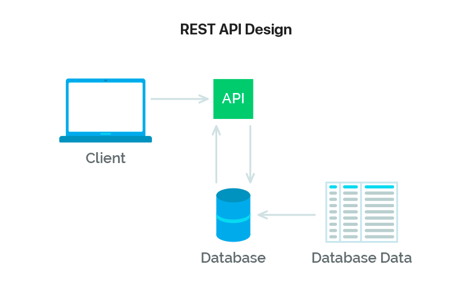
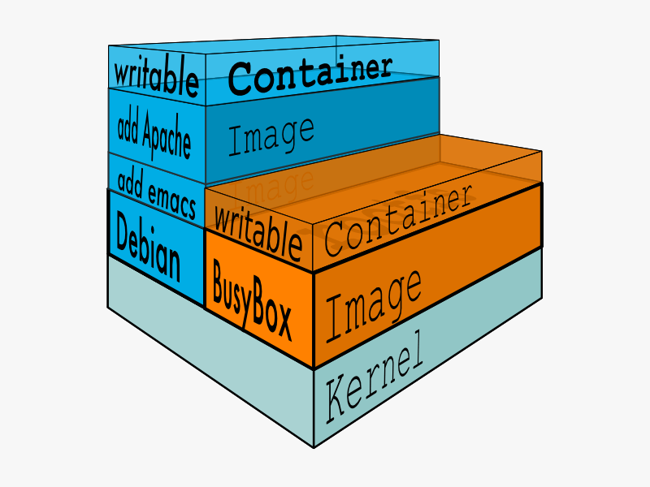
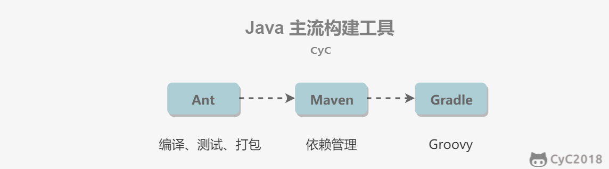

# 程序设计思想

## 命名规则

**1.类名需要使用大驼峰命名法（UpperCamelCase）风格。方法名、参数名、成员变量、局部变量需要使用小驼峰命名法（lowerCamelCase）。**

**2.测试方法名、常量、枚举名称需要使用蛇形命名法（snake_case）**，比如`should_get_200_status_code_when_request_is_valid`、`CLIENT_CONNECT_SERVER_FAILURE`。并且，**测试方法名称要求全部小写，常量以及枚举名称需要全部大写。**

**3.项目文件夹名称使用串式命名法（kebab-case），比如`dubbo-registry`。**

**4.包名统一使用小写，尽量使用单个名词作为包名，各个单词通过 "." 分隔符连接，并且各个单词必须为单数。**

正例： `org.apache.dubbo.common.threadlocal`

反例： ~~`org.apache.dubbo.common.threadLocal`~~

**5.抽象类命名使用 Abstract 开头**。

**6.异常类命名使用 Exception 结尾。**

**7.测试类命名以它要测试的类的名称开始，以 Test 结尾。**

## 命名规范

**1.为了能让命名更加易懂和易读，尽量不要缩写/简写单词，除非这些单词已经被公认可以被这样缩写/简写。比如 `CustomThreadFactory` 不可以被写成 ~~`CustomTF` 。**

**2.命名不像函数一样要尽量追求短，可读性强的名字优先于简短的名字，虽然可读性强的名字会比较长一点。** 这个对应我们上面说的第 1 点。

**3.避免无意义的命名，你起的每一个名字都要能表明意思。**

正例：`UserService userService;` `int userCount`;

反例: ~~`UserService service`~~ ~~`int count`~~

**4.避免命名过长（50 个字符以内最好），过长的命名难以阅读并且丑陋。**

5.**不要使用拼音，更不要使用中文。** 注意：像 alibaba 、wuhan、taobao 这种国际通用名词可以当做英文来看待。

正例：discount

反例：~~dazhe~~

## 面向对象思想

### 一、三大特性

#### 封装

利用抽象数据类型将数据和基于数据的操作封装到一起，使其构成一个不可分割的独立实体。数据被保护在抽象数据类型的内部，尽可能隐藏内部的细节，只保留对外的接口使其与外部发生关系，用户无需关心对象内部的细节，但可通过对象对外访问的接口来访问该对象。

##### 优点

1. 减少耦合，可以独立各模块，各自进行开发、测试、优化、使用、理解和修改
2. 减轻维护的负担，更容易被理解，调试的时候不影响其他模块
3. 有效地调节性能，可以通过剖析来确定哪些模块影响了系统的性能
4. 提高软件的可重用性
5. 降低了构建大型系统的风险，即使整个系统不可用，但是这些独立的模块却有可能是可用的

#### 继承

继承实现了IS-A关系，继承要1实现里式替换原则，子类对象必须可以替换掉所有父类对象。父类引用指向子类对象称为向上转型。响应方法都是看子类是否重写来决定用谁。

#### 多态

多态分为编译时多态和运行时多态

+ 编译时多态指的是方法的重写
+ 运行时多态指的是程序中定义的对象的引用所指向的具体类型在运行期间才确定，有三个条件，继承、重写、向上转型，即父类引用指向子类对象。

### 二、设计原则

#### SOLID原则

| 简写 |                全拼                 |   中文翻译   |
| :--: | :---------------------------------: | :----------: |
| SRP  | The Single Responsibility Principle | 单一责任原则 |
| OCP  |      The Open Closed Principle      | 开放封闭原则 |
| LSP  |  The Liskov Substitution Principle  | 里氏替换原则 |
| ISP  | The Interface Segregation Principle | 接口分离原则 |
| DIP  | The Dependency Inversion Principle  | 依赖倒置原则 |

1. 单一责任原则，修改一个类的原因应该只有一个，换句话说就是让一个类只负责一件事，当这个类需要做过多事情的时候，就需要分解这个类。

   如果一个类承担责任过多，那么一个职责的变化可能会削弱这类其他职责的能力

2. 开放封闭原则，类应该对扩展开放，但是对修改关闭。扩展就是添加新功能的意思，因此该原则要求在添加新功能时不需要修改代码，只是添加部分代码。符合这个原则最典型的设计模式是装饰者模式，他可以动态地将责任附加到对象上，而不用去修改类的代码。

3. 里式替换原则，子类对象必须能替换掉所有父类对象，继承是一种IS-A关系，子类需要能够当成父类来使用，而且需要比父类更加特殊。如果不满足这个原则，那么各个子类之间的关系就会有很大差异，增加继承体系的复杂度。

4. 接口分离原则，不应该强迫用户依赖于他们不用的方法，因此使用多个专门的接口比一个单一的总接口要好

5. 依赖倒置原则，高层模块不应该依赖于底层模块，二者都应该依赖于抽象。抽象不应该依赖于细节，细节应该依赖于抽象。高层模块包含一个应用程序中重要的策略选择和业务模块，如果高层模块依赖于低层模块，那么低层模块的改动会直接影响到高层，从而迫使高层模块也需要改动。

   依赖于抽象意味着：

   + 任何变量都不应该持有一个指向具体类的指针或者引用。
   + 任何类都不应该从具体类中派生
   + 任何方法都不应该覆写它的基类中已经实现的方法

#### 其他常见原则

| 简写 |               全拼                |   中文翻译   |
| :--: | :-------------------------------: | :----------: |
| LOD  |        The Law of Demeter         |  迪米特法则  |
| CRP  |   The Composite Reuse Principle   | 合成复用原则 |
| CCP  |   The Common Closure Principle    | 共同封闭原则 |
| SAP  | The Stable Abstractions Principle | 稳定抽象原则 |
| SDP  | The Stable Dependencies Principle | 稳定依赖原则 |

1. 迪米特法则：又叫做最少知识原则，Least Knowledge principle，LKP，就是说一个对象应当对其他对象尽可能少得了解，少和陌生人说话。
2. 合成复用原则，尽量用对象组合而不是继承来达到复用的目的。即不要为了一个功能随便继承，可以尝试用两个对象来实现功能。
3. 共同封闭原则，一起修改的类，应该组合在一起(同一个包中)，如果必须修改应用程序里的代码，我们希望修改只是发生在一个包里而不是很多包。
4. 稳定抽象原则，最稳定的包应该是最抽象的包，不稳定的应该是具体的包，即越抽象越不要改
5. 稳定依赖原则，包之间的依赖关系都应该是稳定方向依赖的，包要依赖的包要比自己更具有稳定性。

## Restful api规范



这个可以让你看到api设计就知道这是做什么的

### 一、重要概念

REST,即**Resource** **Representational State Transfer** 的缩写。

+ Resource是资源，真实的对象数据称为资源。每一个资源都有特定的uri，要获取资源访问对应的URI就行。
+ 表现形式Representational，资源的表现形式如json、xml等
+ 状态转移，描述服务器端资源的状态，比如增删改查导致的资源状态的改变。http协议是无状态的，所有资源都保存在服务器端。

### 二、接口规范

#### 1、动作

+ GET：请求获取特定资源
+ POST ：在服务器上创建一个新的资源。举个例子：`POST /classes`（创建班级）
+ PUT ：更新服务器上的资源（客户端提供更新后的整个资源）。举个例子：`PUT /classes/12`（更新编号为 12 的班级）。更改用put，插入用post
+ DELETE ：从服务器删除特定的资源。举个例子：`DELETE /classes/12`（删除编号为 12 的班级）
+ PATCH ：更新服务器上的资源（客户端提供更改的属性，可以看做作是部分更新），使用的比较少，这里就不举例子了。

#### 2、路径(接口命名)

路径也叫做终点endpoint，表示api的具体网址

1. 网址中不能有动词，只能有名词，api中名词也应该使用复数，因为这些资源通常是和数据库里面的表对应，而数据库中的表都是同种记录的集合。如果api调用不涉及资源的话就可以用动词
2. 不用大写字母，建议用-而不是下划线，

正面例子：

```
GET    /classes：列出所有班级
POST   /classes：新建一个班级
GET    /classes/classId：获取某个指定班级的信息
PUT    /classes/classId：更新某个指定班级的信息（一般倾向整体更新）
PATCH  /classes/classId：更新某个指定班级的信息（一般倾向部分更新）
DELETE /classes/classId：删除某个班级
GET    /classes/classId/teachers：列出某个指定班级的所有老师的信息
GET    /classes/classId/students：列出某个指定班级的所有学生的信息
DELETE classes/classId/teachers/ID：删除某个指定班级下的指定的老师的信息
```

还要理清楚里面的层次结构关系，

#### 3、过滤信息(Filtering)

如果我们在查询的时候需要添加特定条件的话，建议使用 url 参数的形式。比如我们要查询 state 状态为 active 并且 name 为 guidegege 的班级：

```
GET    /classes?state=active&name=guidegege
```

比如我们要实现分页查询：

```
GET    /classes?page=1&size=10 //指定第1页，每页10个数据
```

#### 4、状态码(State Codes)

**状态码范围：**

| 2xx：成功 | 3xx：重定向    | 4xx：客户端错误  | 5xx：服务器错误 |
| --------- | -------------- | ---------------- | --------------- |
| 200 成功  | 301 永久重定向 | 400 错误请求     | 500 服务器错误  |
| 201 创建  | 304 资源未修改 | 401 未授权       | 502 网关错误    |
|           |                | 403 禁止访问     | 504 网关超时    |
|           |                | 404 未找到       |                 |
|           |                | 405 请求方法不对 |                 |

### 三、HATEOAS

> **RESTful 的极致是 hateoas ，但是这个基本不会在实际项目中用到。**

上面是 RESTful API 最基本的东西，也是我们平时开发过程中最容易实践到的。实际上，RESTful API 最好做到 Hypermedia，即返回结果中提供链接，连向其他 API 方法，使得用户不查文档，也知道下一步应该做什么。

比如，当用户向 api.example.com 的根目录发出请求，会得到这样一个文档。

```javascript
{"link": {
  "rel":   "collection https://www.example.com/classes",
  "href":  "https://api.example.com/classes",
  "title": "List of classes",
  "type":  "application/vnd.yourformat+json"
}}
```

上面代码表示，文档中有一个 link 属性，用户读取这个属性就知道下一步该调用什么 API 了。rel 表示这个 API 与当前网址的关系（collection  关系，并给出该 collection 的网址），href 表示 API 的路径，title 表示 API 的标题，type 表示返回类型  Hypermedia API 的设计被称为[HATEOAS](http://en.wikipedia.org/wiki/HATEOAS)。

在 Spring 中有一个叫做 HATEOAS 的 API 库，通过它我们可以更轻松的创建除符合 HATEOAS 设计的 API。

# 工具总结

## Docker

### 一、解决的问题

因为不同的机器有不同的操作系统、库和组件，在把一个应用部署到多台机器上需要进行很多的环境配置操作。

Docker主要解决环境配置问题。这是一种虚拟化技术，对进程进行隔离，被隔离的进程独立于宿主操作系统和其他隔离的进程。使用Docker可以不修改应用程序代码，不需要开发人员学习特定环境下的技术，就能够将现有的应用程序部署到其他机器上。


### 二、与虚拟机的比较

虚拟机也是一种虚拟化技术，区别在于他是通过模拟硬件并且在硬件上面安装操作系统来实现的。

+ 启动速度上面虚拟机需要先启动操作系统再启动应用，这个过程非常慢。而启动Docker相当于启动宿主操作系统上的一个进程。
+ 占有资源上，虚拟机是一个完整的操作系统，需要占用大量的磁盘内存等资源。Docker是一个进程，运行时占用资源极少
+ Docker更容易迁移到不同的机器上
+ 更容易维护，因为用到了分层技术和镜像，使得应用可以更容易复用重复的部分，复用程度越高则维护越容易
+ 更容易扩展，可以用基础镜像进一步扩展得到新的镜像。并且官方和开源社区提供了大量的镜像，扩展这些镜像就可以非常容易得到我们要的镜像。

### 三、使用场景

1. 持续集成：指的是频繁地把代码集成到主干上，这样可以更快地发现错误。

   他具有轻量级和隔离性的特点，在将代码集成到一个Docker中不会对其他的Docker造成影响。

2. 提供可伸缩的云服务，根据应用的负载情况，可以很轻易地增加或者减少Docker

3. 搭建微服务架构，轻量级的特点使得它适合用于部署、维护、组合微服务

### 四、镜像和容器

镜像是一种静态的结构，可以看成面向对象里面的类，而容器是镜像的一个实例。

镜像包含着容器运行时所需要的代码以及其它组件，它是一种分层结构，每一层都是只读的（read-only layers）。构建镜像时，会一层一层构建，前一层是后一层的基础。镜像的这种分层存储结构很适合镜像的复用以及定制。

构建容器时，通过在镜像的基础上添加一个可写层（writable layer），用来保存着容器运行过程中的修改。



## 构建工具

### 一、构建工具的作用

构建一个项目通常包含了依赖管理、测试、编译、打包、发布等流程。构建工具可以自动化这些操作，从而为我们减少这些繁琐的操作。

其中构建工具提供的依赖管理能够可以自动处理依赖关系。例如一个项目需要用到依赖 A，A 又依赖于 B，那么构建工具就能帮我们导入 B，而不需要我们手动去寻找并导入。

在 Java 项目中，打包流程通常是将项目打包成 Jar 包。在没有构建工具的情况下，我们需要使用命令行工具或者 IDE 手动打包。而发布流程通常是将 Jar 包上传到服务器上

### 二、Java主流构建工具

Ant具有编译、测试、打包功能，其后出现的Maven在Ant的功能基础上新增了依赖管理功能，最新的Gradle又在maven基础上新增了对于Groovy语言的支持。



Gradle 和 Maven 的区别是，它使用 Groovy 这种特定领域语言（DSL）来管理构建脚本，而不再使用 XML 这种标记性语言。因为项目如果庞大的话，XML 很容易就变得臃肿。

例如要在项目中引入 Junit，Maven 的代码如下：

```xml
<?xml version="1.0" encoding="UTF-8"?>
<project xmlns="http://maven.apache.org/POM/4.0.0" xmlns:xsi="http://www.w3.org/2001/XMLSchema-instance"
  xsi:schemaLocation="http://maven.apache.org/POM/4.0.0 http://maven.apache.org/xsd/maven-4.0.0.xsd">
   <modelVersion>4.0.0</modelVersion>
 
   <groupId>jizg.study.maven.hello</groupId>
   <artifactId>hello-first</artifactId>
   <version>0.0.1-SNAPSHOT</version>

   <dependencies>
          <dependency>
               <groupId>junit</groupId>
               <artifactId>junit</artifactId>
               <version>4.10</version>
               <scope>test</scope>
          </dependency>
   </dependencies>
</project>
```

而 Gradle 只需要几行代码：

```java
dependencies {
    testCompile "junit:junit:4.10"
}
```

### 三、Maven

提供了项目对象模型Pom文件来管理项目的构建

#### 仓库

仓库的搜索顺序为：本地仓库、中央仓库、远程仓库。

- 本地仓库用来存储项目的依赖库；
- 中央仓库是下载依赖库的默认位置；
- 远程仓库，因为并非所有的依赖库都在中央仓库，或者中央仓库访问速度很慢，远程仓库是中央仓库的补充

#### POM

pom代表项目对象模型，是一个xml文件，主要在pom.xml文件里面

[groupId, artifactId, version, packaging, classifier] 称为一个项目的坐标，**其中  groupId、artifactId、version 必须定义**，packaging 可选（默认为 Jar），classifier  不能直接定义的，需要结合插件使用。

- groupId：项目组 Id，必须全球唯一；
- artifactId：项目 Id，即项目名；
- version：项目版本；
- packaging：项目打包方式

#### 依赖原则

1. 依赖路径最短原则，哪个依赖路径最远就选择哪一个。
2. 声明顺序优先原则，最先声明的优先。
3. 覆写优先原则，子的依赖优先于父依赖
4. 可以查看maven的依赖树再根据原则调整依赖顺序。


