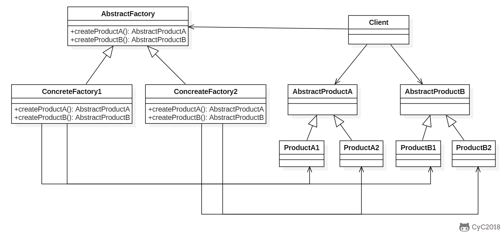
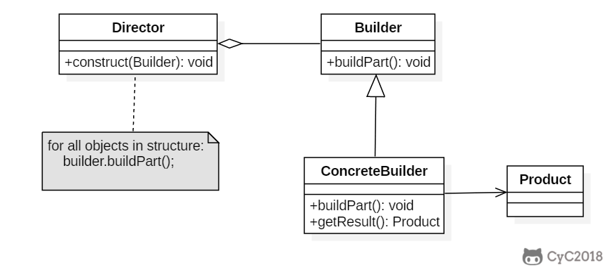

# 设计模式

## 一、前言

设计模式是解决问题的方案，学习现有的设计模式可以做到经验复用，拥有设计模式词汇，沟通的时候就能用更少的词汇来讨论，并且不需要了解底层细节。

## 二、创建型

### 单例模式 Singleton

#### Intent

确保一个类只有一个实例，而且提供该实例的全局访问点。

#### Class Diagram

使用一个私有构造函数、一个私有静态变量以及一个公有静态函数来实现。私有构造函数保证了不能用构造函数来生成对象实例，只能通过公有的静态函数返回唯一的私有静态变量。在公有的静态函数里面，会进行一个判断，只有对象为空才会创建对象，否则就一直用这一个对象，即用这个公有静态函数返回这个对象。

##### 懒汉式-线程不安全

```java
public class Singleton {

    private static Singleton uniqueInstance;

    private Singleton() {
    }

    public static Singleton getUniqueInstance() {
        if (uniqueInstance == null) {//此处线程不安全 但是延迟实例化了
            uniqueInstance = new Singleton();
        }
        return uniqueInstance;
    }
}

```

只会在用到的地方才实例化，所以节约了资源

这样可以不生成第二个对象实例，只能生成一个，但是在多线程的条件下面，一起在这个null判断的地方，就会导致生成多个实例。

##### 饿汉式-线程安全

```java
private static Singleton uniqueInstance = new Singleton();
```

直接在前面实例化，这样就没有了判断，但是这样就不能达到节约资源的目的

##### 懒汉式-线程安全

```java
public static synchronized Singleton getUniqueInstance() {
    if (uniqueInstance == null) {
        uniqueInstance = new Singleton();
    }
    return uniqueInstance;
}
```

直接给方法加锁，就可以解决同步问题，但是这样有性能问题，因为即使没有实例化，也会被阻塞在此处，所以这个方法并不推荐使用

##### 双重校验锁-线程安全

```java
public class Singleton {

    private volatile static Singleton uniqueInstance;

    private Singleton() {
    }

    public static Singleton getUniqueInstance() {
        if (uniqueInstance == null) {
            synchronized (Singleton.class) {
                if (uniqueInstance == null) {
                    uniqueInstance = new Singleton();
                }
            }
        }
        return uniqueInstance;
    }
}
```

只在没有实例化的时候才进来同步，这样就大大节省了时间，不用全都阻塞，只会在没有实例化的时候阻塞一会。

```java
if (uniqueInstance == null) {
    synchronized (Singleton.class) {
        uniqueInstance = new Singleton();
    }
}
```

这样是错误的，是因为这样只是对生成先后有一个顺序，并不会阻止多个实例的生成。

uniqueInstance 采用 **volatile** 关键字修饰也是很有必要的， `uniqueInstance = new Singleton();` 这段代码其实是分为三步执行：

1. 为 uniqueInstance 分配内存空间
2. 初始化 uniqueInstance
3. 将 uniqueInstance 指向分配的内存地址

但是由于 JVM 具有指令重排的特性，执行顺序有可能变成 1>3>2。指令重排在单线程环境下不会出现问题，但是在多线程环境下会导致一个线程获得还没有初始化的实例。例如，线程 T1 执行了 1 和 3，此时 T2 调用 getUniqueInstance() 后发现 uniqueInstance 不为空，因此返回 uniqueInstance，但此时 uniqueInstance 还未被初始化。

使用 volatile 可以禁止 JVM 的指令重排，保证在多线程环境下也能正常运行。

volatile是为了保证可见性，也就是大家改变了都马上通知到内存，JVM就不能指令重排。

##### 静态内部类实现

当 Singleton 类被加载时，静态内部类 SingletonHolder 没有被加载进内存。只有当调用 `getUniqueInstance()` 方法从而触发 `SingletonHolder.INSTANCE` 时 SingletonHolder 才会被加载，此时初始化 INSTANCE 实例，并且 JVM 能确保 INSTANCE 只被实例化一次。

这种方式不仅具有延迟初始化的好处，而且由 JVM 提供了对线程安全的支持。

```java
public class Singleton {

    private Singleton() {
    }

    private static class SingletonHolder {
        private static final Singleton INSTANCE = new Singleton();
    }

    public static Singleton getUniqueInstance() {
        return SingletonHolder.INSTANCE;
        //因为只有第一次是初始化，第二次就是直接使用了
    }
}
```

##### 枚举实现

```java
public enum Singleton {

    INSTANCE;

    private String objName;


    public String getObjName() {
        return objName;
    }


    public void setObjName(String objName) {
        this.objName = objName;
    }


    public static void main(String[] args) {

        // 单例测试
        Singleton firstSingleton = Singleton.INSTANCE;
        firstSingleton.setObjName("firstName");
        System.out.println(firstSingleton.getObjName());
        Singleton secondSingleton = Singleton.INSTANCE;
        secondSingleton.setObjName("secondName");
        System.out.println(firstSingleton.getObjName());
        System.out.println(secondSingleton.getObjName());

        // 反射获取实例测试
        try {
            Singleton[] enumConstants = Singleton.class.getEnumConstants();
            for (Singleton enumConstant : enumConstants) {
                System.out.println(enumConstant.getObjName());
            }
        } catch (Exception e) {
            e.printStackTrace();
        }
    }
}
//firstName
//secondName 只要更改了之后就一直都是这个，所以是单例的
//secondName
//secondName
```

该实现可以防止反射攻击。在其它实现中，通过 setAccessible()  方法可以将私有构造函数的访问级别设置为  public，然后调用构造函数从而实例化对象，如果要防止这种攻击，需要在构造函数中添加防止多次实例化的代码。该实现是由 JVM  保证只会实例化一次，因此不会出现上述的反射攻击。

该实现在多次序列化和序列化之后，不会得到多个实例。而其它实现需要使用 transient 修饰所有字段，并且实现序列化和反序列化的方法。

### 简单工厂

Simple Factory

#### Intent

在创建一个对象时不向客户暴露内部细节，并提供一个创建对象的通用接口

#### Class Diagram

简单工厂把实例化的操作单独放到一个类中，这个类就成为简单工厂类，让简单工厂类来决定应该具体用哪一个子类来实例化。

这样可以将客户类和具体子类实现解耦，客户类不再需要知道有哪些子类以及应该实例化哪一个子类，客户类往往有多个，如果不使用简单工厂，那么所有的客户类都要知道所有子类的细节，而且子类一旦发生改变，比如新增子类，那么所有的客户类都要进行修改。


#### Implementation

```java
public interface Product {
}
public class ConcreteProduct implements Product {
}
public class ConcreteProduct1 implements Product {
}
public class ConcreteProduct2 implements Product {
}
```

以下的 Client 类包含了实例化的代码，这是一种错误的实现。如果在客户类中存在这种实例化代码，就需要考虑将代码放到简单工厂中。

```java
public class Client {

    public static void main(String[] args) {
        int type = 1;
        Product product;
        if (type == 1) {
            product = new ConcreteProduct1();
        } else if (type == 2) {
            product = new ConcreteProduct2();
        } else {
            product = new ConcreteProduct();
        }
        // do something with the product
    }
}//全都是自己实现的，比较麻烦，所有用简单工厂
```

以下的 SimpleFactory 是简单工厂实现，它被所有需要进行实例化的客户类调用。

```java
public class SimpleFactory {

    //重点是有一个父类接口，可以返回所有的子类对象，根据值就可以决定返回哪一个
    public Product createProduct(int type) {
        if (type == 1) {
            return new ConcreteProduct1();
        } else if (type == 2) {
            return new ConcreteProduct2();
        }
        return new ConcreteProduct();
    }
}
public class Client {

    public static void main(String[] args) {
        SimpleFactory simpleFactory = new SimpleFactory();
        Product product = simpleFactory.createProduct(1);
        // do something with the product
    }
}
```

简单工厂是有另一个类来专门帮忙创建新的对象

### 工厂方法

#### Intent 

定义了一个创建对象的接口，但由子类决定要实例化哪个类，工厂方法把实例化操作推迟到子类。

#### Class Diagram

简单工厂里面创建对象的是另一个类，但是在工厂方法里面是由子类来创建对象的。


有一个Factory，里面有doSomeThing方法，需要创建的product则由专门的一个factoryMethod创建。

#### 实现

```java
public abstract class Factory {
    abstract public Product factoryMethod();
    public void doSomething() {
        Product product = factoryMethod();
        // do something with the product
    }
}
public class ConcreteFactory extends Factory {
    public Product factoryMethod() {
        return new ConcreteProduct();
    }
}
public class ConcreteFactory1 extends Factory {
    public Product factoryMethod() {
        return new ConcreteProduct1();
    }
}
public class ConcreteFactory2 extends Factory {
    public Product factoryMethod() {
        return new ConcreteProduct2();
    }
}
```

创建对象的时候根据具体工厂的名字即ConcreteFactory1等进行实际对象的创建。

### 抽象工厂(Abstract Factory)

#### Intent

提供一个接口，用于创建相关的对象家族

#### Class Diagram

这个是创建一个对象家族的，通过封装，得到很多对象一起创建。这些一起创建的对象有他们的相关性。



#### 实现

```java
public class AbstractProductA {
}
public class AbstractProductB {
}
public class ProductA1 extends AbstractProductA {
}
public class ProductA2 extends AbstractProductA {
}
public class ProductB1 extends AbstractProductB {
}
public class ProductB2 extends AbstractProductB {
}
public abstract class AbstractFactory {//抽象工厂
    abstract AbstractProductA createProductA();
    abstract AbstractProductB createProductB();
}
public class ConcreteFactory1 extends AbstractFactory {
    AbstractProductA createProductA() {//抽象工厂实现类，
        return new ProductA1();
    }

    AbstractProductB createProductB() {
        return new ProductB1();
    }
}
public class ConcreteFactory2 extends AbstractFactory {
    AbstractProductA createProductA() {
        return new ProductA2();
    }

    AbstractProductB createProductB() {
        return new ProductB2();
    }
}
public class Client {
    public static void main(String[] args) {
        //一个抽象工厂实现类
        AbstractFactory abstractFactory = new ConcreteFactory1();
        //一起创建两个对象
        AbstractProductA productA = abstractFactory.createProductA();
        AbstractProductB productB = abstractFactory.createProductB();
        // do something with productA and productB
    }
}
```

### 生成器 (Builder)

#### Intent

封装一个对象的构造过程，并允许按步骤构造

#### Class Diagram



有基础类，也有接口，然后有director进行生成步骤的控制

#### 实现

汽车类

```java
interface CarPlan {
    void setWheel(String wheel);
    void setFrame(String frame);
    void setEngine(String engine);
    void setWidget(String widget);
}

class Car implements CarPlan {
    private String myWheel;
    private String myFrame;
    private String myEngine;
    private String myWidget;
    void setWheel(String wheel) {
        myWheel = wheel;
    }
    void setFrame(String frame) {
        myFrame = frame;
    }
    void setEngine(String engine) {
        myEngine = engine;
    }
    void setWidget(String widget) {
        myWidget = widgetl
    }
}
```

Builder：

```java
interface Builder {
    void buildWheel();
    void buildFrame();
    void buildEngine();
    void buildWidget();
    Car getCar();
}
//一个廉价车生成器
class CheapBuilder implements Builder {
    Car cheapCar = new Car();
    Car getCar() {
        return cheapCar;
    }
    void buildWheel() {
        cheapCar.setWheel("cheap wheel");
    }
    void buildFrame() {
        cheapCar.setFrame("cheap frame");
    }
    void buildEngine() {
        cheapCar.setEngine("cheap engine");
    }
    void buildWidget() {
        cheapCar.setWidget("no widget");
    }
}
//一个平价车生成器
class EconomicBuilder implements Builder {
    Car economicCar = new Car();
    Car getCar() {
        return economicCar;
    }
    void buildWheel() {
        cheapCar.setWheel("cheap wheel");
    }
    void buildFrame() {
        cheapCar.setFrame("expensive frame");
    }
    void buildEngine() {
        cheapCar.setEngine("cheap engine");
    }
    void buildWidget() {
        cheapCar.setWidget("economic widget");
    }
}
```

指导类：

```java
class Director {
    private Builder builder;
    director(Builder bld) {
        builder = bld;
    }
    void produceCar() {
        //这里对步骤进行控制
        builder.buildFrame();
        builder.buildWidget();
        builder.buildWheel();
        builder.buildEngine();
    }
    Car getCar() {
        builder.getCar();
    }
}
```

客户端：

```java
public class Test {
    public static void main(String[] args) {
        Builder bld = new EconomicBuilder();
        Director director = new Director(bld);
        director.produceCar();
        Car car = director.getCar();
}
```

### 原型模式

#### Intent

创建一个原型，里面有clone函数，通过调用clone函数获得一个新的对象，即复制生成新对象

#### Class Diagram


#### 实现

```java
public abstract class Prototype {
    abstract Prototype myClone();
}
public class ConcretePrototype extends Prototype {

    private String filed;

    public ConcretePrototype(String filed) {
        this.filed = filed;
    }

    @Override
    Prototype myClone() {
        return new ConcretePrototype(filed);
    }

    @Override
    public String toString() {
        return filed;
    }
}
public class Client {
    public static void main(String[] args) {
        Prototype prototype = new ConcretePrototype("abc");
        Prototype clone = prototype.myClone();//这里就是通过复制获得的新对象
        System.out.println(clone.toString());
    }
}
```

## 三、行为型


### 责任链

### 命令

### 解释器

### 迭代器

### 中介者

### 备忘录

### 观察者

### 状态

### 策略

### 模板方法

### 访问者

### 空对象

## 四、结构型

### 适配器

### 桥接

### 组合

### 装饰

### 外观

### 享元

### 代理