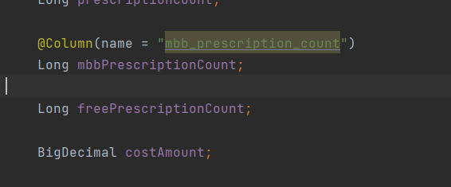

# 春季实习日记

浙江亿保实习--杭州跨贸小镇10栋

## 第一周 四月

仅两天，熟悉环境

### 4.8 周四

第一天上岗，没有账号，也不会框架什么的，所以就学习了一天的SpringBoot，具体学习日记在框架学习里面。

### 4.9 周五

1. 第二天上岗，起来迟了，打车花了不少钱，还是迟到了一些，还是没有账号。

2. 以为我精通了SpringBoot，所以让我学习queryDSL，然而学了一天学了个寂寞，一天都在和环境作斗争，都在配环境，到最后也没有配完。

3. 开了一周总结会，感觉大家会的都挺多，我也更知道后面的学习方向了，从初始到最后能进行业务开发我还有很长的路要走。

### 第一周总结

摸鱼的第一周，自己学习路子不够，学习进度跟不上，要学的东西还很多，一时间学不完，没有人指导还是走的太慢了，自己要接着走下去，希望能在一个月内实现对业务的开发。

## 第二周

### 4.13 周二

#### 问题汇总

1. 文件下载之后记得要改一下run哪里的配置，选择我们的-dev.yml文件进行run，如果没有就会导致找默认的yml文件然后错误
2. jdk版本用1.8，版本不匹配会出现很多问题。
3. 主要学习了图书馆项目，学习了部分git操作，还有整个后端流程。先在controller，然后调用service，service里面进行dao的操作，数据传输多用dto封装，可以直接对一个类的数据进行访问传输，比较简单。

### 4.14 周三

1. 对getList接口进行了完整的查看，知道了里面的数据流向，sql查询怎么做的，尤其是count的计算，List\<Predicate>的where子句，like要加%等问题
2. 熟悉Spring boot的注解，注解内容很多，还要继续背。
3. 学习Java变量等命名规范

### 4.15 周四

#### 问题记录：

1. 

   接口也是可以实现一个成一个对象的，这里的意思是将接口的内容注入到我们的一个引用里面，然后就可以进行使用。

   其实是注入的实现类而不是接口吗？

2. 多线程是怎么体现的？图书馆项目里面都是单线程的，因为完全够用。对于TomCat服务器来说，会提供一个大概十万左右的并发度，六七百的共同访问是可以的，即使是单线程在进行不断地轮转也是可以实现大概的并发的。像是两个用户共同借阅了一本书，最后借书是否成功还是看管理员的，所以从逻辑上防止了并发的问题。

3. 服务器的整体架构。

#### 学习记录

1. 学习了Spring cloud的总体架构，对其基础组件Eureka、Ribbon、Feign、Hystrix、Zull等都有了一个总体的了解，但是其源代码过于复杂，我没有很深入地学习相关代码
2. 用git下载的项目体验了一下Eureka、Ribbon、Feign组件，对其启动方法、常用注解有了基本的了解。

### 4.16 周五

1. 从体检订单报表0322分支切出来

2. 项目内容比较复杂，先找一个接口看清楚里面是怎么调用的。有问题的时候要进行相关的搜索，找到是哪里出了问题。

3. api模块就是封装自己的微服务代码，只给出接口的调用。我们使用别的微服务就是这样调用的：

   ```java
   @FeignClient("JBDOCTOR-COMMON")//这个是微服务的名称 是在Eureka服务器里面显示的名字
   public interface JbdAreaApiService extends JbtAreaService {
   
   }
   ```

   继承别的服务的类，其实继承的也是一个接口，这个接口是api下面的，然后真正的实现是在common里面，common对这个接口进行了一个实现，在我们调用的时候，直接用JbdAreaApiService 引用，然后Autowired把bean注入到这个引用里面，我们就可以进行相关的使用了，直接可以调用实现类里面的方法。

   每次都是定义一个api的接口，然后Controller 就implements这个接口，在接口里面定义好Mapping，连接就会转到controller的地方。其他地方也是一个接口定义了这个服务，然后autowired之后就可以用相关的引用调用需要的方法。

   我们的微服务里面有一个api服务，里面只有一些api的接口，对应的实现类controller在本身的接口里面，其他服务调用就继承这个api的接口，然后再写对应的实现类进行autowired。调用其他微服务的controller不用继承这个接口，只需要继承提供给外部的接口。

4. 分为微服务进行，这样可以方便业务解耦合，也方便进行业务速度的优化，每一个单独的服务拿出去都可以进行使用，调试等也较为方便。

5. 需要换成dev进行运行嘛，每个配置文件分别是什么意思呢？dev就是本地的，默认的是全部的的，prod是正式服，test才是测试服

6. 要学习注解的写法，枚举类的写法。

7. ```xml
   <groupId>com.ebaolife.jbdoctor</groupId> 这个是相当于路径
   <artifactId>jbd-user-api</artifactId> 这个相当于是jar包名称
   ```

8. 有很多都是脚本进行的，比如部署到服务器上面，比如一开始的环境配置等。项目配置用的是Apollo

9. 

   解决compile之后的Q类无法被引入的问题

### 第二周总结

1. 学习了单服务和SpringBoot，但是对配置环境还是不是很熟，数据库的连接也不是很会。
2. 学习了SpringCloud的基础组件，对其有了基本的认识，但是对代码还是不熟悉，训练不够，还是要多写多看。

## 第三周

### 4.20 周二

#### 问题询问

1. 在代码里抛出的异常是如何进行处理的？有一个全局的处理异常的地方global包里面的GlobalExceptionHandler会进行全局的处理

   ```java
      @ExceptionHandler({ServiceException.class})//调用这个异常处理
       @ResponseBody
       public Response biz(ServiceException e) {
           log.error("biz异常: {}", e.getResp());
           e.printStackTrace();
           return e.getResp();//直接返回一个error信息，有异常抛出的时候直接停止，然后转到这里进行异常的处理
       }
   ```

2. 有些字段用了Byte是为了节约空间吗？是的
3. vo和dto啥区别？vo就是view object给前端看的字段。
4. getConsultTypeInquiry是什么逻辑？已经废弃了，逻辑较为复杂。区分视频或者文字是因为医生有类型需求，比如有医生不愿意露脸，所以需要加一个类型判断处理。
5. GSON是处理json格式的类，专门进行格式的转化，我们的传输都是基于json进行的

#### 学习记录

1. 根据阿里云平台的日志进行错误的排查：

   即时反馈：
   产品与服务--容器服务--k8s-test--无状态

   一般是等待别人给出一个测试接口，熟悉代码之后找到相关的接口的controller，再去容器服务里面进行搜索，查看日志

   长期反馈： 重点是要搞清楚日期，找到报错日志信息

   日志服务--hangzhou-log--applog-test是测试服、short-applog是正式服、如果没有可以看applog

   获得报错日志之后回到代码里面dev分支全局搜索一下报错信息，然后看相关的逻辑，就查找到了相关的问题。

2. 看订单池是要先看一个限流，处理高并发的方法。然后是看im里面了解Netty的分布式实现。

3. if else可以用策略模式替代，一个接口多个实现，根据一个参数选择某一个实现，那么就相当于进行了if else的判断，这样代码比较简洁，要学设计模式。

4. im，Instant Messaging，的包结构：

   

   task是redis的配置包

5. Java流计算：

   ```java
           Stream<String> limit = list.stream()
                   .filter((u) -> {
                       return u.getId() % 2 == 0;
                   })// 2.1 过滤 ID 为偶数
                   .filter(u -> {
                       return u.getAge() > 24;//return是流计算里面的return，不是外面的return
                   })//  2.2 过滤 Age > 24
                   .map(m -> { //map是对每一个元素都执行相同的操作而不是变成一个map
                       return m.getUserName().toUpperCase();
                   })// 2.3 把上面筛选结果的名字变为大写
                   .sorted((o1, o2) -> {
                       return o2.compareTo(o1);
                   })// 2.4 倒序排列,o1 在前就是升序，o2 在前就是降序
                   .limit(1);// 2.5 限制输出一条数据
   ```

6. 只有西药存在购物车里面，因为购物车里面只能是西药，中药都是医生给开的。查询的id多几个没问题，不会报错。

### 4.21 周三

#### 问题询问

1. queryDSL的基础函数是什么意思，比如merge、save、flush等，save是全部批量的保存，flush是在并发有锁的环境下进行一个刷新，防止读的数据还没有进行过刷新。merge和persist都是进行修改，有entity里面的id的时候就是进行修改merge，没有对应的id就是进行添加persist。

   ```java
       public EC save(EC entity) {
           if (!entityManager.contains(entity)) {
               entityManager.persist(entity);
               return entity;//所以persist就是添加，因为是在数据库不包含entity的情况下使用的
           } else {
               return entityManager.merge(entity);
           }
       }
   ```

2. 怎么查询对应字段，字段叫什么erpOrderNo，transTime

3. 再次碰到QEntity无法引入的问题，这次reload了一下pom文件就行

4. **首先本地sql要写@Transactional，会报一个transactionRequired的错误。然后是在controller里面，调用微服务的接口implements必须要加上@RequestParam等注解得到参数，没有的话更新会失败。**

#### 学习记录

1. 直接写sql语句进行更改查询的方法

   ```java
       @Transactional(propagation = Propagation.REQUIRED)
       public boolean deleteShoppingCartProduct(Long jbuUserId, Integer shoppingCartProductId) {
           String sql = "update tps_shoping_carts set state = ?1 where jbu_user_id = ?2 and id = ?3";
           Query query = getEntityManager().createNativeQuery(sql);
           query.setParameter(1, 99);
           query.setParameter(2, jbuUserId);
           query.setParameter(3, shoppingCartProductId);
           return query.executeUpdate() == 1;
       }
   ```

   这样写不是用queryDSL进行的，如果用，需要进行的操作是，先查询用户id看是否属于本身的id，然后再进行创建entity，再调用merge方法进行修改，相当于需要进行两次数据库操作，这样用sql语句可以直接写好，一遍直接update了。

   查询一般使用find操作更简单，但是修改添加等用这个更简单。

2. 升序的方法：

   ```java
   orderSpecifiers.add(areaDao.getQEntity().id.asc());//返回升序
   ```

3. 时间查询：

   ```java
   predicates.add(QOrder.order.createdAt.before(createTimeUpper));
   ```

4. 在orderClient即本服务调用别的服务的接口处可以指定接口这样才会启动到本地的服务，否则Eureka服务器可能会找到的是测试服里面已经在跑的服务而不是本地启动的服务：

   ```java
   @FeignClient(value = "WAREHOUSE-ORDER",url="http://localhost:8080")
   public interface OrderClient extends OrderApi {
   
   }
   
   ```

5. Restful API 多用curd单词，里面用驼峰命名法。信息要看长不长，长的话要用RequestBody的形式传输而不是用很多个RequestParam。

6. 增加返回字段发货时间和erpNum，直接在Vo里面增加一个值就行，因为是dto到Vo直接复制的。

7. 增加一个修改发货信息的接口，学习了很多代码规范问题。

### 4.22 周四

#### 问题询问

1. jdk版本看清楚，pom文件里面的依赖和插件记得指定版本。

#### 学习记录

1. 当前端有关键字查询的时候，可以用like(key + "%")则代表有key做开头的记录，都加就是包含key的记录
2. 学习@Builder注解，用来快速优雅地生成一个对象。
3. 学习了Redis的基础知识
4. 学习了facade-admin里面的健康小课堂相关流程，看了相关授权的流程，但是有很多后台源代码没有显示，只有api接口。

### 4.23 周五

#### 问题询问

#### 学习记录

1. 进行修改的方法：

   新建一个Entity，然后调用save函数，在里面有差别，一个是persist插入，一个是merge修改。

   ```java
       public EC save(EC entity) {
           if (!entityManager.contains(entity)) {
               entityManager.persist(entity);
               return entity;
           } else {
               return entityManager.merge(entity);
           }
       }
   ```

   我们一般是会查出原本的entity然后调用相关的set函数，将entity改为我们需要的样子，之后再save(entity);

2. 学习数据库的sql语句写法

3. 看HealthCourseService里面的递归子树。

4. 写代码，尤其是调用别人的接口(如微服务、http请求的时候)，**不要把业务逻辑放在@Transactional事务里面，**因为调用失败会导致我们的事务回滚，或者http请求会被发两次，因为事务一次放到缓冲区，一次提交，都会执行一遍http请求，这样不安全。

   在写代码的时候我们要充分不相信别人，要悲观想象别人的代码，所以在调用的时候要经常记得加try catch捕捉异常。像调用http之类的要么异步执行要么try catch自己处理，不要让可能的异常直接让我们的业务挂掉。

5. 代码要记得ctrl + alt + l进行一个规范化！

6. 打印错误信息一定要注意不要直接加上一个dto，因为其toString方法是没有重写的，lombook虽然有提供，但是不能进行使用，所以要用JSON.toJSON()，这个json是alibaba的fastjson

7. 环境配置又有问题，引入maven文件

8. 写一个消息通知的接口，状况百出

9. 数据校验是前后端都要做的，比如身份证号、手机号等

### 第三周总结

总体来说写了一个最基础的代码，暴露了自己很多习惯不好的问题，比如代码规范化、命名规范化等。下个周继续多写代码，希望早点更加熟练，做出更好的成绩。

下周要多写代码，学习facade-admin项目，学习一些Java基础知识

## 第四周

### 4.27 星期二

#### 问题询问

#### 学习记录

1. 看dao需要的entity是哪一个可以去dao里面找到其继承的QueryDslBaseDao，如：

   ```java
   public class CodeDao extends QueryDslBaseDao<Code, QCode> 
   ```

   这里需要的entity已经说明了是Code

2. 正则表达式找到数字：

   ```java
   String useFreqNum = Pattern.compile("[^0-9]").matcher(useFreq).replaceAll("");
   ```

   找到小数和数字

   ```java
   Matcher m = Pattern.compile("(\\d+\\.\\d+)").matcher(singleDose);
               //找到说明是小数
               if (m.find()) {
                   String singleDoseDouble = m.group(1) == null ? "" : m.group(1);
                   double sdd = Double.parseDouble(singleDoseDouble);
                   uniNumDouble = uniNumDouble / useFreqNumber / sdd;
                   return (int) Math.ceil(uniNumDouble);
               }
   ```

   找小数或者是整数：

   ```java
   Matcher m = Pattern.compile("(\\d+\\.\\d+|\\d+)").matcher(singleDose);
   ```

   他们都能转为double，所以直接一起找就行，加一个|符号在括号里面就可以了

3. BigDecimal的目的是做一个精确的计算，因为double等类型在计算机底层里面的存储实际上是不精确的。

   用来对超过16位有效位的数进行精确的运算。double等只能处理最多十六位，商业计算里就要用这个

   BigDecimal一共有4个构造方法:

   BigDecimal(int) 创建一个具有参数所指定整数值的对象。

   BigDecimal(double) 创建一个具有参数所指定双精度值的对象。（不建议采用）因为本身的double是不确定的

   BigDecimal(long) 创建一个具有参数所指定长整数值的对象。

   BigDecimal(String) 创建一个具有参数所指定以字符串表示的数值的对象

   ```java
   public BigDecimal add(BigDecimal value); //加法
   public BigDecimal subtract(BigDecimal value); //减法
   public BigDecimal multiply(BigDecimal value); //乘法
   public BigDecimal divide(BigDecimal value); //除法
   ```

   这些的计算对象都是一个类型的，本次我写的主要是因为需求是Integer所以不需要这些函数进行计算。

   对于BigInteger，其主要目的是作为大数运算，当给的数字过大，超过了基本类型的时候就要用这个类型进行计算。

4. 用postman直接连接进行接口测试，但是body需要的dto是不能直接出现的，需要自己写内容。另外可以用swagger进行更方便的测试：http://localhost:8082/swagger-ui.html#/

#### 工作记录

1. 完成getUseDays()函数，学习了正则表达式提取数字的方法，了解了BigDecimal的精确性。
2. 为facade-admin里面的药物接口添加limitUseDays字段的添加修改和查询功能
3. 学习jbdoctor项目的common接口，学习设计模式

### 4.28 周三

#### 问题询问

1. 

   这个是string，但是在数据库里是数字，是在哪里转换的？

   是本身就是string，只是数据库里一部分是数字。

2. 增加问诊次数和回退问诊次数

#### 学习记录

1. @Where注解，就是在sql查询的时候都加上一个where子句，比如查询state为0的，在每个查询的时候都加上这个查询。适用于对查询的共同性的查询，加在Entity里面，表示对这个实体进行查询的时候都加上一个where子句。
2. @GeneratedValue(strategy = GenerationType.IDENTITY)，就是主键自增类型，AUTO是自选，table是根据表格生成，Sequence是对不支持主键自增的数据库提供sequence的方式进行生成
3. UUID是唯一标识符。
4. RedisTemplate是redis相关内容，Redis在项目里的作用大概就是在一个地方存进去，在另一个地方取出来用，相当于一个全局的存储，可以直接调用。
5. @Version是一个乐观锁机制，更改的时候则必须用save函数，否则会失败。更新成功version会+1。也就是在查询的时候会查一下version是否是当前的那个值，改完之后version要加1。

#### 工作记录

1. 学习了facade-admin里面的common包controller，complain包里的大多都是jar，没有相关源代码学习。
2. 学习facade-admin里面的disease包controller
3. 学习了部分设计模式

### 4.29 周四

#### 问题询问

1. 

   没有param的参数是怎么调用的，http里面本身包括的

   医生的身份证照片正反面的图片string是怎么存储的，什么形式，存的其实是在云端的时候url，然后我们就可以用拼接url的形式进行图片下载，图片一定不能放进数据库里，会导致很严重的性能缺失。

   下载的时候如何操作的，水印怎么添加的，

   ```java
   	//水印   由于图片在七牛和阿里云都有，加两个参数，分别处理水印
       String watermark = "?" + aliasWatermark + "&" + qiniuWatermark;
   	//虽然是与，但是在云端的时候调用加水印的方法只是其中一个，因为只在对应平台生效
   ```

   没有返回，那么下载的zip在哪里，流是直接传输在http里面的，由Servlet进行传输。我们平时返回的response是我们需要的数据，这种流是直接传回由浏览器进行的处理

#### 学习记录

1. AMQP，即Advanced Message Queuing Protocol，一个提供统一消息服务的应用层标准高级[消息](https://baike.baidu.com/item/消息/1619218)队列协议，是[应用层](https://baike.baidu.com/item/应用层/4329788)协议的一个开放标准，为面向消息的中间件设计。基于此协议的客户端与消息中间件可传递消息，并不受客户端/[中间件](https://baike.baidu.com/item/中间件/452240)不同产品，不同的开发语言等条件的限制。[Erlang](https://baike.baidu.com/item/Erlang)中的实现有[RabbitMQ](https://baike.baidu.com/item/RabbitMQ)等。

#### 工作记录

1. 学习了jbdoctor里面facade-admin里面的doctor相关接口，对于图片和水印处理有了初步了解。
2. 做分享准备
3. 学习了部分设计模式

### 4.30 周五

#### 问题询问

#### 学习记录

1. ```java
   @OneToMany(cascade = CascadeType.ALL, fetch = FetchType.LAZY)
   ```

   懒加载的意思是只是放在那里没有进行查询，只有真的调用到了相关属性的时候才会真的进去数据库里面查询。提高系统性能

#### 工作记录

1. 学习了jbdoctor里面的firewatch、health、homepage相关的controller接口。

### 一周总结

本周代码写的较少，对基础知识学习得较多，学习jbdoctor项目，学习设计模式等。

## 第五周 五月

### 5.6 周四

#### 问题询问

1. queryDSL自动生成的类里面方法找不到一般都是pom文件里面有问题，而且一般是没有指定版本号或者没有指定对版本号，一般要和本身的继承的版本号相对应。

#### 学习记录

1. git 工作区是自己做事情的区、git暂存区是commit之后的区域

2. git merge会根据新的两个分支和共同祖先进行一个三方合并，变成一个新的分支。git rebase是将新的分支修改提取出来，再把master指向到这个新的分支上面，合并掉了其他的分支。执行rebase后依次将当前的提交cherry-pick到目标分支上，然后将在原始分支上的已提交的commit删除。

   merge保存的时间信息较多，但是看起来较乱，rebase展示信息少

   git pull相当于是git fetch + git merge，如果此时运行git pull -r，也就是git pull --rebase，相当于git fetch + git rebase

3. https://www.cnblogs.com/yxhblogs/p/10527271.html rebase合并几次commit的方法

4. rebase修改已经push的commit message：

   ```git
   $ git log
   $ git rebase -i HEAD~5 显示五个最近的进行修改
   进去vim改pick为edit或者reword
   $ git commit --amend 进行message修改
   $ git rebase --continue 进行下一个修改
   $ git push -f 强制push
   ```

5. ```java
   @ConfigurationProperties(prefix = "export_columns")
   ```

   把表头信息放到对应的list里面

6. 是先加载dev，找不到后会去其他的里面寻找，localhost:8060/swagger-ui.html#/

#### 工作记录

1. 写导出excel接口，
2. -Denv=Dev放到environment里面表示是访问阿波罗配置

### 5.8 周六

#### 问题询问

1. 只有多个查询列的时候采用tuple，否则直接相关类型就行

#### 学习记录

1. java.lang.IllegalStateException: LifecycleProcessor not initialized - call 'refresh' before invoking 这个错误把相关的plugin加上version标签就行。

2. Singleton bean creation not allowed while singletons of this factory are in destruction (Do not request a bean from a BeanFactory in a destroy method implementation!)
   	at org.springframework.beans.factory.support.DefaultSingletonBeanRegistry.getSingleton(DefaultSingletonBeanRegistry.java:216)

   端口占用问题

3. 缺谁就打包谁

#### 工作记录

1. 写hospital-导出excel的接口

### 第五周总结

主要是写接口，对于导出不是很熟，还有很多问题要解决

## 第六周

### 5.11 周二

#### 问题询问

1. 是不是写entity的时候column的名字直接驼峰和数据库里面一样就可以？

   

   只要名字一样就行，里面有相关的改下划线、改大小写的映射关系

2. 月份的天数在查询的时候的处理，其实都是31天也没事，不会报错，最后的结果都是合法的日期里面的。

3. swagger.base-package: com.jbdoctor.finance 在配置文件里面加上就可以配置好swagger界面

4. dao里面只做数据查询，封装数据应该在service里面，最好可以达到复用的效果。

5. 一个bean可以在多个地方被引用，业务最好写在统一的一个controller里面

#### 学习记录

1. 导出excel方法：

   ```java
      private List<Object> initEmptyRowData(int rowCellNum) {
           List<Object> innerValue = new ArrayList();
           for (int i = 0; i < rowCellNum; i++) {
               innerValue.add(org.apache.commons.lang3.StringUtils.EMPTY);
           }
           return innerValue;
       }
   
   //这个函数的作用就是将dtos里面的数据和column里面的列对应起来，对应的参照物就是columns里面的英文名字要和dto里面的成员名字一样才可以
       private List<List<Object>> convertExcelData(List<Object> dtos, List<ColumnDto> columns) {
           List<List<Object>> values = new ArrayList();
           if (org.springframework.util.CollectionUtils.isEmpty(dtos)) {
               return values;
           }
   
           dtos.parallelStream().forEach(p -> {
               List<Object> innerValue = initEmptyRowData(columns.size());
   
               for (int i = 0; i < columns.size(); i++) {
                   ColumnDto columnDto = columns.get(i);
                   if (org.apache.commons.lang3.StringUtils.isNotBlank(columnDto.getColumnEnglishName())) {
                       try {
   
                           Field field;
                           try {
                               field = p.getClass()
                                       .getDeclaredField(columnDto.getColumnEnglishName());
                           } catch (NoSuchFieldException e) {
                               field = p.getClass().getSuperclass()
                                       .getDeclaredField(columnDto.getColumnEnglishName());
                           }
                           if (field != null) {
                               field.setAccessible(true);
                               Object value = field.get(p);
                               if (null != value) {
                                   innerValue.set(i, field.get(p).toString());
                               }
                           }
                       } catch (IllegalAccessException | NoSuchFieldException e) {
                           log.error("error : " + e.getMessage(), e);
                       }
                   }
               }
   
               values.add(innerValue);
           });
           return values;
       }
   
   ```

   controller需要做的是：

   ```java
           String tradeCompanyIdList = prescriptionService.getCompanyIdByCreatedTime(createdTime);
           if(StringUtils.isEmpty(tradeCompanyIdList)){
               log.error("此时间范围内未找到公司");
               throw new ServiceException("所查时间范围没有找到公司id");
           }
           //TODO 月份天数处理
           byte[] bytes = companyService.getSettlementRules(startMonth + "-01", endMonth + "-31", tradeCompanyIdList);
   //主要是后面这里要利用http的协议完成byte流的传输
           HttpHeaders headers = new HttpHeaders();
           try {
               headers.setContentDispositionFormData("attachment",
                       new String(
                               (startMonth + "-" + endMonth + "商家结算规则.xls").getBytes(StandardCharsets.UTF_8),
                               StandardCharsets.ISO_8859_1));
           } catch (Exception e) {
               throw new com.jbdoctor.core.exception.ServiceException(e.getMessage());
           }
           headers.setContentType(MediaType.APPLICATION_OCTET_STREAM);
           return new ResponseEntity<>(bytes, headers, HttpStatus.CREATED);
   
       }
   ```

2. 发版方法：

   先dev分支，然后将自己的分支merge into dev

   再进入scripts文件，选择对应的文件发版

   之后可以进入gitlab查看发版信息，具体位置在Repository里面的tag

   转完之后可以去阿里云平台看容器搜索相关组件是否运行起来了。

   ./finance-test.sh v1-0-20210511-1

3. ```java
   //BeanUtils.copyProperties(settlementMonthDto, settlement);
   ```

   这个不能随便用，用了可能导致后面set都失效

   是因为我把前后顺序写错了，应该src在前面，des在后面，写反了就全为null了

4. 如果一个服务启动可以，另一个不能启动，那就可以发布一个服务，然后就能正常调用服务了。

#### 工作记录

1. 调试bug，将三个导出excel的接口都调通并且发布到了测试服里面
2. 学习到了发版的过程，合并代码的过程

### 5.12 周三

#### 问题询问

#### 学习记录

1. 学习了idea的调试技巧，比较重要的是resume program(跳到下一个断点，如果没有就直接运行结束，和run to new cursor类似)，还有drop_frame可以调回刚刚调用的方法处，就是一个断点不小心跳过去了可以返回回去。

#### 工作记录

1. 学习jbdoctor项目的facade-admin的homePage和hospital接口
2. 学习实践了idea调试技巧
3. 学习了设计模式

### 5.14 周五

#### 问题询问

#### 学习记录

1. sql语句照着别人的写，别人的代码容易出问题

2. 

3. 

   并行处理流直接处理有问题，会导致数目减少：

   https://www.cnblogs.com/sueyyyy/p/13079525.html
   
   如果任务之间是独立的，并且代码中不涉及到对同一个对象的某个状态或者某个变量的更新操作，那么就表明代码是可以被并行化的。这里因为有ArrayList的add操作，其本身并不是线程安全的，所以会导致其数目减少。

#### 工作记录

### 第六周总结

excel处理，找到别人程序的bug

## 第七周

### 5.18 周二

#### 问题询问

1. 本地测试的时候Autowired是不行的，会空指针。用传参数的方式在Test里面传入参数就可以了。本地集合测试的时候用这个方法，即进行再次创建而不是等着Bean注入，这样比较方便，不需要等着服务启动了。

#### 学习记录

#### 工作记录

1. 处理了一个excel表格测试
2. jbdoctor项目与天江对接，维护相关接口

### 5.19 周三

#### 问题询问

#### 学习记录

1. form-data的传参方式，都用String传，相关参数涉及类的用GSON.toJson()转化获得相关字符串

   ```java
       @RequestMapping(path = "/order/interface-import/search-order-platform",
               method = RequestMethod.POST,
               consumes = {MediaType.APPLICATION_FORM_URLENCODED_VALUE})
   ```

2. 返回的html我们就要看里面具体是什么错误。

3. 策略模式：一个接口，下面几个具体的实现，一个Map里面，根据特征码存取这个接口的内容，下面实际是几个具体的实现。每次运行的时候都根据特征码获取具体实现的类，然后执行相关内容。

4. application是完全的配置，dev是本地，prod是正式服，test是测试服。

5. 很多配置可能在阿波罗上面，要记得修改。

#### 工作记录

1. 完成天江对应接口，但是接收数据处理还有bug还要再写

### 5.20 周四

#### 问题询问

#### 学习记录

1. 对别人的接口进行调用，应该先进行一个postman测试，找清楚返回值是什么再进行返回值的处理，否则不匹配会报错。
2. xxljob进行任务管理，使用。
3. 接口调用前后都要处理好，传参是什么，返回参数又是什么，都要注意清楚，写清楚。

#### 工作记录

1. 调通天江对接接口，已经发布到测试服上面了。

### 5.21 周五

#### 问题询问

#### 学习记录

1. 关于从yml文件里面取值：

   ```java
   @Component
   @ConfigurationProperties(prefix = "tianjiang")
   @Getter
   @Setter
   @AllArgsConstructor
   @NoArgsConstructor
   public class TJConfig {
   
       String client;
       String token;
       String url;
   
   }
   ```

   像这样取值，如果有更改，那就需要重新发版，再次发布才可以修改完毕。还是推荐在成员变量上面直接用@value进行值注入，这样更改可以直接生效。

2. entityManager创建错误，多是mysql配置有问题，可能是链接写错了，可能依赖引入有问题，可能密码输入错误了。

#### 工作记录

### 第七周总结

主要就是对天江药房进行一个对接，里面遇到了很多问题，比如form-data传递格式不懂，和别人文档对接里面有问题，联调不会等。

## 第八周

### 5.25 周二

#### 问题询问

#### 学习记录

#### 工作记录

1. 完成ScmSync和韵达对接的一个项目，但是还有问题

   http://open.yundaex.com/api/apiDoc

### 5.26 周三

#### 问题询问

#### 学习记录

1. 要用bigDecimal而不是double，bigDecimal的使用更方便，我们在转json的时候不会像double一样变成0.0而是直接0，这个在sign的时候很关键

2. decoder和encoder写好之后，会有驼峰和下划线的匹配，需要自己设置。

3. ```java
   import com.fasterxml.jackson.annotation.JsonProperty;
   ```

   这个可以指定dto里面和http请求内容的对应，必须是faster的才行

4. maven引入依赖失败，可以去本地的repository里面删除已经引入的东西，之后再进行引入

5. swagger页面配置：

   ```xml
   <!--swagger 文档注释-->
   <dependency>
       <groupId>io.springfox</groupId>
       <artifactId>springfox-swagger2</artifactId>
       <version>2.7.0</version>
   </dependency>
   <dependency>
       <groupId>io.springfox</groupId>
       <artifactId>springfox-swagger-ui</artifactId>
       <version>2.7.0</version>
   </dependency>
   <!--swagger-->
   ```

   再加入一个配置类：

   ```java
   package com.config;
    
   import org.springframework.context.annotation.Bean;
   import org.springframework.context.annotation.Configuration;
   import org.springframework.web.bind.annotation.RestController;
   import springfox.documentation.builders.ApiInfoBuilder;
   import springfox.documentation.builders.ParameterBuilder;
   import springfox.documentation.builders.PathSelectors;
   import springfox.documentation.builders.RequestHandlerSelectors;
   import springfox.documentation.schema.ModelRef;
   import springfox.documentation.service.ApiInfo;
   import springfox.documentation.service.Parameter;
   import springfox.documentation.spi.DocumentationType;
   import springfox.documentation.spring.web.plugins.Docket;
   import springfox.documentation.swagger2.annotations.EnableSwagger2;
    
   import java.util.ArrayList;
   import java.util.List;
    
   //参考：http://blog.csdn.net/catoop/article/details/50668896
   /**
    * @author xiebq
    *
    */
   @Configuration
   @EnableSwagger2
   public class Swagger2Config {
    
       @Bean
       public Docket createRestApi() {
           List<Parameter> pars = new ArrayList<Parameter>();
           return new Docket(DocumentationType.SWAGGER_2)
                   .apiInfo(apiInfo())
                   .select()
                   .apis(RequestHandlerSelectors.withClassAnnotation(RestController.class))
                   .paths(PathSelectors.any())
                   .build()
                   .globalOperationParameters(pars)
                   .apiInfo(apiInfo());
       }
    
       private ApiInfo apiInfo() {
           return new ApiInfoBuilder()
                   .title("拾花酿春 RESTful API")
                   .description("展示先做基础功能，后面再添加业务")
                   .termsOfServiceUrl("https://www.cnblogs.com/xiebq/")
                   .version("1.0")
                   .build();
       }
    
   }
   ```

#### 工作记录

1. 完成韵达接口对接

### 5.27 周四

#### 问题询问

#### 学习记录

1. 学习Redis相关基础内容
2. 查看jbdoctor项目里面相关redis的一些操作
3. 学习jbdoctor项目的facade-doctor项目

#### 工作记录

### 5.28 周五

#### 问题询问

#### 学习记录

1. Redis在jbdoctor里面的运用？主要用来做什么，其基本配置是怎么做的。

2. join查询方法：

   ```java
   			JPAQuery<ConsultationList> query = new JPAQuery<>(this.getEntityManager());        
   			query.select(QConsultationList.consultationList)
                   .from(QConsultationList.consultationList)
                   .leftJoin(QConsultationList.consultationList.prescriptionRequests).fetchJoin()//这个fetch
                   .leftJoin(QConsultationList.consultationList.patient).fetchJoin()
                   .leftJoin(QConsultationList.consultationList.dept).fetchJoin()
                   .where(expressions.toArray(new BooleanExpression[expressions.size()]));
   ```

3. Java流计算的map、filter等里面对外部的参数进行数值变化的时候，必须是final或者是atomic的，否则编译都不能通过。

4. 一次查询量过大，而且里面还需要进行一定的过滤则多查一些数据到内存里面，自己用代码进行相关数据过滤。因为数据库操作进行大量的过滤可能用不到索引，直接进行大量数据过滤速度也较慢，用户体验差。

5. 多表连接查询，建议变成一个表一个表的查询，取得数据之后自己进行组装，根据查到的id等进行另一个表的查询，再组装数据。因为大连接查询影响性能，直接的连接查询也没有一个合适的查看日志的方法，有问题不能及时发现，组装虽然麻烦但是性能好。

6. Redis主要就是进行一个缓存，在一些方面我们不想对某些数据进行数据库存储，那样比较复杂，还有可以设置过期时间等，较为方便。

#### 工作记录

1. 学习了jbdoctor项目的facade-doctor里面的订单池接口

## 第九周 六月

### 6.1 周二

#### 问题询问

#### 学习记录

1. 测试private方法：

   1. 反射测试

      ```java
      @Test
          public void privateMethodTest() throws NoSuchMethodException, InstantiationException, IllegalAccessException, InvocationTargetException {
              Class<YundaExpressService> yundaExpressServiceClass = YundaExpressService.class;
      
              Object instance = yundaExpressServiceClass.newInstance();
      
              Method method = yundaExpressServiceClass.getDeclaredMethod("processSenderAddress", YundaOrderDto.class);
      
              method.setAccessible(true);
      
              YundaOrderDto yundaOrderDto = new YundaOrderDto("123456", "发件人", "yibao", "上海市", "重庆", "綦江区", "九龙大道三号",
                      "", "1778888888", "收件人", "上海市", "重庆", "渝中区", "大黄路18号", "1245787965", new BigDecimal("0.1"), "");
      
              String senderAddress = (String) method.invoke(instance, yundaOrderDto);
              method.setAccessible(false);
      
              Method method1 = yundaExpressServiceClass.getDeclaredMethod("processReceiverAddress", YundaOrderDto.class);
              method1.setAccessible(true);
      
              String receiverAddress = (String) method1.invoke(instance, yundaOrderDto);
              method1.setAccessible(false);
          }
      ```

   2. @VisibleForTesting不适用于Java，可能我的使用方法有问题，网上说这个大概是用于Android的

#### 工作记录

1. 韵达对接窗口对地址的处理有bug，进行了一定处理

2. 处理图书馆项目excel导出内容

3. 处理drug-mall项目财务结算导入excel表格的相关内容

   其中实际用到的表格的order-num不是直接看到的，要去数据库里面找，而且订单号会在导出一次之后就更改，所以需要万分注意里面的内容

   一个可能对应两个或者多个订单号，每个都要点击进去进行更改

   https://store.test.laobai.com/user/login 13011112222

### 6.2 周三

#### 问题询问

#### 学习记录

1. 调用feignclient的时候，不用try catch，因为我们在get方法里面就有异常检查，如果自己写了一个异常检查那就会导致原本调用产生的错误无法被发现，只有自己写的简单的检查错误。

#### 工作记录

1. 昨天财务结算数据表格导入里面的表头空指针没有处理，今天进行异常处理，**所以要记住时刻要检验数据**
2. 学习了很多的代码规范问题，从此之后要时刻牢记
3. 改jbdoctor最大药量获取接口，遇到id取错的问题，后面要注意

### 6.2 周三

#### 问题询问

#### 学习记录

1. 代码规范问题：

   sql语句放在dao里面、多数据表时配置多数据源、数字字符串等常量用final定义好，不要直接写相关名字、重视warning、英文拼写、异常输出可用中文、Map返回别人调用可能看不懂是什么(所以要记得加注解，比如map是以什么为key什么为value)、参数传递方法，要写的可扩展、float不要随便用，涉及浮点数多用bigDecimal，方法命名记得要动词打头、微服务加try catch、必要的注释、枚举类取代switch、不要超过一页竖线、数据分页查询，不要一次性全部查出、RabbitMQ多log取出相关数据方便查看bug、调用微服务加注释、调用private函数加注释、流计算加注释

2. 遇到类写了但是总是引入不进来，就

   

   这样就可以完成引入了

3. 遇到log，最好用warn，因为error报的过多会预警，所以只有特别严重的错误才报error

4. 解决发版时Eureka的注册问题：https://docs.qq.com/doc/DU3FzcktXblVocGlN

#### 工作记录

1. 复习整理代码规范问题
2. 将昨天展示的代码根据返回的问题进行优化，力求代码规范，还有excel分页问题在看
3. 学习jbdoctor项目

### 6.4 周五

#### 问题询问

#### 学习记录

1. 学习消息队列基础知识

#### 工作记录

### 第九周 总结

主要是做了一个财务结算的excel导入，对里面数据库的操作不是很熟悉，数据库表的关系非常复杂

还有就是进行了代码规范的学习等

## 第十周

### 6.8 周二

#### 问题询问

1. Method revertStartSettle not annotated with HTTP method type (ex. GET, POST) 这个问题其实是Feign调用的那个微服务接口的方法上面用了@PostMapping注解，这个是Feign的新版本，所以不可以。应该用老办法@RequestMapping()

   ```java
   @RequestMapping(
           value = "settlement/{settle_no}/revert_start",
           method = RequestMethod.GET
   )
   ```

#### 学习记录

1. 不要自己写一个类的构造函数，直接用lombok 的@AllArgsConstructor，如果加了 @AllArgsConstructor
   并且这个类要被jackson反序列化一定要再加一个 @NoArgsConstructor。如果加了 构造方法 jdk就不会给你加默认构造方法了，但是反序列化(json相关格式转化)的时候会报错。

   反序列化的时候，需要先用无参构造函数初始化对象，然后再用它接收反序列化的结果。

   **简单类型(无继承关系)对象序列化时必须实现序列化接口,有无无参构造函数都可以**

   **存在继承关系时,若想序列化子类对象,则父类必须实现序列化接口或者提供无参构造函数**

   **对象间有继承关系,并且有引用关系,若想实现序列化与反序列化,则父类必须实现序列化接口，即父类在子类里面还被引用了，那么父类必须要实现序列化，有没有无参构造函数都可以**

2. 

#### 工作记录

1. 修改互联网医院项目的财务接口，调用一下退回重发起的微服务接口，因为feign版本问题出现了bean注入失败的问题。
2. 学习了消息队列基础知识
3. 明天计划修改图书馆项目需求

### 6.9 周三

#### 问题询问

#### 学习记录

1. 互联网医院项目的core里面

   

   有四个表，mains通过relations和orders进行一个关联，是多对多关系，因为mains里面有多个商家，可能可以合并两个月开票，两个月的价格合并起来超过十万(普票最多开十万)，所以对应到orders里面可能需要分为两个进行开票。orders又对应invoice。

   mains是展示在管理页面上面的，orders是在excel导出里面的。

#### 工作记录

1. 梳理图书馆项目需求，做项目时间预估
2. 完成图书馆项目假接口并与前端对接
3. 完成图书馆项目读者管理部分和图书管理部分功能

### 6.10 周四

#### 问题询问

#### 学习记录

#### 工作记录

1. 完成图书馆项目三个导出excel接口

### 6.11 周五

#### 问题询问

#### 学习记录

1. ```
   orderBy(user.age.asc().nullsFirst())
   ```

   用来让null的排在前面

2. 用mock进行本地测试

3. 构造函数

   ```java
       public YundaExpressService(YdConfig ydConfig, YdClient ydClient){
           this.ydClient = ydClient;
           this.ydConfig = ydConfig;
       }
   ```

4. 测试最好一个类一个测试，而且共同的东西可以写一个父类进行规范。名字不要写father。。。

#### 工作记录

1. 完成小程序端的分类查看图书请求
2. excel改为分页查询
3. 修改韵达对接接口的返回值，进行本地mock测试。
