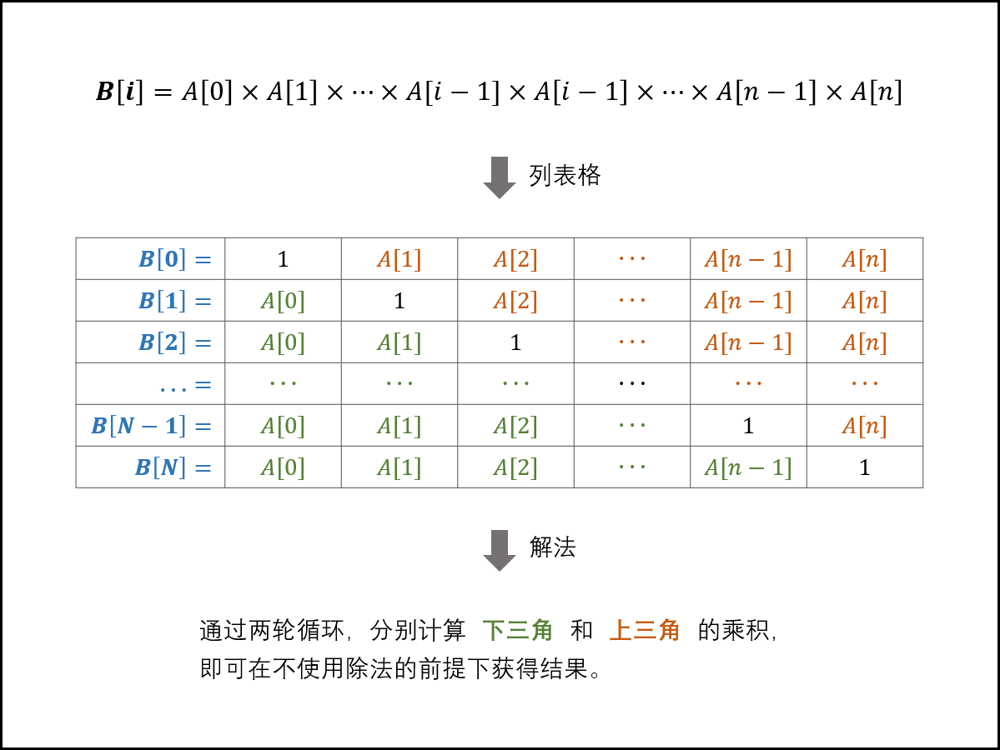
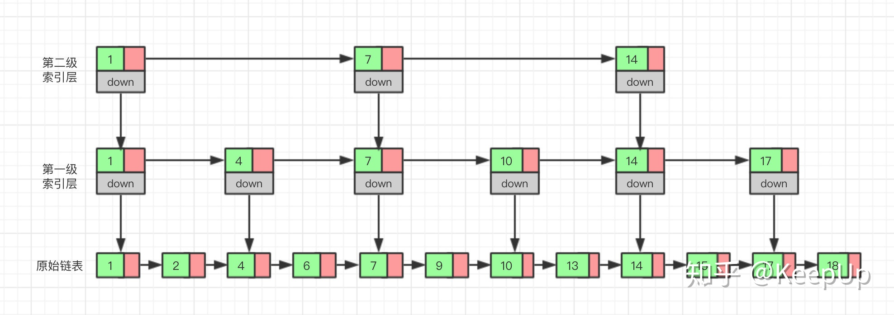

# 算法学习

## 2021年始

### 2.4 leetcode初始刷题

1. 两数之和

   ```
   输入：nums = [2,7,11,15], target = 9
   输出：[0,1]
   解释：因为 nums[0] + nums[1] == 9 ，返回 [0, 1] 
   ```

   一开始只会暴力解题：

   ```java
   class Solution {
       public int[] twoSum(int[] nums, int target) {
           for(int i=0;i<nums.length;i++){
               for(int j=i+1;j<nums.length;j++){
                   if(nums[i]+nums[j]==target){
                       int r[]=new int[2];
                       r[0]=i;
                       r[1]=j;
                       return r;
                   }
               }
           }
           return new int[2];
       }
   }
   //空间复杂度很高
   ```

   之后查看了他人的hashmap实现方式，自己重新写了一份

   ```java
   class Solution {
       public int[] twoSum(int[] nums, int target) {
           Map<Integer,Integer> m=new HashMap();
           int r[]=new int[2];
           for(int i=0;i<nums.length;i++){
               if(m.containsKey(target-nums[i])){
                   r[1]=i;
                   r[0]=m.get(target-nums[i]);//因为是放进去后面一半再执行的，所以顺序要调换
                   break;
               }
               m.put(nums[i],i);
           }
           return r;
       }
   }
   ```

### 2.28 刷题

1. 两个数之和，链表操作，链接https://leetcode-cn.com/problems/add-two-numbers/

   ```java
   /**
    * Definition for singly-linked list.
    * public class ListNode {
    *     int val;
    *     ListNode next;
    *     ListNode() {}
    *     ListNode(int val) { this.val = val; }
    *     ListNode(int val, ListNode next) { this.val = val; this.next = next; }
    * }
    */
   class Solution {
       public ListNode addTwoNumbers(ListNode l1, ListNode l2) {
           int temp=0;
           ListNode r=new ListNode(0);
           ListNode p=r;
           while(l1!=null||l2!=null||temp!=0){//这里三个部分都为0说明都加完了
               int lv1=l1!=null?l1.val:0;
               int lv2=l2!=null?l2.val:0;
               int sum=lv1+lv2+temp;
               temp=sum/10;
               p.next=new ListNode(sum%10);
               p=p.next;
               if(l1!=null) l1=l1.next;
               if(l2!=null) l2=l2.next;
           }
           return r.next;//首可以是0，返回next就行
       }
   }
   ```

2. 无重复字符的最长子串长度：https://leetcode-cn.com/problems/longest-substring-without-repeating-characters/

   ```java
   class Solution {
       public int lengthOfLongestSubstring(String s) {
           int r=0;
           int last[]=new int[128];
           for(int i=0;i<128;i++){//元素的修改必须用for循环，只是遍历可以用foreach循环
               last[i]=-1;
           }
           int start=0;
           for(int i=0;i<s.length();i++){
               int index=s.charAt(i);
               start=Math.max(start,last[index]+1);//上一次的位置加1，因为上一次的位置不能作为头进行遍历
               r=Math.max(r,i-start+1);//获得的上一次本字符的位置作为头
               last[index]=i;
           }
           return r;
       }
   }
   ```

   参考了别人的代码思想，用数组存起来每个可能的字符的上一次出现的位置，下一次再碰到这个字符就根据它来进行遍历。

   

3. 找到两个有序数组的中位数：https://leetcode-cn.com/problems/median-of-two-sorted-arrays/

   首先将中位数的奇数与偶数合并 

   **没有看懂第k小的方法，再看**
   
   ```java
   int left = (n + m + 1) / 2;
int right = (n + m + 2) / 2;
   ```

   这样就保证了奇数与偶数情况下都是一样的左加右除以二的结果。

   自己的暴力解法而且写得极为丑陋：就是合并两个数组，然后在获得实际的结果的时候
   
   ```java
   class Solution {
       public double findMedianSortedArrays(int[] nums1, int[] nums2) {
           int n=nums1.length,m=nums2.length;
           int left = (n + m + 1) / 2;
           int right = (n + m + 2) / 2;
           if(nums1.length==0){
               if(m==1)    return (double)nums2[0];
               return (double)(nums2[left-1]+nums2[right-1])/2;
           }
           if(nums2.length==0){
               if(n==1)    return (double)nums1[0];
               return (double)(nums1[left-1]+nums1[right-1])/2;
           }
           int[] r=new int[nums1.length+nums2.length];
           int allLen=nums1.length+nums2.length;
           int flag=1;
           int z=0,head=0,tail=0;
           if(allLen%2==1){
               z=allLen/2;
           }
           else{
               head=allLen/2-1;tail=allLen/2;
               flag=0;
           }
           int i=0,j=0,ri=0;
           while(i<nums1.length||j<nums2.length){
               if(nums1[i]<nums2[j]){
                   r[ri]=nums1[i];
                   if(i+1!= nums1.length){
                       i++;
                   }
                   else{
                       nums1[i]=1000001;
                   }
               }
               else
               {
                   r[ri]=nums2[j];
                   if(j+1!= nums2.length){
                       j++;
                   }
                   else
                   {
                       nums2[j]=1000001;
                   }
               }
               if(flag==0&&ri>=tail){
                   double ret=(r[head]+r[tail])/2.0;
                   return ret;
               }
               else if(flag==1&&ri>=z){
                   return (double)r[z];
               }
               ri++;
           }
           return 0;
       }
}
   ```

### 3.1 剑指offer刷题

1. 找出数组中任意一个重复的元素：

   https://leetcode-cn.com/problems/shu-zu-zhong-zhong-fu-de-shu-zi-lcof/

   应该问面试官处理的需求，是要时间还是空间，我用了set的方法，但是时间太长，

   ```java
   class Solution {
       public int findRepeatNumber(int[] nums) {
           Set<Integer> s=new HashSet<>();
           for(int i=0;i<nums.length;i++){
               if(s.contains(nums[i])){
                   return nums[i];
               }
               s.add(nums[i]);
           }
           return nums[0];
       }
   }
   ```

   别人的快速代码，不需要set拖慢速度

   时间2ms，但是空间用的较大了

   ```java
   class Solution {
       public int findRepeatNumber(int[] nums) {
           int arr[]=new int[nums.length];
           for(int i=0;i<nums.length;i++){
               arr[nums[i]]++;
               if(arr[nums[i]]>1) return nums[i];
           }
           return nums[0];
       }
   }
   ```

   继续借鉴别人的代码，原地置换，因为数组是0-n的，那么按理来说应该数字i就在i的位置，如果不是我们就进行置换，然后下次再碰到i正好在i位置说明本数字就重复了，返回

   ```java
   class Solution {
       public int findRepeatNumber(int[] nums) {
           int temp;
           for(int i=0;i<nums.length;i++){
               while(nums[i]!=i){
                   if(nums[i]==nums[nums[i]]){
                       return nums[i];
                   }
                   temp=nums[i];
                   nums[i]=nums[temp];
                   nums[temp]=temp;
               }
           }
           return -1;
       }
   }
   ```

   这个时间0ms，不知道为什么短得多，空间反而较大，可能是leetcode的测试案例不一样。

2. 替换字符串里面的空格变为%20，如果不用库函数就用SrtingBuilder，StringBuffer什么的要再看

   https://leetcode-cn.com/problems/ti-huan-kong-ge-lcof/submissions/

   ```
   class Solution {
       public String replaceSpace(String s) {
           return s.replace(" ","%20");
       }
   }
   ```

3. 根据中序和前序遍历重建树

   https://leetcode-cn.com/problems/zhong-jian-er-cha-shu-lcof/comments/

   ```java
   /**
    * Definition for a binary tree node.
    * public class TreeNode {
    *     int val;
    *     TreeNode left;
    *     TreeNode right;
    *     TreeNode(int x) { val = x; }
    * }
    */
   class Solution {
       public TreeNode buildTree(int[] preorder, int[] inorder) {
           if(preorder.length==0)  return null;
           int rootVal=preorder[0],rootIndex=0;
           for(int i=0;i<inorder.length;i++){
               if(rootVal==inorder[i]){
                   rootIndex=i;
                   break;
               }
           }
           TreeNode root=new TreeNode(rootVal);
           root.left=buildTree(Arrays.copyOfRange(preorder,1,1+rootIndex),Arrays.copyOfRange(inorder,0,rootIndex));
           int n=preorder.length;
           root.right=buildTree(Arrays.copyOfRange(preorder,1+rootIndex,n),Arrays.copyOfRange(inorder,rootIndex+1,n));//copyOfRange的范围是左闭右开的区间
           return root;
       }
   }
   ```

   - 前序遍历列表：第一个元素永远是 【根节点 (root)】
   - 中序遍历列表：根节点 (root)【左边】的所有元素都在根节点的【左分支】，【右边】的所有元素都在根节点的【右分支】

   算法思路：

   1. 通过【前序遍历列表】确定【根节点 (root)】
   2. 将【中序遍历列表】的节点分割成【左分支节点】和【右分支节点】
   3. 递归寻找【左分支节点】中的【根节点 (left child)】和 【右分支节点】中的【根节点 (right child)】


### 3.2 剑指offer

1. 二维数组的查找，二维数组每一个元素都比右边和下面小，找一个快速的查找方法，如从右上角开始查找，目标比当前元素大就左移，比它小就向下，等于就返回，最后找完没有return就代表没有找到，注意都要判断边界条件如为空的时候要返回false。

   https://leetcode-cn.com/problems/er-wei-shu-zu-zhong-de-cha-zhao-lcof/submissions/

   ```java
   class Solution {
       public boolean findNumberIn2DArray(int[][] matrix, int target) {
           if(matrix==null||matrix.length==0)   return false;
           int col=matrix[0].length-1,row=0;
           while(col>=0&&row<matrix.length){
               if(matrix[row][col]==target)    return true;
               else if(matrix[row][col]>target){
                   col--;
               }
               else if(matrix[row][col]<target){
                   row++;
               }
           }
           return false;
       }
   }
   ```

2. 用两个堆栈实现一个队列https://leetcode-cn.com/problems/yong-liang-ge-zhan-shi-xian-dui-lie-lcof/submissions/

   就是用两个栈模拟队列的运作，其中Java的堆栈Stack较慢，建议用LinkedList，因为其速度较快，用add替代其push操作，pop操作本身也有

   ```java
   class CQueue {
   
       LinkedList<Integer> s1,s2;
       public CQueue() {
           s1=new LinkedList<>();
           s2=new LinkedList<>();
       }
       
       public void appendTail(int value) {
           s1.add(value);
       }
       
       public int deleteHead() {
           if(s2.isEmpty()){
            if(s1.isEmpty()){
               return -1;
           }
           while(!s1.isEmpty()){
               int temp=s1.pop();
               s2.add(temp);
           }   
           return s2.pop();
           }else return s2.pop();
           
       }
   }
   
   /**
    * Your CQueue object will be instantiated and called as such:
    * CQueue obj = new CQueue();
    * obj.appendTail(value);
    * int param_2 = obj.deleteHead();
    */
   ```

3. 求第n个斐波那契数https://leetcode-cn.com/problems/fei-bo-na-qi-shu-lie-lcof/submissions/

   ```java
   class Solution {
       public int fib(int n) {
           int f1=0,f2=1;
           if(n==0)return 0;
           if(n==1)return 1;
           int temp=0;
           for(int i=2;i<=n;i++){
               temp=f2+f1;
               f1=f2;
               f2=temp%1000000007;//每次都要取余数
           }
           return f2;
       }
   }
   ```

4. 青蛙跳台阶，其实就是斐波那契数列问题，因为从上面一个台阶或者两个台阶跳过来

   如果第一次跳的是1级台阶，那么剩下n-1级台阶，跳法是f(n-1)
   如果第一次跳的是2级台阶，那么剩下n-2级台阶，跳法是f(n-2)
   可以得出总跳法为: f(n) = f(n-1) + f(n-2)
   由题意可得：没有台阶的时候f(0) = 1，只有一级台阶的时候 f(1) = 1
   可以发现最终得出的是一个斐波那契数列：

   https://leetcode-cn.com/problems/qing-wa-tiao-tai-jie-wen-ti-lcof/solution/

   所以

   ```java
   class Solution {
       public int numWays(int n) {
           if(n<=1)    return 1;
           if(n==2)    return 2;
           int f1=1,f2=2,temp=0;
           for(int i=2;i<n;i++){
               temp=f1+f2;
               f1=f2;
               f2=temp%1000000007;
           }
           return f2;
       }
   }
   ```

5. 找到旋转数组的最小值，就是给一个升序的数组，其顺序有过一定的改变，然后找到其最小值，

   https://leetcode-cn.com/problems/xuan-zhuan-shu-zu-de-zui-xiao-shu-zi-lcof/

   ```java
   class Solution {
       public int minArray(int[] numbers) {
           int left=0,right=numbers.length-1,mid=0;
           while(left<right){
               mid=(left+right)/2;
               if(numbers[mid]>numbers[right]) left=mid+1;
               else if(numbers[mid]<numbers[right])    right=mid;
               else if(numbers[mid]==numbers[right])   right--;//缩短右边界距离
           }
           return numbers[left];
       }
   }
   ```

   就用二分的思想，中间的值大于右边的，说明还在左边递增的数组里面，如果小于说明在右边递增的数组里，如果等于则需要减少右边界距离直到其不再是等于。

6. 矩阵中的路径，就是一个宽度或者深度搜索，我用的是回溯+dfs的方法，找到一条路径

   https://leetcode-cn.com/problems/ju-zhen-zhong-de-lu-jing-lcof/

   ```java
   class Solution {
       int findLength=0;
       public boolean exist(char[][] board, String word) {
           char a=word.charAt(0);
           for(int i=0;i<board.length;i++){
               for(int j=0;j<board[0].length;j++){
                   if(board[i][j]==a){
                       findLength=0;
                       board[i][j]='-';
                       findLength++;
                       boolean r=dfs(board,word,i,j);
                       board[i][j]=a;
                       if(r)   return true;
                   }
               }
           }
           return false;
       }
       public boolean dfs(char[][] board,String word,int m,int n){
           if(findLength==word.length()) return true;
           if(m-1>=0&&board[m-1][n]==word.charAt(findLength)){
               board[m-1][n]='-';
               findLength++;
               boolean r=dfs(board,word,m-1,n);
               board[m-1][n]=word.charAt(--findLength);
               if(r)   return true;
           }
           if(m+1<board.length&&board[m+1][n]==word.charAt(findLength)){
               board[m+1][n]='-';
               findLength++;
               boolean r=dfs(board,word,m+1,n);
               board[m+1][n]=word.charAt(--findLength);
               if(r)   return true;
           }
           if(n-1>=0&&board[m][n-1]==word.charAt(findLength)){
               board[m][n-1]='-';
               findLength++;
               boolean r=dfs(board,word,m,n-1);
               board[m][n-1]=word.charAt(--findLength);
               if(r)   return true;
           }
           if(n+1<board[0].length&&board[m][n+1]==word.charAt(findLength)){
               board[m][n+1]='-';
               findLength++;
               boolean r=dfs(board,word,m,n+1);
               board[m][n+1]=word.charAt(--findLength);
               if(r)   return true;
           }
           return false;
       }
   }
   ```

   回溯其实就是递归里面，找准条件，在用完之后恢复原样就行。

7. 机器人的运动范围https://leetcode-cn.com/problems/ji-qi-ren-de-yun-dong-fan-wei-lcof/

   地上有一个m行n列的方格，从坐标 [0,0] 到坐标 [m-1,n-1] 。一个机器人从坐标 [0, 0] 的格子开始移动，它每次可以向左、右、上、下移动一格（不能移动到方格外），也不能进入行坐标和列坐标的数位之和大于k的格子。例如，当k为18时，机器人能够进入方格 [35, 37] ，因为3+5+3+7=18。但它不能进入方格 [35, 38]，因为3+5+3+8=19。请问该机器人能够到达多少个格子？

   ```java
   class Solution {
       public int movingCount(int m, int n, int k) {
           boolean vi[][]=new boolean[m][n];
           return dfs(0,0,vi,k,m,n);
       }
       public int dfs(int row,int col,boolean vi[][],int k,int m,int n){
           if(row<0||col<0||row>=m||col>=n||vi[row][col]||(row/10+row%10+col/10+col%10)>k){
               return 0;
           }
           vi[row][col]=true;
           return dfs(row+1,col,vi,k,m,n)+dfs(row,col+1,vi,k,m,n)+1;
       }
   }
   ```

   其实就是一个dfs，一个一个找就行，我以为有什么快速解法的

8. 剪绳子：https://leetcode-cn.com/problems/jian-sheng-zi-lcof/

   只会一个简单的回溯，这样虽然测试暂时没问题，但是超出了时间限制

   ```java
   class Solution {
       int duan[];
       int index=0;
       int maxMul=0;
       public int cuttingRope(int n) {
           duan=new int[n];
           dfs(n,0);
           return maxMul;
       }
       public void dfs(int n,int time){
           if(n==0){
               int mul=1;
               for(int i=0;i<duan.length&&duan[i]!=0;i++){
                   mul*=duan[i];
               }
               maxMul=Math.max(mul,maxMul);
               return ;
           }
           if(time==0)//保证一个绳子至少分成两部分
           {
               time++;
               for(int i=1;i<n;i++){
               duan[index]=i;
               index++;
               dfs(n-i,time);
               index--;
               duan[index]=0;
           }
           }
           else{
               for(int i=1;i<=n;i++){
               duan[index]=i;
               index++;
               dfs(n-i,time);
               index--;
               duan[index]=0;
           }
           }
           return ;
       }
   }
   ```

   学到了以下解法：

   ```java
   class Solution {
       
       public int cuttingRope(int n) {
          if(n==1||n==2){
              return 1;
          }
          else if(n==3) return 2;
          else if(n>=3){
              int mul=1;
              while(n>4){//等于4的时候分为2 2更好，如果是>=3会被分为1 3这样小一些了
                  mul*=3;
                  n-=3;
              }
              return mul*n;
          }
          return 1;
       }
   }
   ```

   原理就是3作为底数乘积是最好的，而且个数越多其乘积越大，数论的知识

   ```java
   class Solution {
       
       public int cuttingRope(int n) {
          int dp[]=new int[n+1];
          dp[2]=1;//n=0和n=1忽略
          for(int i=3;i<n+1;i++){
              for(int j=1;j<i;j++){
                   //j即是将n从第j处分割
                   //Math.max(j*(i-j),j*dp[i-j]) 中 j*(i-j)指的是分割一次后的乘积；j*dp[i-j]指
                   //分割一次后，剩余部分继续分割后的最大乘积,前面已经求解过，所以只需要取结果
                   //下面综合起来就是，但j取不同时，与前一次j取值后的dp[i]比较，取最大值，直到j遍历完
                  dp[i]=Math.max(dp[i],Math.max(j*(i-j),j*dp[i-j]));
              }
          }
          return dp[n];
       }
   }
   ```

   动态规划的思想，一次次将n提高，每次都试一下j的大小，因为切一次之后剩下的大小在前面已经算好了

9. 剪绳子2，https://leetcode-cn.com/problems/jian-sheng-zi-ii-lcof/，不能再用DP，因为取余之后再max会出错，所以只能用第一种方法，即乘3的方法。也可以用Java的BigInteger运算，但是比较麻烦。

   ```java
   class Solution {
       
       public int cuttingRope(int n) {
          if(n==1||n==2){
              return 1;
          }
          else if(n==3) return 2;
          else if(n>=3){
              long mul=1;//用int会出错
              while(n>4){//等于4的时候分为2 2更好，如果是>=3会被分为1 3这样小一些了
                  mul*=3;
                  mul%=1000000007;//有取余记得每一个都取余
                  n-=3;
              }
              return (int)(mul*n%1000000007);//最后转为int
          }
          return 1;
       }
   }
   ```

10. 32位整数中1的个数，无符号右移>>>,有符号右移>>

    https://leetcode-cn.com/problems/er-jin-zhi-zhong-1de-ge-shu-lcof/

    更快的解法：

    ```java
    public class Solution {
        public int hammingWeight(int n) {
            int res = 0;
            while(n != 0) {
                res++;
                n &= n - 1;//这个的作用是去除最右边的一个1
            }
            return res;
        }
    }
    ```

    我的解法：

    ```java
    public class Solution {
        // you need to treat n as an unsigned value
        public int hammingWeight(int n) {
            int and=1;
            int count=0;
            for(int i=0;i<32;i++){
                int a=and&n;
                if(a!=0)count++;
                and<<=1;
            }
            return count;
        }
    }
    ```

    当然要遍历32次

### 3.3 剑指offer刷题

1. 数值的整数次方：

   https://leetcode-cn.com/problems/shu-zhi-de-zheng-shu-ci-fang-lcof/

   快速幂求法：

   ```java
   class Solution {
       public double myPow(double x, int n) {
           if(n==1)return x;
           if(n==-1) return 1.0/x;
           if(n==0) return 1;
           double half=myPow(x,n/2);
           double mod=myPow(x,n%2);
           return half*half*mod;
       }
   }
   ```

   也可以用迭代的思路

   ```java
   class Solution {
       public double myPow(double x, int n) {
           if(x==0)return 0;
           if(n==1)return x;
           if(n==0)return 1;
           if(n==-1)return 1/x;
   
           long t=n;
           double tx=x;
           if(t<0){
               tx=1/tx;
               t=-t;//必须是long，否则会越界
           }
           double f=1;
           while(t!=0){
               if((t&1)==1)f*=tx;
               tx*=tx;
               t>>=1;
           }
           return f;
       }
   }
   ```

   Java中int 32位，所以在边界的时候进行负数转换出错，因此这里必须用long做数字转换

2. 打印从1到n位的所有整数

   以为很复杂，但实际上没有什么，本题就是没有考虑较难的情况，即当n过大时，位数大，需要算很多，但是这里返回是int，所有不需要担心大数据越界。

   ```java
   class Solution {
       public int[] printNumbers(int n) {
           int p=(int)Math.pow(10,n)-1;
           int r[]=new int[p];
           int co=1;
           for(int i=0;i<p;i++){
               r[i]=co++;
           }
           return r;
       }
   }
   ```

3. 删除链表中的某个指针

   https://leetcode-cn.com/problems/shan-chu-lian-biao-de-jie-dian-lcof/

   注意边界值！

   ```java
   class Solution {
       public ListNode deleteNode(ListNode head, int val) {
           ListNode p=head,pNext=p.next;
           if(head.val==val){
               if(head.next!=null)return head.next;
               else return null;
           }
           while(pNext!=null){
               if(pNext.val==val){
                   p.next=pNext.next;
                   return head;
               }
               p=pNext;
               pNext=pNext.next;
           }
           return head;
       }
   }
   ```


### 3.4 剑指offer

1. 调整数组顺序使得左边是奇数，右边是偶数

   https://leetcode-cn.com/problems/diao-zheng-shu-zu-shun-xu-shi-qi-shu-wei-yu-ou-shu-qian-mian-lcof/

   ```java
   class Solution {
       public int[] exchange(int[] nums) {
           int left=0,right=nums.length-1;
           int temp;
           while(left<right){
               while(left<right&&(nums[left]&1)!=0){//里面也必须有大小判断，否则在循环的时候会出现左边越过右边的情形
                   left++;
               }
               while(left<right&&(nums[right]&1)==0){
                   right--;
               }
               temp=nums[left];
               nums[left]=nums[right];
               nums[right]=temp;
           }
           return nums;
       }
   }
   ```

   快排的思想，每次就找到不符合的，然后二者交换位置。

   快排完整代码：

   ```java
   
   //快速排序
   void quick_sort(int s[], int l, int r)
   {
       if (l < r)
       {
           //Swap(s[l], s[(l + r) / 2]); //将中间的这个数和第一个数交换 参见注1
           int i = l, j = r, x = s[l];
           while (i < j)
           {
               while(i < j && s[j] >= x) // 从右向左找第一个小于x的数
                   j--;  
               if(i < j) 
                   s[i++] = s[j];
               
               while(i < j && s[i] < x) // 从左向右找第一个大于等于x的数
                   i++;  
               if(i < j) 
                   s[j--] = s[i];
           }
           s[i] = x;
           quick_sort(s, l, i - 1); // 递归调用 
           quick_sort(s, i + 1, r);
       }
   }//时间复杂度nlogn，空间复杂度为logn
   ```


### 3.5 剑指offer

1. 返回链表倒数第k个node：https://leetcode-cn.com/problems/lian-biao-zhong-dao-shu-di-kge-jie-dian-lcof/

   自己的简单方法，遍历一遍，再来第二次遍历：

   ```java
   /**
    * Definition for singly-linked list.
    * public class ListNode {
    *     int val;
    *     ListNode next;
    *     ListNode(int x) { val = x; }
    * }
    */
   class Solution {
       public ListNode getKthFromEnd(ListNode head, int k) {
           ListNode p=head;
           int cnt=0;
           if(head.next==null&&k==1){
               return new ListNode(head.val);
           }
           while(p!=null){
               cnt++;
               p=p.next;
           }
           p=head;
           int kCnt=0;
           while(p!=null){
               
               if(kCnt==cnt-k){
                   return p;
               }
               kCnt++;
               p=p.next;
           }
           return null;
       }
   }
   ```

   双指针方法，快指针，先走k步，它结束的时候慢的就达到了目标位置

   ```java
   class Solution {
       public ListNode getKthFromEnd(ListNode head, int k) {
           ListNode fast=head;
           while(fast!=null){
               fast=fast.next;
               if(k==0)    head=head.next;
               else    k--;
           }
           return head;
       }
   }
   ```

2. 链表逆置：https://leetcode-cn.com/problems/fan-zhuan-lian-biao-lcof/

   ```java
   class Solution {
       public ListNode reverseList(ListNode head) {
           ListNode pre=null,cur=head,next=null;
           while(cur!=null){
               next=cur.next;
               cur.next=pre;
               pre=cur;
               cur=next;
           }
           return pre;
       }
   }
   ```

   三个指针，分别进行迭代就可以了，看一下思路。

### 3.6 剑指offer

1. 合并两个有序链表：https://leetcode-cn.com/problems/he-bing-liang-ge-pai-xu-de-lian-biao-lcof/

   ```java
   class Solution {
       public ListNode mergeTwoLists(ListNode l1, ListNode l2) {
           ListNode r=new ListNode(0);
           ListNode p=r;
           r.next=null;
           while(l1!=null||l2!=null){
               if(l1!=null&&l2!=null){
                   if(l1.val<l2.val){
                       p.next=new ListNode(l1.val);
                       p=p.next;
                       l1=l1.next;
                   }
                   else{
                       p.next=new ListNode(l2.val);
                       p=p.next;
                       l2=l2.next;
                   }
               }
               else if(l1==null){
                       p.next=new ListNode(l2.val);
                       p=p.next;
                       l2=l2.next;
               }
               else if(l2==null){
                       p.next=new ListNode(l1.val);
                       p=p.next;
                       l1=l1.next;
               }
           }
           return r.next;
       }
   }
   ```

   这种题主要就是要考虑清楚那些边界值

2. 一棵树是否是另一棵树的子结构https://leetcode-cn.com/problems/shu-de-zi-jie-gou-lcof/

   我的错误方法：

   ```java
   class Solution {
       public boolean isSubStructure(TreeNode A, TreeNode B) {
           boolean r=dfs(A,B);
           if(B==null&&A!=null)    return false;
           return r;
       }
   
       public boolean dfs(TreeNode A,TreeNode B){
           if(B==null){
               return true;
           }
           if(A==null){
               return false;
           }
           if(A.val==B.val){
               return dfs(A.left,B.left)&&dfs(A.right,B.right);
           }
           else{
               return dfs(A.left,B)||dfs(A.right,B);//不应该用dfs判断A的左右是否和B相同，而是应该用上一个函数进行判断，因为有可能一边上面有一个数相等，下面有一个数相等，这样就容易出错，下面的才是子结构，应该分开
           }
   
       }
   }
   ```

   正确的做法以及可能出错的地方：

   ```java
   class Solution {
       public boolean isSubStructure(TreeNode A, TreeNode B) {
           if(A==null||B==null)return false;
           return 			        				dfs(A,B)||isSubStructure(A.left,B)||isSubStructure(A.right,B);
           //意思是看A和B是否完全相同和A的子树是否和B相同
       }
       public boolean dfs(TreeNode A,TreeNode B){
           if(B==null)return true;//这俩的顺序错了也会有问题
           if(A==null)return false;
           
           return A.val==B.val&&dfs(A.left,B.left)&&dfs(A.right,B.right);
       }
   }
   ```

3. 二叉树的镜像：

   ```java
   class Solution {
       public TreeNode mirrorTree(TreeNode root) {
           if(root==null) return null;
           TreeNode temp=root.left;
           root.left=mirrorTree(root.right);
           root.right=mirrorTree(temp);
           return root;
       }
   }
   ```

   对于递归的条件，出口以及是否需要返回值，都应该要牢记于心，自己要清楚，要会做，否则手撕的时候就废了。

4. 对称的二叉树：https://leetcode-cn.com/problems/dui-cheng-de-er-cha-shu-lcof/

   ```java
   class Solution {
       public boolean isSymmetric(TreeNode root) {
           if(root==null)return true;
           return isS(root.left,root.right);
       }
       public boolean isS(TreeNode left,TreeNode right){
           
           if(left==null&&right!=null)return false;
           if(left!=null&&right==null) return false;
           if(left==null&&right==null) return true;
           if(left.val!=right.val) return false;
           return isS(left.left,right.right)&&isS(left.right,right.left);
       }
   }
   ```

   重点是一开始有个判断，root是null就返回true；

5. 顺时针打印数组：

   重点是要知道什么时候哪一个数要加或者减，最好带入一次，就知道每个数该怎么增或者减了。

   ```java
   class Solution {
       public int[] spiralOrder(int[][] matrix) {
            if (matrix == null || matrix.length == 0 || matrix[0].length == 0) {
               return new int[0];
           }//为null的时候直接返回int [0]
           int row=matrix.length,col=matrix[0].length;
           
           int all=row*col;
           int r[]=new int[all];
           int j=0,k=0;
           int left=0,right=col-1,top=1,bottom=row-1;
           for(int i=0;i<all;){
               for(;k<=right;k++){//向右走
                   r[i++]=matrix[j][k];
               }
               k--;
               j++;//要进行行和列的恢复
               if(i>=all)break;
               right--;
               for(;j<=bottom;j++){//向下走
                   r[i++]=matrix[j][k];
               }
               j--;
               k--;
               if(i>=all)break;
               bottom--;
               for(;k>=left;k--){//向左走
                   r[i++]=matrix[j][k];
               }
               j--;
               k++;
               if(i>=all)break;
               left++;
               for(;j>=top;j--){//向上走
                   r[i++]=matrix[j][k];
               }
               j++;
               k++;
               if(i>=all)break;
               top++;
           }
           return r;
   
       }
   }
   ```

6. 包含min函数的栈：https://leetcode-cn.com/problems/bao-han-minhan-shu-de-zhan-lcof/

   ```java
   class MinStack {
   
       Stack<Integer> s=new Stack<>();
       Stack<Integer> ms=new Stack<>();//stack速度奇慢
       /** initialize your data structure here. */
       public MinStack() {
           
       }
       
       public void push(int x) {
           s.push(x);
           if(ms.isEmpty()||ms.peek()>=x){
               ms.push(x);
           }
       }
       
       public void pop() {
           int temp=s.pop();
           if(temp==ms.peek()){//重点是min的处理
               ms.pop();
           }
       }
       
       public int top() {
           return s.peek();
       }
       
       public int min() {
           return ms.peek();
       }
   }
   
   /**
    * Your MinStack object will be instantiated and called as such:
    * MinStack obj = new MinStack();
    * obj.push(x);
    * obj.pop();
    * int param_3 = obj.top();
    * int param_4 = obj.min();
    */
   ```

7. 栈的压入弹出队列：https://leetcode-cn.com/problems/zhan-de-ya-ru-dan-chu-xu-lie-lcof/

   ```java
   class Solution {
       public boolean validateStackSequences(int[] pushed, int[] popped) {
           int stack[]=new int[pushed.length];
           int j=0;
           int si=0;
           for(int e:pushed){
               stack[si]=e;
               while(si>=0&&j<popped.length&&stack[si]==popped[j]){
                   si--;
                   j++;
               }
               si++;
           }
           return j==popped.length;
       }
   }
   ```

   用一个数组模拟栈，直接push，如果栈顶不等于poped，否则就pop掉继续操作

8. 层序遍历：https://leetcode-cn.com/problems/cong-shang-dao-xia-da-yin-er-cha-shu-lcof/

   其实主要就是不熟悉java的queue和LinkedList

   转换成数组就简单点循环写吧，别要求太多。

   ```java
   class Solution {
       int rear=0,front=0;
       Queue<TreeNode> q=new LinkedList<>();
       List<Integer> l=new ArrayList<Integer>();
       public int[] levelOrder(TreeNode root) {
           if(root==null)  return new int[0];
           q.offer(root);
           while(!q.isEmpty()){
               TreeNode temp=q.poll();
               l.add(temp.val);
               if(temp.left!=null) q.offer(temp.left);
               if(temp.right!=null) q.offer(temp.right);
           }
           int size=l.size();
           int r[]=new int[size];
           int i=0;
           for(int e:l){
               r[i++]=e;
           }
           return r;
       }
   
   }
   ```

9. 层序遍历，每一层输出到一行，加一个k数字，说明是第几层。

   https://leetcode-cn.com/problems/cong-shang-dao-xia-da-yin-er-cha-shu-ii-lcof/

   ```java
   class Solution {
       List<List<Integer>> ll=new ArrayList<>();
       public List<List<Integer>> levelOrder(TreeNode root) {
           ceng(root,0);
           return ll;
       }
       public void ceng(TreeNode root,int k){
           if(root!=null){
               if(ll.size()<=k) ll.add(new ArrayList());
               ll.get(k).add(root.val);
               if(root.left!=null) ceng(root.left,k+1);
               if(root.right!=null) ceng(root.right,k+1);
           }
       }
   }
   ```

10. 层序遍历，Z字遍历

    https://leetcode-cn.com/problems/cong-shang-dao-xia-da-yin-er-cha-shu-iii-lcof/

    在上一题的结果后面加一个reverse就可以了，也就是某一行加一下就行。

    ```java
    class Solution {
        List<List<Integer>> ll=new ArrayList<>();
        public List<List<Integer>> levelOrder(TreeNode root) {
            ceng(root,0);
            for(int i=1;i<ll.size();i+=2){
                Collections.reverse(ll.get(i));
            }
            return ll;
        }
        public void ceng(TreeNode root, int k){
            if(root!=null){
                if(ll.size()<=k)    ll.add(new ArrayList());
                ll.get(k).add(root.val);
                if(root.left!=null)  ceng(root.left,k+1);
                if(root.right!=null) ceng(root.right,k+1); 
            }               
            else
                return;
        }
    }
    ```


### 3.7 剑指offer刷题

1. 判断一个数组是否是二叉搜索树的后序遍历结果：https://leetcode-cn.com/problems/er-cha-sou-suo-shu-de-hou-xu-bian-li-xu-lie-lcof/

   需要知道二叉搜索树后序遍历的特征，最后一个数是根节点，前面比根节点大的是右子树，小的是左子树，然后递归下去

   ```java
   class Solution {
       public boolean verifyPostorder(int[] postorder) {
           return dfs(postorder,0,postorder.length-1);
       }
       public boolean dfs(int postorder[],int i,int j){
           if(i>=j) return true;//此时说明已经判断完毕，所有都符合
           int p=i;
           int root=postorder[j];
           while(postorder[p]<root)    p++;//左边元素都比根节点小
           int mid=p;//作为中间分界线
           while(postorder[p]>root)    p++;//右边元素都比根节点大
           return p==j&&dfs(postorder,i,mid-1)&&dfs(postorder,mid,j-1);//false只会在这里产生
       }
   }
   ```

2. 找到从根节点到叶节点的等于给定数字的路径：

   https://leetcode-cn.com/problems/er-cha-shu-zhong-he-wei-mou-yi-zhi-de-lu-jing-lcof/

   ```java
   class Solution {
       List<List<Integer>> ll=new ArrayList<>();
       public List<List<Integer>> pathSum(TreeNode root, int sum) {
           List<Integer> l=new ArrayList<>();
           dfs(root,l,sum);
           return ll;
       }
       public void dfs(TreeNode root,List<Integer> l,int sum){
           if(root==null) return;
           l.add(root.val);
           sum-=root.val;
           if(sum==0&&root.left==null&&root.right==null){
               ll.add(new ArrayList<>(l));
               //return ;不能这里加return因为会导致后面的没有去掉元素
           }
           else{
                dfs(root.left,l,sum);
                dfs(root.right,l,sum);
           }
           //sum+=root.val;不用减去，因为本身的sum无用，返回上一层用的就是上一层的sumsum
           l.remove(l.size()-1);
           return ;
       }
   }
   ```


### 3.8 剑指offer刷题

1. 复杂链表的复制，要真的复制，而不是把以前的还回去，这里面比较复杂的就是next指针和random指针的指向问题，不知道应该指向什么地方，在没有建好链表之前都是不知道的https://leetcode-cn.com/problems/fu-za-lian-biao-de-fu-zhi-lcof/

   一开始用暴力的方法，只会先创建好一个链表，再根据信息去连random，但是总是传出空指针，没有找到什么原因。

   ```java
   class Solution {
       public Node copyRandomList(Node head) {
           Map<Node,Node> m=new HashMap<>();
           Node p=head;
           while(p!=null){
              m.put(p,new Node(p.val)); 
              p=p.next;
           }
           p=head;
           while(p!=null){
               m.get(p).next=m.get(p.next);
               m.get(p).random=m.get(p.random);
               p=p.next;
           }
           p=head;
           return m.get(p);
       }
   }
   ```

   学习了别人的HashMap的方法，挺简单好懂的。还有一种方法是变成1 1 2 2 3 3这种，连接的时候把新的节点放在老节点后面。

2. 在二叉搜索树上面修改成为双向链表：https://leetcode-cn.com/problems/er-cha-sou-suo-shu-yu-shuang-xiang-lian-biao-lcof/

   要知道怎么中序遍历，多加一个变量，存储上次访问的节点，还要保存根节点，最后处理根节点

   ```java
   class Solution {
       Node pre,head;
       public Node treeToDoublyList(Node root) {
           if(root==null) return null;
           dfs(root);
           pre.right=head;
           head.left=pre;
           return head;
       }
       public void dfs(Node cur){
           if(cur==null) return ;//说明访问到了空节点，返回
           dfs(cur.left);
           if(pre!=null) pre.right=cur;//不为空的时候连接pre的右边，dfs左边回来，则pre一定是最后访问的那个即右子树
           else head=cur;//为空说明是根节点，保存根节点
           cur.left=pre;
           pre=cur;//pre的递推
           dfs(cur.right);
       }
   }
   ```

3. 序列化二叉树，即将一个完全二叉树(加上null)序列化一个字符串，然后再恢复回去，我用的是层序遍历序列化再恢复的思路，主要就是字符串的处理，以及用的时间过长：

   ```java
   public class Codec {
   
       Queue<TreeNode> q=new LinkedList<>();
       // Encodes a tree to a single string.
       public String serialize(TreeNode root) {
           if(root==null) return new String();
           q.offer(root);
           String r="";
           while(!q.isEmpty()){
               TreeNode t=q.poll();
               if(t!=null) {
                   r+=t.val+",";
                   q.offer(t.left);
                   q.offer(t.right);
               }
               else r+="null,";
           }
           r=r.substring(0,r.length()-1);
           return r;
       }
   
       // Decodes your encoded data to tree.
       public TreeNode deserialize(String data) {
           if(data.length()==0)    return null;
           String []sp=data.split(",");
           TreeNode root=new TreeNode(Integer.parseInt(sp[0]));
           q.offer(root);
           int i=1;
           while(!q.isEmpty()){
               TreeNode t=q.poll();//根据层序遍历重建树，
               if(sp[i].charAt(0)!='n'){
                   t.left=new TreeNode(Integer.parseInt(sp[i]));
                   q.offer(t.left);
               }
               else{
                   t.left=null;
               }
               i++;//i++是有意义的，i的次序正好和push pop的对上
               if(sp[i].charAt(0)!='n'){
                   t.right=new TreeNode(Integer.parseInt(sp[i]));
                   q.offer(t.right);
               }
               else{
                   t.right=null;
               }
               i++;
           }
           return root;
       }
   }
   ```


### 3.9 剑指offer

1. 找出一个数组里面数量过半的数字：https://leetcode-cn.com/problems/shu-zu-zhong-chu-xian-ci-shu-chao-guo-yi-ban-de-shu-zi-lcof/

   我的hashMap实现，但是时间复杂度过高

   ```java
   class Solution {
       HashMap<Integer,Integer> m=new HashMap<>();
       public int majorityElement(int[] nums) {
           int len=nums.length;
           for(int i=0;i<len;i++){
               if(!m.containsKey(nums[i])){
                   m.put(nums[i],1);
               }
               else{
                   int s=nums[i];
                   m.put(nums[i],m.get(s)+1);//这里不能直接getget之后加1，需要重新放入，结合HashMap底层，遇到key相同会覆盖原来的值
                   if(m.get(s)>len/2){
                       return nums[i];
                   }
               }
           }
           return nums[0];//为1个的时候返回num[0]，
       }
   }
   ```

   摩尔投票法：

   ```java
   class Solution {
       public int majorityElement(int[] nums) {
           int x=0,votes=0;
           for(int e:nums){
               if(votes==0)    x=e;
               votes+=e==x?1:-1;
           }
           return x;
       }
   }
   ```

   票数是0的时候，就当前值为x，后面遇到的数如果不是x就票数-1，是x就票数加1，遍历完之后x就是众数。这样做的话，如果前面的数加起来票数为0，则后面的数里面，众数仍然是众数。

   本题限制一定存在超过一半的数，所以可以这么用，否则还需要找到众数之后进行检验

2. 最小的k个数https://leetcode-cn.com/problems/zui-xiao-de-kge-shu-lcof/

   ```java
   class Solution {
       public int[] getLeastNumbers(int[] arr, int k) {
           if(arr.length==0) return new int[0];
           Arrays.sort(arr);//排序解决，主要是看这个函数的使用方法
           return Arrays.copyOfRange(arr,0,k);
       }
   }
   ```

   优先队列，但是时间更长了

   ```java
   class Solution {
       public int[] getLeastNumbers(int[] arr, int k) {
           if(arr.length==0) return new int[0];
           if(k==0)return new int[0];
           PriorityQueue<Integer> pq=new PriorityQueue<>(new Comparator<Integer>(){
               public int compare(Integer n1,Integer n2){
                   return n2-n1;
               }
           });//java的优先队列用法，
           for(int i=0;i<k;i++){
               pq.offer(arr[i]);
           }
           for(int i=k;i<arr.length;i++){
               if(pq.peek()>arr[i]){
                   pq.poll();
                   pq.offer(arr[i]);
               }
           }
           int r[]=new int[k];
           for(int i=0;i<k;i++){
               r[i]=pq.poll();
           }
           return r;
       }
   }
   ```


### 3.10 剑指offer刷题

1. 连续数组的最大和，给一个数组，给出这里面连续的一个或多个数的和最大值https://leetcode-cn.com/problems/lian-xu-zi-shu-zu-de-zui-da-he-lcof/

   ```java
   class Solution {
       public int maxSubArray(int[] nums) {
           int dp[]=new int[nums.length];
           dp[0]=nums[0];
           int max=nums[0];
           for(int i=1;i<nums.length;i++){
               dp[i]=Math.max(nums[i]+dp[i-1],nums[i]);
               max=Math.max(dp[i],max);
           }
           return max;
       }
   }
   ```

   学习动态规划，每次就是根据dp[i-1]+nums[i]和nums[i]比较，每次要么从当前开始要么从之前开始，每个都存起来，

### 3.11 剑指offer

1. 数字序列中某一位的数字：https://leetcode-cn.com/problems/shu-zi-xu-lie-zhong-mou-yi-wei-de-shu-zi-lcof/

   给出一个数字，求出123456789101112.。。这样的字符串序列这个数字下标代表的数字是哪一个，返回一个int

   ```java
   class Solution {
       public int findNthDigit(int n) {
           //数字1*10 2*90 3*900 4*9000
           //每一个数字都可以这么求，每次减去这些数字，直到大于的时候
           //如2304 减到10+180=2114
           //此时是三位数了，所以数字就是100+(n-1)/3=2113/3+100=804
           //所以最后是804这个数字里面的某一位，(804-1)%3=2即返回4这一位，当做数组下标，
           //减1可以先减再mod也可以先求余再减都是为了成为下标
           if(n<10) return n;
           int digit=1;
           long start=1,count=9;
           while(n>count){
               n-=count;
               digit++;
               start*=10;
               count=digit*9*start;
           }
           long num=start+(n-1)/digit;
           return Long.toString(num).charAt((n-1)%digit)-'0';//减去0是为了返回int
       }
   }
   ```

2. 把数列排出最小的数https://leetcode-cn.com/problems/ba-shu-zu-pai-cheng-zui-xiao-de-shu-lcof/

   ```java
   class Solution {
       public String minNumber(int[] nums) {
           List<String> l=new ArrayList<>();
           for(int e:nums){
               l.add(String.valueOf(e));
           }
           //变成lambda表达式，字典序排序，直接
           Collections.sort(l,(o1,o2)->(o1+o2).compareTo(o2+o1));
           String r="";
           for(String e:l){
               r+=e;
           }
           return r;
       }
   }
   ```


### 3.12 剑指offer

1. 给一个数字，问可以转换为几种字符串：https://leetcode-cn.com/problems/ba-shu-zi-fan-yi-cheng-zi-fu-chuan-lcof/

   ```java
   class Solution {
       int count=0;
       public int translateNum(int num) {
           String s=String.valueOf(num);
           dfs(s,0);
           return count;
       }
       public void dfs(String s,int index){
           if(index==s.length()){
               count++;
               return ;
           }
           dfs(s,index+1);//往后面走一位
           if(index+2>s.length()) return ;//往后面走两位，但是要判断能不能走
           if(s.substring(index,index+2).charAt(0)=='0')return ;
           int shu=Integer.parseInt(s.substring(index,index+2));
           if(shu>=0&&shu<=25){
               dfs(s,index+2);
           }
           else{
               return ;
           }
       }
   }
   ```

   简单的回溯算法，竟然100%时间击败

   下面是dp解法，但是时间和空间差不多。其实思路和回溯也差不多。

   ```java
   class Solution {
       public int translateNum(int num) {
           String s=String.valueOf(num);
           int len=s.length();
           int dp[]=new int[len+1];
           dp[0]=1;dp[1]=1;
           for(int i=2;i<=len;i++){
               String subS=s.substring(i-2,i);
               int shu=Integer.parseInt(subS);
               if(shu>=10&&shu<=25){
                   dp[i]=dp[i-1]+dp[i-2];
               }
               else
                   dp[i]=dp[i-1];
           }
           return dp[len];
       }
   }
   ```

2. 每次从矩阵左上角走，找出最大的路线，一次一步只能向右或者向下：https://leetcode-cn.com/problems/li-wu-de-zui-da-jie-zhi-lcof/

   ```java
   class Solution {
       public int maxValue(int[][] grid) {
           int m=grid.length,n=grid[0].length;
           for(int i=0;i<m;i++){
               for(int j=0;j<n;j++){
                   if(i!=0&&j!=0){
                       grid[i][j]+=Math.max(grid[i-1][j],grid[i][j-1]);
                       continue;
                   }
                   if(i==0&&j==0)  continue;
                   if(i==0) grid[i][j]+=grid[i][j-1];
                   else if(j==0)   grid[i][j]+=grid[i-1][j];
               }
           }
           return grid[m-1][n-1];
       }
   }
   ```

   找到dp的关系是关键。

3. 无重复字符的最长子串，之前做过一次，居然又错了，惭愧惭愧。

   ```java
   class Solution {
       public int lengthOfLongestSubstring(String s) {
           if(s.length()==1) return 1;
           int ch[]=new int[128];
           int start=0,maxLen=0;
           for(int i=0;i<128;i++)  ch[i]=-1;//忘了这里要赋值为-1，否则后面选择会有问题
           for(int i=0;i<s.length();i++){
               start=Math.max(start,ch[s.charAt(i)]+1);//这里应该选大的值，而不是小的值，否则会跳过中间有问题的阶段
               maxLen=Math.max(maxLen,i-start+1);
               ch[s.charAt(i)]=i;
           }
           return maxLen;
       }
   }
   ```

   滑动窗口的方法，一个set，一旦发现有字符存在，就一直移除出去左边的字符，没有就正常+1.

   ```java
   class Solution {
       public int lengthOfLongestSubstring(String s) {
           if(s.length()==1) return 1;
           Set<Character> set=new HashSet<>();
           int l=0,r=0,maxLen=0;
           for(r=0;r<s.length();r++){
               if(set.contains(s.charAt(r))){
                   while(set.contains(s.charAt(r))){
                       set.remove(s.charAt(l++));
                   }
               }
               set.add(s.charAt(r));
               maxLen=Math.max(maxLen,r-l+1);
           }
           return maxLen;
       }
   }
   ```

4. 找到一个字符串里面第一个只出现一次的字符：https://leetcode-cn.com/problems/di-yi-ge-zhi-chu-xian-yi-ci-de-zi-fu-lcof/

   ```java
   class Solution {
       public char firstUniqChar(String s) {
           int len=s.length();
           int count[]=new int[26];
           for(int i=0;i<len;i++){
               count[s.charAt(i)-'a']++;
           }
           for(int i=0;i<len;i++){
               if(count[s.charAt(i)-'a']==1){
                   return s.charAt(i);
               }
           }
           return ' ';
       }
   }
   ```

   没有什么含量，好像最简单的还是得遍历一遍。

5. 两个链表的第一个公共节点：https://leetcode-cn.com/problems/liang-ge-lian-biao-de-di-yi-ge-gong-gong-jie-dian-lcof/

   ```java
   public class Solution {
       public ListNode getIntersectionNode(ListNode headA, ListNode headB) {
           ListNode h1=headA,h2=headB;
           while(h1!=h2){
               h1=h1==null?headB:h1.next;//意思就是说如果a变成了空就变成b，走一遍b的路
               h2=h2==null?headA:h2.next;//经过一样的路，二者就会相遇在一点
           }
           return h1;//就算为空也没什么，因为最后会双双为null从而结束
       }
   }
   ```

   感动程序员十大题目

6. 统计数组中目标数字出现的次数，是有序数组，所以用二分：https://leetcode-cn.com/problems/zai-pai-xu-shu-zu-zhong-cha-zhao-shu-zi-lcof/

   就是要看清楚，哪些是特殊情况，然后哪些边界情况怎么处理。

   ```java
   class Solution {
       public int search(int[] nums, int target) {
           if(nums.length==0||(nums.length==1&&nums[0]!=target)) return 0;
           if(nums.length==1&&nums[0]==target)return 1;
           int left=0,right=nums.length-1,mid=0;
           while(left<=right){
               mid=(left+right)/2;
               if(nums[mid]>target){
                   right=mid-1;
               }
               else if(nums[mid]<target){
                   left=mid+1;
               }
               else{
                   break;
               }
           }
           int cnt=0;
           left=mid;
           while(left>=0&&nums[left]==target){
               cnt++;
               left--;
           }
           right=mid+1;
           while(right<=nums.length-1&&nums[right]==target){
               cnt++;
               right++;
           }
           return cnt;
       }
   }
   ```

7. 0-n-1中缺失的数字：和上面题目类似，遇到有序数组，一定要想到二分法

   https://leetcode-cn.com/problems/que-shi-de-shu-zi-lcof/

   ```java
   class Solution {
       public int missingNumber(int[] nums) {
           int left=0,right=nums.length-1,mid=0;
           while(left<right){
               mid=(left+right)/2;
               if(nums[mid]!=mid){
                   right=mid;
               }
               else
                   left=mid+1;
           }
           return left==nums.length-1&&nums[left]==left?left+1:left;
       }
   }
   ```

8. 二叉搜索树的第k大数：https://leetcode-cn.com/problems/er-cha-sou-suo-shu-de-di-kda-jie-dian-lcof/

   因为是第k大，只需要右中左的顺序做，做到第k个值的时候返回即可。因为右边最大，所以右边算过来，就是找的第k大数。

   ```java
   class Solution {
       int ans=0,count=0;
       boolean flag=false;
       public int kthLargest(TreeNode root, int k) {
           dfs(root,k);
           return ans;
       }
       public void dfs(TreeNode root,int k){
           if(flag==false&&root.right!=null) dfs(root.right,k);
           if(++count==k){
               ans=root.val;
               flag=true;
               return ;
           }
           if(!flag&&root.left!=null) dfs(root.left,k);
       }
   }
   ```

9. 求二叉树的高度：https://leetcode-cn.com/problems/er-cha-shu-de-shen-du-lcof/

   ```java
   class Solution {
       public int maxDepth(TreeNode root) {
           return root==null?0:Math.max(maxDepth(root.left),maxDepth(root.right))+1;
       }
   }
   ```

   如果是非递归，可以用层序遍历。


### 3.13 剑指offer

1. 找出一个数组里面只出现了一次的两个数字，其他数字都出现了两次，只有两个数字只出现了一次。用异或解决：

   ```java
   class Solution {
       public int[] singleNumbers(int[] nums) {
           int norEnd=0;//与0异或得到的是本身
           for(int e:nums){
               norEnd^=e;
           }//异或获得最后的值，这个值是那两个只出现一次的值，其他的因为出现了两次所以异或后为0了
           norEnd&=(-norEnd);//找到最后一个为1的位，然后根据这一位进行分割，分成两组，因为这个为1的位必定是某一个只出现一次的数的某一位
           int a1=0,a2=0;
           for(int e:nums){
               if((e&norEnd)!=0){//根据这一位是否为0分为两组，这两组进行异或获得的就是我们要的结果
                   a1^=e;
               }
               else{
                   a2^=e;
               }
           }
           int r[]=new int[2];
           r[0]=a1;r[1]=a2;
           return r;
       }
   }
   ```

2. 找出一个数组里面，数组其他数都出现了三次，只有一个数只出现了一次

   每一位取出来，数字加上去都应该是为3的倍数，除了本身多的那一个数字的位数，

   ```java
   class Solution {
       public int singleNumber(int[] nums) {
           int ones = 0, twos = 0;
           for(int num : nums){//高深的位运算，不是很懂
               ones = ones ^ num & ~twos;
               twos = twos ^ num & ~ones;
           }
           return ones;
       }
   }
   ```

   好理解的办法：获得每一位的1的数量，取余之后把数字再安回去，但是这样时间复杂度较高。

   ```java
   class Solution {
       public int singleNumber(int[] nums) {
           int wei[]=new int[32];
           for(int i=0;i<nums.length;i++){
               int pos=1;
               for(int j=0;j<32;j++){
                   if((nums[i]&pos)!=0){
                       wei[j]++;
                   }
                   pos<<=1;
               }
           }
           int r=0;
           for(int i=0;i<32;i++){
               wei[i]%=3;
               if(wei[i]!=0){
                   r|=(1<<i);
               }
           }
           return r;
   
       }
   }
   ```

3. 找出有序数组里面和为目标的两个数：

   ```java
   class Solution {
       public int[] twoSum(int[] nums, int target) {
           int left=0,right=nums.length-1,i;
           while(left<right){
               int cur=nums[left]+nums[right];
               if(cur==target) return new int[]{nums[left],nums[right]};
               else if(cur>target){
                   right--;
               }
               else{
                   left++;
               }
           }
           return new int[0];
       }
   }
   ```

   一开始想了二分的方法，但是好像不好实现，于是看到别人用了双指针的方法，即根据左右的和看大于和小于决定左和右指针的是否挪动。

4. 输入一个数，输出一个序列，这个序列是连续的，和为这个数的序列：https://leetcode-cn.com/problems/he-wei-sde-lian-xu-zheng-shu-xu-lie-lcof/

   ```java
   class Solution {
       public int[][] findContinuousSequence(int target) {
           List<int []> lst=new ArrayList<>();
           int l=1,r=2,sum=0;
           while(l<r){
               sum=(l+r)*(r-l+1)/2;
               if(sum==target){
                   int s[]=new int[r-l+1];
                   for(int i=0;i<s.length;i++){
                       s[i]=l+i;
                   }
                   lst.add(s);
                   l++;
               }
               else if(sum<target){
                   r++;
               }
               else if(sum>target){
                   l++;
               }
           }
           return lst.toArray(new int[lst.size()][]);
       }
   }
   ```

5. Java去掉句子的空格，把所有单词倒置，用split(" ")去掉一个空格，用split(" +")去掉多个空格，trim()函数去掉首尾空格。

   ```java
   class Solution {
       public String reverseWords(String s) {
           if(s==null) return null;
           String r[]=s.trim().split(" +");
           String c="";
           for(int i=r.length-1;i>0;i--){
               c+=r[i]+" ";
           }
           c+=r[0];
           return c;
       }
   }
   ```


### 3.14 剑指offer

1. 给出一个数组，五个数，问五个数是否是顺子，0代表大小王可以作为任意数：https://leetcode-cn.com/problems/bu-ke-pai-zhong-de-shun-zi-lcof/

   ```java
   class Solution {
       public boolean isStraight(int[] nums) {
           Arrays.sort(nums);
           int zeroCnt=0,gap=0;
           for(int i=0;i<nums.length-1;i++){
               if(nums[i]==0){
                   zeroCnt++;
               }
               else if(nums[i]==nums[i+1]){
                   return false;
               }
               else if(nums[i]+1!=nums[i+1]){
                   gap+=nums[i+1]-nums[i]-1;
               }
           }
           if(zeroCnt<gap) return false;
           return true;
       }
   }
   ```

2. 约瑟夫环问题，一个环最后剩下的是哪一个数字：https://leetcode-cn.com/problems/yuan-quan-zhong-zui-hou-sheng-xia-de-shu-zi-lcof/

   多看看题解，理解起来有点难，主要是反推的。大概就是当只剩一个数字的时候，它的当前数组下标是0，然后反推，每次都是多三个数字(如果m为3的话)，然后获得其大小再模当前数组大小。数组大小是从2开始一直到n的，这个最好记住。

   ```java
   class Solution {
       public int lastRemaining(int n, int m) {
           int ans=0;
           for(int i=2;i<=n;i++){
               ans=(ans+m)%i;
           }
           return ans;
       }
   }
   ```

3. 股票的最大利润，一个数组，买入要比卖出前，找到最大的差值https://leetcode-cn.com/problems/gu-piao-de-zui-da-li-run-lcof/

   ```java
   class Solution {
       public int maxProfit(int[] prices) {
           if(prices.length==0) return 0;
           int ru=prices[0],profit=0;
           for(int i=1;i<prices.length;i++){
               profit=Math.max(profit,prices[i]-ru);
               //只关注结束，只用存储买入的价格就可以，后面有大于的就存起来，有更小的值也存起来
               ru=ru>prices[i]?prices[i]:ru;
           }
           return profit;
       }
   }
   ```

4. 求 `1+2+...+n` ，要求不能使用乘除法、for、while、if、else、switch、case等关键字及条件判断语句（A?B:C）。

   https://leetcode-cn.com/problems/qiu-12n-lcof/

   ```java
   class Solution {
       public int sumNums(int n) {
           boolean flag=n>=1&&(n+=sumNums(n-1))>0;
           return n;
       }
   }
   ```

   用符号短路做if else语句。

5. 写一个函数，求两个整数之和，要求在函数体内不得使用 “+”、“-”、“*”、“/” 四则运算符号。：https://leetcode-cn.com/problems/bu-yong-jia-jian-cheng-chu-zuo-jia-fa-lcof/

   ```java
   class Solution {
       public int add(int a, int b) {
           while(b!=0){//当进位为0，就不用把非进位和进位相加了。
               int c=(a&b)<<1;//不管是几位数，都是这么求的进位
               a^=b;//这是求的不是进位的
               b=c;
           }
           return a;
       }
   }
   ```

6. 给定一个数组 A[0,1,…,n-1]，请构建一个数组 B[0,1,…,n-1]，其中 B[i] 的值是数组 A 中除了下标 i 以外的元素的积, 即 B[i]=A[0]×A[1]×…×A[i-1]×A[i+1]×…×A[n-1]。不能使用除法。

   https://leetcode-cn.com/problems/gou-jian-cheng-ji-shu-zu-lcof

   ```java
   class Solution {
       public int[] constructArr(int[] a) {
           if(a.length==0) return new int[0];
           int temp=1;
           int r[]=new int[a.length];
           r[0]=1;
           for(int i=1;i<a.length;i++){
               r[i]=r[i-1]*a[i-1];
           }
           for(int i=a.length-2;i>=0;i--){
               temp*=a[i+1];
               r[i]*=temp;
           }
           return r;
       }
   }
   ```

   

   思路就是分为上三角和下三角，两边分别开始乘，叠加乘起来。

7. 判断一个字符串里面是否有重复的字符：https://leetcode-cn.com/problems/is-unique-lcci/

   ```java
   class Solution {
       public boolean isUnique(String astr) {
           //重点应该清楚，怎么确定范围，要进行边界判断吗
           int mark=0;
           for(int i=0;i<astr.length();i++){
               if((mark&(1<<(astr.charAt(i)-'a')))!=0){
                   return false;
               }
               mark|=(1<<(astr.charAt(i)-'a'));
           }
           return true;
       }
   }
   ```

### 3.16 leetcode刷题

1. 整数翻转：https://leetcode-cn.com/problems/reverse-integer/

   ```java
   https://leetcode-cn.com/problems/palindrome-number/class Solution {
       public int reverse(int x) {
           long n=0;
           while(x!=0){
               n=n*10+x%10;
               x/=10;
           }
           return (int)n==n?(int)n:0;
       }
   }
   ```

2. 整数是不是回文串：https://leetcode-cn.com/problems/palindrome-number/

   ```java
   class Solution {
       public boolean isPalindrome(int x) {
           String s=String.valueOf(x);
           int len=s.length();
           if(x>=0&&x<10) return true;
           if(x<0||x%10==0) return false;
           for(int i=0;i<len/2;i++){
               if(s.charAt(i)!=s.charAt(len-1-i)){
                   return false;
               }
           }
           return true;
       }
   }
   ```


### 3.17 leetcode

1. Z字形变换：https://leetcode-cn.com/problems/zigzag-conversion/

   自己只想到了二维数组的方式，其中还各种数字关系处理不当，暴力解法，结果极差

   ```java
   class Solution {
       public String convert(String s, int numRows) {
           if(numRows==1) return s;
           int len=s.length();
           char ma[][]=new char[numRows][len];
           String rs="";
           int col=0,row=0;
          p1:for(int i=0;i<len;){
               for(;row<numRows;row++){
                   ma[row][col]=s.charAt(i);
                   //System.out.println(row+","+col+","+i);
                   if(++i==len) break p1;
               }
               row-=2;
               //i--;//因为加了之后才判断的
               col++;
               for(;row>=0;row--){
                   ma[row][col]=s.charAt(i);
                   //System.out.println(row+","+col+","+i);
                   col++;
                   if(++i==len) break p1;
                   if(row==0) break;
               }
               //i--;
               col--;row++;
           }
           for(int i=0;i<numRows;i++){
               for(int j=0;j<len;j++){
                   //System.out.print(ma[i][j]);
                   if(ma[i][j]!=0){
                       rs+=ma[i][j];
                   }
               }
           }
           return rs;
       }
   }
   ```

### 3.18 leetcode

1. 找出最长回文串：https://leetcode-cn.com/problems/longest-palindromic-substring/

   ```java
   class Solution {
       public String longestPalindrome(String s) {
           int len=s.length();
           if(len<2) return s;
           int begin=0,maxLen=1;
           boolean dp[][]=new boolean[len][len];
           char sa[]=s.toCharArray();
           for(int i=0;i<len;i++){
               dp[i][i]=true;//单个元素的确定
           }
           for(int j=1;j<len;j++){
               for(int i=0;i<j;i++){
                   if(sa[i]!=sa[j]){
                       dp[i][j]=false;
                   }
                   else{
                       if(j-i<3){//判断的其实是i+1 j-1不是区间，此时仅一个元素，所以直接为true了
                           dp[i][j]=true;
                       }
                       /*边界条件是：表达式 [i + 1, j - 1] 不构成区间，即长度严格小于 2，即 j - 1 - (i + 1) + 1 <                      2 ，整理得 j - i < 3。
                       这个结论很显然：j - i < 3 等价于 j - i + 1 < 4，即当子串 s[i..j] 的长度等于 2 或者等于 3 的                     时候，其实只需要判断一下头尾两个字符是否相等就可以直接下结论了。*/
                       else{
                           dp[i][j]=dp[i+1][j-1];
                       }
                   }
                   if(dp[i][j]&&(j-i+1)>maxLen){
                       begin=i;
                       maxLen=j-i+1;
                   }
               }
   
           }
           return s.substring(begin,begin+maxLen);
       }
   }
   ```

2. 盛最多水的容器：https://leetcode-cn.com/problems/container-with-most-water/

   ```java
   class Solution {
       public int maxArea(int[] height) {
           int n=height.length;
           int maxA=0;
           int i=0,j=n-1;
           while(i<j){
               int h=Math.min(height[i],height[j]);
               maxA=Math.max(maxA,h*(j-i));
               if(height[i]>height[j]) j--;
               else i++;
           }
           return maxA;
       }
   }
   ```

   双指针方法，想不到啊

3. 整数转罗马数字：https://leetcode-cn.com/problems/integer-to-roman/

   其实是简单题，一共的字符串就那么几种，把它给表示出来，然后挨个加减就可以了。

   ```java
   class Solution {
       public String intToRoman(int num) {
           int val[]={1000,900,500,400,100,90,50,40,10,9,5,4,1};
           String r[]={"M","CM","D","CD","C","XC","L","XL","X","IX","V","IV","I"};
           String re="";
           for(int i=0;i<13;i++){
               while(val[i]<=num){
                   num-=val[i];
                   re+=r[i];
               }
           }
           return re;
       }
   }
   ```

4. 罗马数字转整型数字：https://leetcode-cn.com/problems/roman-to-integer/

   别人的方法看起来更简单，要是当前罗马数字大于右边的就加上，小于右边的说明是左边数字就减去。

   ```java
   class Solution {
       public int romanToInt(String s) {
           int val[]={1000,900,500,400,100,90,50,40,10,9,5,4,1};
           String r[]={"M","CM","D","CD","C","XC","L","XL","X","IX","V","IV","I"};
           Map<String,Integer> m=new HashMap<>();
           for(int i=0;i<13;i++){
               m.put(r[i],val[i]);
           }
           int reInt=0;
           for(int i=0;i<s.length();){
               if(i+2<=s.length()&&m.containsKey(s.substring(i,i+2))){
                   reInt+=m.get(s.substring(i,i+2));
                   i+=2;
               }
               else{
                   reInt+=m.get(s.substring(i,i+1));
                   i+=1;
               }
           }
           return reInt;
       }
   }
   ```

5. 最长公共前缀：

   ```java
   class Solution {
       public String longestCommonPrefix(String[] strs) {
           int len=strs.length;
           if(len==0) return "";
           String r="";
           int index=0;
           p1:while(true){//暴力解法，一个一个字符地对比，时间极长
               if(index>=strs[0].length()) break;
               char x=strs[0].charAt(index);
               for(int i=0;i<len;i++){
                   if(strs[i]==null||index>=strs[i].length()||x!=strs[i].charAt(index))  break p1;
               }
               r+=x;
               index++;
           }
           return r;
       }
   }
   ```

   别人更快的方法：反正前缀是大家共有的，我随便找一个，然后遍历进行匹配，只要不是相同的我就前缀减去1，然后再继续进行判断，直到变为0就返回。

   ```java
   class Solution {
       public String longestCommonPrefix(String[] strs) {
           if(strs.length==0) return "";
           String s=strs[0];
           for(String e:strs){
               while(!e.startsWith(s)){//这个函数判断是不是前缀 这个函数记住。
                   if(s.length()==0)return "";
                   s=s.substring(0,s.length()-1);
               }
           }
           return s;
       }
   }
   ```


### 3.20 leetcode

1. 三数之和：https://leetcode-cn.com/problems/3sum/submissions/

   双指针+排序

   ```java
   class Solution {
       public List<List<Integer>> threeSum(int[] nums) {
           int len=nums.length;
           if(len<3) return new ArrayList<>();
           List<List<Integer>> rl=new ArrayList<>();
           Arrays.sort(nums);
           int l=0,r=0;
           for(int i=0;i<len;i++){
               if(nums[i]>0) break;
               if(i>0&&nums[i]==nums[i-1]){//判断必须写成这样，不能和++1比较否则就会少算一个-1 -1 0
                   continue;
               }
               l=i+1;r=len-1;
               while(l<r){
                   int tmp=nums[l]+nums[r]+nums[i];
                   if(tmp==0){
                       List<Integer> xl=new ArrayList<>(3);
                       xl.add(nums[i]);
                       xl.add(nums[l]);
                       xl.add(nums[r]);
                       rl.add(xl);
                       while(r>l&&nums[r]==nums[r-1]) r--;
                       while(l<r&&nums[l]==nums[l+1])l++;
                       r--;l++;//不应该break，因为一个数可能有多个匹配的
                   }
                   else if(tmp>0) r--;
                   else if(tmp<0) l++;
               }
           }
           return rl;
       }
   }
   ```

2. 最接近的三数之和，找到三个数和最接近目标值的三个数：https://leetcode-cn.com/problems/3sum-closest/submissions/

   和上一题同样的思路

   ```java
   class Solution {
       public int threeSumClosest(int[] nums, int target) {
           int len=nums.length;
           int re=10000000;
           int l=0,r=0;
           Arrays.sort(nums);
           for(int i=0;i<len;i++){
               l=i+1;r=len-1;
               while(l<r){
                   int tmp=nums[l]+nums[r]+nums[i];
                   if(Math.abs(target-tmp)<Math.abs(target-re)){
                       re=tmp;
                   }
                   if(tmp==target) return target;
                   else if(tmp>target) r--;
                   else if(tmp<target) l++;
               }
           }
           return re;
       }
   }
   ```

3. 


## 算法和数据结构

### 跳表

1. 跳表类似下图

   

2. 最下面是原始链表，然后建起一层层索引，查找复杂度logN，空间换时间的方法，所以空间复杂度是O(N)，然后插入的时候，也需要对应的进行索引的维护，索引插入到哪一层是由随机函数实现的，防止跳表退化。

   查找过程就是看如找9，第一层发现7 14，所以从7到下一层链表，然后在本层再看，7 10,9在中间，所以根据7继续下一层索引，然后再向右边找一定距离就可以找到9，这样找的个数较少，时间复杂度较低。

   ```java
   package skiplist;
   
   import java.util.Random;
   
   /**
    * 跳表的一种实现方法。
    * 跳表中存储的是正整数，并且存储的是不重复的。
    */
   public class SkipList {
   
     private static final int MAX_LEVEL = 16;
   
     private static final float SKIPLIST_P = 0.5f;
   
     private int levelCount = 1;
   
     private Node head = new Node();  // 带头链表
   
     private Random r = new Random();
   
     public Node find(int value) {
       Node p = head;
       for (int i = levelCount - 1; i >= 0; --i) {
         while (p.forwards[i] != null && p.forwards[i].data < value) {
           p = p.forwards[i];
         }
       }
   
       if (p.forwards[0] != null && p.forwards[0].data == value) {
         return p.forwards[0];
       } else {
         return null;
       }
     }
   
     public void insert(int value) {
       int level = randomLevel();
       Node newNode = new Node();
       newNode.data = value;
       newNode.maxLevel = level;
       Node update[] = new Node[level];
       for (int i = 0; i < level; ++i) {
         update[i] = head;
       }
   
       // record every level largest value which smaller than insert value in update[]
       Node p = head;
       for (int i = level - 1; i >= 0; --i) {
         while (p.forwards[i] != null && p.forwards[i].data < value) {
           p = p.forwards[i];
         }
         update[i] = p;// use update save node in search path
       }
   
       // in search path node next node become new node forwords(next)
       for (int i = 0; i < level; ++i) {
         newNode.forwards[i] = update[i].forwards[i];
         update[i].forwards[i] = newNode;
       }
   
       // update node hight
       if (levelCount < level) levelCount = level;
     }
   
     public void delete(int value) {
       Node[] update = new Node[levelCount];
       Node p = head;
       for (int i = levelCount - 1; i >= 0; --i) {
         while (p.forwards[i] != null && p.forwards[i].data < value) {
           p = p.forwards[i];
         }
         update[i] = p;
       }
   
       if (p.forwards[0] != null && p.forwards[0].data == value) {
         for (int i = levelCount - 1; i >= 0; --i) {
           if (update[i].forwards[i] != null && update[i].forwards[i].data == value) {
             update[i].forwards[i] = update[i].forwards[i].forwards[i];
           }
         }
       }
     }
   
    // 理论来讲，一级索引中元素个数应该占原始数据的 50%，二级索引中元素个数占 25%，三级索引12.5% ，一直到最顶层。
     // 因为这里每一层的晋升概率是 50%。对于每一个新插入的节点，都需要调用 randomLevel 生成一个合理的层数。
     // 该 randomLevel 方法会随机生成 1~MAX_LEVEL 之间的数，且 ：
     //        50%的概率返回 1
     //        25%的概率返回 2
     //      12.5%的概率返回 3 ...
     private int randomLevel() {
       int level = 1;
   
       while (Math.random() < SKIPLIST_P && level < MAX_LEVEL)
         level += 1;
       return level;
     }
   
     public void printAll() {
       Node p = head;
       while (p.forwards[0] != null) {
         System.out.print(p.forwards[0] + " ");
         p = p.forwards[0];
       }
       System.out.println();
     }
   
     public class Node {
       private int data = -1;
       private Node forwards[] = new Node[MAX_LEVEL];
       private int maxLevel = 0;
   
       @Override
       public String toString() {
         StringBuilder builder = new StringBuilder();
         builder.append("{ data: ");
         builder.append(data);
         builder.append("; levels: ");
         builder.append(maxLevel);
         builder.append(" }");
   
         return builder.toString();
       }
     }
   
   }
   ```

### 八大排序算法

1. 如果一个排序算法能够保留数组中重复元素的相对位置则可以被称为是 **稳定** 的。反之，则是 **非稳定** 的。

2. | 排序类型     | 平均情况  | 最好情况  | 最坏情况   | 辅助空间  | 稳定性   |
   | ------------ | --------- | --------- | ---------- | --------- | -------- |
   | 冒泡排序     | O(n²)     | O(n)      | O(n²)      | O(1)      | 稳定     |
   | 选择排序     | O(n²)     | O(n²)     | O(n²)      | O(1)      | 不稳定   |
   | 直接插入排序 | O(n²)     | O(n)      | O(n²)      | O(1)      | 稳定     |
   | 折半插入排序 | O(n²)     | O(n)      | O(n²)      | O(1)      | 稳定     |
   | 希尔排序     | O(n^1.3)  | O(nlogn)  | O(n²)      | O(1)      | 不稳定   |
   | 归并排序     | O(nlog₂n) | O(nlog₂n) | O(nlog₂n)  | O(n)      | 稳定     |
   | 快速排序     | O(nlog₂n) | O(nlog₂n) | O(n²)      | O(nlog₂n) | 不稳定   |
   | 堆排序       | O(nlog₂n) | O(nlog₂n) | O(nlog₂n)  | O(1)      | 不稳定   |
   | 计数排序     | O(n+k)    | O(n+k)    | O(n+k)     | O(k)      | 稳定     |
   | 桶排序       | O(n+k)    | O(n+k)    | O(n²)      | O(n+k)    | (不)稳定 |
   | 基数排序     | O(d(n+k)) | O(d(n+k)) | O(d(n+kd)) | O(n+kd)   | 稳定     |

3. 插入排序

   ```java
   /**
    * 通过交换进行插入排序，借鉴冒泡排序
    */
   public static void sort(int[] a) {
       for (int i = 0; i < a.length - 1; i++) {
           for (int j = i + 1; j > 0; j--) {
               if (a[j] < a[j - 1]) {
                   int temp = a[j];
                   a[j] = a[j - 1];
                   a[j - 1] = temp;
               }
           }
       }
   }
   
   /**
    * 通过将较大的元素都向右移动而不总是交换两个元素
    */
   public static void sort2(int[] a) {
       for (int i = 1; i < a.length; i++) {
           int num = a[i];
           int j;
           for (j = i; j > 0 && num < a[j - 1]; j--) {
               a[j] = a[j - 1];
           }
           a[j] = num;
       }
   }
   ```

   平均时间复杂度是$n^2$，空间是O(1)

4. 希尔排序：找一个步长，如5，则下标0和5进行比较，小的个放到前面，下次缩小步长为2，然后最后到步长为1也就是相邻的进行排序，最后就排序成功了。

   ```java
   public static void sort(int[] a) {
       int length = a.length;
       int h = 1;
       while (h < length / 3) h = 3 * h + 1;
       for (; h >= 1; h /= 3) {
           for (int i = 0; i < a.length - h; i += h) {
               for (int j = i + h; j > 0; j -= h) {
                   if (a[j] < a[j - h]) {
                       int temp = a[j];
                       a[j] = a[j - h];
                       a[j - h] = temp;
                   }
               }
           }
       }
   }
   ```

   平均时间复杂度为nlogn，空间是O(1)

5. 选择排序，每次就是从后面的选择最大的或者最小的和当前的进行交换，

   ```java
   public static void sort(int[] a) {
       for (int i = 0; i < a.length; i++) {
           int min = i;
           //选出之后待排序中值最小的位置
           for (int j = i + 1; j < a.length; j++) {
               if (a[j] < a[min]) {
                   min = j;
               }
           }
           //最小值不等于当前值时进行交换
           if (min != i) {
               int temp = a[i];
               a[i] = a[min];
               a[min] = temp;
           }
       }
   }
   ```

   时间复杂度为$n^2$，空间复杂度为本身的一个数组，

6. 堆排序：构造一个堆，每次把最大的数放到堆顶，然后再和最后一个数交换，再调整堆，直到全部调整结束。是用数组做的，完全二叉树，所以可以用数组解决。

   

   - 父节点i的左子节点在位置：`(2*i+1)`;
   - 父节点i的右子节点在位置：`(2*i+2)`;
   - 子节点i的父节点在位置：`floor((i-1)/2)`;

   ```java
   /**
    * @param a
    */
   public static void sort(int[] a) {
   
       for (int i = a.length - 1; i > 0; i--) {
           max_heapify(a, i);
           //堆顶元素(第一个元素)与Kn交换
           int temp = a[0];
           a[0] = a[i];
           a[i] = temp;
       }
   }
   
   /***
    *  将数组堆化
    *  i = 第一个非叶子节点。
    *  从第一个非叶子节点开始即可。无需从最后一个叶子节点开始。
    *  叶子节点可以看作已符合堆要求的节点，根节点就是它自己且自己以下值为最大。
    */
   public static void max_heapify(int[] a, int n) {
       int child;
       for (int i = (n - 1) / 2; i >= 0; i--) {
           //左子节点位置
           child = 2 * i + 1;
           //右子节点存在且大于左子节点，child变成右子节点
           if (child != n && a[child] < a[child + 1]) {
               child++;
           }
           //交换父节点与左右子节点中的最大值
           if (a[i] < a[child]) {
               int temp = a[i];
               a[i] = a[child];
               a[child] = temp;
           }
       }
   }
   ```

   建堆需要N，调整堆为高度调整即logn所以一共NlogN，空间复杂度，不需要别的辅助空间

7. 冒泡排序，就是$n^2$及O(1)

8. 快速排序，需要nlogn的时间和logn-n的空间，因为有递归。

   ```java
   public static void sort(int[] a, int low, int high) {
       //已经排完
       if (low >= high) {
           return;
       }
       int left = low;
       int right = high;
   
       //保存基准值
       int pivot = a[left];
       while (left < right) {
           //从后向前找到比基准小的元素
           while (left < right && a[right] >= pivot)
               right--;
           a[left] = a[right];
           //从前往后找到比基准大的元素
           while (left < right && a[left] <= pivot)
               left++;
           a[right] = a[left];
       }
       // 放置基准值，准备分治递归快排
       a[left] = pivot;
       sort(a, low, left - 1);
       sort(a, left + 1, high);
   }
   ```

   找到一个基准，然后比基准大的放在右边，小的放在左边，之后根据基准分为两半，分别进行递归再次快排。

9. 归并排序，即每次分割成两半，分别排好，之后合并到一起，时间复杂度为nlogn，空间复杂度即在合并的时候需要一个辅助n数组进行合并。

   ```java
   public class Merge {
   
       //归并所需的辅助数组
       private static int[] aux;
   
       public static void sort(int[] a) {
           //一次性分配空间
           aux = new int[a.length];
           sort(a, 0, a.length - 1);
       }
   
       public static void sort(int[] a, int low, int high) {
           if (low >= high) {
               return;
           }
           int mid = (low + high) / 2;
           //将左半边排序
           sort(a, low, mid);
           //将右半边排序
           sort(a, mid + 1, high);
           merge(a, low, mid, high);//时间复杂度为n
       }
   
       /**
        * 该方法先将所有元素复制到aux[]中，然后在归并会a[]中。方法咋归并时(第二个for循环)
        * 进行了4个条件判断：
        * - 左半边用尽(取右半边的元素)
        * - 右半边用尽(取左半边的元素)
        * - 右半边的当前元素小于左半边的当前元素(取右半边的元素)
        * - 右半边的当前元素大于等于左半边的当前元素(取左半边的元素)
        */
       public static void merge(int[] a, int low, int mid, int high) {
           //将a[low..mid]和a[mid+1..high]归并
           int i = low, j = mid + 1;
           for (int k = low; k <= high; k++) {
               aux[k] = a[k];
           }
   
           for (int k = low; k <= high; k++) {
               if (i > mid) {
                   a[k] = aux[j++];
               } else if (j > high) {
                   a[k] = aux[i++];
               } else if (aux[j] < aux[i]) {
                   a[k] = aux[j++];
               } else {
                   a[k] = aux[i++];
               }
           }
       }
   }
   ```

10. 基数排序：即从每个数的最低位开始，有0-9的数字，最后一位是9的就放到9上面，这样依次排序排到最大数的最高位，就完成了排序

    

    ```java
    public static void sort(int[] arr) {
        if (arr.length <= 1) return;
    
        //取得数组中的最大数，并取得位数
        int max = 0;
        for (int i = 0; i < arr.length; i++) {
            if (max < arr[i]) {
                max = arr[i];
            }
        }
        int maxDigit = 1;
        while (max / 10 > 0) {
            maxDigit++;
            max = max / 10;
        }
        //申请一个桶空间
        int[][] buckets = new int[10][arr.length];//每一个数列都要有最大值
        int base = 10;
    
        //从低位到高位，对每一位遍历，将所有元素分配到桶中
        for (int i = 0; i < maxDigit; i++) {
            int[] bktLen = new int[10];        //存储各个桶中存储元素的数量
    
            //分配：将所有元素分配到桶中
            for (int j = 0; j < arr.length; j++) {
                int whichBucket = (arr[j] % base) / (base / 10);
                buckets[whichBucket][bktLen[whichBucket]] = arr[j];
                bktLen[whichBucket]++;
            }
    
            //收集：将不同桶里数据挨个捞出来,为下一轮高位排序做准备,由于靠近桶底的元素排名靠前,因此从桶底先捞
            int k = 0;
            for (int b = 0; b < buckets.length; b++) {
                for (int p = 0; p < bktLen[b]; p++) {
                    arr[k++] = buckets[b][p];
                }
            }
            System.out.println("Sorting: " + Arrays.toString(arr));
            base *= 10;
        }
    }
    ```

    | 平均时间复杂度 | 最好情况   | 最坏情况   | 空间复杂度 |
    | -------------- | ---------- | ---------- | ---------- |
    | O(d*(n+r))     | O(d*(n+r)) | O(d*(n+r)) | O(n+r)     |

    其中，**d 为位数，r 为基数，n 为原数组个数**。在基数排序中，因为没有比较操作，所以在复杂上，最好的情况与最坏的情况在时间上是一致的，均为 `O(d*(n + r))`。


.