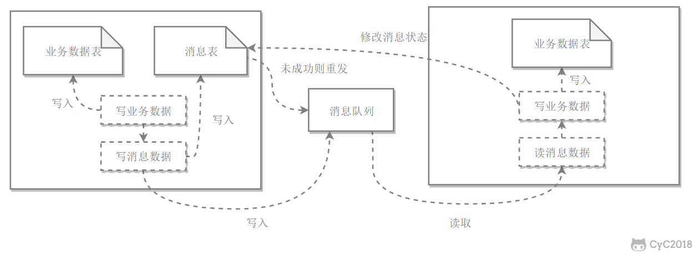

# 系统设计

## 系统设计基础

### 一、性能

#### 性能指标

1. 响应时间，指某个请求从发出到接收到响应消耗的时间，在对时间进行测试后，可以多次测量取平均值获得平均响应时间。
2. 吞吐量：指的是单位时间内可以处理的请求数量
3. 并发用户数：指的是可以同时处理的并发用户请求数量。多线程可以提高吞吐量，缩短响应时间，是因为线程多、对于IO可以等待处理切换到其他线程。并发用户数并不是越多越好，过多会导致系统无法请求。

#### 性能优化

1. 集群：多台服务器组成集群，使用负载均衡将请求转发到集群中，避免单一服务器的负载压力过大。
2. 缓存：缓存提高性能的原因如下：
   1. 缓存位于内存等介质中，访问较快
   2. 缓存可以位于靠近用户的地方，如缓存一些网页啊之类的，用户可以直接使用，就不用再次向服务器发送请求等。
   3. 将计算结果进行缓存，避免重复运算
3. 异步：将操作转换为消息，将消息发送到消息队列之后立即返回，之后这个操作会被异步处理，即可以多线程进行处理这个操作。

### 二、伸缩性

指不断向集群中添加服务器来缓解不断上升的用户并发访问压力和不断增长的数据存储需求。

#### 伸缩性和性能

如果系统存在性能问题，那么单个用户的请求总是很慢的。如果存在伸缩性问题，那么单个用户访问可能会较快，但是并发数高起来服务器资源跟不上就会变慢。

#### 实现伸缩性

应用服务器只要不具有状态，那么就可以很容易地通过负载均衡器向集群中添加新的服务器。关系型数据库的伸缩性通过Sharding即切分数据表来实现，将数据按一定的规则分布到不同的节点上，从而解决单台存储服务器的存储空间限制。

对于非关系型数据库，本身就是为了海量数据而诞生的，对伸缩性支持得特别好。

### 三、扩展性

指的是添加新功能时对于其他应用没有影响，这就要求不同应用之间低耦合

实现可扩展的方式有：

+ 使用消息队列进行解耦，应用之间通过消息传递进行通信，而不是用全局变量之类的
+ 使用分布式服务将业务和可复用的服务分离开来，业务使用分布式框架调用可复用的服务，新增的产品可以通过调用可复用的服务来实现业务逻辑，对其他产品没有影响。也就是复用的耦合的东西用一个接口进行调用，而不是互相之间随便乱调用。

### 四、可用性

#### 冗余

1. 保证高可用性的主要手段就是冗余，某个服务器故障了就调用其他服务器。
2. 服务器的冗余比较容易实现，只要保证服务器不具有状态，那么服务器故障的时候负载均衡器会将服务器原来的用户请求转发到另一个应用服务器上面，不会对用户有任何影响。
3. 存储服务器的冗余主要用主从复制来实现，主服务器故障的时候，提升从服务器为主服务器，这个过程叫做切换。主从复制的实现过程是三个线程，一个从主服务器读出内容到日志，一个读取到日志，还有一个将读出来的日志里面的操作再做一遍

#### 监控

1. 对CPU、内存、磁盘、网络等系统负载信息进行监控，当某个信息达到一定阈值的时候通知运维人员，从而在系统发生故障之前及时发现问题。

#### 服务降级

服务降级是为了应对大量的请求，主动关闭部分功能，从而保证核心功能的可用性。

### 五、安全性

要求系统在应对各种攻击手段能够有可靠的应对措施。

+++

## 分布式

### 一、分布式锁

在单机场景下，可以用语言的内置锁来实现进程同步，但是在分布式场景下，需要同步的进程可能位于不同的服务器节点，那么就需要用到分布式锁。

阻塞锁通常使用互斥量来实现

+ 互斥量为0说明有其他进程使用锁，此时处于锁定状态
+ 互斥量为1说明未锁定

1和0可以用一个整型值表示，也可以用某个数据是否存在表示

#### 数据库的唯一索引

获得锁的时候向表中插入一条数据，释放的时候删除这条记录，唯一索引可以保证该记录只被插入一次，那么就可以用这个数据是否插入在数据表中来判断是否处于锁定状态

存在的问题：

+ 锁没有失效时间，解锁失败的话其他进程就无法再次获得锁，也就是锁坏了之后不会自动消失，其他进程也无法再次获得锁
+ 只能是非阻塞锁，插入失败直接就报错了，无法重试。
+ 不可重入，已经获得锁的进程也必须重新获取锁。

#### Redis的SETNX指令

使用SETNX set if not exist，指令插入一个键值对，如果Key已经存在，那么就会返回False，否则就插入成功返回True

这个和数据库唯一索引类似，保证了只存在一个Key的键值对，那么就可以用Key的键值对是否存在来判断是否在锁定状态

EXPIRE指令可以为这个键值对设定一个过期时间，从而避免了数据库唯一索引实现方式中释放锁失败的问题，防止一个锁坏掉其他都不能用了

#### Redis的RedLock算法

1. 设计的基础：
   1. 一致性，互斥，不管任何时候都只能有一个客户端持有这个锁。安全性
   2. 分区可容忍性：不会死锁，最终一定会得到锁，就算一个持有锁的客户端宕机或者发生网络分区。即锁坏掉了还能用。效率属性A。
   3. 可用性：只要大多数Redis节点正常工作，客户端应该就能获取和释放锁。效率属性B。
2. 只是简单的给一个从机保证在主机宕机的时候可以使用是不行的，原因是无法保证安全互斥的原则，因为Redis的复制是异步的，把锁复制过去的时候可能就出现了两把锁。
3. 使用了多个Redis实例来实现分布式锁，这是为了保证在发送单点故障时仍然可用
   + 尝试从N个相互独立的Redis实例中获取锁。
   + 最初有一个总的锁释放时间，然后一个一个节点去申请锁。这时候有一个申请的阈值时间，超过这个时间就说明本节点损坏，直接连接下一个节点。申请锁的方式就是用相同的键值对去请求，最后获得一个总的申请锁时间。
   + 计算获取锁消耗的时间，只有时间小于锁的总的释放时间，并且从大多数即一半以上的实例上面获取了锁，才认为获取锁成功。此时就要更新总的释放时间，将在总的锁释放时间减去申请锁的时间之后释放这个锁。
   + 如果获取锁失败，不管是申请的时间超时还是节点数不足一半，这个申请都需要去每个节点上面释放锁，即使自己没有申请到的节点也要进行释放。

#### Zookeeper的有序节点

1. Zookeeper抽象模型：提供了一种树形结构的命令空间，/app1/p_1节点的父节点为/app1
2. 节点类型有三种，永久节点不会因为会话结束或者超时而消失。临时节点如果会话结束或者超时就消失。有序节点，会在节点名后面加一个数字后缀，而且有序的递增的。
3. 监听器：为一个节点注册监听器，节点状态发生改变时，会给客户端发送消息。
4. 分布式锁实现：创建一个锁目录/lock。当一个客户端需要获取锁的时候，在/lock下创建临时的且有序的子节点。客户端获取子节点列表，判断自己创建的子节点是否是当前子节点列表中序号最小的子节点，如果是则认为获得锁，否则就监听自己的前一个子节点，获得子节点变更通知后重复此步骤从而获得锁。最后执行业务代码，完成之后删除对应的子节点。
5. 会话超时：如果一个已经获得锁的会话超时了，因为创建的是临时节点，超时的话会被清除，那么其他会话就能获得锁了，这种情况不会出现数据库唯一索引的锁释放失败产生的问题
6. 羊群效应：一个节点未获得锁，只需要监听自己的前一个子节点，这是因为如果监听所有的子节点，那么任意一个子节点状态改变，其他所有节点都会收到通知，而我们只希望它的最后一个子节点收到通知。也就是说一个羊动的时候，其他羊也会跟着动。那么前一个子节点状态改变，我就收到了通知，当前节点就可以进行锁的获取。

### 二、分布式事务

指事务的操作位于不同的节点上面，需要保证事务的ACID特性。如下单场景，库存和订单如果不在一个节点上面，就涉及到分布式事务操作了。

分布式锁和事务的区别：

+ 锁问题主要是关于进程之间的互斥关系，比如银行账户的修改，没有互斥关系就不会有正确的修改结果。
+ 事务问题的关键在于事务涉及的一系列操作都需要ACID特征，可以说事务问题比锁问题更加高大。

#### 2PC

两阶段提交Two-phase Commit，通过引入协调者Coordinator来协调参与者的行为，并最终决定这些参与者是否要真正执行事务

1. 运行过程：

   1. 准备阶段：协调者询问参与者事务是否执行成功，参与者返回事务执行结果，询问可以堪称是一种投票，需要参与者都同意才能执行。

      

   2. 提交阶段：如果事务在每个参与者上面都执行成功，事务协调者发送通知让参与者提交事务，否则协调者发送通知让参与者回滚。准备阶段完成了事务，但是还没有提交，在经过协调者确认之后才会提交或者回滚。有这个的目的就是有一个统一的过程来决定事务是否提交，对整体情况进行一个把控。

2. 存在的问题：

   1. 同步阻塞：所有事务参与者在等待其他参与者响应的时候处于阻塞状态，因为有一个事务还要等着提交或者回滚，所有这时候是不能进行其他操作的，占用资源，效率不高
   2. 单点问题：协调者发生了故障会导致很大的错误发生，因为最重要的节点丢失了信息，大家都会阻塞在哪里等待回应
   3. 数据不一致：提交阶段，如果协调者只发送了部分commit信息，网络异常之后，只有部分参与者收到信息，这样使得数据不一致
   4. 太过保守：任意一个节点失败就会导致整个事务失败，这样没有完善的容错机制，不太行。

#### 本地消息表

本地消息表和业务数据处于同一个数据库中，这样就可以利用本地事务来保证对这个表的操作满足事务特性。并且使用了消息队列来保证最终一致性。

1. 在分布式事务操作的一方完成写业务数据的操作之后向本地消息表发送一个消息，本地事务能保证这个消息一定会被写入本地消息表中

2. 之后将本地消息表中的消息转发到消息队列中，如果转发成功则将消息从本地消息表中删除，否则重新继续转发

3. 在分布式事务操作的另一方从消息队列中读取一个消息，并且执行消息中的操作。

4. 这个就是进行本地的消息存储，再用消息队列进行通信：

   

### 三、CAP

分布式系统不可能同时满足CAP Consistency Availablity Partition Tolerance，即一致性、可用性、分区容忍性，最多只能同时满足其中两项：

#### 一致性 Consistency

一致性指的是多个数据副本能否保持一致的特性，在一致性的条件下，系统在执行数据更新操作之后能够从一致性状态转移到另一个一致状态。对一个数据更新成功之后，如果每个用户都能够读取到最新的值，该系统就被认为具有一致性

#### 可用性 Availablity

可用性指的是分布式系统在面对各种异常的时候可以提供正常服务的能力，可以用系统可用时间占总时间的比值来衡量，4个9的可用性表示系统99.99%的时间是可用的

在可用性条件下，要求系统提供的服务一直处于可用的状态，对于用户的每个操作请求总是能够在有限的时间内返回结果。

#### 分区容忍性 Partition Tolerance

网络分区指的是分布式系统中的节点被划分为多个区域，每个区域内部可以通信，但是区域之间无法通信。在分区容忍性条件下，分布式系统在遇到任何网络分区故障的时候，仍然需要对外提出一致性和可用性的服务，除非是整个网络环境都发生了故障。即部分网络损坏的时候，要有可以在故障下仍正常通信的能力。

#### 权衡

在分布式系统里面，分区容忍性是必不可少的，因为需要假设网络总是不可靠的。因此CAP理论实际上是要在可用性和一致性之间权衡。

可用性和一致性常常是冲突的，很难同时满足，在多个节点之间进行数据同步的时候：

+ 为了保证一致性CP，不能访问未同步完成的节点，也就失去了部分可用性
+ 为了保证可用性AP，允许读取所有节点的数据，但是数据可能不一致。

### 四、BASE

BASE是基本可用Basically Available、软状态Soft State，和最终一致性Eventually Consistent三个短语的缩写。

BASE理论是对可用性和一致性权衡的结果，核心思想是：即使无法做到强一致性，但每个业务应该根据自身特点采用适当的方式来使系统达到最终一致性。

#### 基本可用

指分布式系统出现故障的时候，保证核心可用，允许损失部分可用性。

比如电商在做促销的时候，为了保证系统的稳定性，部分消费者会被引导到一个降级的界面。

#### 软状态

指允许系统中的数据存在中间状态，并认为该中间状态不会影响整个系统的可用性，允许不同节点之间的副本的同步过程存在时延

#### 最终一致性

最终一致性强调在一段时间后最终是一致的状态。

ACID要求强一致性，通常在传统数据库上面，但是这里BASE只要求最终一致即可。通过牺牲强一致性来达到可用性，通常运用在大型分布式系统中。

在实际的分布式场景中，不同业务单元和组件对一致性的要求是不同的，所以ACID和BASE会结合使用。

### 五、Paxos

用于达成共识性问题，即对多个节点产生的值，该算法能保证只选出唯一一个值。

主要有三类节点：提议者Proposer提议一个值、接收者Acceptor对每个提议进行投票、告知者Learner被告知投票的结果，不参与投票过程

#### 执行过程

规定一个提议包含两个字段[n,v]，n是序号，v是提议值。

1. Prepare阶段：

   

   有两个提议者和三个接收者。接受者收到准备请求，包含的提议为[n1,v1]，并且之前没有接受过prepare的请求，就发送一个响应，设置当前收到的为n1,v1，并且保证之后收到的序号都大于n1。如果没有收到过返回的就是no previous的prepare响应。

   如果收到了一个序号小于当前序号的请求，那就丢弃这个小值的序号。如果收到序号更大，就返回对应响应，再设置当前值为新的大值。收到序号更大的时候，会返回之前存储的[n0,v0]值，它的v值可能更大，所以返回到Proposer的时候的值就不再是Proposer之前发送的值了。

#### Accept阶段

当一个Proposer收到超过一半的Acceptor的prepare响应的时候，就可以发送Accept请求了。取最大提议编号的v值进行发送，发送给Acceptor。这个值是由Acceptor返回的，值可能会比自己之前发送的值大。

#### Learn阶段

Acceptor收到Accept请求时，如果序号大于等于该Acceptor承诺的最小序号，那么就发送Learn提议给所有的Learner，当Learner发现有大多数的Acceptor接收了某个提议，那么该提议的提议值就被Paxos选择出来。

#### 约束条件

1. 正确性：指只有一个提议值能生效。因为Paxos协议要求每个生效的提议被大多数的Acceptor接收，并且Acceptor只能接收一个提议(最大序号)，所以可以保证正确性。
2. 可终止性：指最后总有一个提议生效。Paxos能够让Proposer发送的提议朝着被大多数Acceptor接收的那个提议靠拢，所以可以最后终止。因为Acceptor会根据序号返回对应值，这个值就会使得Proposer进行更改。总是在向大家都接收的值哪里靠近的，

### 六、Raft

Raft也是分布式一致性协议，主要用来竞选主节点。

#### 单个Candidate的竞选

有三种节点，Follower、Candidate和Leader，Leader会周期性地发送心跳包给Follower，每个Follower否设置一个随机的竞选超时时间，一般为150ms-300ms，如果在这个时间内没有收到心跳包，就会变成Candidate，进入竞选阶段。

1. 一开始都是Follower，没有Leader，所以某个节点等待了一段时间，没有等到就变成了Candidate。

2. 此时会发送投票请求给其他所有节点，其他节点进行回复，如果超过一半的节点回复了，那么就变成了Leader。

3. 之后它就会周期性地发送包给Follower，当没有给某一个发送了之后，又进行同样的Candidate的过程。

#### 多个Candidate的竞选

1. 如果多个Follower成为Candidate，并且所获的票数相同，就需要重新投票。
2. 由于每个节点设置的随机竞选超时时间不同，因此下次再出现多个Candidate且投票获得同样票数的概率很低，这样就可以实现选出一个Leader。

#### 数据同步

1. 来自客户端的修改都会传入Leader，注意此时修改没有提交，只是写入了日志中。
2. Leader会把所有修改复制到Follower里面
3. Leader会等待**大多数**的Follower都进行了修改，然后才提交修改
4. 此时Leader会通知所有的Follower让他们都进行修改，这样才让所有数据一样了。

## 参考资料

1. 大型网站技术架构：核心原理与案例分析