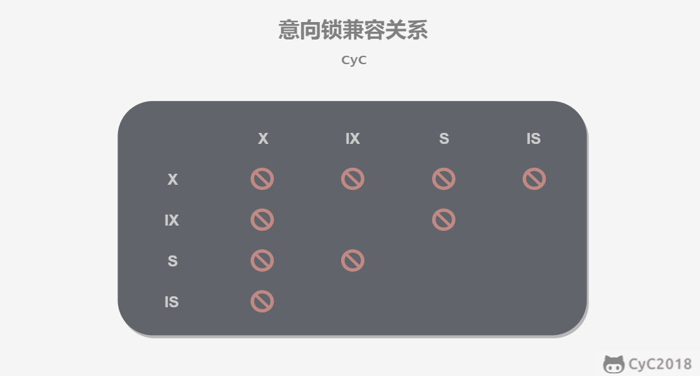

# 数据库系统

## 数据库基本概念

### 一、事务

#### 事务概念

1. 事务是满足ACID四个特性的一组操作，可以通过commit提交一个事务，也可以用rollback进行回滚

#### 事务的四个特性ACID

1. 原子性：Atomicity。事务是不可分割的最小单元，要么全部提交成功，要么全部失败。

2. 一致性：Consistency。数据库在事务执行前后都是一致性状态。所有事务对同一个数据的读取结果是一样的。

3. 隔离性：Isolation。一个事务对其他事务不可见，做什么是自己的事。

4. 持久性：Durability。一旦提交事务，其做的改变将会永远保存，即便是系统崩溃也不会丢失。可以用redo log重做日志记录，实现持久性。

5. **事务的 ACID 特性概念简单，但不是很好理解，主要是因为这几个特性不是一种平级关系：**

   - 只有满足一致性，事务的执行结果才是正确的。
   - 在无并发的情况下，事务串行执行，隔离性一定能够满足。此时只要能满足原子性，就一定能满足一致性。
   - 在并发的情况下，多个事务并行执行，事务不仅要满足原子性，还需要满足隔离性，才能满足一致性。
   - 事务满足持久化是为了能应对系统崩溃的情况。

   

6. MySQL默认用自动提交模式，默认把一个操作作为事务进行提交。

### 二、并发一致性问题

并发之下隔离性难以保证，所以一致性难以保证

1. 丢失修改：即两个事务都进行修改，一个修改了但还没有来得及提交就被另一个覆盖了，先后顺序有问题。
2. 读脏数据，一个改了还未提交，另一个读取了，但是改的被撤销了，就导致其读到了脏数据。
3. 不可重复读：一个已经读过了数据，另一个改了，之后再读数据就被更改了
4. 幻影读：读一个范围的数据，另一个事务插入了数据，则数据范围已经被改变了。

这些都是因为改变了事务的隔离性，所以需要加锁进行隔离。

### 三、加锁

#### 封锁粒度

1. 最好只是对相关数据进行加锁，而不是整个表加锁。加锁需要消耗资源，封锁粒度越大则开销越大，要做好权衡。

#### 封锁类型

1. 读写锁：互斥锁以及共享锁，

2. 意向锁Intertion locks：在对一个表进行封锁的时候因为有一行被封锁就不能加锁，这样再去检测某一行是否加锁比较麻烦，所以有了意向锁，IX和IS，预先加上，都是对表的锁定，表示自己想要对某个数据行加上X和S锁。一个事务想要获得S与X都必须现有IS与IX。

   

3. 任意的IS与IX之间都是兼容的，因为只是意向加锁而不是真正加锁。意向锁都是表级的，所以对分别两行加锁是不冲突的。

#### 封锁类型

1. 三级封锁协议：修改A的时候要加X锁，事务结束才释放。二级是读要加S锁，读完就释放。三级是读加S锁，事务结束才释放。
2. 两段锁协议，加锁和解锁在两个阶段进行。两段锁可以保证可串行化调度，但是不满足也可能达到。
3. MySQL的InnoDB存储引擎采用了两段锁协议，根据隔离级别自动加锁，后面再一起释放，这是隐式锁定。

### 四、隔离级别

1. 未提交读：事务修改之后未提交但还是可以被其他事务可见
2. 提交读：只有提交之后才可以被看到
3. 可重复读：保证同一个事务之中多次读取数据的结果是一样的
4. 可串行化：强制事务串行执行，这样两个事务互不干扰，这个需要加锁实现

### 五、多版本并发控制

1. MVCC Multi-Version Concurrency Control。是MySQL的InnoDB存储引擎实现隔离的具体方式。实现了提交读和可重复读的隔离级别。读操作实际较多，加锁比较浪费，MVCC用多版本的思想，写操作更新最新的版本快照，读操作读旧版本，没有互斥关系。其规定了只能读取别的已经提交的事务，还有自己未提交的脏页面。
2. MVCC的多个版本快照存储在Undo日志里面，里面有版本号
3. MVCC维护了一个ReadView的结构，存储了当前系统未提交的事务列表，还有其中版本号的最大最小值。在select的时候，根据当前的和min，max的比较得出一定结论。如果小于最小，那么表示当前的行是在所有未提交之前的，可以使用。如大于max，说明是在未提交后面，不可使用。如果在中间，需要根据隔离等级决定能否使用。如果当前的不可用就需要找到下一个快照版本使用。

## MySQL相关概念

### 一、索引

#### B+树原理

1. 数据结构：B树指的是Balance Tree，平衡树，所有叶子节点位于同一层。每一层每一处的节点都是从左到右依次增大的，两个数字之间的指针指的就是下一层位于两者之间的数字范围。查找的时候可以二分查找，因为是递增顺序的数组。插入的时候可能会多一个数出来，就需要对一些结构进行分裂。
2. 与红黑树进行比较，我们用的是B+树而不是红黑树，是因为B+树有更高的性能。首先是B+树的树高更低，不是二叉树，所以比较低。然后在磁盘访问方面，操作系统总是分页或者分块对数据进行访问的，内存和磁盘之间的交换也是由页进行的。数据库就把索引的一个节点的大小设置为页的大小，这样对一个节点的访问就是对一页的访问，这就更快。如果需要访问不同的块，磁盘寻道时间会长很多，红黑树树高则变换页面的次数多，所以性能不如B+树。磁盘的预读取对于相邻节点的载入也有很大的帮助。

#### MySQL索引

1. 索引是在存储引擎层实现的，而不是在服务器实现的，所以不同的存储引擎的索引类型和实现是不同的。

2. B+树所以是大多数MySQL存储引擎的默认索引类型。只需要对树进行查找，所以查找速度很快。B+树有序，所以除了查找还可以用来排序和分组，可以指定多个列作为索引列，多个索引列组成一个键。**适用于全键值、键值范围和键前缀查找，其中键前缀查找只适用于最左前缀查找。如果不是按照索引列的顺序进行查找，则无法使用索引。**InnoDB的B+树索引分为主索引和辅助索引，主索引的叶子结点记录着完整的数据记录，这种索引方式叫聚簇索引，因为无法把数据行存在两个地方，所以一个表只能有一个聚簇索引，因为它保存了所有的东西，相当于是完整的表格了。

   辅助索引的叶子节点的data域记录着主键的值，所以在找辅助索引的时候需要先找到主键值，然后去主索引中查找。也就是说完整的东西还是在主索引里面，辅助索引只是先找到主键的地方然后再去主索引中查找。

   主索引是稀疏索引，意思是它是把每一块的第一项拿来做索引节点值，辅助索引是稠密索引，有所有东西，但是只保存了主键信息，先查找到主键信息再去主索引中进行寻找。

   总结：**InnoDB中，表数据文件本身就是按B+Tree组织的一个索引结构，聚簇索引就是按照每张表的主键构造一颗B+树，同时叶子节点中存放的就是整张表的行记录数据，也将聚集索引的叶子节点称为数据页。这个特性决定了索引组织表中数据也是索引的一部分；**

   　**一般建表会用一个自增主键做聚簇索引，没有的话MySQL会默认创建，但是这个主键如果更改代价较高，故建表时要考虑自增ID不能频繁update这点。**

   　　**我们日常工作中，根据实际情况自行添加的索引都是辅助索引，辅助索引就是一个为了需找主键索引的二级索引，现在找到主键索引再通过主键索引找数据；**

3. 哈希索引，能以O(1)的时间查找，但是失去了有序性，无法用于排序和分组，只能精确查找不能部分或者范围查找。

   InnoDB引擎会自适应哈希索引，当一个索引值被用得很频繁的时候，会在B+树所以之上再建立一个hash索引，这样就可以更快速地查找到我们频繁需要的内容。

4. 全文索引，MyISAM存储引擎支持全文索引，用于查找文本中的关键词，而不是直接比较是否相等。查找条件MATCH AGAINST而不是WHERE。全文索引用倒排索引实现，它记录着关键词到其所在文档的映射，InnoDB存储引擎也在5.6.4版本之后支持全文索引。倒排索引就是搜索引擎的管理方式。

5. 空间数据索引：MyISAM存储引擎支持空间数据索引R-Tree，可以用于地理数据存储，空间数据索引会从所有维度来索引数据，可以有效地使用任意维度来进行组合查询，必须用GIS相关的函数来维护数据。

#### 索引优化

1. 独立的列：在进行查询的时候，索引列不能是一个表达式，而应该是一个列=多少直接查询，否则无法使用
2. 多列索引：在需要使用多个列作为条件查询的时候，使用多列索引比使用多个单列索引性能更好。多列索引就是在建立的时候不是一个列一个索引，而是两个或者多个列共同建立索引，这样选择条件就很严格。而且要在查询的时候将严格的索引放在前面，这样筛选力度更大。因为索引建的越多越耗费空间，所以一个单独的多列索引优于两个单列索引。
3. 索引列的顺序：选择性最强的放在前面。选择性强是指不同的索引值所占比例高。这样我选的时候出来的一个值的重复性就低。因为有一个值可能大家都有，总的数目不变，不同的值个数比例占得多那么它的重复性就低，我最后结果获得的值就越少。
4. 前缀索引：对于BLOB TEXT VARCHAR等，使用前缀索引，因为可能很长，所以只是对一部分进行索引，长度需要根据索引选择性来确定。
5. 覆盖索引：索引包含所有需要查询的字段的值，意思是索引里面包含了要查询的东西了，就不用再次查询主索引等。有一些优点
   1. 索引本身包含的东西小于数据行的大小，只读取索引可以减少数据访问量。
   2. 一些存储引擎如MyISAM在内存里面只缓存索引，但是全部数据就需要操作系统缓存，如果对全部数据进行访问那就需要操作系统系统调用，这个比较耗时。
   3. 对于InnoDB引擎，如果辅助索引可以覆盖查询，那就不需要访问主索引进行二次查找了。

#### 索引的使用条件

+ 对于非常小的表，大部分时候直接全表扫描比建立索引更高效。
+ 对于中型和大型的表，索引就很有效
+ 对于特大型的表，索引的建立和维护代价都会很高，这种情况下就需要一种可以直接区分出需要查询的一组数据而不是一条一条地匹配，例如分区技术。

### 二、查询性能优化

#### 使用Explain进行分析

Explain 用来分析 SELECT 查询语句，开发人员可以通过分析 Explain 结果来优化查询语句。

比较重要的字段有：

- select_type : 查询类型，有简单查询、联合查询、子查询等
- key : 使用的索引
- rows : 扫描的行数

#### 优化数据访问

1. 减少请求的数据量：
   1. 只返回必要的列，少用select *
   2. 只返回必要的行，如用limit语句来限制返回的数据
   3. 缓存重复查询的数据，使用缓存可以避免在数据库里面进行查询，特别在要查询的数据经常被重复查询时，缓存带来得查询性能提升会很明显。
2. 减少服务器端扫描的行数：最有效的办法就是建立索引，少去进行行扫描

#### 重构查询方式

1. 切分大查询：一个大查询如果直接执行，可能会一次锁住很多数据，占满整个数据日志，耗费系统资源，阻塞一些小的但重要的查询。
2. 分解大连接查询：将一个大连接查询分解为对每一个表进行一次单表查询，然后再在程序里面人为进行关联。
   1. 这样可以缓存更高效，对于连接而言，如果其中一个表发生了改变，那么整个查询缓存就无法使用，而单独一个表查询，改变一部分东西也不会影响这个表的缓存。
   2. 分解为多个单表查询，这些单表查询的结果也可以缓存起来被其他查询使用，效率更高。
   3. 减少锁竞争
   4. 在应用层进行连接，更容易对数据库进行拆分，从而更容易做到高性能和可伸缩。
   5. 查询本身的效率也会有所提升，如查询的时候根据ID进行顺序查找而不是简单的连接之后的id乱序查找，这样的查询效率就会高得多。

### 三、存储引擎

#### InnoDB

1. 是MySQL默认的事务性存储引擎，只有在需要它不支持的其他特性时才会考虑使用其他存储引擎、

2. 实现了四个标准的隔离级别，默认级别是可重复读。在可重复读的隔离级别下通过MVCC多版本并发控制+Next-Key Locking防止幻影读。

3. 主索引是聚簇索引，在索引中保存了数据，从而避免直接读取磁盘，因此对查询性能有很大的提升。

4. 内部做了很多优化，包括从磁盘读取数据用可预测性读取，自适应哈希索引，加速插入操作的插入缓冲区等。

5. 支持真正的在线热备份，其他引擎不支持这个，要获取一致性视图需要停止对所有表的写入，而在读写混合场景中，停止写入可能也意味着停止读取。

#### MyISAM

1. 设计简单，数据以紧密格式存储，对于只读数据，或者表比较小，可以容忍修复操作，那么就可以使用它。提供了如压缩表、空间数据索引等特性

2. 不支持事务

3. 不支持行的锁，只能对整个表加锁。在一个表读取的时候，也可以往表中插入新的记录，这被称为并发插入。

4. 可以手工或者自动执行检查和修复操作，但是和事务恢复即崩溃恢复不同，可能导致一些数据丢失，而且速度极为缓慢。

5. 如果指定了 DELAY_KEY_WRITE  选项，在每次修改执行完成时，不会立即将修改的索引数据写入磁盘，而是会写到内存中的键缓冲区，只有在清理键缓冲区或者关闭表的时候才会将对应的索引块写入磁盘。这种方式可以极大的提升写入性能，但是在数据库或者主机崩溃时会造成索引损坏，需要执行修复操作。

   也就是说写到缓冲区而不是要等着写回了再进行其他执行。

#### 比较

+ 事务：InnoDB是事务性的，可以用commit语句和rollback语句
+ 并发：MyISAM只支持表级锁，InnoDB还支持行级锁
+ 外键：InnoDB支持外键
+ 备份：InnoDB支持在线热备份
+ 崩溃恢复：MyISAM崩溃后发生损坏的概率比InnoDB高很多，而且恢复的速度也更慢。
+ 其他特性：MyISAM支持压缩表和空间数据索引

### 四、数据类型

1. 整型：TINYINT, SMALLINT, MEDIUMINT, INT, BIGINT 分别使用 8, 16, 24, 32, 64 位存储空间，一般情况下越小的列越好。

   INT(11) 中的数字只是规定了交互工具显示字符的个数，对于存储和计算来说是没有意义的。也就是说这个规定只是显示左右，实际上还是int的32位。

2. 浮点数：FLOAT 和 DOUBLE 为浮点类型，DECIMAL 为高精度小数类型。CPU 原生支持浮点运算，但是不支持 DECIMAl 类型的计算，因此 DECIMAL 的计算比浮点类型需要更高的代价。

   FLOAT、DOUBLE 和 DECIMAL 都可以指定列宽，例如 DECIMAL(18, 9) 表示总共 18 位，取 9 位存储小数部分，剩下 9 位存储整数部分。

3. 字符串：主要有 CHAR 和 VARCHAR 两种类型，一种是定长的，一种是变长的。

   VARCHAR 这种变长类型能够节省空间，因为只需要存储必要的内容。但是在执行 UPDATE 时可能会使行变得比原来长，当超出一个页所能容纳的大小时，就要执行额外的操作。MyISAM 会将行拆成不同的片段存储，而 InnoDB 则需要分裂页来使行放进页内。

   在进行存储和检索时，**会保留 VARCHAR 末尾的空格，而会删除 CHAR 末尾的空格。**

4. 时间和日期

   MySQL 提供了两种相似的日期时间类型：DATETIME 和 TIMESTAMP。

   1. DATETIME

      能够保存从 1000 年到 9999 年的日期和时间，精度为秒，使用 8 字节的存储空间。

      它与时区无关。默认情况下，MySQL 以一种可排序的、无歧义的格式显示 DATETIME 值，例如“2008-01-16  22:37:08”，这是 ANSI  标准定义的日期和时间表示方法。

   2. TIMESTAMP

      和 UNIX 时间戳相同，保存从 1970 年 1 月 1 日午夜（格林威治时间）以来的秒数，使用 4 个字节，只能表示从 1970 年到 2038 年。

      它和时区有关，也就是说一个时间戳在不同的时区所代表的具体时间是不同的。

      MySQL 提供了 FROM_UNIXTIME() 函数把 UNIX 时间戳转换为日期，并提供了 UNIX_TIMESTAMP() 函数把日期转换为 UNIX 时间戳。

      默认情况下，如果插入时没有指定 TIMESTAMP 列的值，会将这个值设置为当前时间。

      应该尽量使用 TIMESTAMP，因为它比 DATETIME 空间效率更高。

### 五、切分

#### 水平切分

水平切分又叫做Sharding，它是将一个表中的记录拆分到多个结构相同的表中，当一个表的数据不断增多的时候，这个是必须要进行的操作，它可以将数据分布到不同集群的不同节点上从而缓解单个数据库的压力。

#### 垂直切分

是说把一个表按列切分为多个表，通常按照列的关系密切程度进行切分，也可以利用垂直切分将经常被使用的列和不经常使用的列切分到不同的表中。

在数据库的垂直切分例子如将原来的电商数据切分为商品数据和用户数据等。

#### Sharding策略

+ hash取模 hash(key)%n
+ 范围可以是ID范围也可以是时间范围
+ 映射表：用一个单独的数据库来存储切分后的映射关系

#### Sharding存在的问题

1. 事务问题：利用分布式事务来处理
2. 连接：将原来的连接变为多表查询，然后在用户程序中进行连接。
3. ID唯一性：使用全局一个ID，为每一个分片指定一个ID范围，分布式ID生成器

### 六、复制

#### 主从复制

1. 主要涉及三个线程binlog线程、IO线程、SQL线程

   binlog线程主要复制将主服务器上面的数据更改写入二进制日志中

   IO线程复制从主服务器上读取二进制日志，并且写入从服务器的中继日志

   SQL线程，复制读取中继日志，解析出主服务器进行的更改数据并且在从服务器中执行。

   

#### 读写分离

主服务器执行写操作和实时性要求较高的读操作，从服务器处理读操作。

读写分离能提高性能的原因在于：

+ 主从服务器负责各自的读写，可以缓解锁的争用
+ 从服务器可以使用MyISAM，提升查询性能及节约系统开销
+ 增加冗余，提高可用性。

这样需要一个代理服务器，接收应用程序传来的读写请求人然后决定转发到哪一个服务器。

## Redis

### 一、概述

Redis是速度非常快的非关系型NoSQL内存键值数据库，可以存储键和五种不同类型的值之间的映射，键只能是字符串，值支持五种类型：字符串、列表、集合、散列表、有序集合

Redis有很多特性，比如将内存中的数据持久化到硬盘中，使用复制来扩展读性能，使用分片来扩展写性能。

### 三、数据类型

| 数据类型 |      可以存储的值      |                             操作                             |
| :------: | :--------------------: | :----------------------------------------------------------: |
|  STRING  | 字符串、整数或者浮点数 | 对整个字符串或者字符串的其中一部分执行操作对整数和浮点数执行自增或者自减操作 |
|   LIST   |          列表          | 从两端压入或者弹出元素 对单个或者多个元素进行修剪，只保留一个范围内的元素 |
|   SET    |        无序集合        | 添加、获取、移除单个元素检查一个元素是否存在于集合中计算交集、并集、差集 从集合里面随机获取元素 |
|   HASH   | 包含键值对的无序散列表 |  添加、获取、移除单个键值对获取所有键值对检查某个键是否存在  |
|   ZSET   |        有序集合        | 添加、获取、删除元素根据分值范围或者成员来获取元素计算一个键的排名 |

