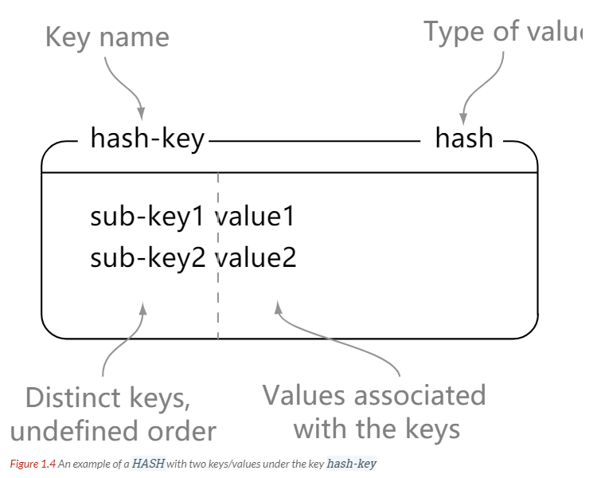
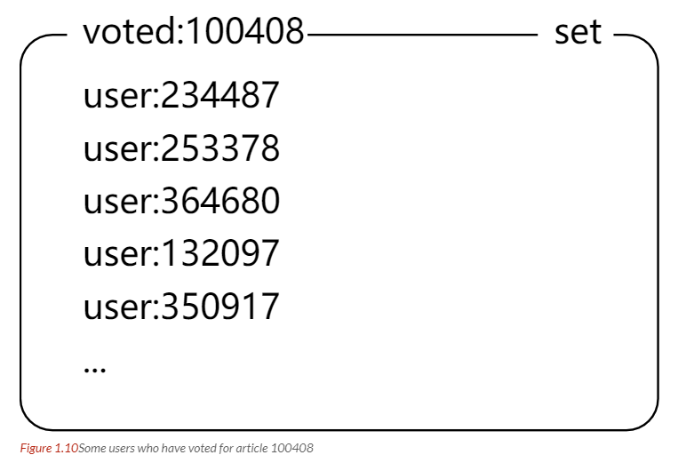

# 数据库系统

## 数据库基本概念

### 一、事务

#### 事务概念

1. 事务是满足ACID四个特性的一组操作，可以通过commit提交一个事务，也可以用rollback进行回滚

#### 事务的四个特性ACID

1. 原子性：Atomicity。事务是不可分割的最小单元，要么全部提交成功，要么全部失败。

2. 一致性：Consistency。数据库在事务执行前后都是一致性状态。所有事务对同一个数据的读取结果是一样的。

3. 隔离性：Isolation。一个事务对其他事务不可见，做什么是自己的事。

4. 持久性：Durability。一旦提交事务，其做的改变将会永远保存，即便是系统崩溃也不会丢失。可以用redo log重做日志记录，实现持久性。

5. **事务的 ACID 特性概念简单，但不是很好理解，主要是因为这几个特性不是一种平级关系：**

   - 只有满足一致性，事务的执行结果才是正确的。
   - 在无并发的情况下，事务串行执行，隔离性一定能够满足。此时只要能满足原子性，就一定能满足一致性。
   - 在并发的情况下，多个事务并行执行，事务不仅要满足原子性，还需要满足隔离性，才能满足一致性。
   - 事务满足持久化是为了能应对系统崩溃的情况。

   

6. MySQL默认用自动提交模式，默认把一个操作作为事务进行提交。

### 二、并发一致性问题

并发之下隔离性难以保证，所以一致性难以保证

1. 丢失修改：即两个事务都进行修改，一个修改了但还没有来得及提交就被另一个覆盖了，先后顺序有问题。
2. 读脏数据，一个改了还未提交，另一个读取了，但是改的被撤销了，就导致其读到了脏数据。
3. 不可重复读：一个已经读过了数据，另一个改了，之后再读数据就被更改了
4. 幻影读：读一个范围的数据，另一个事务插入了数据，则数据范围已经被改变了。

这些都是因为改变了事务的隔离性，所以需要加锁进行隔离。

### 三、加锁

#### 封锁粒度

1. 最好只是对相关数据进行加锁，而不是整个表加锁。加锁需要消耗资源，封锁粒度越大则开销越大，要做好权衡。

#### 封锁类型

1. 读写锁：互斥锁以及共享锁，

2. 意向锁Intertion locks：在对一个表进行封锁的时候因为有一行被封锁就不能加锁，这样再去检测某一行是否加锁比较麻烦，所以有了意向锁，IX和IS，预先加上，都是对表的锁定，表示自己想要对某个数据行加上X和S锁。一个事务想要获得S与X都必须现有IS与IX。

   

3. 任意的IS与IX之间都是兼容的，因为只是意向加锁而不是真正加锁。意向锁都是表级的，所以对分别两行加锁是不冲突的。

#### 封锁类型

1. 三级封锁协议：修改A的时候要加X锁，事务结束才释放。二级是读要加S锁，读完就释放。三级是读加S锁，事务结束才释放。
2. 两段锁协议，加锁和解锁在两个阶段进行。两段锁可以保证可串行化调度，但是不满足也可能达到。
3. MySQL的InnoDB存储引擎采用了两段锁协议，根据隔离级别自动加锁，后面再一起释放，这是隐式锁定。

### 四、隔离级别

1. 未提交读：事务修改之后未提交但还是可以被其他事务可见
2. 提交读：只有提交之后才可以被看到
3. 可重复读：保证同一个事务之中多次读取数据的结果是一样的
4. 可串行化：强制事务串行执行，这样两个事务互不干扰，这个需要加锁实现

### 五、多版本并发控制

1. MVCC Multi-Version Concurrency Control。是MySQL的InnoDB存储引擎实现隔离的具体方式。实现了提交读和可重复读的隔离级别。读操作实际较多，加锁比较浪费，MVCC用多版本的思想，写操作更新最新的版本快照，读操作读旧版本，没有互斥关系。其规定了只能读取别的已经提交的事务，还有自己未提交的脏页面。
2. MVCC的多个版本快照存储在Undo日志里面，里面有版本号
3. MVCC维护了一个ReadView的结构，存储了当前系统未提交的事务列表，还有其中版本号的最大最小值。在select的时候，根据当前的和min，max的比较得出一定结论。如果小于最小，那么表示当前的行是在所有未提交之前的，可以使用。如大于max，说明是在未提交后面，不可使用。如果在中间，需要根据隔离等级决定能否使用。如果当前的不可用就需要找到下一个快照版本使用。

### NoSQL

NoSQL最常见的解释是“non-relational”， “Not Only SQL”也被很多人接受。NoSQL最常见的解释是“non-relational”， “Not Only SQL”也被很多人接受。不保证ACID的特性。无关系性，去掉了数据之间的关系，这样读写就特别快。

#### 易扩展

NoSQL数据库种类繁多，但是一个共同的特点都是去掉关系数据库的关系型特性。数据之间无关系，这样就非常容易扩展。无形之间，在架构的层面上带来了可扩展的能力。

#### 大数据量，高性能

NoSQL数据库都具有非常高的读写性能，尤其在大数据量下，同样表现优秀。这得益于它的无关系性，数据库的结构简单。一般MySQL使用Query Cache。NoSQL的Cache是记录级的，是一种细粒度的Cache，所以NoSQL在这个层面上来说性能就要高很多。

#### 灵活的数据模型

NoSQL无须事先为要存储的数据建立字段，随时可以存储自定义的数据格式。而在关系数据库里，增删字段是一件非常麻烦的事情。如果是非常大数据量的表，增加字段简直就是——个噩梦。这点在大数据量的Web 2.0时代尤其明显。

#### 高可用

NoSQL在不太影响性能的情况，就可以方便地实现高可用的架构。比如Cassandra、HBase模型，通过复制模型也能实现高可用。 

#### 体系架构

NoSQL框架体系NosoL整体框架分为四层，由下至上分为数据持久层(data persistence)、整体分布层(data distribution model)、数据逻辑模型层(data logical  model)、和接口层(interface)，层次之间相辅相成，协调工作。 

数据持久层定义了数据的存储形式，主要包括基于内存、基于硬盘、内存和硬盘接口、订制可拔插四种形式。基于内存形式的数据存取速度最快，但可能会造成数据丢失。基于硬盘的数据存储可能保存很久，但存取速度较基于内存形式的慢。内存和硬盘相结合的形式，结合了前两种形式的优点，既保证了速度，又保证了数据不丢失。订制可拔插则保证了数据存取具有较高的灵活性。 

数据分布层定义了数据是如何分布的，相对于关系型数据库，NoSQL可选的机制比较多，主要有三种形式：一是CAP支持，可用于水平扩展。二是多数据中心支持，可以保证在横跨多数据中心是也能够平稳运行。三是动态部署支持，可以在运行着的集群中动态地添加或删除节点。 

数据逻辑层表述了数据的逻辑表现形式，与关系型数据库相比，NoSQL在逻辑表现形式上相当灵活，主要有四种形式：一是键值模型，这种模型在表现形式上比较单一，但却有很强的扩展性。二是列式模型，这种模型相比于键值模型能够支持较为复杂的数据，但扩展性相对较差。三是文档模型，这种模型对于复杂数据的支持和扩展性都有很大优势。四是图模型，这种模型的使用场景不多，通常是基于图数据结构的数据定制的。 

接口层为上层应用提供了方便的数据调用接口，提供的选择远多于关系型数据库。接口层提供了五种选择：Rest，Thrift，Map/Reduce，Get/Put，特定语言API，使得应用程序和数据库的交互更加方便。 

## MySQL相关概念

### 一、索引

#### B+树原理

1. 数据结构：B树指的是Balance Tree，平衡树，所有叶子节点位于同一层。每一层每一处的节点都是从左到右依次增大的，两个数字之间的指针指的就是下一层位于两者之间的数字范围。查找的时候可以二分查找，因为是递增顺序的数组。插入的时候可能会多一个数出来，就需要对一些结构进行分裂。
2. 与红黑树进行比较，我们用的是B+树而不是红黑树，是因为B+树有更高的性能。首先是B+树的树高更低，不是二叉树，所以比较低。然后在磁盘访问方面，操作系统总是分页或者分块对数据进行访问的，内存和磁盘之间的交换也是由页进行的。数据库就把索引的一个节点的大小设置为页的大小，这样对一个节点的访问就是对一页的访问，这就更快。如果需要访问不同的块，磁盘寻道时间会长很多，红黑树树高则变换页面的次数多，所以性能不如B+树。磁盘的预读取对于相邻节点的载入也有很大的帮助。

#### MySQL索引

1. 索引是在存储引擎层实现的，而不是在服务器实现的，所以不同的存储引擎的索引类型和实现是不同的。

2. B+树所以是大多数MySQL存储引擎的默认索引类型。只需要对树进行查找，所以查找速度很快。B+树有序，所以除了查找还可以用来排序和分组，可以指定多个列作为索引列，多个索引列组成一个键。**适用于全键值、键值范围和键前缀查找，其中键前缀查找只适用于最左前缀查找。如果不是按照索引列的顺序进行查找，则无法使用索引。**InnoDB的B+树索引分为主索引和辅助索引，主索引的叶子结点记录着完整的数据记录，这种索引方式叫聚簇索引，因为无法把数据行存在两个地方，所以一个表只能有一个聚簇索引，因为它保存了所有的东西，相当于是完整的表格了。

   辅助索引的叶子节点的data域记录着主键的值，所以在找辅助索引的时候需要先找到主键值，然后去主索引中查找。也就是说完整的东西还是在主索引里面，辅助索引只是先找到主键的地方然后再去主索引中查找。

   主索引是稀疏索引，意思是它是把每一块的第一项拿来做索引节点值，辅助索引是稠密索引，有所有东西，但是只保存了主键信息，先查找到主键信息再去主索引中进行寻找。

   总结：**InnoDB中，表数据文件本身就是按B+Tree组织的一个索引结构，聚簇索引就是按照每张表的主键构造一颗B+树，同时叶子节点中存放的就是整张表的行记录数据，也将聚集索引的叶子节点称为数据页。这个特性决定了索引组织表中数据也是索引的一部分；**

   　**一般建表会用一个自增主键做聚簇索引，没有的话MySQL会默认创建，但是这个主键如果更改代价较高，故建表时要考虑自增ID不能频繁update这点。**

   　　**我们日常工作中，根据实际情况自行添加的索引都是辅助索引，辅助索引就是一个为了需找主键索引的二级索引，现在找到主键索引再通过主键索引找数据；**

3. 哈希索引，能以O(1)的时间查找，但是失去了有序性，无法用于排序和分组，只能精确查找不能部分或者范围查找。

   InnoDB引擎会自适应哈希索引，当一个索引值被用得很频繁的时候，会在B+树所以之上再建立一个hash索引，这样就可以更快速地查找到我们频繁需要的内容。

4. 全文索引，MyISAM存储引擎支持全文索引，用于查找文本中的关键词，而不是直接比较是否相等。查找条件MATCH AGAINST而不是WHERE。全文索引用倒排索引实现，它记录着关键词到其所在文档的映射，InnoDB存储引擎也在5.6.4版本之后支持全文索引。倒排索引就是搜索引擎的管理方式。

5. 空间数据索引：MyISAM存储引擎支持空间数据索引R-Tree，可以用于地理数据存储，空间数据索引会从所有维度来索引数据，可以有效地使用任意维度来进行组合查询，必须用GIS相关的函数来维护数据。

#### 索引优化

1. 独立的列：在进行查询的时候，索引列不能是一个表达式，而应该是一个列=多少直接查询，否则无法使用
2. 多列索引：在需要使用多个列作为条件查询的时候，使用多列索引比使用多个单列索引性能更好。多列索引就是在建立的时候不是一个列一个索引，而是两个或者多个列共同建立索引，这样选择条件就很严格。而且要在查询的时候将严格的索引放在前面，这样筛选力度更大。因为索引建的越多越耗费空间，所以一个单独的多列索引优于两个单列索引。最左前缀进行索引，左边的选出来的要尽可能少
3. 索引列的顺序：选择性最强的放在前面。选择性强是指不同的索引值所占比例高。这样我选的时候出来的一个值的重复性就低。因为有一个值可能大家都有，总的数目不变，不同的值个数比例占得多那么它的重复性就低，我最后结果获得的值就越少。
4. 前缀索引：对于BLOB TEXT VARCHAR等，使用前缀索引，因为可能很长，所以只是对一部分进行索引，长度需要根据索引选择性来确定。
5. 覆盖索引：索引包含所有需要查询的字段的值，意思是索引里面包含了要查询的东西了，就不用再次查询主索引等。有一些优点
   1. 索引本身包含的东西小于数据行的大小，只读取索引可以减少数据访问量。
   2. 一些存储引擎如MyISAM在内存里面只缓存索引，但是全部数据就需要操作系统缓存，如果对全部数据进行访问那就需要操作系统系统调用，这个比较耗时。
   3. 对于InnoDB引擎，如果辅助索引可以覆盖查询，那就不需要访问主索引进行二次查找了。

#### 索引的使用条件

+ 对于非常小的表，大部分时候直接全表扫描比建立索引更高效。
+ 对于中型和大型的表，索引就很有效
+ 对于特大型的表，索引的建立和维护代价都会很高，这种情况下就需要一种可以直接区分出需要查询的一组数据而不是一条一条地匹配，例如分区技术。

### 二、查询性能优化

#### 使用Explain进行分析

Explain 用来分析 SELECT 查询语句，开发人员可以通过分析 Explain 结果来优化查询语句。

比较重要的字段有：

- select_type : 查询类型，有简单查询、联合查询、子查询等
- key : 使用的索引
- rows : 扫描的行数

#### 优化数据访问

1. 减少请求的数据量：
   1. 只返回必要的列，少用select *
   2. 只返回必要的行，如用limit语句来限制返回的数据
   3. 缓存重复查询的数据，使用缓存可以避免在数据库里面进行查询，特别在要查询的数据经常被重复查询时，缓存带来得查询性能提升会很明显。
2. 减少服务器端扫描的行数：最有效的办法就是建立索引，少去进行行扫描

#### 重构查询方式

1. 切分大查询：一个大查询如果直接执行，可能会一次锁住很多数据，占满整个数据日志，耗费系统资源，阻塞一些小的但重要的查询。
2. 分解大连接查询：将一个大连接查询分解为对每一个表进行一次单表查询，然后再在程序里面人为进行关联。
   1. 这样可以缓存更高效，对于连接而言，如果其中一个表发生了改变，那么整个查询缓存就无法使用，而单独一个表查询，改变一部分东西也不会影响这个表的缓存。
   2. 分解为多个单表查询，这些单表查询的结果也可以缓存起来被其他查询使用，效率更高。
   3. 减少锁竞争
   4. 在应用层进行连接，更容易对数据库进行拆分，从而更容易做到高性能和可伸缩。
   5. 查询本身的效率也会有所提升，如查询的时候根据ID进行顺序查找而不是简单的连接之后的id乱序查找，这样的查询效率就会高得多。

### 三、存储引擎

#### InnoDB

1. 是MySQL默认的事务性存储引擎，只有在需要它不支持的其他特性时才会考虑使用其他存储引擎、

2. 实现了四个标准的隔离级别，默认级别是可重复读。在可重复读的隔离级别下通过MVCC多版本并发控制+Next-Key Locking防止幻影读。

3. 主索引是聚簇索引，在索引中保存了数据，从而避免直接读取磁盘，因此对查询性能有很大的提升。

4. 内部做了很多优化，包括从磁盘读取数据用可预测性读取，自适应哈希索引，加速插入操作的插入缓冲区等。

5. 支持真正的在线热备份，其他引擎不支持这个，要获取一致性视图需要停止对所有表的写入，而在读写混合场景中，停止写入可能也意味着停止读取。

#### MyISAM

1. 设计简单，数据以紧密格式存储，对于只读数据，或者表比较小，可以容忍修复操作，那么就可以使用它。提供了如压缩表、空间数据索引等特性

2. 不支持事务

3. 不支持行的锁，只能对整个表加锁。在一个表读取的时候，也可以往表中插入新的记录，这被称为并发插入。

4. 可以手工或者自动执行检查和修复操作，但是和事务恢复即崩溃恢复不同，可能导致一些数据丢失，而且速度极为缓慢。

5. 如果指定了 DELAY_KEY_WRITE  选项，在每次修改执行完成时，不会立即将修改的索引数据写入磁盘，而是会写到内存中的键缓冲区，只有在清理键缓冲区或者关闭表的时候才会将对应的索引块写入磁盘。这种方式可以极大的提升写入性能，但是在数据库或者主机崩溃时会造成索引损坏，需要执行修复操作。

   也就是说写到缓冲区而不是要等着写回了再进行其他执行。

#### 比较

+ 事务：InnoDB是事务性的，可以用commit语句和rollback语句
+ 并发：MyISAM只支持表级锁，InnoDB还支持行级锁
+ 外键：InnoDB支持外键
+ 备份：InnoDB支持在线热备份
+ 崩溃恢复：MyISAM崩溃后发生损坏的概率比InnoDB高很多，而且恢复的速度也更慢。
+ 其他特性：MyISAM支持压缩表和空间数据索引

### 四、数据类型

1. 整型：TINYINT, SMALLINT, MEDIUMINT, INT, BIGINT 分别使用 8, 16, 24, 32, 64 位存储空间，一般情况下越小的列越好。

   INT(11) 中的数字只是规定了交互工具显示字符的个数，对于存储和计算来说是没有意义的。也就是说这个规定只是显示左右，实际上还是int的32位。

2. 浮点数：FLOAT 和 DOUBLE 为浮点类型，DECIMAL 为高精度小数类型。CPU 原生支持浮点运算，但是不支持 DECIMAl 类型的计算，因此 DECIMAL 的计算比浮点类型需要更高的代价。

   FLOAT、DOUBLE 和 DECIMAL 都可以指定列宽，例如 DECIMAL(18, 9) 表示总共 18 位，取 9 位存储小数部分，剩下 9 位存储整数部分。

3. 字符串：主要有 CHAR 和 VARCHAR 两种类型，一种是定长的，一种是变长的。

   VARCHAR 这种变长类型能够节省空间，因为只需要存储必要的内容。但是在执行 UPDATE 时可能会使行变得比原来长，当超出一个页所能容纳的大小时，就要执行额外的操作。MyISAM 会将行拆成不同的片段存储，而 InnoDB 则需要分裂页来使行放进页内。

   在进行存储和检索时，**会保留 VARCHAR 末尾的空格，而会删除 CHAR 末尾的空格。**

4. 时间和日期

   MySQL 提供了两种相似的日期时间类型：DATETIME 和 TIMESTAMP。

   1. DATETIME

      能够保存从 1000 年到 9999 年的日期和时间，精度为秒，使用 8 字节的存储空间。

      它与时区无关。默认情况下，MySQL 以一种可排序的、无歧义的格式显示 DATETIME 值，例如“2008-01-16  22<span>:</span>37<span>:</span>08”，这是 ANSI  标准定义的日期和时间表示方法。

   2. TIMESTAMP

      和 UNIX 时间戳相同，保存从 1970 年 1 月 1 日午夜（格林威治时间）以来的秒数，使用 4 个字节，只能表示从 1970 年到 2038 年。

      它和时区有关，也就是说一个时间戳在不同的时区所代表的具体时间是不同的。

      MySQL 提供了 FROM_UNIXTIME() 函数把 UNIX 时间戳转换为日期，并提供了 UNIX_TIMESTAMP() 函数把日期转换为 UNIX 时间戳。

      默认情况下，如果插入时没有指定 TIMESTAMP 列的值，会将这个值设置为当前时间。

      应该尽量使用 TIMESTAMP，因为它比 DATETIME 空间效率更高。

### 五、切分

#### 水平切分

水平切分又叫做Sharding，它是将一个表中的记录拆分到多个结构相同的表中，当一个表的数据不断增多的时候，这个是必须要进行的操作，它可以将数据分布到不同集群的不同节点上从而缓解单个数据库的压力。

#### 垂直切分

是说把一个表按列切分为多个表，通常按照列的关系密切程度进行切分，也可以利用垂直切分将经常被使用的列和不经常使用的列切分到不同的表中。

在数据库的垂直切分例子如将原来的电商数据切分为商品数据和用户数据等。

#### Sharding策略

+ hash取模 hash(key)%n
+ 范围可以是ID范围也可以是时间范围
+ 映射表：用一个单独的数据库来存储切分后的映射关系

#### Sharding存在的问题

1. 事务问题：利用分布式事务来处理
2. 连接：将原来的连接变为多表查询，然后在用户程序中进行连接。
3. ID唯一性：使用全局一个ID，为每一个分片指定一个ID范围，分布式ID生成器

### 六、复制

#### 主从复制

1. 主要涉及三个线程binlog线程、IO线程、SQL线程

   binlog线程主要复制将主服务器上面的数据更改写入二进制日志中

   IO线程复制从主服务器上读取二进制日志，并且写入从服务器的中继日志

   SQL线程，复制读取中继日志，解析出主服务器进行的更改数据并且在从服务器中执行。

   

#### 读写分离

主服务器执行写操作和实时性要求较高的读操作，从服务器处理读操作。

读写分离能提高性能的原因在于：

+ 主从服务器负责各自的读写，可以缓解锁的争用
+ 从服务器可以使用MyISAM，提升查询性能及节约系统开销
+ 增加冗余，提高可用性。

这样需要一个代理服务器，接收应用程序传来的读写请求人然后决定转发到哪一个服务器。

## Redis

### 一、概述

Redis是速度非常快的非关系型NoSQL内存键值数据库，可以存储键和五种不同类型的值之间的映射，键只能是字符串，值支持五种类型：字符串、列表、集合、散列表、有序集合

Redis有很多特性，比如将内存中的数据持久化到硬盘中，使用复制来扩展读性能，使用分片来扩展写性能。

### 三、数据类型

| 数据类型 |      可以存储的值      |                             操作                             |
| :------: | :--------------------: | :----------------------------------------------------------: |
|  STRING  | 字符串、整数或者浮点数 | 对整个字符串或者字符串的其中一部分执行操作<br />对整数和浮点数执行自增或者自减操作 |
|   LIST   |          列表          | 从两端压入或者弹出元素 <br />对单个或者多个元素进行修剪，<br />只保留一个范围内的元素 |
|   SET    |        无序集合        | 添加、获取、移除单个元素<br />检查一个元素是否存在于集合中计算交集、并集、差集<br />从集合里面随机获取元素 |
|   HASH   | 包含键值对的无序散列表 | 添加、获取、移除单个键值对<br />获取所有键值对检查某个键是否存在 |
|   ZSET   |        有序集合        | 添加、获取、删除元素<br />根据分值范围或者成员来获取元素<br />计算一个键的排名 |

#### String


```html
> set hello world
OK
> get hello
"world"
> del hello
(integer) 1
> get hello
(nil)
```

相当于存储的字符串是一个hashmap，自动有键-值

#### List


```html
> rpush list-key item
(integer) 1
> rpush list-key item2
(integer) 2
> rpush list-key item
(integer) 3

> lrange list-key 0 -1
1) "item"
2) "item2"
3) "item"

> lindex list-key 1
"item2"

> lpop list-key
"item"

> lrange list-key 0 -1
1) "item2"
2) "item"
```

通过返回的index号进行一些操作，比如range、index等

#### SET


类似的操作

```html
> sadd set-key item
(integer) 1
> sadd set-key item2
(integer) 1
> sadd set-key item3
(integer) 1
> sadd set-key item
(integer) 0 添加失败

> smembers set-key
1) "item"
2) "item2"
3) "item3"

> sismember set-key item4
(integer) 0
> sismember set-key item
(integer) 1

> srem set-key item2
(integer) 1
> srem set-key item2
(integer) 0

> smembers set-key
1) "item"
2) "item3"
```

#### Hash



```html
> hset hash-key sub-key1 value1
(integer) 1
> hset hash-key sub-key2 value2
(integer) 1
> hset hash-key sub-key1 value1
(integer) 0

> hgetall hash-key
1) "sub-key1"
2) "value1"
3) "sub-key2"
4) "value2"

> hdel hash-key sub-key2
(integer) 1
> hdel hash-key sub-key2
(integer) 0

> hget hash-key sub-key1
"value1"

> hgetall hash-key
1) "sub-key1"
2) "value1"
```

#### ZSet


```html
> zadd zset-key 728 member1
(integer) 1
> zadd zset-key 982 member0
(integer) 1
> zadd zset-key 982 member0
(integer) 0

> zrange zset-key 0 -1 withscores
1) "member1"
2) "728"
3) "member0"
4) "982"

> zrangebyscore zset-key 0 800 withscores
1) "member1"
2) "728"

> zrem zset-key member1
(integer) 1
> zrem zset-key member1
(integer) 0

> zrange zset-key 0 -1 withscores
1) "member0"
2) "982"
```

### 三、数据结构

#### 字典

dictht是一个散列表结构，用拉链法解决哈希冲突

```c
/* This is our hash table structure. Every dictionary has two of this as we
 * implement incremental rehashing, for the old to the new table. */
typedef struct dictht {
    dictEntry **table;
    unsigned long size;
    unsigned long sizemask;
    unsigned long used;
} dictht;

typedef struct dictEntry {//这是多余的挂起来的链表
    void *key;
    union {
        void *val;
        uint64_t u64;
        int64_t s64;
        double d;
    } v;
    struct dictEntry *next;
} dictEntry;
```

字典里面有两个哈希表，这是为了方便进行rehash操作，扩容的时候，一个键值对rehash到另一个字典上面，完成之后就释放之前的那个空间，然后交换二者角色，这样我们就可以快速扩容了。

在rehash的时候不是一次性结束，而是渐进式地运行，防止给服务器造成过大的负担。rehash的频率就是对字典执行操作的频率，一次操作做一次rehash。实现方法就是给一个标记数，每次操作标记数加1。

因为在rehash的时候数据分散在两个字典上，所以就需要查找数据的时候也注意看应该到哪个表查找。

#### 跳表

这是有序集合的底层实现之一，基于多指针有序链表实现的，可以看成多个有序链表，

和红黑树相比，有以下优点

+ 插入速度非常快速，不需要进行旋转等操作来维护平衡性。
+ 更容易实现
+ 支持没有锁的操作。

### 四、使用场景

#### 计数器

可以对String类型进行自增和自减，从而实现计数器功能。因为Redis是内存型数据库，读写性能非常高，很适合频繁读写的计数量。主要是他的string、hash、ZSet都提供了原子性的自增操作。

+ 如果应用需要显示每天注册用户数，就可以用string作为计数器，设定一个名为。。。的key，在初始化时设定一个每天凌晨过期的时间，当用户注册的时候数字加1，当每天凌晨0点之后就会因为key过期而值清零
+ 每条微博都有点赞数，评论数，转发数和浏览数四条属性，用hash进行计数会更好，将该计数器的 key 设为`weibo:weibo_id`，`hash`的 field 为`like_number`、`comment_number`、`forward_number`和`view_number`，在对应操作后通过`hincrby`使`hash`中的 field 自增。
+ 如果有一个发帖排行榜功能，选择ZSet，把key设置好，然后用户发帖之后将对应的id下的key增加1，然后ZSet会重新排序内容。

#### 时间轴 Timeline

List作为双向链表，不仅可以作为队列使用，还可以做一个共用的时间轴，新发送的消息放入一个key为LATEST_WEIBO的list中，之后便可以通过lrange取出当前最新的微博。

#### 缓存

作为key-value的内存数据库，最容易想到的就是做一个数据缓存，只需要通过string类型将序列化后的对象存起来即可。

将热点数据放到内存里面，设置内存的最大使用量以及淘汰策略来保证缓存的命中率。作为缓存需要注意以下几点：

+ 必须保证不同对象的key不会重复，并且key要尽量短，一般用类名或者表名加上主键拼接而成
+ 选择一个优秀的序列化方式也很重要，目的是提高序列化的效率和减少内存占有。
+ 缓存内容和数据库要一致。两种做法：一种是只在数据查询后将对象放入缓存，如果对象发生了修改或删除操作，直接清除对应缓存(或设为过期)。另一种是在数据库新增和查询后将对象放入缓存，修改后更新缓存，删除后清除对应缓存(或者设为过期)。

#### 查找表

例如DNS记录就很适合用Redis进行存储。

查找表和缓存类似，都是利用了Redis的快速查找特性。但是这个查找表的内容不可以失效，缓存可以失效，所以缓存不能作为可靠的数据来源。

#### 消息队列(即生产者消费者模型)

List是一个双向链表，可以通过lpush和rpop写入和读取消息，不过最好用Kafka、RabbitMQ等消息中间件。生产者lpush，消费者rpop，并且可以保证有序性，如果需要带有优先级的消息队列也可以选择sorted set，而pub/sub功能也可以用做发布者/订阅者模型的消息。

#### 会话缓存

可以使用Redis来统一存储多台应用服务器的会话信息。

当应用服务器不再存储用户的会话信息，那么就不再具有状态，一个用户可以请求任意一个应用服务器，从而更容易实现高可用性以及伸缩性。也就是说当用Redis作为用户会话信息的存储，那么在用户下一次申请会话的时候，可以从Redis里面直接取出会话信息，就不再需要某个服务器进行存储，这样就可以申请其他的服务器，实现伸缩性和高可用性。

#### 分布式锁实现

在分布式场景下，无法使用单机环境的锁来对多个节点上面的进程进行同步。

用Redis自带的SETNX命令实现分布式锁，除此之外还可以用RedLock分布式锁实现。

 在 Redis 2.6.12 版本开始，`string`的`set`命令增加了三个参数：

- `EX`：设置键的过期时间（单位为秒）

- `PX`：设置键的过期时间（单位为毫秒）

- `NX` | `XX`：当设置为`NX`时，仅当 key 存在时才进行操作，设置为`XX`时，仅当 key 不存在才会进行操作

  由于这个操作是原子性的，可以简单地以此实现一个分布式的锁，例如：

```
set key "lock" EX 1 XX
```

 如果这个操作返回`false`，说明 key 的添加不成功，也就是当前有人在占用这把锁。而如果返回`true`，则说明得了锁，便可以继续进行操作，并且在操作后通过`del`命令释放掉锁。并且即使程序因为某些原因并没有释放锁，由于设置了过期时间，该锁也会在 1 秒后自动释放，不会影响到其他程序的运行。

#### 好友关系

 对于一个用户 A，将它的关注和粉丝的用户 id 都存放在两个 set 中：

- `A:follow`：存放 A 所有关注的用户 id

- `A:follower`：存放 A 所有粉丝的用户 id

  那么通过`sinter`命令便可以根据`A:follow`和`A:follower`的交集得到与 A 互相关注的用户。当 A 进入另一个用户 B 的主页后，`A:follow`和`B:follow`的交集便是 A 和 B 的共同专注，`A:follow`和`B:follower`的交集便是 A 关注的人也关注了 B。

#### 排行榜

ZSet可以实现有序性操作，从而实现排行榜等功能。只要有一个计算热度的算法，就可以用来产生一个排行榜。zrevrangebyscore可以得到以分数倒序排列的序列，zrank可以获得一个成员在排行榜的位置(分数正序排列的位置，如果要获取倒序就需要zcard-zrank)。

### 五、Redis和Memcached

两者都是非关系型内存键值数据库，主要有以下不同

1. 数据类型：Memcached只支持字符串类型，但是Redis支持更多类型的数据，更灵活
2. 数据持久化：Redis支持RDB快照和AOF日志，但是Memcached不支持持久化
3. 分布式：Memcached不支持分布式，只能在客户端用一致性hash来实现分布式存储，这种方式在存储和查询的时候都需要在客户端先计算一次数据所在的节点，意思是只能在客户端进行一致性管理。但是Redis CLuster实现了分布式的支持。
4. 内存管理机制
   + 在Redis中，不是所有数据都一直存储在内存里面，可以把一些很久没用的放进磁盘，但是Memcached的数据是一直在内存里面
   + Memcached把内存分割成特定长度的块来存储数据，这样可以解决内存碎片的问题，但是这样会导致内存利用率不高，比如每一块要的远远小于提供的大小。

### 六、内部原理剖析

#### 键的过期时间

Redis可以给每个键设置过期时间，当键过期的时候就会删除这个键

对于散列表这种容器，只能为整个表设置过期时间，但是不能为键里面单个元素设置过期时间。

#### 数据淘汰策略

设置一个内存最大使用量，超过的时候就会启用数据淘汰策略

主要有六种淘汰策略：

|      策略       |                         描述                         |
| :-------------: | :--------------------------------------------------: |
|  volatile-lru   | 从已设置过期时间的数据集中挑选最近最少使用的数据淘汰 |
|  volatile-ttl   |   从已设置过期时间的数据集中挑选将要过期的数据淘汰   |
| volatile-random |      从已设置过期时间的数据集中任意选择数据淘汰      |
|   allkeys-lru   |       从所有数据集中挑选最近最少使用的数据淘汰       |
| allkeys-random  |          从所有数据集中任意选择数据进行淘汰          |
|   noeviction    |                     禁止驱逐数据                     |

作为内存型数据库，为了防止对性能的过度消耗，其实淘汰算法并不是对所有数据都进行一遍扫描，只是进行了一个抽样，获得一小部分并且从中选出被淘汰的key。

使用Redis缓存数据的时候，为了提高命中率，需要保证缓存数据都是热点数据，可以把内存最大使用量设置为热点数据占用的内存量，然后用allkeys-lru淘汰掉不够热点的数据。

Redis 4.0引入了lfu的淘汰策略，意思是将访问频率最少的键值淘汰。

#### 持久化

Redis是内存型的，为了保证断电后不丢失数据，需要把内存中的数据持久化到硬盘上面。

##### RDB持久化

把某个时间点的所有数据都存放到硬盘上

可以把快照复制到其他服务器从而创建具有相同数据的服务器副本，从而达到保护数据安全的目的。

一旦系统发生故障，就会丢失最后一次创建快照之后的数据

如果数据量很大，保存快照的时间会很长。

##### AOF持久化

将写命令添加到AOF文件(Append Only File)的末尾，使用AOF持久化需要设置同步选项，是因为并不是直接写入，而是先到缓冲区再写入。有以下的选项：

|   选项   |         同步频率         |
| :------: | :----------------------: |
|  always  |     每个写命令都同步     |
| everysec |       每秒同步一次       |
|    no    | 让操作系统来决定何时同步 |

always会严重降低服务器性能

everysec比较合适，可以保证系统崩溃的时候只丢失1s左右的数据，并且Redis每秒执行一次同步对服务器性能几乎没有影响

no选项不能给服务器带来多大的提升，而且也会增加服务器崩溃时数据丢失的风险。

当服务器写请求增多的时候，AOF文件可能会很大，那么就需要重写AOF文件去除冗余写命令

#### 事务

一个事务包含了多个命令，服务器在执行事务的时候，不会改去执行其他客户端的命令请求，事务中的多个命令被一次性发送给服务器，而不是一条一条发送，这种方式叫做流水线，可以减少客户端和服务器之间的网络通信从而提升性能。

Redis最简单的事务实现方式是使用MULTI命令和EXEC命令将事务操作包围起来。

#### 事件

Redis服务器是一个事件驱动程序

##### 文件事件

服务器通过套接字进行网络通信，文件事件就是对套接字操作的抽象。

Redis 基于 Reactor 模式开发了自己的网络事件处理器，使用 I/O 多路复用程序来同时监听多个套接字，并将到达的事件传送给文件事件分派器，分派器会根据套接字产生的事件类型调用相应的事件处理器。


##### 时间事件

服务器有一些操作要在给定的时间点执行，时间事件就是对这类定式操作的抽象。

这个事件分为两种：一种是定时事件，在指定的时间内执行一次，一种是周期性时间，每隔指定时间就执行一次。

Redis将所有时间事件都放在一个无序链表中，通过遍历整个链表找到已到达的时间事件，并且调用相关的事件处理器。

##### 事件的调度与执行

服务器需要不断监听文件事件的套接字才能得到待处理的文字事件，但是不能一直监听，否则时间事件无法在规定的时间内执行，因此监听时间应该根据距离现在最近的时间事件来决定。事件调度与执行由aeProcessEvents函数负责，伪代码如下：

```python
def aeProcessEvents():
    # 获取到达时间离当前时间最接近的时间事件
    time_event = aeSearchNearestTimer()
    # 计算最接近的时间事件距离到达还有多少毫秒
    remaind_ms = time_event.when - unix_ts_now()
    # 如果事件已到达，那么 remaind_ms 的值可能为负数，将它设为 0
    if remaind_ms < 0:
        remaind_ms = 0
    # 根据 remaind_ms 的值，创建 timeval
    timeval = create_timeval_with_ms(remaind_ms)
    # 阻塞并等待文件事件产生，最大阻塞时间由传入的 timeval 决定
    aeApiPoll(timeval)
    # 处理所有已产生的文件事件
    procesFileEvents()
    # 处理所有已到达的时间事件
    processTimeEvents()
```

将 aeProcessEvents 函数置于一个循环里面，加上初始化和清理函数，就构成了 Redis 服务器的主函数，伪代码如下：

```python
def main():
    # 初始化服务器
    init_server()
    # 一直处理事件，直到服务器关闭为止
    while server_is_not_shutdown():
        aeProcessEvents()
    # 服务器关闭，执行清理操作
    clean_server()
```


#### 复制

通过使用slaveof host port命令来让一个服务器成为另一个服务器的从服务器，一个从服务器只能有一个主服务器，而且不支持主主复制。

##### 连接过程

1. 主服务器创建快照文件，发送给从服务器，并在发送期间使用缓冲区记录执行的写命令。快照文件发送完毕之后，开始向从服务器发送存储在缓冲区内的写命令。
2. 从服务器丢弃所有旧数据，载入主服务器发来的快照文件，之后从服务器开始接受主服务器发来的写命令。
3. 主服务器每执行一次写命令，就向从服务器发送相同的写命令。

##### 主从链

负载上升的时候，主服务可能没有那么多精力去很快地更新从服务器，或者重新连接和重新同步从服务器将会导致系统超载。为了解决这个问题可以用中间服务器，服务于主服务器和从服务器之间，专门承担复制工作。


所以中间的又是主服务器又是从服务器。

#### Sentinel 哨兵

哨兵可以监听集群中的服务器，在主服务器下线的时候自动从从服务器里面选举出新的主服务器。

#### 分片

分片是指将数据分为多个部分的方法，可以把数据存储到多台机器里面，这样可以在解决一些问题的时候获得性能的提升。

一种是范围分片，将某个范围的放再一个服务器上。另一种是哈希分片，使用CRC32哈希函数将键转换为一个数字，再对实例数量求模就鞥知道应该存储的地方是哪里。

根据分片位置可以分为三种分片方式：

+ 客户端分片：客户端用一致性哈希算法决定键应该分布在哪个节点
+ 代理分片，将客户端请求发送到代理商，由代理转发请求到正确的节点上
+ 服务器分片：Redis Cluster

### 七、一个简单的论坛系统分析

#### 论坛功能简介

可以发布文章，对文章点赞、在首页按文章的发布时间或者文章的点赞数进行排序显示

#### 文章信息

文章包括标题、作者、赞数等，在Redis里面可以用HASH来存储每种信息以及其对应的值的映射。

Redis没有表来存储，所以用的是命名空间的方式，在一个空间里面存放一篇文章的信息：

键名的前面部分存储命名空间，后面部分的内容存储 ID，通常使用 : 来进行分隔。例如下面的 HASH 的键名为 article:92617，其中 article 为命名空间，ID 为 92617。


#### 点赞功能

当有用户对一篇文章点赞的时候，除了要对该文章的votes字段进行加一操作，还必须记录该用户已经对该文章进行了点赞，防止用户不停地点赞，可以建立文章的已投票用户集合来进行记录

为了节约内存，规定文章发布一周之后就不能再进行投票，文章已投票的集合也就会被删除，可以为文章的集合设置一个一周的过期时间。



#### 对文章进行排序

为了按发布时间和点赞数进行排序，可以建立一个文章发布时间的有序集合和一个文章点赞数的有序集合


有序集合可以用来排序，按照后面的点数排序，后面的点数是根据一些规则计算出来的。

## SQL语法

### 一、基础

模式定义了数据如何存储，存储什么样的数据以及数据如何分解等信息，数据库和表都有模式

主键的值不允许修改，也不允许复用(即已经删除的主键值不能再去赋给别的对象)

SQL(Structured Query Language)，ANSI SQL

SQL语句不区分大小写，但是数据库表名、列名和值是否区分依赖于具体的DBMS以及配置

SQL 支持以下三种注释：

```sql
## 注释
SELECT *
FROM mytable; -- 注释
/* 注释1
   注释2 */
```

数据库创建与使用：

```sql
CREATE DATABASE test;
USE test;
```

USE就是代表当前使用test这个数据库

### 二、表相关

1. 创建表：

   ```sql
   CREATE TABLE mytable (
     # int 类型，不为空，自增
     id INT NOT NULL AUTO_INCREMENT,
     # int 类型，不可为空，默认值为 1，不为空
     col1 INT NOT NULL DEFAULT 1,
     # 变长字符串类型，最长为 45 个字符，可以为空
     col2 VARCHAR(45) NULL,
     # 日期类型，可为空
     col3 DATE NULL,
     # 设置主键为 id
     PRIMARY KEY (`id`));
   ```

2. 修改表：

   添加列

   ```sql
   ALTER TABLE mytable
   ADD col CHAR(20);
   ```

   删除列

   ```sql
   ALTER TABLE mytable
   DROP COLUMN col;
   ```

   删除表

   ```sql
   DROP TABLE mytable;
   ```

### 三、内容相关

1. 插入：

   普通插入

   ```sql
   INSERT INTO mytable(col1, col2)
   VALUES(val1, val2);
   ```

   插入检索出来的数据

   ```sql
   INSERT INTO mytable1(col1, col2)
   SELECT col1, col2
   FROM mytable2;
   ```

   将一个表的内容插入到一个新表

   ```sql
   CREATE TABLE newtable AS
   SELECT * FROM mytable;
   ```

2. 更新：

   ```sql
   UPDATE mytable
   SET col = val
   WHERE id = 1;
   ```

3. 删除：

   ```sql
   DELETE FROM mytable
   WHERE id = 1;
   ```

   **TRUNCATE TABLE**   可以清空表，也就是删除所有行。

   ```sql
   TRUNCATE TABLE mytable;
   ```

   使用更新和删除操作时一定要用 WHERE 子句，不然会把整张表的数据都破坏。可以先用 SELECT 语句进行测试，防止错误删除

4. 查询：

   1. **DISTINCT**

      相同值只会出现一次。它作用于所有列，也就是说所有列的值都相同才算相同。

      ```sql
      SELECT DISTINCT col1, col2
      FROM mytable;
      ```

   2. **LIMIT**

      限制返回的行数。可以有两个参数，第一个参数为起始行，从 0 开始；第二个参数为返回的总行数。

      返回前 5 行：

      ```sql
      SELECT *
      FROM mytable
      LIMIT 5;
      SELECT *
      FROM mytable
      LIMIT 0, 5;
      ```

      返回第 3 ~ 5 行：

      ```sql
      SELECT *
      FROM mytable
      LIMIT 2, 3;
      ```

   3. 排序：

      - **ASC**  ：升序（默认）
      - **DESC**  ：降序

      可以按多个列进行排序，并且为每个列指定不同的排序方式：

      ```sql
      SELECT *
      FROM mytable
      ORDER BY col1 DESC, col2 ASC;
      ```

   4. 过滤：

      不进行过滤的数据非常大，导致通过网络传输了多余的数据，从而浪费了网络带宽。因此尽量使用 SQL 语句来过滤不必要的数据，而不是传输所有的数据到客户端中然后由客户端进行过滤。

      ```sql
      SELECT *
      FROM mytable
      WHERE col IS NULL;
      ```

      下表显示了 WHERE 子句可用的操作符

      | 操作符  |     说明     |
      | :-----: | :----------: |
      |    =    |     等于     |
      |    <    |     小于     |
      |    >    |     大于     |
      |  <> !=  |    不等于    |
      |  <= !>  |   小于等于   |
      |  >= !<  |   大于等于   |
      | BETWEEN | 在两个值之间 |
      | IS NULL |  为 NULL 值  |

      应该注意到，NULL 与 0、空字符串都不同。

      **AND 和 OR**   用于连接多个过滤条件。优先处理 AND，当一个过滤表达式涉及到多个 AND 和 OR 时，可以使用 () 来决定优先级，使得优先级关系更清晰。

      **IN**   操作符用于匹配一组值，其后也可以接一个 SELECT 子句，从而匹配子查询得到的一组值。

      **NOT**   操作符用于否定一个条件。

### 四、特别符号

#### 通配符

通配符也是用在过滤语句中，但它只能用于文本字段。

- **%**   匹配 >=0 个任意字符；
- **_**   匹配 ==1 个任意字符；
- **[ ]**   可以匹配集合内的字符，例如 [ab] 将匹配字符 a 或者 b。用脱字符 ^ 可以对其进行否定，也就是不匹配集合内的字符。

使用 Like 来进行通配符匹配。

```sql
SELECT *
FROM mytable
WHERE col LIKE '[^AB]%'; -- 不以 A 和 B 开头的任意文本
```

不要滥用通配符，通配符位于开头处匹配会非常慢

#### 分组查询

把具有相同的数据值的行放在同一组中。

可以对同一分组数据使用汇总函数进行处理，例如求分组数据的平均值等。

指定的分组字段除了能按该字段进行分组，也会自动按该字段进行排序。

```sql
SELECT col, COUNT(*) AS num
FROM mytable
GROUP BY col;
```

GROUP BY 自动按分组字段进行排序，ORDER BY 也可以按汇总字段来进行排序。

```sql
SELECT col, COUNT(*) AS num
FROM mytable
GROUP BY col
ORDER BY num;
```

WHERE 过滤行，HAVING 过滤分组，行过滤应当先于分组过滤。

```sql
SELECT col, COUNT(*) AS num
FROM mytable
WHERE col > 2
GROUP BY col
HAVING num >= 2;
```

分组规定：

- GROUP BY 子句出现在 WHERE 子句之后，ORDER BY 子句之前；
- 除了汇总字段外，SELECT 语句中的每一字段都必须在 GROUP BY 子句中给出；
- NULL 的行会单独分为一组；
- 大多数 SQL 实现不支持 GROUP BY 列具有可变长度的数据类型

### 五、特别处理

#### 计算及字符串标准

在数据库服务器上完成数据的转换和格式化的工作往往比客户端上快得多，并且转换和格式化后的数据量更少的话可以减少网络通信量。

计算字段通常需要使用   **AS**   来取别名，否则输出的时候字段名为计算表达式。

```sql
SELECT col1 * col2 AS alias
FROM mytable;
```

**CONCAT()**   用于连接两个字段。许多数据库会使用空格把一个值填充为列宽，因此连接的结果会出现一些不必要的空格，使用 **TRIM()** 可以去除首尾空格。

```sql
SELECT CONCAT(TRIM(col1), '(', TRIM(col2), ')') AS concat_col
FROM mytable;
```

#### 函数

|  函 数  |      说 明       |
| :-----: | :--------------: |
|  AVG()  | 返回某列的平均值 |
| COUNT() |  返回某列的行数  |
|  MAX()  | 返回某列的最大值 |
|  MIN()  | 返回某列的最小值 |
|  SUM()  |  返回某列值之和  |

#### 文本处理

|   函数    |      说明      |
| :-------: | :------------: |
|  LEFT()   |   左边的字符   |
|  RIGHT()  |   右边的字符   |
|  LOWER()  | 转换为小写字符 |
|  UPPER()  | 转换为大写字符 |
|  LTRIM()  | 去除左边的空格 |
|  RTRIM()  | 去除右边的空格 |
| LENGTH()  |      长度      |
| SOUNDEX() |  转换为语音值  |

#### 日期处理

- 日期格式：YYYY-MM-DD
- 时间格式：HH:<zero-width space>MM:SS

|     函 数     |             说 明              |
| :-----------: | :----------------------------: |
|   ADDDATE()   |    增加一个日期（天、周等）    |
|   ADDTIME()   |    增加一个时间（时、分等）    |
|   CURDATE()   |          返回当前日期          |
|   CURTIME()   |          返回当前时间          |
|    DATE()     |     返回日期时间的日期部分     |
|  DATEDIFF()   |        计算两个日期之差        |
|  DATE_ADD()   |     高度灵活的日期运算函数     |
| DATE_FORMAT() |  返回一个格式化的日期或时间串  |
|     DAY()     |     返回一个日期的天数部分     |
|  DAYOFWEEK()  | 对于一个日期，返回对应的星期几 |
|    HOUR()     |     返回一个时间的小时部分     |
|   MINUTE()    |     返回一个时间的分钟部分     |
|    MONTH()    |     返回一个日期的月份部分     |
|     NOW()     |       返回当前日期和时间       |
|   SECOND()    |      返回一个时间的秒部分      |
|    TIME()     |   返回一个日期时间的时间部分   |
|    YEAR()     |     返回一个日期的年份部分     |

#### 数学函数

|  函数  |  说明  |
| :----: | :----: |
| SIN()  |  正弦  |
| COS()  |  余弦  |
| TAN()  |  正切  |
| ABS()  | 绝对值 |
| SQRT() | 平方根 |
| MOD()  |  余数  |
| EXP()  |  指数  |
|  PI()  | 圆周率 |
| RAND() | 随机数 |


