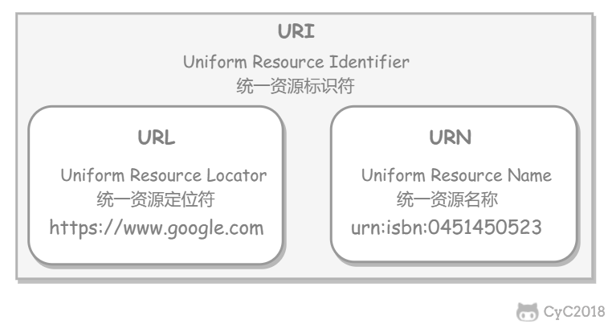

# 计算机网络

## TCP/IP 

1. 流量控制是发送方给一个窗口大小，每次都是按照拥塞控制和这个窗口大小进行的发送大小确定，流量控制是让接收方来得及接受。

2. 慢开始是一开始设定一个ssthreash值，从1 2 4 8这样增长上去，到达ssthreash的时候就进行拥塞避免，即+1 +1这样增加上去。一旦到了拥塞窗口值或者超时了就进行慢开始，即ssthreash变为cwnd拥塞窗口的一半大小，再从1 2 4 8这样增加上去。

   快重传和快恢复是连续接受到三个一样的确认，那么就表示有一个丢失了，所以要进行快速重传，这样只是一个报文丢失而不是全部丢失所以就只用快重传和快恢复，设定ssthreash为拥塞窗口一半，然后拥塞窗口本身也减半，这时直接进入了拥塞避免阶段，即+1 +1 +1

3. 三次握手是，客户端发送SYN=1，ACK=0，seq=x到服务端，服务端发送SYN=1，ACK=1，seq=y，ack=x+1，然后客户端发送ACK=1，seq=x+1，ack=y+1. seq是自己是哪一个队列值，然后ack表示我要对方发的编号是多少。

   第三次确认主要是为了防止超时重传的时候滞留的客户端连接请求再次到服务端，这样服务端会打开两次连接。有第三次握手的话，客户端就会忽略服务端对错误连接请求的SYN=1，ACK=1。

4. 四次挥手是，客户端发送FIN=1，seq=u，服务端发送ACK=1，seq=v，ack=u+1，然后服务端将没有传完的继续传完，传完之后服务端发送FIN=1，ACK=1，seq=w，ack=u+1，最后客户端发送ACK=1，seq=u+1，ack=w+1，会等待2MTTI，才客户端关闭，为了让服务器可能的超时重传被接收到，也为了清除滞留在网络里面可能还未被接收到的请求等。

## 应用层

### DNS

1. DNS domain name system，多用UDP连接，所以要处理未送达的消息，也可用TCP，端口都是53.UDP最多只支持512字节的数据，多了就要用TCP了。

### FTP

1. FTP用TCP连接，端口号是20 21，控制连接是21，数据发送是20

### DHCP

1. 有DHCP服务器，分配给请求的一个合理的IP地址，用udp连接，端口号是67 68

### 邮件

1. 邮件包括发送和接收协议，发送用SMTP，接收用POP3和IMAP，他们的端口号分别是25，110，143

### Web页面请求过程

#### 1. DHCP配置主机信息

#### 2. ARP解析获得的默认路由的MAC地址

#### 3. DNS查询所需要的网址的ip地址，**递归查询和迭代查询**，

递归查询是一个一个路由器的查出去。迭代是一个查，返回服务器地址，再向服务器发送同样的请求包，这样一层一层直到获得结果。

#### 4. 最后是HTTP请求页面

1. 前面三个都是为了主机本身和浏览器创建socket，因为要知道对方ip地址才可以创建
2. 这个套接字生成之后向web服务器发送HTTP的GET报文，以表示需求，三次握手，80端口，然后服务器发送HTTP报文，发回给主机

## HTTP

### HTTP基础知识

1. HTTP通过URL进行资源定位

   

2. 服务器返回的   **响应报文**   中第一行为状态行，包含了状态码以及原因短语，用来告知客户端请求的结果。

3. | 状态码 |               类别               |            含义            |
   | :----: | :------------------------------: | :------------------------: |
   |  1XX   |  Informational（信息性状态码）   |     接收的请求正在处理     |
   |  2XX   |      Success（成功状态码）       |      请求正常处理完毕      |
   |  3XX   |   Redirection（重定向状态码）    | 需要进行附加操作以完成请求 |
   |  4XX   | Client Error（客户端错误状态码） |     服务器无法处理请求     |
   |  5XX   | Server Error（服务器错误状态码） |     服务器处理请求出错     |

   其中404 not found

3. Cookie：HTTP 协议是无状态的，主要是为了让 HTTP 协议尽可能简单，使得它能够处理大量事务。HTTP/1.1 引入 Cookie 来保存状态信息。

   Cookie 是服务器发送到用户浏览器并保存在本地的一小块数据，它会在浏览器之后向同一服务器再次发起请求时被携带上，用于告知服务端两个请求是否来自同一浏览器。由于之后每次请求都会需要携带 Cookie 数据，因此会带来额外的性能开销（尤其是在移动环境下）。

   - 会话状态管理（如用户登录状态、购物车、游戏分数或其它需要记录的信息）
   - 个性化设置（如用户自定义设置、主题等）
   - 浏览器行为跟踪（如跟踪分析用户行为等）

   也可以用Session进行保存信息

### HTTP各个版本功能

#### HTTP/0.9

最初版本，简陋，只支持请求GET，只能请求访问HTML格式的资源

#### HTTP/1.0

1. 请求行要在尾部添加http/1.0作为协议版本字段，要包含头消息。
2. 有了POST和HEAD，根据content-type可以支持多种数据格式，如text、image等，支持cache即在规定时间访问同一个网站可以直接访问cache，有一定的存储。还可以自定义类型。
3. 请求格式改变，新增了状态码、多字符集、多部分发送、权限、内容编码等
4. 每个TCP连接只能发送一个请求，发送完毕了就关闭了连接。
5. 头部是ASCII码，体部任何格式。

#### HTTP/1.1

1. 新增方法PUT PATCH OPTIONS DELETE
2. 引入持久连接，TCP连接默认不关闭，可以复用连接，对一个域名，客户端还可以同时发送多个请求，提高了效率。但是这样也会有队头堵塞，因为是顺序使用连接的。
3. 还有一些问题：
   1. 传输数据是明文
   2. header头部数据太长
   3. 每次传输还是要重新连接
   4. server不能主动push

#### HTTP/2.0

1. 是一种https的升级版
2. 头信息和体部都是二进制，称为头信息帧和数据帧，二进制做压缩就可以减小头部大小
3. 复用TCP连接，多工连接，即客户端和浏览器可以同时发送多个请求和回应。
4. 有一个头信息表，客户端和服务端共有，生成一个索引号，只要有了之后再次请求就只需要索引号发送即可。
5. 服务器推送，即服务器未经客户端请求就可以主动向客户端发送消息资源。

#### http1.0 和 http1.1 的区别

1. 1.1有长连接和请求流水线处理
2. 有缓存，可以存储部分信息
3. 带宽优化，比如允许只请求资源的一部分，服务器也发送资源的一部分。
4. 1.1新增状态响应码，如409表示请求资源和资源当前状态冲突，410表示某个资源已经被永久性删除
5. 1.1有host头处理，即一个服务器有多个虚拟主机，所以有主机号进行区分，1.1支持它的区分，没有主机号的请求会报错400 Bad Request

## HTTPS

1. HTTP 有以下安全性问题：

   - 使用明文进行通信，内容可能会被窃听；
   - 不验证通信方的身份，通信方的身份有可能遭遇伪装；
   - 无法证明报文的完整性，报文有可能遭篡改。

   HTTPS 并不是新协议，而是让 HTTP 先和 SSL（Secure Sockets Layer）通信，再由 SSL 和 TCP 通信，也就是说 HTTPS 使用了隧道进行通信。

   通过使用 SSL，HTTPS 具有了加密（防窃听）、认证（防伪装）和完整性保护（防篡改）。

2. 使用非对称密钥加密方式，传输对称密钥加密方式所需要的 Secret Key，从而保证安全性;

   获取到 Secret Key 后，再使用对称密钥加密方式进行通信，从而保证效率。（下图中的 Session Key 就是 Secret Key）

   所以是混合加密的

3. HTTPS因为有非对称方式，所以速度较慢，加密导致速度也较慢

## GET和POST的区别

1. GET是获取资源的，POST传输实体

2. GET 和 POST 的请求都能使用额外的参数，但是 GET 的参数是以查询字符串出现在 URL 中，而 POST 的参数存储在实体主体中。不能因为 POST 参数存储在实体主体中就认为它的安全性更高，因为照样可以通过一些抓包工具（Fiddler）查看。URL只支持ASCII编码，所以还要进行转码。

3. GET安全，因为只是获取，只读，而POST不安全，因为有传送过去东西，可能更改服务器。

4. GET是幂等的，POST不是，因为GET多次执行结果一样，但是POST多次执行结果会发生改变。

5. 在使用 XMLHttpRequest 的 POST 方法时，浏览器会先发送 Header 再发送 Data。但并不是所有浏览器会这么做，例如火狐就不会。

   而 GET 方法 Header 和 Data 会一起发送。

