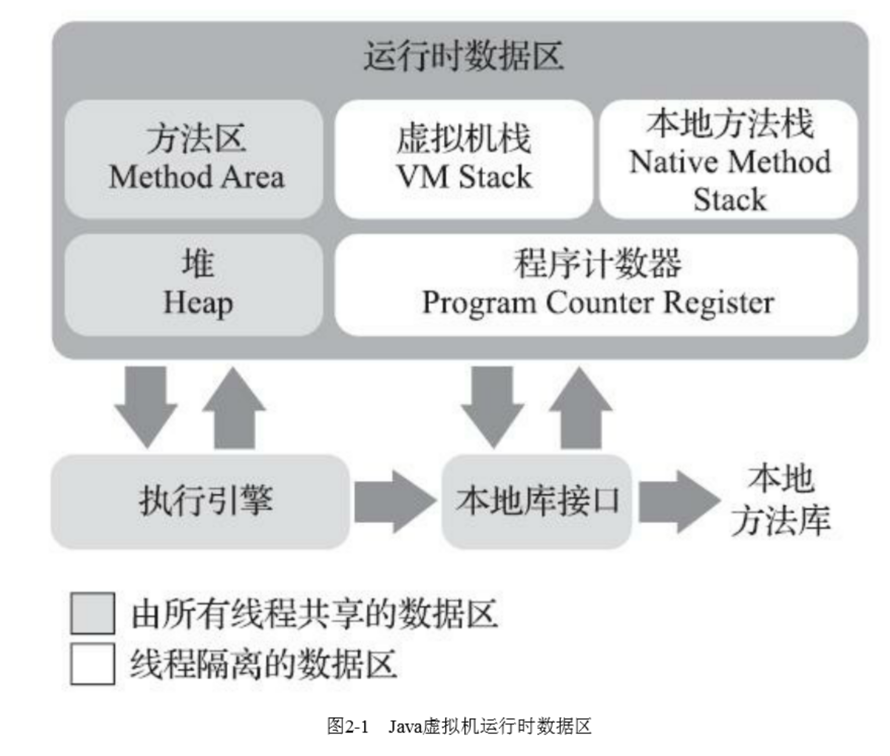

# 深入理解Java虚拟机

## 第一章 走近Java

### Java虚拟机

多为HotSpot

## 第二章 Java内存区域与内存溢出异常

### 2.1 概述

C++等人员需要自己进行内存管理，显得麻烦。Java自动进行内存管理，但是又不是那么好，因为自动管理是有局限性的，一旦程序员完全将本部分交给虚拟机管理，就会使得内存泄露和溢出的时候无从下手，所以我们要知道部分Java虚拟机内部架构，在程序运行的时候可以对内存管理进行一部分参数的调整，也就是我们所说的调优。

### 2.2 运行时数据区域

